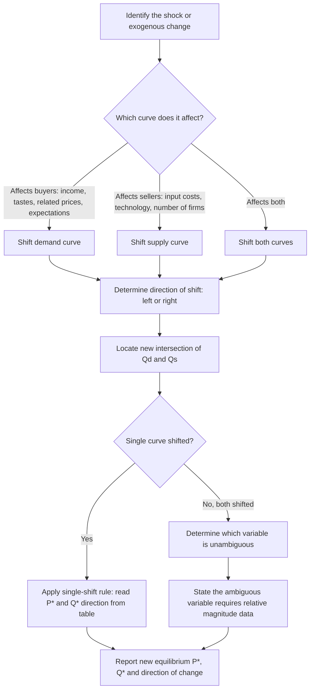

## Comparative Statics: Shifts in Demand and Supply Curves

### Overview and Purpose

Comparative statics is the method of analyzing how the equilibrium values of endogenous variables (price and quantity) change in response to a change in an exogenous variable (a determinant of demand or supply), by comparing the initial equilibrium to the new equilibrium after the shift, without examining the adjustment path or the time taken to get there. It is a "before-and-after snapshot" technique, not a dynamic analysis of the transition process.

This tool is central to managerial economics because most real-world decisions involve predicting how markets respond to change: input cost increases, new competitors, income growth, regulatory shifts, or shifts in consumer preferences.

---

### Distinguishing Shifts from Movements

**Key Points:**

- A **movement along a curve** results only from a change in the good's own price and represents a change in quantity demanded/supplied, not a change in demand/supply itself.
- A **shift of a curve** results from a change in any non-price determinant and represents a genuine change in the underlying relationship between price and quantity at every price level.

Formally, if $Q_d = f(P, X_1, X_2, \ldots)$, a change in $P$ moves along the curve; a change in any $X_i$ shifts the entire curve.

---

### Determinants That Shift the Demand Curve

| Determinant | Effect of Increase | Direction of Shift |
| --- | --- | --- |
| Consumer income (normal good) | Increases demand | Rightward |
| Consumer income (inferior good) | Decreases demand | Leftward |
| Price of a substitute good | Increases demand for this good | Rightward |
| Price of a complementary good | Decreases demand for this good | Leftward |
| Favorable change in tastes/preferences | Increases demand | Rightward |
| Expectation of future price increases | Increases current demand | Rightward |
| Increase in number of buyers | Increases demand | Rightward |
| Population growth | Increases demand | Rightward |

### Determinants That Shift the Supply Curve

| Determinant | Effect of Increase | Direction of Shift |
| --- | --- | --- |
| Input/factor prices | Decreases supply (higher costs) | Leftward |
| Technological improvement | Increases supply | Rightward |
| Price of a substitute in production | Decreases supply of this good | Leftward |
| Number of firms in the market | Increases supply | Rightward |
| Expectation of future price increases | Decreases current supply | Leftward |
| Favorable weather/input conditions (agriculture) | Increases supply | Rightward |
| Taxes on production | Decreases supply | Leftward |
| Subsidies to producers | Increases supply | Rightward |

---

### The Four Basic Comparative Static Cases

Using the linear framework $Q_d = a - bP$ and $Q_s = c + dP$, the four fundamental single-curve shift scenarios are as follows.

#### Case 1: Demand Increases (Supply Constant)

The demand intercept $a$ rises. Both equilibrium price and quantity rise.

$$P^{*\prime} = \frac{a'-c}{b+d} > P^* \qquad Q^{*\prime} = a' - bP^{*\prime} > Q^*$$

**Numerical Example:** $Q_d = 100-4P \to Q_d' = 130-4P$; $Q_s = -20+6P$ (unchanged).

Original: $P^*=12$, $Q^*=52$. New: $130-4P=-20+6P \Rightarrow 150=10P \Rightarrow P^{*\prime}=15$, $Q^{*\prime}=130-4(15)=70$.

**Result: $P^*$ rises from 12 to 15; $Q^*$ rises from 52 to 70.**

#### Case 2: Demand Decreases (Supply Constant)

Both equilibrium price and quantity fall.

**Numerical Example:** $Q_d = 100-4P \to Q_d'' = 70-4P$; $Q_s=-20+6P$ unchanged.

$70-4P=-20+6P \Rightarrow 90=10P \Rightarrow P^{*\prime\prime}=9$, $Q^{*\prime\prime}=70-4(9)=34$.

**Result: $P^*$ falls from 12 to 9; $Q^*$ falls from 52 to 34.**

#### Case 3: Supply Increases (Demand Constant)

The supply intercept $c$ rises (or slope shifts favorably). Equilibrium price falls; equilibrium quantity rises.

**Numerical Example:** $Q_d = 100-4P$ unchanged; $Q_s=-20+6P \to Q_s'=10+6P$.

$100-4P=10+6P \Rightarrow 90=10P \Rightarrow P^{*\prime}=9$, $Q^{*\prime}=100-4(9)=64$.

**Result: $P^*$ falls from 12 to 9; $Q^*$ rises from 52 to 64.**

#### Case 4: Supply Decreases (Demand Constant)

Equilibrium price rises; equilibrium quantity falls.

**Numerical Example:** $Q_d=100-4P$ unchanged; $Q_s=-20+6P \to Q_s''=-50+6P$.

$100-4P=-50+6P \Rightarrow 150=10P \Rightarrow P^{*\prime\prime}=15$, $Q^{*\prime\prime}=100-4(15)=40$.

**Result: $P^*$ rises from 12 to 15; $Q^*$ falls from 52 to 40.**

---

### Summary Table: Single-Curve Shifts

| Shift | $\Delta P^*$ | $\Delta Q^*$ |
| --- | --- | --- |
| Demand ↑ (Supply constant) | ↑ | ↑ |
| Demand ↓ (Supply constant) | ↓ | ↓ |
| Supply ↑ (Demand constant) | ↓ | ↑ |
| Supply ↓ (Demand constant) | ↑ | ↓ |

**Mnemonic pattern:** Demand shifts move $P^*$ and $Q^*$ in the *same* direction as each other; supply shifts move $P^*$ and $Q^*$ in *opposite* directions.

---

### Simultaneous Shifts in Both Curves

When both demand and supply shift at the same time, the direction of change in one equilibrium variable is often determinate, while the other is ambiguous and depends on the *relative magnitude* of the two shifts.

#### Case 5: Demand Increases and Supply Increases

- $P^*$: **Ambiguous** — demand increase pushes price up, supply increase pushes price down; net effect depends on which shift dominates.
- $Q^*$: **Increases** — both effects push quantity in the same direction (up).

#### Case 6: Demand Increases and Supply Decreases

- $P^*$: **Increases** — both effects push price up.
- $Q^*$: **Ambiguous** — demand increase pushes quantity up, supply decrease pushes quantity down.

#### Case 7: Demand Decreases and Supply Increases

- $P^*$: **Decreases** — both effects push price down.
- $Q^*$: **Ambiguous** — demand decrease pushes quantity down, supply increase pushes quantity up.

#### Case 8: Demand Decreases and Supply Decreases

- $P^*$: **Ambiguous**.
- $Q^*$: **Decreases** — both effects push quantity down.

#### Summary Table: Simultaneous Shifts

| Demand Shift | Supply Shift | $\Delta P^*$ | $\Delta Q^*$ |
| --- | --- | --- | --- |
| Increase | Increase | Ambiguous | Increase |
| Increase | Decrease | Increase | Ambiguous |
| Decrease | Increase | Decrease | Ambiguous |
| Decrease | Decrease | Ambiguous | Decrease |

#### Worked Example: Simultaneous Shift (Case 6)

$Q_d = 100-4P \to Q_d' = 130-4P$ (demand up) and $Q_s=-20+6P \to Q_s'=-50+6P$ (supply down), simultaneously.

$$130-4P = -50+6P \implies 180 = 10P \implies P^{*\prime}=18$$

$$Q^{*\prime} = 130-4(18) = 130-72 = 58$$

Compare to original $P^*=12$, $Q^*=52$: price rose unambiguously (12→18), consistent with theory. Quantity rose slightly (52→58) in this instance — but this specific outcome depended on the relative sizes of the two shifts; had the supply decrease been proportionally larger than the demand increase, quantity could have fallen instead. This illustrates the "ambiguous" result: the *direction* is not fixed by theory alone and requires the actual magnitudes to resolve.

---

### Diagrammatic Process: How to Perform Comparative Statics Analysis

---

### Illustration: Demand Shift vs. Supply Shift (svg_diagram)

<svg xmlns="http://www.w3.org/2000/svg" viewBox="0 0 780 380">
\<style\>
.axis-line { stroke: #333; stroke-width: 2; }
.demand-line { stroke: #2563eb; stroke-width: 2; fill: none; }
.demand-line-new { stroke: #2563eb; stroke-width: 2; fill: none; stroke-dasharray: 6,4; }
.supply-line { stroke: #dc2626; stroke-width: 2; fill: none; }
.supply-line-new { stroke: #dc2626; stroke-width: 2; fill: none; stroke-dasharray: 6,4; }
.dash { stroke: #999; stroke-width: 1; stroke-dasharray: 3,3; }
.lbl { font-family: sans-serif; font-size: 12px; fill: #222; }
.title { font-family: sans-serif; font-size: 15px; font-weight: bold; fill: #111; text-anchor: middle; }
.pt-old { fill: #555; }
.pt-new { fill: #16a34a; }
\</style\>
<text x="390" y="20" class="title">Comparative Statics: Demand Shift vs Supply Shift (svg_diagram)</text>

<line x1="50" y1="330" x2="330" y2="330" class="axis-line" />
<line x1="50" y1="330" x2="50" y2="60" class="axis-line" />
<text x="335" y="335" class="lbl">Q</text>
<text x="35" y="55" class="lbl">P</text>
<path d="M 60 90 L 300 300" class="demand-line" />
<text x="255" y="290" class="lbl" fill="#2563eb">D</text>
<path d="M 100 90 L 320 260" class="demand-line-new" />
<text x="295" y="255" class="lbl" fill="#2563eb">D'</text>
<path d="M 90 300 L 260 100" class="supply-line" />
<text x="255" y="95" class="lbl" fill="#dc2626">S</text>
<circle cx="175" cy="205" r="4" class="pt-old" />
<circle cx="207" cy="180" r="4" class="pt-new" />
<line x1="175" y1="205" x2="175" y2="330" class="dash" />
<line x1="207" y1="180" x2="207" y2="330" class="dash" />
<line x1="50" y1="205" x2="175" y2="205" class="dash" />
<line x1="50" y1="180" x2="207" y2="180" class="dash" />
<text x="140" y="350" class="lbl" font-weight="bold">Demand Increase: P* up, Q* up</text>

<line x1="440" y1="330" x2="720" y2="330" class="axis-line" />
<line x1="440" y1="330" x2="440" y2="60" class="axis-line" />
<text x="725" y="335" class="lbl">Q</text>
<text x="425" y="55" class="lbl">P</text>
<path d="M 450 90 L 690 300" class="demand-line" />
<text x="670" y="290" class="lbl" fill="#2563eb">D</text>
<path d="M 480 300 L 650 100" class="supply-line" />
<text x="645" y="95" class="lbl" fill="#dc2626">S</text>
<path d="M 450 300 L 620 100" class="supply-line-new" />
<text x="600" y="120" class="lbl" fill="#dc2626">S'</text>
<circle cx="565" cy="205" r="4" class="pt-old" />
<circle cx="537" cy="178" r="4" class="pt-new" />
<line x1="565" y1="205" x2="565" y2="330" class="dash" />
<line x1="537" y1="178" x2="537" y2="330" class="dash" />
<line x1="440" y1="205" x2="565" y2="205" class="dash" />
<line x1="440" y1="178" x2="537" y2="178" class="dash" />
<text x="500" y="350" class="lbl" font-weight="bold">Supply Increase: P* down, Q* up</text>
</svg>

---

### Real-World Managerial Applications

**Example — Input Cost Shock:** A bakery chain relies on wheat flour. A drought reduces wheat harvests, shifting the flour supply curve left (Case 4 analog upstream). This raises flour input costs, which shifts the bakery's own product supply curve left, raising equilibrium bread prices and reducing equilibrium quantity sold — a manager should anticipate margin compression unless prices can be passed through.

**Example — Complementary Good Price Change:** A rise in gasoline prices decreases demand for large SUVs (a complementary relationship in usage), shifting the SUV demand curve left — both equilibrium price and quantity for SUVs are predicted to fall, informing inventory and production planning for automakers.

**Example — Regulatory Shock:** A new environmental compliance cost imposed on manufacturers shifts the supply curve left (Case 4), raising consumer prices and reducing quantity sold — useful for anticipating the market impact of anticipated regulation before it is enacted.

---

### Common Pitfalls

**Key Points:**

- Attempting to determine the direction of an ambiguous variable (e.g., $Q^*$ under Case 6) without additional information on relative shift magnitudes — the correct academic answer is "ambiguous, depends on relative magnitudes," not a guess.
- Confusing which curve a given determinant affects (e.g., mistakenly treating an input price change as a demand-side shifter rather than a supply-side shifter).
- Forgetting that a "shift" changes the entire schedule of quantities at every price, not just the single equilibrium point — the full curve moves, and the intersection point is simply where the new equilibrium happens to fall.
- Assuming both curves always shift by comparable magnitudes — in practice, relative elasticities and shift sizes must be estimated empirically (e.g., via regression) to make specific quantitative predictions, not just directional statements.

---

**Related Topics**

- Price elasticity of demand and supply and its role in shift magnitude outcomes
- Simultaneous equations models for empirically estimating demand and supply shifts
- Consumer and producer surplus changes following equilibrium shifts
- General equilibrium analysis across interconnected markets
- Dynamic adjustment models (cobweb model) versus static comparative analysis
- Elasticity of derived demand in input markets
- Application of comparative statics to tax incidence analysis