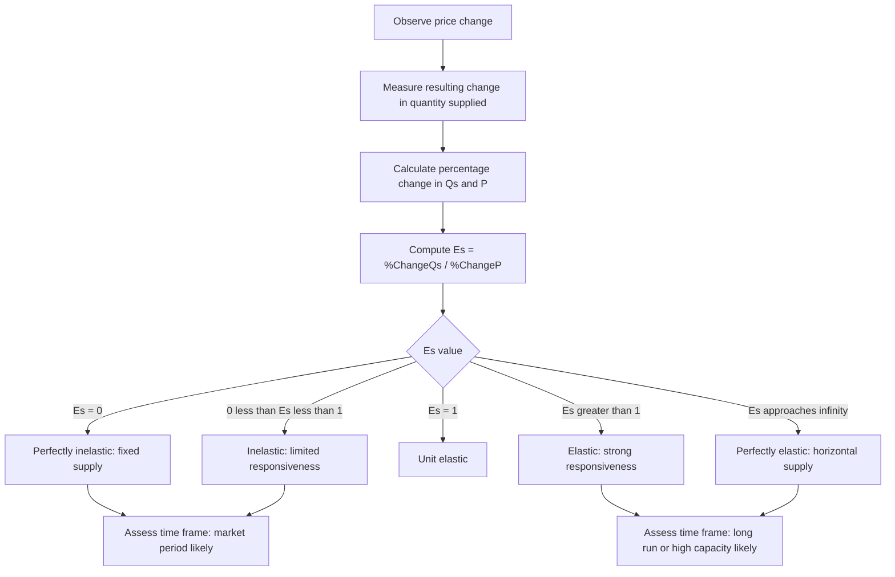

## Price Elasticity of Supply

### Definition and Conceptual Foundation

Price elasticity of supply (PES) measures the responsiveness of quantity supplied to a change in the price of a good, holding all other supply determinants (input costs, technology, number of firms, expectations) constant. It quantifies *how much* producers adjust output when price changes, in percentage terms — allowing comparison across goods measured in different units (barrels, kilograms, units, etc.).

---

### Formula

#### Basic (Point) Elasticity Formula

$$E_s = \frac{\%\,\Delta Q_s}{\%\,\Delta P} = \frac{\Delta Q_s / Q_s}{\Delta P / P}$$

Equivalently:

$$E_s = \frac{\Delta Q_s}{\Delta P} \times \frac{P}{Q_s}$$

Since the law of supply dictates that price and quantity supplied move in the same direction, $E_s$ is conventionally **positive** (unlike price elasticity of demand, which is negative by convention and often reported as an absolute value).

#### Midpoint (Arc) Elasticity Formula

To avoid the asymmetry problem of point elasticity (where calculating elasticity from $A \to B$ gives a different value than from $B \to A$), the midpoint formula is preferred for discrete changes:

$$E_s = \frac{(Q_2 - Q_1)/[(Q_1+Q_2)/2]}{(P_2-P_1)/[(P_1+P_2)/2]}$$

#### Calculus-Based (Point) Elasticity

For a continuous supply function $Q_s = g(P)$:

$$E_s = \frac{dQ_s}{dP} \times \frac{P}{Q_s}$$

---

### Worked Example: Midpoint Formula

A manufacturer raises the price of a component from $50 to $60, and quantity supplied rises from 200 to 260 units.

$$\%\Delta Q_s = \frac{260-200}{(200+260)/2} = \frac{60}{230} \approx 0.2609 \;(26.09\%)$$

$$\%\Delta P = \frac{60-50}{(50+60)/2} = \frac{10}{55} \approx 0.1818\;(18.18\%)$$

$$E_s = \frac{0.2609}{0.1818} \approx 1.435$$

**Interpretation:** Supply is elastic ($E_s > 1$); a 1% increase in price is associated with approximately a 1.435% increase in quantity supplied.

---

### Worked Example: Point Elasticity from a Linear Supply Function

Given $Q_s = -20 + 6P$, find the elasticity at $P=12$ (where $Q_s = 52$, from the earlier equilibrium example).

$$\frac{dQ_s}{dP} = 6$$

$$E_s = 6 \times \frac{12}{52} = \frac{72}{52} \approx 1.385$$

**Interpretation:** At this price-quantity combination, supply is elastic — a 1% price increase yields roughly a 1.385% increase in quantity supplied.

**Important property of linear supply curves:** Unlike linear demand curves (which have elasticity ranging continuously from 0 to infinity along their length), a linear supply curve's elasticity behavior depends specifically on where the line, if extended, intersects the axes:

- If the supply line's extension passes through the **origin** (i.e., $Q_s = dP$, no intercept), elasticity equals exactly 1 (unit elastic) at every point along the curve.
- If the supply line's extension intersects the **positive price axis** (vertical intercept, $c<0$ mathematically translating to a positive price-axis intercept), the curve is elastic ($E_s>1$) at every point.
- If the supply line's extension intersects the **positive quantity axis** (horizontal intercept), the curve is inelastic ($E_s<1$) at every point.

[Inference] This is a frequently underemphasized but mathematically direct property of linear supply curves, distinct from the demand-curve case, and is a common source of confusion for students transferring demand-curve elasticity intuition directly to supply.

---

### Classification of Supply Elasticity

| Value of $E_s$ | Classification | Interpretation |
| --- | --- | --- |
| $E_s = 0$ | Perfectly inelastic | Quantity supplied does not change regardless of price (vertical supply curve) |
| $0 < E_s < 1$ | Inelastic | Quantity supplied changes proportionally less than price |
| $E_s = 1$ | Unit elastic | Quantity supplied changes proportionally the same as price |
| $E_s > 1$ | Elastic | Quantity supplied changes proportionally more than price |
| $E_s = \infty$ | Perfectly elastic | Infinite quantity supplied at a single price; any price decrease drops quantity to zero (horizontal supply curve) |

---

### Illustration: Supply Elasticity Cases (svg_diagram)

<svg xmlns="http://www.w3.org/2000/svg" viewBox="0 0 780 300">
\<style\>
.axis { stroke: #333; stroke-width: 1.5; }
.sline { stroke: #dc2626; stroke-width: 2.5; fill: none; }
.lbl { font-family: sans-serif; font-size: 12px; fill: #222; text-anchor: middle; }
.title { font-family: sans-serif; font-size: 15px; font-weight: bold; fill: #111; text-anchor: middle; }
\</style\>
<text x="390" y="18" class="title">Extreme Cases of Supply Elasticity (svg_diagram)</text>

<line x1="60" y1="260" x2="190" y2="260" class="axis" />
<line x1="60" y1="260" x2="60" y2="50" class="axis" />
<line x1="125" y1="60" x2="125" y2="250" class="sline" />
<text x="125" y="280" class="lbl">Perfectly Inelastic (Es = 0)</text>

<line x1="260" y1="260" x2="390" y2="260" class="axis" />
<line x1="260" y1="260" x2="260" y2="50" class="axis" />
<line x1="260" y1="260" x2="380" y2="70" class="sline" />
<text x="325" y="280" class="lbl">Unit Elastic, through origin (Es = 1)</text>

<line x1="460" y1="260" x2="590" y2="260" class="axis" />
<line x1="460" y1="260" x2="460" y2="50" class="axis" />
<line x1="480" y1="260" x2="580" y2="90" class="sline" />
<text x="525" y="280" class="lbl">Elastic, intersects P-axis (Es &gt; 1)</text>

<line x1="640" y1="260" x2="770" y2="260" class="axis" />
<line x1="640" y1="260" x2="640" y2="50" class="axis" />
<line x1="650" y1="150" x2="765" y2="150" class="sline" />
<text x="705" y="280" class="lbl">Perfectly Elastic (Es = ∞)</text>
</svg>

---

### Determinants of Price Elasticity of Supply

#### 1. Time Period (Marshallian Time Frames)

Time is generally regarded as the single most important determinant of supply elasticity.

- **Market period (very short run):** No time to adjust production; supply is essentially fixed. $E_s \approx 0$ (perfectly inelastic). Example: the day's catch of fresh fish already brought to market.
- **Short run:** Firms can adjust variable inputs (labor, materials) within existing capacity, but cannot build new plants. Supply is more elastic than in the market period but still constrained. Example: a factory adding overtime shifts.
- **Long run:** Firms can adjust all inputs, including capital and plant capacity, and new firms can enter the industry. Supply is most elastic in the long run. Example: new manufacturing plants coming online over several years.

#### 2. Spare Production Capacity

Firms operating well below full capacity can increase output substantially with a small price incentive (elastic supply); firms operating at or near full capacity require large price increases to justify costly capacity expansion (inelastic supply).

#### 3. Ease of Factor Substitution and Input Mobility

If a firm can readily reallocate resources (labor, land, capital) from other uses into producing the good in question, supply tends to be more elastic. Highly specialized inputs with few alternative uses lead to less elastic supply.

#### 4. Ability to Store Output (Inventory)

Goods that can be stockpiled (durable, non-perishable) allow firms to release inventory quickly in response to price increases, increasing elasticity. Perishable goods (fresh produce, live events/services) cannot be stored, tending toward inelastic supply in the short run.

#### 5. Number of Firms and Ease of Entry/Exit

Industries with low barriers to entry allow new firms to enter quickly when prices rise, increasing long-run elasticity. Industries with high barriers (large capital requirements, licensing, patents) exhibit more inelastic supply even in the longer run.

#### 6. Risk and Cost of Expanding Production

Industries requiring long lead times and high sunk costs for capacity expansion (e.g., oil refining, semiconductor fabrication, real estate development) tend to have inelastic supply, since production cannot respond quickly even when firms wish it to.

---

### Special Case: Elasticity of Supply for Non-Reproducible Goods

For goods with a genuinely fixed total supply regardless of price — most commonly cited textbook examples include original works of art by a deceased artist, or land in an absolute aggregate sense — supply is perfectly inelastic ($E_s = 0$), since no price increase can generate additional units. [Unverified] In practice, even goods described this way in textbooks (e.g., "land") often exhibit some elasticity at the margin (e.g., converting agricultural land to residential/commercial use, reclaiming land, or bringing previously unused land into cultivation), so "perfectly inelastic" is best understood as a theoretical limiting case rather than a literal description of most real markets.

---

### Elasticity and Total Revenue for Producers

Unlike demand elasticity (where elasticity determines whether a price change raises or lowers total revenue in a specific opposing direction), for supply, because price and quantity supplied move in the *same* direction, an increase in price **always increases total revenue to sellers** collectively, regardless of the elasticity value — the elasticity value only affects the *magnitude* of the revenue increase, not its direction.

$$TR = P \times Q_s$$

Since both $P$ and $Q_s$ rise together following a price increase, $TR$ necessarily rises. The elasticity coefficient tells a manager how much *additional* quantity will be forthcoming from the market at the new price, which matters for planning production, inventory, and capacity — but not whether revenue direction will reverse.

---

### Application: Tax Incidence and Elasticity of Supply

The relative elasticities of supply and demand determine how the burden (incidence) of a per-unit tax is shared between buyers and sellers:

$$\frac{\text{Burden on consumers}}{\text{Burden on producers}} = \frac{E_s}{E_d}$$

- If supply is more elastic relative to demand ($E_s > E_d$), producers can more easily reduce quantity supplied in response to the tax, shifting a larger share of the burden onto consumers.
- If supply is highly inelastic relative to demand, producers bear a larger share of the tax burden, since they cannot easily reduce output to avoid it.

**Example:** A tax on agricultural land (highly inelastic supply in the short-to-medium run) tends to fall predominantly on landowners rather than being passed to consumers/renters, since the fixed land supply cannot contract in response.

---

### Managerial Applications

**Key Points:**

- **Capacity planning:** Firms in industries with structurally inelastic supply (e.g., due to long construction lead times) should anticipate greater price volatility from demand shocks, since output cannot adjust quickly to absorb the shock.
- **Pricing strategy under supply shocks:** Understanding one's own elasticity of supply relative to competitors informs how aggressively to adjust prices versus quantities when input costs change.
- **Investment timing:** Because elasticity rises over time (market period → short run → long run), firms should recognize that short-run price spikes triggered by demand surges will erode as supply gradually expands — informing decisions on whether to lock in current high prices via contracts or wait for market normalization.
- **Supply chain risk assessment:** Suppliers of highly specialized or perishable inputs (low elasticity) represent greater exposure to price volatility risk in a firm's supply chain than suppliers of easily substitutable, storable inputs.

---

### Elasticity Determination Process

---

### Common Pitfalls

**Key Points:**

- Assuming supply elasticity is constant over time — it is fundamentally time-dependent (market period vs. short run vs. long run), unlike some textbook treatments that use a single static value.
- Misapplying demand-curve elasticity intuition (elasticity varying along a linear curve from 0 to infinity) directly to supply curves, which follow a different rule based on axis-intercept geometry.
- Treating "perfectly inelastic supply" as a universal, permanent description of a good, when it typically describes only a specific short time horizon.
- Confusing supply elasticity's effect on total revenue (always positive with a price rise) with demand elasticity's effect (which can be positive or negative depending on the elastic/inelastic classification) — these are governed by different mechanisms.

---

**Related Topics**

- Price elasticity of demand and its determinants
- Cross-price elasticity and income elasticity of demand
- Tax incidence and the division of tax burden between buyers and sellers
- Producer surplus and its relationship to supply elasticity
- Marshallian time periods and short-run vs. long-run cost curves
- Elasticity of derived demand for factors of production
- Applications of elasticity in agricultural and commodity markets