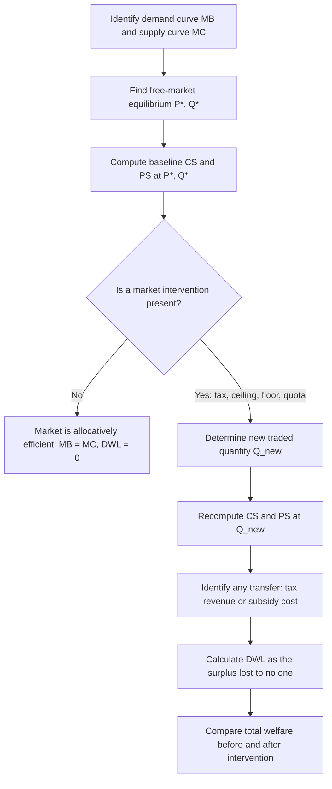

## Consumer Surplus, Producer Surplus, and Market Efficiency

### Overview

Consumer surplus and producer surplus together measure the total welfare (net benefit) generated by a market transaction, providing the analytical foundation for evaluating whether a market outcome is efficient and for quantifying the welfare costs of interventions such as taxes, price controls, and quotas. This framework — welfare economics applied to partial equilibrium — is essential for managers and policy analysts assessing the broader economic impact of pricing decisions, regulations, and market structures.

---

### Consumer Surplus

#### Definition

Consumer surplus (CS) is the difference between the maximum price a consumer is *willing to pay* for a unit of a good (reflected by the demand curve, representing marginal benefit) and the price they *actually pay* in the market. Aggregated across all units purchased, it represents the total net benefit consumers receive from being able to purchase a good at the market price rather than at their individual maximum willingness to pay.

#### Graphical Representation

Consumer surplus is the area **below the demand curve and above the market price**, from zero quantity up to the equilibrium quantity.

#### Formula (Linear Demand Case)

For a linear demand curve $P = a - bQ$ (inverse demand form) and market equilibrium $(P^*, Q^*)$:

$$CS = \frac{1}{2} \times Q^* \times (a - P^*)$$

This is the area of the triangle bounded by the demand curve, the vertical axis, and the horizontal line at $P^*$.

#### Worked Example

Using the earlier equilibrium example: $Q_d = 100 - 4P$, rearranged to inverse form: $P = 25 - 0.25Q$ (so $a = 25$ when $Q=0$). Equilibrium: $P^* = 12$, $Q^* = 52$.

$$CS = \frac{1}{2} \times 52 \times (25 - 12) = \frac{1}{2} \times 52 \times 13 = 338$$

**Interpretation:** Consumers collectively receive $338 (in the relevant monetary units) of net benefit beyond what they paid, reflecting the aggregate "bargain" consumers as a group obtain at the market-clearing price.

---

### Producer Surplus

#### Definition

Producer surplus (PS) is the difference between the price a producer *actually receives* for a unit and the minimum price they would have been *willing to accept* (reflected by the supply curve, representing marginal cost). Aggregated across all units sold, it represents the total net benefit producers receive from selling at the market price rather than at their individual minimum acceptable price.

#### Graphical Representation

Producer surplus is the area **above the supply curve and below the market price**, from zero quantity up to the equilibrium quantity.

#### Formula (Linear Supply Case)

For a linear supply curve $P = c' + dQ$ (inverse supply form, where $c'$ is the price-axis intercept) and equilibrium $(P^*, Q^*)$:

$$PS = \frac{1}{2} \times Q^* \times (P^* - c')$$

#### Worked Example

Using $Q_s = -20 + 6P$, rearranged to inverse form: $P = \frac{20+Q}{6} = 3.33 + 0.1667Q$ (so $c' = 3.33$ when $Q=0$). Equilibrium: $P^*=12$, $Q^*=52$.

$$PS = \frac{1}{2} \times 52 \times (12 - 3.33) = \frac{1}{2} \times 52 \times 8.67 \approx 225.4$$

**Interpretation:** Producers collectively receive approximately $225.4 of net benefit beyond their minimum acceptable selling price, reflecting the returns to production above marginal cost.

---

### Total Economic Surplus (Social Welfare)

$$TS = CS + PS$$

Using the values above:

$$TS = 338 + 225.4 = 563.4$$

Total surplus represents the total net gain to society from the market's existence — the combined benefit to buyers and sellers from voluntary exchange at the market-clearing price.

---

### Illustration: Consumer and Producer Surplus (svg_diagram)

<svg xmlns="http://www.w3.org/2000/svg" viewBox="0 0 520 400">
\<style\>
.axis-line { stroke: #333; stroke-width: 2; }
.demand-line { stroke: #2563eb; stroke-width: 2.5; fill: none; }
.supply-line { stroke: #dc2626; stroke-width: 2.5; fill: none; }
.dash { stroke: #888; stroke-width: 1; stroke-dasharray: 4,4; }
.lbl { font-family: sans-serif; font-size: 13px; fill: #222; }
.title { font-family: sans-serif; font-size: 15px; font-weight: bold; fill: #111; text-anchor: middle; }
.cs-area { fill: #93c5fd; opacity: 0.5; }
.ps-area { fill: #fca5a5; opacity: 0.5; }
\</style\>
<text x="260" y="20" class="title">Consumer and Producer Surplus (svg_diagram)</text>
<line x1="70" y1="350" x2="470" y2="350" class="axis-line" />
<line x1="70" y1="350" x2="70" y2="60" class="axis-line" />
<text x="480" y="355" class="lbl">Q</text>
<text x="55" y="55" class="lbl">P</text>

<polygon points="70,90 70,220 260,220" class="cs-area" />

<polygon points="70,220 70,310 260,220" class="ps-area" />

<path d="M 70 90 L 420 320" class="demand-line" />
<text x="400" y="335" class="lbl" fill="#2563eb">Demand</text>

<path d="M 100 310 L 400 100" class="supply-line" />
<text x="405" y="95" class="lbl" fill="#dc2626">Supply</text>

<line x1="70" y1="220" x2="260" y2="220" class="dash" />
<line x1="260" y1="220" x2="260" y2="350" class="dash" />
<text x="45" y="225" class="lbl">P*</text>
<text x="255" y="370" class="lbl">Q*</text>

<text x="140" y="140" class="lbl" font-weight="bold" fill="`#1e3a8a`">CS</text>

<text x="140" y="280" class="lbl" font-weight="bold" fill="`#991b1b`">PS</text>

</svg>

---

### Market Efficiency and the Competitive Equilibrium

#### Allocative Efficiency

A market achieves **allocative efficiency** when total surplus ($CS + PS$) is maximized — this occurs precisely at the competitive equilibrium quantity, where the demand curve (marginal benefit, $MB$) intersects the supply curve (marginal cost, $MC$):

$$MB(Q^*) = MC(Q^*)$$

At any quantity below $Q^*$, marginal benefit exceeds marginal cost, meaning additional units would generate more benefit than they cost to produce — society would gain from producing more. At any quantity above $Q^*$, marginal cost exceeds marginal benefit, meaning resources are being used to produce units that cost more than the benefit they generate — society would gain from producing less. Only at $Q^*$ is there no unexploited gain from trade.

**Key Points:**

- Efficiency here is about maximizing *total* surplus, not the *distribution* between consumers and producers — a market can be efficient while distributing gains very unevenly, and equity is a separate normative consideration from efficiency.
- The First Welfare Theorem (formalized in general equilibrium theory) states that, under idealized conditions (perfect competition, no externalities, complete information, no market power), competitive market equilibrium is Pareto efficient — no reallocation can make anyone better off without making someone else worse off.

---

### Deadweight Loss: The Cost of Market Inefficiency

When a market is prevented from reaching its efficient equilibrium quantity $Q^*$ — due to a tax, price ceiling, price floor, quota, or monopoly power — some mutually beneficial trades that would have occurred at $Q^*$ no longer occur. The resulting lost surplus (benefit that is neither captured by consumers, producers, nor government) is called **deadweight loss (DWL)**.

#### Deadweight Loss from a Price Ceiling

If price is capped below $P^*$, quantity supplied falls below $Q^*$ (since suppliers are unwilling to produce as much at the capped price). The trades between the new lower quantity and $Q^*$ — which would have been mutually beneficial at the free-market price — no longer occur, and their combined lost surplus becomes deadweight loss.

#### Deadweight Loss from a Tax

A per-unit tax $t$ drives a wedge between the price buyers pay ($P_b$) and the price sellers receive ($P_s$), where $P_b - P_s = t$. Quantity traded falls from $Q^*$ to a lower $Q_t$. The deadweight loss triangle is:

$$DWL = \frac{1}{2} \times t \times (Q^* - Q_t)$$

**Key Points:**

- DWL from a tax increases with the elasticities of both demand and supply — more elastic curves mean a given tax causes a larger reduction in quantity traded, producing a larger deadweight loss (this is the basis for the "excess burden" concept in public finance).
- Highly inelastic markets experience relatively little deadweight loss from taxation (though the tax revenue and incidence distribution still matter), which is why economists often recommend taxing inelastic goods (e.g., specific excise taxes) to minimize distortion, separate from equity considerations.

---

### Illustration: Deadweight Loss from Below-Equilibrium Quantity Restriction (svg_diagram)

<svg xmlns="http://www.w3.org/2000/svg" viewBox="0 0 500 380">
\<style\>
.axis-line { stroke: #333; stroke-width: 2; }
.demand-line { stroke: #2563eb; stroke-width: 2.5; fill: none; }
.supply-line { stroke: #dc2626; stroke-width: 2.5; fill: none; }
.dash { stroke: #888; stroke-width: 1; stroke-dasharray: 4,4; }
.lbl { font-family: sans-serif; font-size: 12px; fill: #222; }
.title { font-family: sans-serif; font-size: 15px; font-weight: bold; fill: #111; text-anchor: middle; }
.dwl-area { fill: #6b7280; opacity: 0.55; }
\</style\>
<text x="250" y="20" class="title">Deadweight Loss Triangle (svg_diagram)</text>
<line x1="60" y1="330" x2="440" y2="330" class="axis-line" />
<line x1="60" y1="330" x2="60" y2="50" class="axis-line" />
<text x="450" y="335" class="lbl">Q</text>
<text x="45" y="45" class="lbl">P</text>
<path d="M 60 70 L 400 300" class="demand-line" />
<text x="390" y="315" class="lbl" fill="#2563eb">Demand</text>
<path d="M 90 300 L 380 80" class="supply-line" />
<text x="385" y="75" class="lbl" fill="#dc2626">Supply</text>

<polygon points="230,195 230,240 300,150" class="dwl-area" />
<line x1="230" y1="330" x2="230" y2="150" class="dash" />
<line x1="300" y1="330" x2="300" y2="150" class="dash" />
<text x="225" y="350" class="lbl">Q_restricted</text>
<text x="295" y="350" class="lbl">Q*</text>
<text x="245" y="205" class="lbl" font-weight="bold">DWL</text>
</svg>

---

### Numerical Example: Deadweight Loss from a Price Ceiling

Using $Q_d = 100-4P$ and $Q_s=-20+6P$ (equilibrium $P^*=12$, $Q^*=52$), suppose a price ceiling is imposed at $P_c = 9$.

At $P_c=9$: $Q_s = -20+6(9) = 34$ (quantity actually traded is limited to the *lower* of $Q_d$ and $Q_s$ at the ceiling price, i.e., 34 units, since sellers won't supply more).

To find the deadweight loss, identify the demand price at $Q=34$: from $P=25-0.25Q$, $P(34) = 25-0.25(34)=16.5$. This represents buyers' marginal willingness to pay for the 34th unit — the height of the DWL triangle's demand side.

The supply price at $Q=34$ is the ceiling price itself, $9$ (since that's what sellers receive).

$$DWL = \frac{1}{2} \times (Q^* - Q_{ceiling}) \times (P_{demand@34} - P_{ceiling}) = \frac{1}{2} \times (52-34) \times (16.5-9) = \frac{1}{2} \times 18 \times 7.5 = 67.5$$

**Interpretation:** The price ceiling generates $67.5 of lost total surplus that is captured by no one — neither the consumers who wanted to buy at higher prices but couldn't find supply, nor the producers who would have been willing to sell more.

---

### Effects of Market Interventions on Surplus: Summary Table

| Intervention | Effect on CS | Effect on PS | Deadweight Loss? |
| --- | --- | --- | --- |
| Price ceiling (below $P^*$) | Ambiguous (some consumers gain from lower price, others lose from unavailability/shortage) | Decreases | Yes |
| Price floor (above $P^*$) | Decreases | Ambiguous (some producers gain from higher price, others lose from unsold surplus) | Yes |
| Per-unit tax | Decreases | Decreases | Yes (tax revenue partially offsets total loss, but DWL remains) |
| Per-unit subsidy | Increases | Increases | Yes (subsidy cost to government typically exceeds the surplus gain) |
| Quota (below $Q^*$) | Ambiguous | Ambiguous | Yes |
| Removal of a distorting tax/quota | Increases | Increases | Reduces existing DWL |

---

### Process for Welfare Analysis

---

### Managerial and Policy Applications

**Key Points:**

- **Price discrimination analysis:** Firms that can capture consumer surplus through price discrimination (charging different prices to different consumer segments based on willingness to pay) increase producer surplus and firm profit at the expense of consumer surplus, without necessarily creating deadweight loss (perfect price discrimination can actually eliminate DWL entirely by ensuring all mutually beneficial trades occur).
- **Cost-benefit analysis of regulation:** Regulators and firms assessing proposed regulations (e.g., a price cap, minimum quality standard, or tariff) can use CS/PS/DWL analysis to quantify the net welfare impact on different stakeholder groups.
- **Trade policy:** Analysis of tariffs and quotas uses this same framework, decomposing effects into changes in domestic consumer surplus, domestic producer surplus, government tariff revenue, and deadweight loss from reduced trade volume.
- **Justifying business pricing strategy:** While a firm's private objective is profit (a subset of producer surplus), understanding the full CS/PS/DWL picture helps firms anticipate stakeholder and regulatory reactions to pricing decisions perceived as extracting excessive consumer surplus.

---

### Common Pitfalls

**Key Points:**

- Confusing "efficient" with "fair" or "equitable" — allocative efficiency says nothing about how surplus is distributed between consumers and producers, which is a distinct normative question.
- Assuming deadweight loss always requires government intervention — market power (monopoly, oligopoly) can also create deadweight loss even without any tax, ceiling, or floor, by restricting output below the competitive level.
- Incorrectly calculating consumer or producer surplus using the wrong reference price (e.g., using pre-tax price for consumer surplus when the tax changes the price buyers actually pay).
- Forgetting that tax revenue is a *transfer*, not a loss — it moves surplus from consumers/producers to the government, and only the deadweight loss triangle (not the entire reduction in CS+PS) represents a net loss to society as a whole.

---

**Related Topics**

- Deadweight loss under monopoly and imperfect competition
- Tax incidence: division of the tax burden by elasticity
- Price discrimination (first, second, third degree) and its welfare effects
- Externalities and market failure (divergence between private and social marginal cost/benefit)
- International trade: tariffs, quotas, and their welfare effects
- Cost-benefit analysis frameworks for public policy evaluation
- Pareto efficiency and the First and Second Welfare Theorems