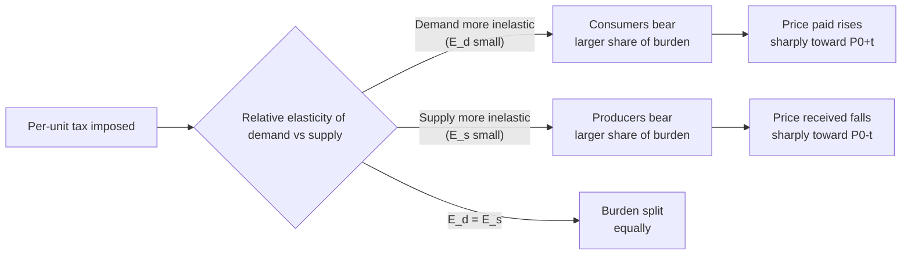

## Effects of Taxes and Subsidies on Market Outcomes

### Overview

Taxes and subsidies are government interventions that alter the effective price faced by buyers and sellers, driving a wedge between the price paid by consumers and the price received by producers. This wedge shifts market equilibrium, changes the quantities exchanged, redistributes surplus between market participants and the government, and — except in specific elasticity conditions — creates deadweight loss (allocative inefficiency).

### Key Concepts

**Tax Incidence**: The distribution of the actual burden of a tax between buyers and sellers, which depends on relative elasticities of demand and supply — not on who is legally required to remit the tax.

**Statutory vs. Economic Incidence**: Statutory incidence refers to who is legally obligated to pay the tax (buyer or seller). Economic incidence refers to who actually bears the burden in terms of reduced welfare. These frequently diverge.

**Price Wedge**: A tax or subsidy creates a gap between the price paid by consumers ($P_c$) and the price received by producers ($P_p$).

For a per-unit tax $t$:

$$P_c - P_p = t$$

For a per-unit subsidy $s$:

$$P_p - P_c = s$$

### Effects of a Per-Unit Tax

#### Mechanics

A per-unit (specific) tax of amount $t$ imposed on a good shifts either the demand curve down or the supply curve up by the vertical amount $t$, depending on whether it is levied on buyers or sellers. The equilibrium outcome is identical regardless of which side is statutorily taxed — this is a core result of tax incidence theory.

Consider a standard linear market:

$$Q_d = a - bP_c$$

$$Q_s = c + dP_p$$

With the tax wedge $P_c = P_p + t$, the new equilibrium quantity $Q_t$ solves:

$$a - b(P_p + t) = c + dP_p$$

$$P_p = \frac{a - c - bt}{b + d}$$

$$P_c = P_p + t$$

$$Q_t = c + dP_p$$

**Key Points**:

- Equilibrium quantity falls relative to the pre-tax quantity.
- $P_c$ (price paid by consumers) rises above the original equilibrium price.
- $P_p$ (price received by producers) falls below the original equilibrium price.
- The vertical distance between the demand and supply curves at $Q_t$ equals the tax $t$.

#### Diagram: Per-Unit Tax on Supply

<svg xmlns="http://www.w3.org/2000/svg" viewBox="0 0 640 460">
<text x="320" y="24" text-anchor="middle" font-size="16" font-weight="bold" fill="#1a1a1a">Effect of a Per-Unit Tax on Market Equilibrium (svg_diagram)</text>

<line x1="80" y1="400" x2="580" y2="400" stroke="#333" stroke-width="2" />
<line x1="80" y1="400" x2="80" y2="50" stroke="#333" stroke-width="2" />
<text x="590" y="405" font-size="13" fill="#333">Quantity</text>
<text x="55" y="45" font-size="13" fill="#333">Price</text>

<line x1="120" y1="380" x2="520" y2="90" stroke="#2563eb" stroke-width="2" />
<text x="530" y="90" font-size="12" fill="#2563eb">S (before tax)</text>

<line x1="120" y1="330" x2="520" y2="40" stroke="#dc2626" stroke-width="2" stroke-dasharray="6,4" />
<text x="530" y="45" font-size="12" fill="#dc2626">S + tax</text>

<line x1="120" y1="90" x2="520" y2="380" stroke="#16a34a" stroke-width="2" />
<text x="530" y="380" font-size="12" fill="#16a34a">D</text>

<circle cx="320" cy="235" r="4" fill="#000" />
<line x1="320" y1="235" x2="320" y2="400" stroke="#888" stroke-dasharray="3,3" />
<line x1="80" y1="235" x2="320" y2="235" stroke="#888" stroke-dasharray="3,3" />
<text x="325" y="230" font-size="12">E0 (P0, Q0)</text>

<circle cx="260" cy="185" r="4" fill="#dc2626" />
<circle cx="260" cy="285" r="4" fill="#2563eb" />
<line x1="260" y1="185" x2="260" y2="400" stroke="#888" stroke-dasharray="3,3" />
<line x1="80" y1="185" x2="260" y2="185" stroke="#dc2626" stroke-dasharray="3,3" />
<line x1="80" y1="285" x2="260" y2="285" stroke="#2563eb" stroke-dasharray="3,3" />
<text x="265" y="180" font-size="12" fill="#dc2626">Pc (buyer pays)</text>
<text x="265" y="300" font-size="12" fill="#2563eb">Pp (seller receives)</text>

<line x1="260" y1="185" x2="260" y2="285" stroke="#000" stroke-width="2" />
<text x="150" y="240" font-size="12" font-weight="bold">tax wedge = t</text>

<polygon points="260,185 320,235 260,285" fill="#f59e0b" opacity="0.4" />
<text x="270" y="240" font-size="11" fill="#7c2d12">DWL</text>

<text x="255" y="415" font-size="11">Qt</text>

<text x="315" y="415" font-size="11">Q0</text>

</svg>

#### Government Revenue

Total tax revenue collected equals:

$$R = t \times Q_t$$

Graphically, this is the rectangle bounded by $P_c$, $P_p$, and $Q_t$.

#### Deadweight Loss (Welfare Loss)

The tax eliminates mutually beneficial trades between $Q_t$ and $Q_0$ (original equilibrium quantity) where the marginal buyer's willingness to pay exceeded the marginal seller's cost. This lost surplus is the deadweight loss:

$$DWL = \frac{1}{2} \times t \times (Q_0 - Q_t)$$

**Key Points**:

- DWL rises with the square of the tax rate (approximately), meaning doubling a tax more than doubles the efficiency loss.
- DWL is larger the more elastic demand and supply are, because quantity responds more strongly to the price wedge.
- A tax on a good with perfectly inelastic demand or supply produces zero deadweight loss.

### Tax Incidence and Elasticity

The statutory party who remits the tax is economically irrelevant to the final burden distribution. What matters is the *relative elasticity* of demand and supply.

**General incidence formula** — the buyer's share of the tax burden:

$$\text{Buyer's share} = \frac{E_s}{E_s + |E_d|}$$

**Seller's share**:

$$\text{Seller's share} = \frac{|E_d|}{E_s + |E_d|}$$

where $E_s$ is the price elasticity of supply and $E_d$ is the price elasticity of demand (in absolute value).

**Key Points**:

- **The side of the market with the more inelastic (less elastic) relative response bears a greater share of the tax burden.**
- If demand is perfectly inelastic ($E_d = 0$), consumers bear 100% of the tax.
- If supply is perfectly inelastic ($E_s = 0$), producers bear 100% of the tax.
- If demand is perfectly elastic, producers bear the entire burden regardless of who remits it.
- This is why taxes on necessities (inelastic demand, e.g., insulin, cigarettes) fall heavily on consumers, while taxes on luxury or easily substitutable goods fall more on producers.

#### Diagram: Incidence Under Different Elasticities

### Effects of a Per-Unit Subsidy

#### Mechanics

A subsidy is the mirror image of a tax: the government pays producers (or consumers) an amount $s$ per unit, effectively shifting the supply curve down (or demand curve up) by $s$. This lowers the price paid by consumers and raises the price received by producers, with the government covering the gap.

$$P_p = P_c + s$$

Using the same linear framework:

$$a - bP_c = c + d(P_c + s)$$

$$P_c = \frac{a - c - ds}{b + d}$$

$$P_p = P_c + s$$

**Key Points**:

- Equilibrium quantity **rises** above the pre-subsidy level (opposite of a tax).
- $P_c$ falls below the original price; $P_p$ rises above the original price.
- Government expenditure equals $s \times Q_{subsidy}$, a cost rather than revenue.

#### Diagram: Per-Unit Subsidy

<svg xmlns="http://www.w3.org/2000/svg" viewBox="0 0 640 460">
<text x="320" y="24" text-anchor="middle" font-size="16" font-weight="bold" fill="#1a1a1a">Effect of a Per-Unit Subsidy on Market Equilibrium (svg_diagram)</text>
<line x1="80" y1="400" x2="580" y2="400" stroke="#333" stroke-width="2" />
<line x1="80" y1="400" x2="80" y2="50" stroke="#333" stroke-width="2" />
<text x="590" y="405" font-size="13" fill="#333">Quantity</text>
<text x="55" y="45" font-size="13" fill="#333">Price</text>

<line x1="120" y1="380" x2="520" y2="90" stroke="#2563eb" stroke-width="2" />
<text x="530" y="90" font-size="12" fill="#2563eb">S (before subsidy)</text>

<line x1="120" y1="430" x2="520" y2="140" stroke="#16a34a" stroke-width="2" stroke-dasharray="6,4" />
<text x="530" y="140" font-size="12" fill="#16a34a">S - subsidy</text>

<line x1="120" y1="90" x2="520" y2="380" stroke="#7c3aed" stroke-width="2" />
<text x="530" y="380" font-size="12" fill="#7c3aed">D</text>

<circle cx="320" cy="235" r="4" fill="#000" />
<line x1="320" y1="235" x2="320" y2="400" stroke="#888" stroke-dasharray="3,3" />
<text x="325" y="230" font-size="12">E0 (P0, Q0)</text>

<circle cx="380" cy="270" r="4" fill="#7c3aed" />
<circle cx="380" cy="180" r="4" fill="#16a34a" />
<line x1="380" y1="180" x2="380" y2="400" stroke="#888" stroke-dasharray="3,3" />
<line x1="80" y1="270" x2="380" y2="270" stroke="#7c3aed" stroke-dasharray="3,3" />
<line x1="80" y1="180" x2="380" y2="180" stroke="#16a34a" stroke-dasharray="3,3" />
<text x="385" y="175" font-size="12" fill="#16a34a">Pp (seller receives)</text>
<text x="385" y="285" font-size="12" fill="#7c3aed">Pc (buyer pays)</text>

<line x1="380" y1="180" x2="380" y2="270" stroke="#000" stroke-width="2" />
<text x="390" y="225" font-size="12" font-weight="bold">subsidy = s</text>

<polygon points="320,235 380,270 380,180" fill="#f59e0b" opacity="0.4" />
<text x="330" y="230" font-size="11" fill="#7c2d12">DWL</text>

<text x="315" y="415" font-size="11">Q0</text>

<text x="375" y="415" font-size="11">Qs</text>

</svg>

#### Deadweight Loss from Subsidies

Unlike taxes (which suppress mutually beneficial trades), subsidies **encourage trades beyond the efficient quantity** — units where the marginal cost of production exceeds the marginal benefit to consumers. This overproduction also generates deadweight loss:

$$DWL_{subsidy} = \frac{1}{2} \times s \times (Q_s - Q_0)$$

**Key Points**:

- The subsidy's cost to government ($s \times Q_s$) exceeds the combined gain in consumer and producer surplus, with the difference being the DWL.
- Subsidy benefit incidence follows the same elasticity logic as tax incidence, but in reverse: the more inelastic side captures the larger share of the subsidy's benefit.

### Numerical Example

**Setup**: Demand $Q_d = 100 - 2P$, Supply $Q_s = -20 + 3P$.

**Step 1 — Find initial equilibrium** (no tax):

$$100 - 2P = -20 + 3P \implies 120 = 5P \implies P_0 = 24, \quad Q_0 = 52$$

**Step 2 — Impose a $5 per-unit tax on sellers.** Sellers now receive $P_p = P_c - 5$. Supply becomes:

$$Q_s = -20 + 3(P_c - 5) = -35 + 3P_c$$

**Step 3 — Solve new equilibrium**:

$$100 - 2P_c = -35 + 3P_c \implies 135 = 5P_c \implies P_c = 27$$

$$P_p = 27 - 5 = 22, \quad Q_t = 100 - 2(27) = 46$$

**Step 4 — Interpret**:

- Consumers pay $27 (up $3 from $24) → consumers bear $3 of the $5 tax.
- Producers receive $22 (down $2 from $24) → producers bear $2 of the $5 tax.
- Because demand ($E_d$) is relatively less elastic than supply ($E_s$) at this equilibrium, consumers absorb the larger 3:2 share — consistent with the incidence formula.
- Quantity falls from 52 to 46 units.

**Step 5 — Compute revenue and DWL**:

$$R = 5 \times 46 = 230$$

$$DWL = \frac{1}{2} \times 5 \times (52 - 46) = 15$$

### Special Cases

**Perfectly Inelastic Demand or Supply**: If one side is perfectly inelastic, that side bears the entire tax burden and no deadweight loss occurs, since quantity does not change. Land taxes are the classic textbook example on the supply side.

**Perfectly Elastic Demand or Supply**: The perfectly elastic side bears none of the tax; the other side absorbs it fully, and deadweight loss can be substantial since quantity is highly responsive.

**Ad Valorem (Percentage) Taxes**: Rather than a fixed per-unit amount, an ad valorem tax is a percentage of price, meaning the vertical wedge between supply and demand widens as price rises, producing a pivoted (non-parallel) shift rather than a parallel one. The qualitative incidence and DWL conclusions remain analogous.

**Subsidies with Binding Caps**: [Inference] In practice, many real-world subsidy programs (e.g., agricultural subsidies) include budget caps or per-unit output limits, which can prevent the market from reaching the theoretical unconstrained equilibrium quantity $Q_s$; actual behavioral responses may deviate from the idealized linear model above.

### Applications

- **Excise taxes** on cigarettes, alcohol, and fuel exploit the inelastic demand for these goods to raise stable revenue while shifting most of the burden to consumers.
- **Payroll taxes** (nominally split between employer and employee) are, per incidence theory, ultimately borne according to labor supply and demand elasticities rather than the legal split.
- **Agricultural price supports/subsidies** raise farmer (producer) revenue and quantity supplied, but generate surplus production and DWL, often necessitating additional government purchase or storage programs.
- **Carrier/import tariffs** function analogously to a tax wedge between domestic and world price, with incidence depending on relative elasticities of domestic supply/demand versus the world supply curve.
- **Renewable energy subsidies** (e.g., production tax credits) lower the effective marginal cost for producers, shifting supply outward and increasing quantity adopted, with benefit incidence depending on elasticity of demand for the subsidized technology.

### Common Misconceptions

- **Misconception**: "Whoever legally pays the tax bears the burden." **Correction**: Economic incidence depends on elasticity, not statutory assignment; the equilibrium prices and quantities are identical whether the tax is levied on buyers or sellers.
- **Misconception**: "A subsidy is purely beneficial with no efficiency cost." **Correction**: Subsidies that push output beyond the free-market equilibrium create deadweight loss from overproduction, even though total quantity and producer/consumer surplus components individually rise.
- **Misconception**: "Higher tax rates always yield proportionally higher revenue." **Correction**: Because quantity falls as $t$ rises, revenue eventually peaks and declines — reflected in the Laffer Curve — since DWL grows faster than revenue at high tax rates.

**Related Topics**:

- Consumer and Producer Surplus
- Price Elasticity of Demand and Supply
- Price Ceilings and Price Floors
- Deadweight Loss and Allocative Efficiency
- The Laffer Curve and Optimal Taxation
- Ad Valorem vs. Specific Taxes
- Tariffs, Quotas, and International Trade Policy
- Market Failure and Externalities (Pigouvian Taxes/Subsidies)
- General Equilibrium Effects of Government Intervention