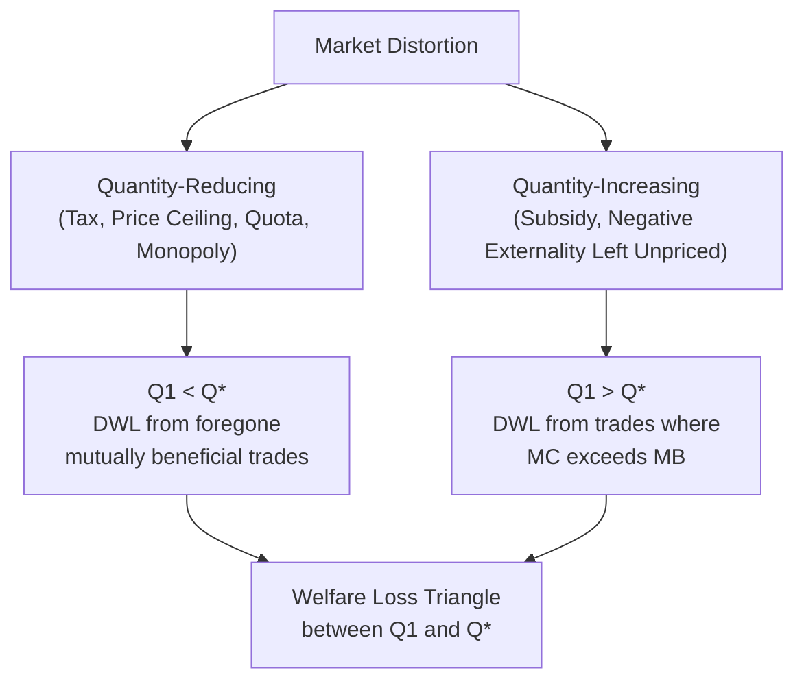

## Deadweight Loss and Welfare Analysis

### Overview

Welfare analysis is the framework economists use to evaluate how market outcomes and government interventions affect the well-being of consumers, producers, and society as a whole. Deadweight loss (DWL) — also called the welfare loss or excess burden — measures the reduction in total economic surplus that occurs when a market fails to reach the allocatively efficient equilibrium quantity. It represents lost mutual gains from trade that no party captures: not transferred to consumers, producers, or government, but destroyed entirely.

### Foundational Concepts

**Consumer Surplus (CS)**: The difference between what consumers are willing to pay and what they actually pay, summed across all units purchased. Graphically, the area below the demand curve and above the market price.

$$CS = \int_0^{Q^*} P_d(Q) \, dQ - P^* \times Q^*$$

**Producer Surplus (PS)**: The difference between what producers actually receive and their marginal cost of production, summed across all units sold. Graphically, the area above the supply curve and below the market price.

$$PS = P^* \times Q^* - \int_0^{Q^*} P_s(Q) \, dQ$$

**Total (Social) Surplus**: The sum of consumer and producer surplus, representing the total welfare generated by a market.

$$TS = CS + PS$$

**Key Points**:

- At the competitive equilibrium quantity $Q^*$ (where $P_d = P_s$, i.e., $MB = MC$), total surplus is maximized.
- Any quantity above or below $Q^*$ reduces total surplus, because units are being produced/consumed where marginal cost diverges from marginal benefit.
- Efficiency in this context refers strictly to allocative efficiency — maximizing total surplus — not equity or distributional fairness.

### The Efficiency Condition

A market allocation is efficient when the marginal benefit (MB) of the last unit consumed equals its marginal cost (MC) of production:

$$MB(Q^*) = MC(Q^*)$$

At the free, undistorted market equilibrium, $Q^*$ is determined by the intersection of demand (representing marginal benefit) and supply (representing marginal cost). Any policy, tax, price control, or market failure that pushes actual quantity $Q_1$ away from $Q^*$ opens a gap between MB and MC on the untraded (or over-traded) units, generating deadweight loss.

### Diagram: Deadweight Loss at a Glance

<svg xmlns="http://www.w3.org/2000/svg" viewBox="0 0 640 460">
<text x="320" y="24" text-anchor="middle" font-size="16" font-weight="bold" fill="#1a1a1a">Deadweight Loss from Underproduction (svg_diagram)</text>
<line x1="80" y1="400" x2="580" y2="400" stroke="#333" stroke-width="2" />
<line x1="80" y1="400" x2="80" y2="50" stroke="#333" stroke-width="2" />
<text x="590" y="405" font-size="13" fill="#333">Quantity</text>
<text x="55" y="45" font-size="13" fill="#333">Price</text>

<line x1="120" y1="380" x2="520" y2="90" stroke="#2563eb" stroke-width="2" />
<text x="530" y="90" font-size="12" fill="#2563eb">S (MC)</text>

<line x1="120" y1="90" x2="520" y2="380" stroke="#16a34a" stroke-width="2" />
<text x="530" y="380" font-size="12" fill="#16a34a">D (MB)</text>

<circle cx="320" cy="235" r="4" fill="#000" />
<line x1="320" y1="235" x2="320" y2="400" stroke="#888" stroke-dasharray="3,3" />
<line x1="80" y1="235" x2="320" y2="235" stroke="#888" stroke-dasharray="3,3" />
<text x="325" y="230" font-size="12">E* (P*, Q*)</text>

<line x1="230" y1="150" x2="230" y2="400" stroke="#dc2626" stroke-width="1.5" stroke-dasharray="4,3" />
<text x="215" y="415" font-size="11" fill="#dc2626">Q1</text>
<text x="315" y="415" font-size="11">Q*</text>

<circle cx="230" cy="175" r="4" fill="#16a34a" />
<circle cx="230" cy="290" r="4" fill="#2563eb" />

<polygon points="80,90 230,175 230,235 80,235" fill="#22c55e" opacity="0.15" />
<text x="110" y="150" font-size="11" fill="#166534">CS</text>

<polygon points="80,380 230,290 230,235 80,235" fill="#3b82f6" opacity="0.15" />
<text x="110" y="320" font-size="11" fill="#1e3a8a">PS</text>

<polygon points="230,175 320,235 230,290" fill="#f59e0b" opacity="0.5" />
<text x="245" y="240" font-size="12" font-weight="bold" fill="#7c2d12">DWL</text>

<text x="100" y="440" font-size="11" fill="#555">Restricting quantity from Q* to Q1 destroys the shaded triangle of surplus</text>

</svg>

### Sources of Deadweight Loss

**Key Points** — DWL commonly arises from:

1. **Taxes** — a per-unit tax drives a wedge between price paid and price received, reducing quantity below $Q^*$.
2. **Subsidies** — encourage production/consumption beyond $Q^*$, where MC exceeds MB on the excess units.
3. **Price ceilings** (e.g., rent control) — set below equilibrium price, causing quantity supplied to fall below $Q^*$ and creating shortages.
4. **Price floors** (e.g., minimum wage, agricultural price supports) — set above equilibrium price, causing quantity demanded to fall below $Q^*$ and creating surpluses.
5. **Quotas** — direct quantity restrictions below $Q^*$.
6. **Monopoly power** — a monopolist restricts output below the competitive quantity to raise price and extract surplus, creating DWL even absent any government policy.
7. **Externalities** — when private MC or MB diverges from social MC or MB, the market equilibrium is not socially optimal, producing DWL relative to the social optimum (distinct from, but structurally similar to, tax/subsidy DWL).

### Calculating Deadweight Loss

For linear demand and supply curves, DWL from a quantity restriction (via tax, price control, or quota) forms a triangle — often called the "welfare loss triangle" or "Harberger triangle":

$$DWL = \frac{1}{2} \times |\Delta Q| \times |\Delta P|$$

where $\Delta Q = Q^* - Q_1$ (the quantity reduction) and $\Delta P$ is the vertical gap between the demand and supply curves at $Q_1$ (e.g., the tax wedge, or the gap between willingness-to-pay and marginal cost at the restricted quantity).

**Numerical Example**:

Demand: $Q_d = 80 - 2P$. Supply: $Q_s = -10 + 2P$.

**Step 1 — Free-market equilibrium**:

$$80 - 2P = -10 + 2P \implies 90 = 4P \implies P^* = 22.5, \quad Q^* = 35$$

**Step 2 — Suppose a price ceiling is imposed at $P_c = 18$.**

$$Q_s = -10 + 2(18) = 26 \quad \text{(quantity supplied determines actual traded quantity)}$$

**Step 3 — Find the demand price at the reduced quantity** $Q_1 = 26$:

$$26 = 80 - 2P_d \implies P_d = 27$$

**Step 4 — Compute the welfare-loss triangle**:

$$\Delta Q = 35 - 26 = 9, \quad \Delta P = 27 - 18 = 9$$

$$DWL = \frac{1}{2} \times 9 \times 9 = 40.5$$

**Interpretation**: At $Q_1 = 26$, consumers value the next unit at $27 while producers could supply it for $18 — a $9 gap of unrealized mutual gain per unit across the 9 foregone units, none of which is captured by anyone.

### Welfare Analysis Under Different Interventions

#### Tax

| Component | Change |
| --- | --- |
| Consumer Surplus | Decreases |
| Producer Surplus | Decreases |
| Government Revenue | Increases (transfer, not a loss) |
| Deadweight Loss | Increases (net welfare loss) |

$$\Delta TS = \Delta CS + \Delta PS + \Delta R - DWL$$

Government revenue is **not** counted as a welfare loss — it is a transfer from consumers/producers to the government (and, in a full accounting, is presumed to fund public goods or services of comparable value). Only the DWL triangle is a pure loss to society.

#### Subsidy

| Component | Change |
| --- | --- |
| Consumer Surplus | Increases |
| Producer Surplus | Increases |
| Government Expenditure | Increases (transfer, cost to taxpayers) |
| Deadweight Loss | Increases (from overproduction) |

Unlike a tax, a subsidy's DWL arises because the government expenditure **exceeds** the combined gain in CS and PS — the difference is destroyed value from producing units where MC > MB.

#### Price Ceiling (Binding, Below Equilibrium)

- Consumer surplus: ambiguous — some consumers gain (pay less for units they still obtain) but others lose (rationed out entirely); net effect depends on demand elasticity.
- Producer surplus: unambiguously decreases.
- DWL: positive, from the triangle between $Q_1$ and $Q^*$.
- Additional non-price costs often emerge: search costs, queuing, black markets — these represent **further** welfare losses not captured in the standard triangle and are sometimes termed "second-order" losses.

#### Price Floor (Binding, Above Equilibrium)

- Producer surplus: ambiguous — sellers who still sell earn more per unit, but total units sold falls; net effect depends on supply elasticity.
- Consumer surplus: unambiguously decreases.
- DWL: positive, from the triangle between $Q_1$ and $Q^*$.
- Surplus output (unsold at the floor price) may require government purchase/storage, adding further fiscal cost beyond the core DWL triangle.

#### Monopoly

A monopolist sets output where marginal revenue (MR) equals marginal cost (MC), producing less and charging more than the competitive outcome. The DWL triangle sits between the monopoly quantity $Q_m$ and the competitive quantity $Q_c$, bounded by the demand and MC curves.

$$DWL_{monopoly} = \frac{1}{2} \times (Q_c - Q_m) \times (P_m - MC)$$

**Key Points**:

- Monopoly transfers some consumer surplus to producer surplus (higher price, positive markup) — this transfer alone is not inefficiency.
- The DWL is specifically the surplus lost on the units between $Q_m$ and $Q_c$ that are efficient to trade but are not produced under monopoly restriction.

### Diagram: Sources of DWL Comparison

### Determinants of Deadweight Loss Magnitude

**Key Points**:

- **Elasticity**: The more elastic demand and/or supply, the larger the quantity response to a given price distortion, and thus the larger the DWL. Highly inelastic markets (e.g., insulin, addictive goods) generate relatively small DWL from taxation.
- **Size of the distortion**: DWL grows approximately with the *square* of the tax/price distortion, meaning a doubling of a tax more than doubles the deadweight loss — a key justification for smoothing tax rates rather than large, concentrated ones.
- **Pre-existing distortions**: In markets that already have other distortions (e.g., existing taxes, externalities), the marginal DWL from an additional intervention can differ substantially from the isolated-market case — a concept explored in the theory of the second best. [Inference] Real-world interactions among multiple simultaneous distortions can be complex and are typically addressed with general equilibrium models rather than the single-market partial equilibrium framework presented here.

### Welfare Analysis and Government Revenue: The Laffer Curve Connection

Because DWL rises faster than tax revenue as the tax rate increases, there exists a revenue-maximizing tax rate beyond which further rate increases reduce total revenue even as DWL continues to grow. This relationship (the Laffer Curve) illustrates that welfare cost and revenue objectives can diverge sharply at high tax rates.

### Distinguishing Transfers from True Welfare Losses

A common analytical error is treating any redistribution as a loss to society. **Key Points**:

- Transfers (tax revenue to government, subsidy payments to producers/consumers, monopoly profit from consumers to the firm) **change who holds the surplus but do not by themselves destroy total surplus**.
- Only the units of trade that fail to occur (or occur inefficiently) when MB ≠ MC constitute genuine deadweight loss.
- Policy evaluation should separate the **efficiency effect** (DWL) from the **distributional effect** (who gains, who loses) — a normative judgment about the desirability of a policy often depends on both, weighed according to the values of the decision-maker or society, which the DWL calculation alone does not resolve.

### Applications

- **Optimal taxation theory**: Governments seeking to raise revenue with minimal DWL prefer taxing goods with inelastic demand/supply (Ramsey taxation principle), all else equal.
- **Cost-benefit analysis of regulation**: Agencies quantify DWL from proposed price controls, tariffs, or quotas to weigh efficiency costs against distributional or other policy goals.
- **Antitrust policy**: Regulators use monopoly DWL estimates to justify intervention against market power (mergers, price-fixing, dominant firm conduct).
- **Trade policy**: Tariff analysis decomposes welfare effects into consumer loss, producer gain, government revenue, and DWL — directly paralleling the tax framework.
- **Healthcare economics**: Analysis of insurance-induced overconsumption (moral hazard) uses the same MB/MC framework to estimate DWL from third-party payment systems.

### Common Misconceptions

- **Misconception**: "Deadweight loss means someone loses money that someone else gains." **Correction**: DWL is surplus that vanishes entirely — it is not transferred to any party, unlike tax revenue or monopoly profit.
- **Misconception**: "A price ceiling only hurts producers." **Correction**: While producer surplus unambiguously falls, consumer surplus can also fall on net if the demand-side losses from rationed-out consumers exceed the gains to those still able to purchase at the lower price.
- **Misconception**: "Total surplus is always maximized at market equilibrium." **Correction**: This holds only in the absence of externalities, market power, and other market failures; where private and social marginal costs/benefits diverge, the private market equilibrium itself can be inefficient relative to the social optimum.

**Related Topics**:

- Consumer and Producer Surplus
- Effects of Taxes and Subsidies on Market Outcomes
- Price Ceilings and Price Floors
- Market Failure and Externalities
- Monopoly and Market Power
- The Laffer Curve and Optimal Taxation
- Theory of the Second Best
- Cost-Benefit Analysis in Policy Evaluation