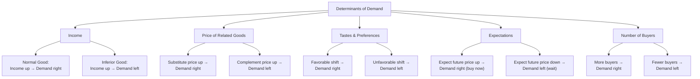

## Law of Demand and Determinants of Demand

### Overview

The law of demand is one of the foundational principles of microeconomics, describing the inverse relationship between the price of a good and the quantity demanded, holding all other factors constant. Determinants of demand refer to the non-price factors that cause the entire demand relationship — the demand curve itself — to shift. Distinguishing a **movement along** the demand curve (caused by a price change) from a **shift of** the demand curve (caused by a change in a non-price determinant) is essential to correctly analyzing market behavior.

### The Law of Demand

**Statement**: Holding all other factors constant (*ceteris paribus*), as the price of a good rises, the quantity demanded of that good falls; as price falls, quantity demanded rises.

$$\frac{\partial Q_d}{\partial P} < 0$$

**Key Points**:

- This inverse relationship is one of the most consistently observed regularities in economics, reflected in the negative slope of the demand curve.
- The law of demand describes quantity demanded — the amount consumers are willing and able to purchase at a given price — not merely desire or need.
- The relationship is *ceteris paribus*: it isolates the effect of price alone by holding income, tastes, prices of related goods, expectations, and the number of buyers constant.

### Why the Law of Demand Holds: Underlying Explanations

**Substitution Effect**: When a good's price rises relative to substitutes, consumers shift consumption toward relatively cheaper alternatives, reducing quantity demanded of the now-costlier good.

**Income Effect**: A price increase reduces a consumer's real purchasing power (effective income), which — for a normal good — leads to reduced consumption; for an inferior good, the income effect works in the opposite direction, though typically not enough to overturn the substitution effect.

**Diminishing Marginal Utility**: As a consumer acquires more units of a good, the marginal utility (satisfaction) derived from each additional unit typically declines. Consumers are willing to pay progressively less for successive units, which underlies the downward slope of the demand curve.

$$MU_n < MU_{n-1} \quad \text{for successive units } n$$

### The Demand Function and Demand Curve

The general demand function expresses quantity demanded as a function of price and other determinants:

$$Q_d = f(P, I, P_r, T, E, N, \ldots)$$

where:

- $P$ = price of the good itself
- $I$ = consumer income
- $P_r$ = price of related goods (substitutes or complements)
- $T$ = tastes and preferences
- $E$ = expectations about future prices/income
- $N$ = number of buyers in the market

A simple linear demand curve, holding other determinants fixed, takes the form:

$$Q_d = a - bP$$

where $a$ represents the quantity-axis intercept (influenced by all non-price determinants) and $b$ represents the sensitivity of quantity to price.

### Movement Along vs. Shift of the Demand Curve

**Key Points**:

- A **change in quantity demanded** results solely from a change in the good's own price and is represented by movement *along* a fixed demand curve.
- A **change in demand** results from a change in any non-price determinant and is represented by a *shift* of the entire curve — rightward (increase in demand) or leftward (decrease in demand).
- Confusing these two is one of the most common analytical errors in introductory economics.

#### Diagram: Movement Along vs. Shift of Demand

<svg xmlns="http://www.w3.org/2000/svg" viewBox="0 0 640 460">
<text x="320" y="24" text-anchor="middle" font-size="16" font-weight="bold" fill="#1a1a1a">Movement Along vs. Shift of Demand Curve (svg_diagram)</text>
<line x1="80" y1="400" x2="580" y2="400" stroke="#333" stroke-width="2" />
<line x1="80" y1="400" x2="80" y2="50" stroke="#333" stroke-width="2" />
<text x="590" y="405" font-size="13" fill="#333">Quantity</text>
<text x="55" y="45" font-size="13" fill="#333">Price</text>

<line x1="150" y1="90" x2="450" y2="380" stroke="#16a34a" stroke-width="2" />
<text x="455" y="380" font-size="12" fill="#16a34a">D0</text>

<line x1="230" y1="90" x2="530" y2="380" stroke="#2563eb" stroke-width="2" stroke-dasharray="6,4" />
<text x="535" y="380" font-size="12" fill="#2563eb">D1 (increase)</text>

<circle cx="250" cy="235" r="4" fill="#000" />
<circle cx="350" cy="160" r="4" fill="#000" />
<line x1="250" y1="235" x2="350" y2="160" stroke="#000" stroke-width="1.5" marker-end="url(#arrow)" />
<text x="255" y="250" font-size="11">A</text>
<text x="355" y="155" font-size="11">B (price fell → movement along D0)</text>

<circle cx="330" cy="235" r="4" fill="#dc2626" />
<line x1="250" y1="235" x2="330" y2="235" stroke="#dc2626" stroke-width="1.5" stroke-dasharray="3,3" />
<text x="335" y="230" font-size="11" fill="#dc2626">C (same price → shift to D1)</text>
<text x="90" y="430" font-size="11" fill="#555">A→B: price change causes movement along D0. A→C: non-price determinant causes shift to D1.</text>

</svg>

### The Determinants of Demand

#### 1. Income (I)

The effect of income changes depends on whether the good is normal or inferior.

- **Normal Good**: Demand increases as income rises (curve shifts right); demand decreases as income falls (curve shifts left).
- **Inferior Good**: Demand decreases as income rises (curve shifts left); demand increases as income falls (curve shifts right) — e.g., instant noodles, used clothing, generic-brand goods, as consumers substitute toward higher-quality alternatives when they can afford to.

The income elasticity of demand formalizes this:

$$E_I = \frac{\%\Delta Q_d}{\%\Delta I}$$

- $E_I > 0$: normal good
- $E_I < 0$: inferior good
- $E_I > 1$: luxury good (normal good with income-elastic demand)

#### 2. Prices of Related Goods ($P_r$)

- **Substitutes**: Goods that can replace one another in consumption (e.g., coffee and tea, Coke and Pepsi). A rise in the price of a substitute increases demand for the good in question (curve shifts right). Cross-price elasticity is positive: $E_{XY} > 0$.
- **Complements**: Goods consumed together (e.g., printers and ink, cars and gasoline). A rise in the price of a complement decreases demand for the good in question (curve shifts left). Cross-price elasticity is negative: $E_{XY} < 0$.

$$E_{XY} = \frac{\%\Delta Q_{d,X}}{\%\Delta P_Y}$$

#### 3. Tastes and Preferences (T)

Shifts in consumer preferences — driven by advertising, fashion trends, health information, cultural changes, or social influence — shift demand independent of price or income. A favorable shift (increased preference) moves demand right; an unfavorable shift moves it left.

#### 4. Expectations (E)

- **Future price expectations**: If consumers expect prices to rise, current demand increases (they buy now to avoid the higher future price); if they expect prices to fall, current demand decreases (they delay purchases).
- **Future income expectations**: Anticipated higher future income can increase current demand (especially for durable/big-ticket goods purchased on credit); anticipated income declines can reduce current demand.

#### 5. Number of Buyers / Market Size (N)

An increase in the number of consumers in a market (population growth, market expansion, demographic shifts) increases aggregate demand at every price level, shifting the market demand curve rightward; a decrease in buyers shifts it leftward.

#### 6. Other Determinants

- **Government policy**: Taxes, subsidies to consumers, and regulations can alter effective prices or preferences.
- **Seasonality**: Demand for goods like umbrellas, heating fuel, or holiday items shifts systematically with the calendar.
- **Demographics**: Age distribution, household composition, and urbanization patterns affect demand for age- or lifestyle-specific goods.

### Diagram: Determinants of Demand and Shift Direction

### Market Demand vs. Individual Demand

Market demand is the horizontal summation of all individual consumers' demand curves at each price level:

$$Q_d^{market}(P) = \sum_{i=1}^{n} Q_{d,i}(P)$$

**Key Points**:

- At any given price, market quantity demanded equals the sum of quantities demanded by every individual buyer at that price.
- The market demand curve is generally flatter (more elastic) than individual demand curves, since more substitution opportunities exist in aggregate.

### Numerical Example

Suppose individual demand curves for three consumers at price $P = 5$ are:

- Consumer A: $Q_A = 20 - 2P = 10$
- Consumer B: $Q_B = 15 - P = 10$
- Consumer C: $Q_C = 30 - 3P = 15$

Market quantity demanded at $P=5$:

$$Q_{market} = 10 + 10 + 15 = 35$$

If income rises and each consumer's demand curve shifts right (assuming normal goods) — e.g., $Q_A' = 24 - 2P$ — the market demand curve itself shifts right, and quantity demanded at the *same* price of $5 increases from 35 to a higher figure, illustrating a determinant-driven shift distinct from any price movement.

### Exceptions and Limitations to the Law of Demand

**Key Points** — the law of demand is a strong empirical regularity but has theoretically debated exceptions:

- **Giffen Goods**: [Inference] For certain inferior goods that constitute a very large share of a very poor consumer's budget, a price increase can theoretically cause quantity demanded to rise, because the negative income effect overwhelms the substitution effect. Giffen goods are considered rare and empirically difficult to document; most textbook examples (e.g., historical accounts of potatoes during the Irish famine) remain debated among economists.
- **Veblen Goods**: For certain luxury/status goods, higher prices can *signal* higher status or quality, potentially increasing quantity demanded at higher prices — this reflects a shift in perceived utility/tastes rather than a true violation of the *ceteris paribus* law of demand, since the good's perceived attributes change with price.
- **Speculative Demand**: In asset markets, a rising price can sometimes attract more buyers who expect further price increases (momentum/speculative behavior), an expectations-driven effect distinct from ordinary consumption demand.

**Note**: [Inference] Because Giffen and Veblen effects typically involve either extreme budget shares or a re-interpretation of the good's utility depending on price, most economists treat these as narrow theoretical exceptions rather than practical refutations of the law of demand for the vast majority of goods and markets.

### Applications

- **Sales forecasting**: Firms use demand determinants to predict how income growth, competitor pricing, or seasonal shifts will affect sales, independent of the firm's own pricing decisions.
- **Marketing and advertising**: Advertising campaigns aim to shift the tastes/preferences determinant, increasing demand at every price point rather than relying solely on price competition.
- **Policy analysis**: Understanding whether a good is normal or inferior, and its substitute/complement relationships, is essential for predicting the effects of tax policy, subsidies, or income-support programs on specific markets.
- **Inventory and capacity planning**: Businesses anticipate demand shifts from expected determinant changes (e.g., stocking heating oil before winter, or anticipating declining demand for a substitute after a competitor's price cut).

### Common Misconceptions

- **Misconception**: "A price change shifts the demand curve." **Correction**: A price change causes movement *along* a fixed demand curve; only non-price determinants shift the curve itself.
- **Misconception**: "All goods become more desired when income rises." **Correction**: Only normal goods behave this way; inferior goods see demand fall as income rises.
- **Misconception**: "The law of demand has no exceptions." **Correction**: While robust for the overwhelming majority of goods, theoretically and empirically debated exceptions (Giffen and Veblen goods) exist under specific, narrow conditions.

**Related Topics**:

- Price Elasticity of Demand
- Income and Cross-Price Elasticity
- Consumer Choice Theory and Utility Maximization
- Indifference Curves and Budget Constraints
- Substitution and Income Effects
- Market Equilibrium and the Price Mechanism
- Giffen and Veblen Goods
- Consumer Surplus