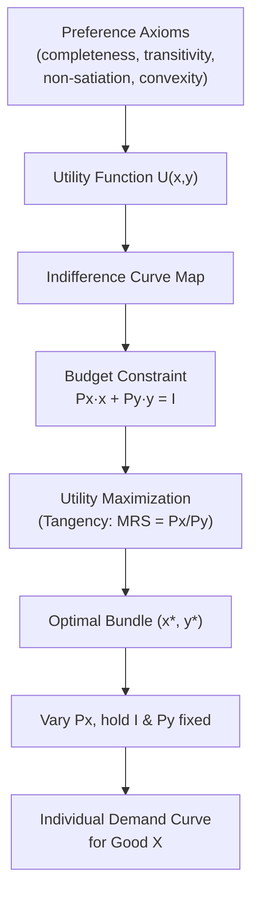

## Consumer Preferences and Utility Theory

### Overview

Utility theory provides the formal framework economists use to model how consumers make choices among goods and services under scarcity. It begins with axioms describing rational preference orderings, translates those preferences into a utility function representing satisfaction, and uses this function to derive optimal consumption decisions subject to a budget constraint. This theory underpins demand curve derivation, welfare analysis, and virtually all of microeconomic consumer theory.

### Consumer Preferences: Core Assumptions

Economists formalize consumer preferences using a set of axioms that ensure preferences are "well-behaved" and can be represented mathematically.

**Key Points** — the standard axioms of rational preference:

1. **Completeness**: For any two bundles $A$ and $B$, the consumer can state a preference — $A \succ B$, $B \succ A$, or $A \sim B$ (indifference). Consumers are assumed never to be undecided.
2. **Transitivity**: If $A \succ B$ and $B \succ C$, then $A \succ C$. This ensures consistent, non-contradictory rankings.
3. **Non-satiation (More is Better)**: Given a choice between two bundles, a consumer prefers the bundle with more of at least one good and no less of any other good ("monotonicity").
4. **Convexity**: Consumers prefer diversified bundles to extreme ones — a mix of two goods is preferred (or at least as good) to consuming only one, reflecting diminishing marginal rate of substitution.
5. **Continuity**: Small changes in a bundle lead to small changes in preference ranking, ensuring the preference relation can be represented by a continuous utility function (a formal requirement for mathematical tractability).

[Inference] These axioms are simplifying idealizations; behavioral economics research has documented systematic real-world deviations (e.g., preference reversals, framing effects) from strict transitivity and completeness, though the axioms remain the standard baseline for classical consumer theory.

### Utility Functions

A utility function $U(x_1, x_2, \ldots, x_n)$ assigns a numerical value to each consumption bundle, representing the preference ranking (not necessarily the literal magnitude of "happiness").

**Ordinal vs. Cardinal Utility**:

- **Ordinal utility**: Utility numbers only indicate *rank order* of preference, not the magnitude of satisfaction difference between bundles. This is the standard modern approach — if $U(A) = 10$ and $U(B) = 5$, we can only conclude $A \succ B$, not that $A$ is "twice as good."
- **Cardinal utility**: An older approach treating utility as measurable in absolute units ("utils"), allowing statements about *how much more* one bundle is preferred. Largely abandoned in modern consumer theory except for expected utility analysis under uncertainty, where cardinal properties matter for risk preferences.

**Key Points**:

- Any monotonic transformation of a utility function represents the same underlying preferences (ordinal invariance) — e.g., $U$ and $U^2$ (for $U>0$) generate identical demand behavior.
- Common utility function forms used in managerial and microeconomic analysis:

| Function | Form | Characteristics |
| --- | --- | --- |
| Cobb-Douglas | $U = x^\alpha y^\beta$ | Smooth, well-behaved indifference curves; constant expenditure shares |
| Perfect Substitutes | $U = ax + by$ | Linear indifference curves; goods traded at a fixed rate |
| Perfect Complements | $U = \min(ax, by)$ | L-shaped indifference curves; goods consumed in fixed proportions |
| Quasilinear | $U = x + f(y)$ | Income effects isolated to one good; useful in welfare analysis |

### Marginal Utility

Marginal utility (MU) is the additional satisfaction gained from consuming one more unit of a good, holding other consumption constant:

$$MU_x = \frac{\partial U}{\partial x}$$

**Law of Diminishing Marginal Utility**: As consumption of a good increases (holding other goods fixed), the marginal utility derived from each successive unit typically decreases.

$$\frac{\partial MU_x}{\partial x} = \frac{\partial^2 U}{\partial x^2} < 0$$

**Key Points**:

- This principle underlies the convex shape of indifference curves and the downward-sloping demand curve.
- Diminishing marginal utility does not imply *total* utility decreases — total utility still rises with consumption, just at a decreasing rate, so long as marginal utility remains positive.

### Indifference Curves

An indifference curve represents all consumption bundles that yield the same level of total utility — the consumer is indifferent among all points on the curve.

**Properties of standard (well-behaved) indifference curves**:

1. **Downward sloping**: To maintain the same utility while consuming more of one good, the consumer must give up some of the other (assuming both goods are desirable).
2. **Cannot intersect**: Two indifference curves crossing would violate transitivity.
3. **Convex to the origin**: Reflects a diminishing marginal rate of substitution — consumers require increasingly larger amounts of one good to compensate for successive unit losses of the other.
4. **Higher curves represent higher utility**: Curves farther from the origin represent preferred (higher-utility) bundles, by the non-satiation assumption.

#### Diagram: Indifference Curve Map

<svg xmlns="http://www.w3.org/2000/svg" viewBox="0 0 640 460">
<text x="320" y="24" text-anchor="middle" font-size="16" font-weight="bold" fill="#1a1a1a">Indifference Curve Map (svg_diagram)</text>
<line x1="80" y1="400" x2="580" y2="400" stroke="#333" stroke-width="2" />
<line x1="80" y1="400" x2="80" y2="50" stroke="#333" stroke-width="2" />
<text x="590" y="405" font-size="13" fill="#333">Good X</text>
<text x="45" y="45" font-size="13" fill="#333">Good Y</text>

<path d="M 130 380 Q 200 220 380 130" fill="none" stroke="#93c5fd" stroke-width="2" />
<text x="385" y="130" font-size="12" fill="#93c5fd">IC1</text>

<path d="M 180 380 Q 260 240 450 110" fill="none" stroke="#3b82f6" stroke-width="2" />
<text x="455" y="110" font-size="12" fill="#3b82f6">IC2</text>

<path d="M 240 380 Q 330 260 520 90" fill="none" stroke="#1e3a8a" stroke-width="2" />
<text x="525" y="90" font-size="12" fill="#1e3a8a">IC3</text>

<text x="320" y="425" font-size="12" fill="#555">Utility increases moving outward: IC3 &gt; IC2 &gt; IC1</text>

<line x1="150" y1="350" x2="220" y2="300" stroke="#16a34a" stroke-width="2" marker-end="url(#arrow2)" />
<text x="155" y="345" font-size="11" fill="#16a34a">↗ higher utility</text>
</svg>

### Marginal Rate of Substitution (MRS)

The MRS measures the rate at which a consumer is willing to trade one good for another while remaining on the same indifference curve — the negative of the slope of the indifference curve.

$$MRS_{xy} = -\frac{dy}{dx}\bigg|_{U = \bar{U}} = \frac{MU_x}{MU_y}$$

**Key Points**:

- MRS represents the consumer's *subjective* trade-off rate, distinct from the market's *objective* trade-off rate (the price ratio).
- Diminishing MRS (as $x$ increases along an indifference curve, MRS falls) is the mathematical expression of convex indifference curves and reflects the intuition that consumers value variety.
- For perfect substitutes, MRS is constant; for perfect complements, MRS is either zero or undefined (infinite) depending on which good is in excess.

### Special Cases of Preferences

#### Perfect Substitutes

$$U = ax + by$$

Indifference curves are straight lines with constant slope $-a/b$. Consumers view the goods as interchangeable at a fixed rate (e.g., two brands of identical bottled water).

#### Perfect Complements

$$U = \min(ax, by)$$

Indifference curves are L-shaped, kinked at the ratio $y/x = a/b$. Consumption of one good beyond the fixed ratio provides no additional utility without the paired good (e.g., left and right shoes, or nuts and bolts in fixed ratio).

#### Diagram: Perfect Substitutes vs. Perfect Complements

<svg xmlns="http://www.w3.org/2000/svg" viewBox="0 0 640 300">
<text x="320" y="24" text-anchor="middle" font-size="16" font-weight="bold" fill="#1a1a1a">Perfect Substitutes vs. Perfect Complements (svg_diagram)</text>

<line x1="50" y1="260" x2="280" y2="260" stroke="#333" stroke-width="2" />
<line x1="50" y1="260" x2="50" y2="60" stroke="#333" stroke-width="2" />
<line x1="70" y1="240" x2="260" y2="80" stroke="#2563eb" stroke-width="2" />
<line x1="70" y1="200" x2="260" y2="40" stroke="#93c5fd" stroke-width="2" />
<text x="100" y="285" font-size="12" fill="#333">Perfect Substitutes (linear ICs)</text>

<line x1="360" y1="260" x2="590" y2="260" stroke="#333" stroke-width="2" />
<line x1="360" y1="260" x2="360" y2="60" stroke="#333" stroke-width="2" />
<path d="M 400 260 L 400 130 L 530 130" fill="none" stroke="#2563eb" stroke-width="2" />
<path d="M 440 260 L 440 90 L 570 90" fill="none" stroke="#93c5fd" stroke-width="2" />
<text x="400" y="285" font-size="12" fill="#333">Perfect Complements (L-shaped ICs)</text>
</svg>

### Utility Maximization and the Consumer's Optimum

The consumer maximizes utility subject to a budget constraint:

$$\max_{x,y} U(x,y) \quad \text{subject to} \quad P_x x + P_y y = I$$

**Optimality condition (tangency)**: At the optimal bundle, the indifference curve is tangent to the budget line — the MRS equals the price ratio:

$$\frac{MU_x}{MU_y} = \frac{P_x}{P_y}$$

Equivalently, expressed as the **equimarginal principle**:

$$\frac{MU_x}{P_x} = \frac{MU_y}{P_y}$$

This states that at the optimum, the marginal utility per dollar spent is equalized across all goods — if this were not the case, the consumer could reallocate spending toward the good with higher marginal utility per dollar to increase total utility, until equalization is restored.

#### Diagram: Consumer Equilibrium (Tangency Condition)

<svg xmlns="http://www.w3.org/2000/svg" viewBox="0 0 640 420">
<text x="320" y="24" text-anchor="middle" font-size="16" font-weight="bold" fill="#1a1a1a">Consumer Equilibrium: Tangency of IC and Budget Line (svg_diagram)</text>
<line x1="80" y1="370" x2="580" y2="370" stroke="#333" stroke-width="2" />
<line x1="80" y1="370" x2="80" y2="50" stroke="#333" stroke-width="2" />
<text x="590" y="375" font-size="13" fill="#333">Good X</text>
<text x="45" y="45" font-size="13" fill="#333">Good Y</text>

<line x1="120" y1="90" x2="500" y2="350" stroke="#dc2626" stroke-width="2" />
<text x="505" y="350" font-size="12" fill="#dc2626">Budget Line: Pxx+Pyy=I</text>

<path d="M 180 350 Q 300 220 460 130" fill="none" stroke="#2563eb" stroke-width="2" />
<text x="465" y="125" font-size="12" fill="#2563eb">IC (highest attainable)</text>

<path d="M 150 350 Q 240 260 370 200" fill="none" stroke="#93c5fd" stroke-width="1.5" stroke-dasharray="4,3" />
<text x="375" y="200" font-size="11" fill="#93c5fd">Lower IC (feasible but not optimal)</text>

<circle cx="310" cy="217" r="5" fill="#000" />
<text x="320" y="210" font-size="12" font-weight="bold">E* (x*, y*)</text>
<line x1="310" y1="217" x2="310" y2="370" stroke="#888" stroke-dasharray="3,3" />
<line x1="80" y1="217" x2="310" y2="217" stroke="#888" stroke-dasharray="3,3" />
</svg>

### Numerical Example: Cobb-Douglas Utility Maximization

**Setup**: $U(x,y) = x^{0.5}y^{0.5}$, $P_x = 4$, $P_y = 2$, Income $I = 100$.

**Step 1 — Set up Lagrangian**:

$$\mathcal{L} = x^{0.5}y^{0.5} + \lambda(100 - 4x - 2y)$$

**Step 2 — First-order conditions**:

$$MU_x = 0.5x^{-0.5}y^{0.5} = 4\lambda$$

$$MU_y = 0.5x^{0.5}y^{-0.5} = 2\lambda$$

**Step 3 — Divide to eliminate $\lambda$** (tangency condition):

$$\frac{MU_x}{MU_y} = \frac{y}{x} = \frac{4}{2} = 2 \implies y = 2x$$

**Step 4 — Substitute into budget constraint**:

$$4x + 2(2x) = 100 \implies 8x = 100 \implies x^* = 12.5$$

$$y^* = 2(12.5) = 25$$

**Step 5 — Verify utility**:

$$U^* = (12.5)^{0.5}(25)^{0.5} \approx 17.68$$

**Interpretation**: [Inference for general Cobb-Douglas case] For a Cobb-Douglas utility function $U = x^\alpha y^\beta$, the standard closed-form solution allocates a fixed budget share to each good: $x^* = \frac{\alpha}{\alpha+\beta}\cdot\frac{I}{P_x}$ and $y^* = \frac{\beta}{\alpha+\beta}\cdot\frac{I}{P_y}$ — here, with $\alpha=\beta=0.5$, the consumer spends exactly half of income ($50) on each good, consistent with $x^* = 50/4 = 12.5$ and $y^* = 50/2 = 25$.

### Deriving the Demand Curve from Utility Maximization

By solving the utility-maximization problem for a range of prices $P_x$ (holding income and $P_y$ fixed), the resulting set of optimal quantities $x^*(P_x)$ traces out the individual demand curve — formally linking utility theory to the demand curve introduced in basic supply-and-demand analysis.

### Income and Substitution Effects Decomposition

When the price of a good changes, the total change in quantity demanded can be decomposed into:

1. **Substitution Effect**: The change in consumption due purely to the change in relative prices, holding utility (real purchasing power) constant — always moves in the opposite direction of the price change.
2. **Income Effect**: The change in consumption due to the change in real purchasing power caused by the price change — direction depends on whether the good is normal or inferior.

$$\text{Total Effect} = \text{Substitution Effect} + \text{Income Effect}$$

This decomposition (formally, the **Slutsky equation**) explains why demand curves slope downward for normal and most inferior goods, and identifies the narrow theoretical conditions (strongly inferior goods, i.e., Giffen goods) under which this could fail.

### Applications

- **Pricing and product bundling strategy**: Firms use indifference curve analysis and MRS concepts to design bundled pricing (e.g., software suites, cable packages) that extract consumer surplus based on preference heterogeneity.
- **Tax policy evaluation**: Comparing lump-sum versus commodity taxes uses utility maximization to show that lump-sum taxes are generally less distortionary (smaller welfare loss) for a given revenue target, since they don't alter relative price ratios.
- **Employee compensation design**: Equimarginal principle logic applies to allocating benefits budgets (cash vs. health insurance vs. retirement contributions) to maximize employee utility per dollar spent by the firm.
- **Consumer choice modeling in marketing**: Cobb-Douglas and other utility specifications underlie econometric demand estimation used in product positioning and pricing research.

### Common Misconceptions

- **Misconception**: "Utility is a directly measurable quantity like temperature." **Correction**: Modern (ordinal) utility theory only requires ranking bundles; the numerical utility values themselves carry no independent cardinal meaning.
- **Misconception**: "Diminishing marginal utility means the consumer eventually dislikes the good." **Correction**: Marginal utility diminishing toward zero (or even negative, i.e., satiation) is distinct from total utility decreasing; most standard models assume marginal utility stays positive throughout the relevant range.
- **Misconception**: "Indifference curves must always be smooth and convex." **Correction**: While standard for well-behaved preferences, perfect substitutes (linear) and perfect complements (L-shaped) are valid, commonly used exceptions representing extreme substitutability or non-substitutability.

**Related Topics**:

- Law of Demand and Determinants of Demand
- Budget Constraints and Consumer Choice
- Income and Substitution Effects (Slutsky Equation)
- Marginal Rate of Substitution
- Price, Income, and Cross-Price Elasticity of Demand
- Revealed Preference Theory
- Expected Utility Theory and Choice Under Uncertainty
- Consumer Surplus