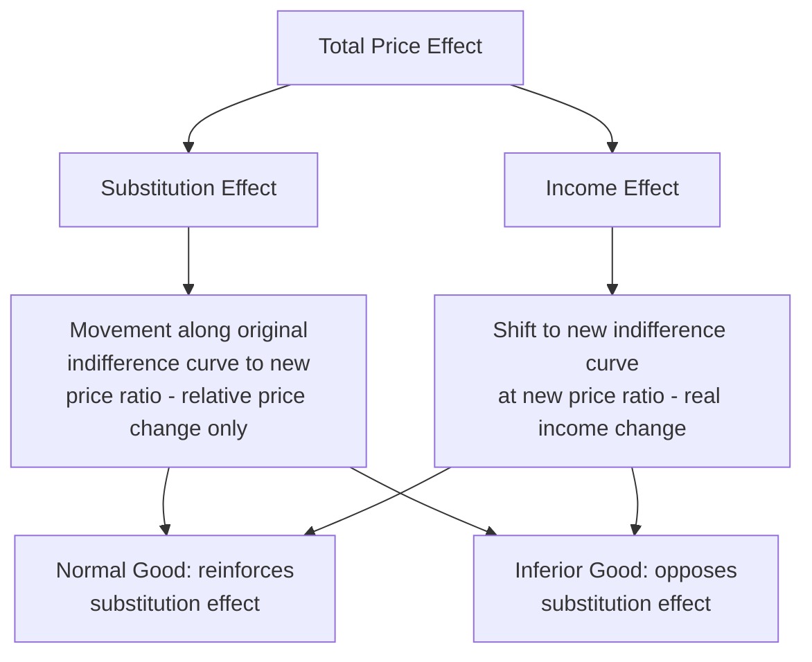

## Indifference Curve Analysis and Consumer Equilibrium

### Overview

Indifference curve analysis is an ordinal approach to consumer behavior theory, developed primarily by Francis Edgeworth, Vilfredo Pareto, and later formalized by J.R. Hicks and R.G.D. Allen. Unlike the cardinal utility approach (Marshallian utility analysis), this method does not require utility to be measured in absolute numerical units. Instead, consumers are assumed only to be able to rank bundles of goods by preference — stating whether one bundle is preferred to, less preferred than, or equally preferred as another.

### Key Concepts and Definitions

**Indifference Curve**

A locus of points representing different combinations of two goods that yield the same level of total satisfaction (utility) to the consumer, such that the consumer is indifferent between any of these combinations.

**Indifference Map**

A family or set of indifference curves, each corresponding to a different level of utility. Curves further from the origin represent higher levels of satisfaction.

**Key Points**

- Utility is ordinal (ranked), not cardinal (measured in units)
- The consumer is assumed to have consistent, rational preferences
- Only two goods are typically analyzed (for graphical tractability), though the theory generalizes to $n$ goods

### Assumptions of Indifference Curve Analysis

1. **Rationality** — the consumer aims to maximize satisfaction subject to a budget constraint
2. **Ordinal utility** — preferences can be ranked, not quantified
3. **Consistency and transitivity** — if bundle A is preferred to B, and B to C, then A is preferred to C; preference rankings do not reverse
4. **Non-satiation (more is better)** — a consumer always prefers more of a good to less, holding the other good constant
5. **Diminishing marginal rate of substitution** — as a consumer substitutes one good for another along an indifference curve, progressively smaller amounts of the second good are required to compensate for each additional unit of the first
6. **Continuity** — indifference curves are continuous and smooth, permitting infinitesimally small substitutions

### Properties of Indifference Curves

**Key Points**

- **Negative slope (downward sloping):** To maintain the same utility level, an increase in one good must be offset by a decrease in the other, given non-satiation
- **Convex to the origin:** A direct result of the diminishing marginal rate of substitution (MRS)
- **Higher curves represent higher utility:** Any point on a curve farther from the origin is preferred to any point on a curve closer to the origin
- **Indifference curves cannot intersect:** If two curves crossed, the point of intersection would imply two different utility levels for the same bundle, violating transitivity
- **Curves do not touch the axes:** Assumes both goods are desired in positive quantities for a well-behaved (interior) solution

<svg xmlns="http://www.w3.org/2000/svg" viewBox="0 0 500 400">
<text x="250" y="25" font-size="16" font-weight="bold" text-anchor="middle" fill="#1a1a1a">Indifference Map (svg_diagram)</text>
<line x1="60" y1="350" x2="60" y2="50" stroke="#333" stroke-width="2" />
<line x1="60" y1="350" x2="460" y2="350" stroke="#333" stroke-width="2" />
<text x="465" y="355" font-size="14" fill="#333">Good X</text>
<text x="30" y="45" font-size="14" fill="#333">Good Y</text>
<path d="M 90,120 Q 150,180 230,320" stroke="#2563eb" stroke-width="2" fill="none" />
<text x="235" y="330" font-size="12" fill="#2563eb">IC1</text>
<path d="M 130,90 Q 210,160 320,320" stroke="#16a34a" stroke-width="2" fill="none" />
<text x="325" y="330" font-size="12" fill="#16a34a">IC2</text>
<path d="M 180,70 Q 280,150 400,320" stroke="#dc2626" stroke-width="2" fill="none" />
<text x="405" y="330" font-size="12" fill="#dc2626">IC3</text>

<text x="330" y="60" font-size="12" fill="#555">Higher utility →</text>

<line x1="200" y1="200" x2="320" y2="70" stroke="#999" stroke-width="1" stroke-dasharray="4,4" marker-end="url(#arrow)" />

</svg>

### Marginal Rate of Substitution (MRS)

The MRS of good X for good Y is the rate at which a consumer is willing to substitute good X for good Y while remaining on the same indifference curve (holding total utility constant).

$$MRS_{XY} = -\frac{\Delta Y}{\Delta X}\bigg|_{U=\bar{U}}$$

At the margin (differential form), the MRS equals the slope of the indifference curve and is also expressible as the ratio of marginal utilities:

$$MRS_{XY} = -\frac{dY}{dX} = \frac{MU_X}{MU_Y}$$

**Derivation from total differential of utility:**

Along a single indifference curve, total utility $U(X,Y)$ is constant, so $dU = 0$:

$$dU = MU_X \, dX + MU_Y \, dY = 0$$

$$\Rightarrow \frac{dY}{dX} = -\frac{MU_X}{MU_Y}$$

**Diminishing MRS**

As the consumer moves down the indifference curve (acquiring more X and less Y), the MRS falls — each additional unit of X is worth progressively fewer units of Y in terms of maintained satisfaction. This is the graphical counterpart of diminishing marginal utility and is what produces the convex shape.

### The Budget Line (Budget Constraint)

The budget line represents all combinations of two goods that a consumer can purchase given a fixed income $M$ and fixed prices $P_X$ and $P_Y$.

$$P_X \cdot X + P_Y \cdot Y = M$$

Rearranged in slope-intercept form:

$$Y = \frac{M}{P_Y} - \frac{P_X}{P_Y} X$$

**Key Points**

- Vertical intercept ($X=0$): $Y = M/P_Y$ — maximum quantity of Y purchasable
- Horizontal intercept ($Y=0$): $X = M/P_X$ — maximum quantity of X purchasable
- Slope of the budget line = $-P_X/P_Y$, the **relative price ratio** (opportunity cost of X in terms of Y)
- A change in income shifts the line parallel (outward for increase, inward for decrease)
- A change in relative prices changes the slope, pivoting the line around one intercept

### Consumer Equilibrium

**Definition**

Consumer equilibrium occurs at the combination of goods that maximizes utility subject to the budget constraint — the point where the consumer gets the highest attainable satisfaction given limited income.

**Graphical Condition**

Equilibrium occurs at the point of **tangency** between the budget line and the highest attainable indifference curve. At this point, the slope of the indifference curve (MRS) equals the slope of the budget line (price ratio):

$$MRS_{XY} = \frac{MU_X}{MU_Y} = \frac{P_X}{P_Y}$$

Equivalently, rearranging into the **equi-marginal principle**:

$$\frac{MU_X}{P_X} = \frac{MU_Y}{P_Y}$$

This states that at equilibrium, the marginal utility per dollar (or peso) spent is equal across all goods — the consumer cannot reallocate spending between X and Y to gain additional utility.

<svg xmlns="http://www.w3.org/2000/svg" viewBox="0 0 500 400">
<text x="250" y="25" font-size="16" font-weight="bold" text-anchor="middle" fill="#1a1a1a">Consumer Equilibrium (svg_diagram)</text>
<line x1="60" y1="350" x2="60" y2="50" stroke="#333" stroke-width="2" />
<line x1="60" y1="350" x2="460" y2="350" stroke="#333" stroke-width="2" />
<text x="465" y="355" font-size="14" fill="#333">Good X</text>
<text x="30" y="45" font-size="14" fill="#333">Good Y</text>
<line x1="80" y1="90" x2="420" y2="330" stroke="#555" stroke-width="2" />
<text x="425" y="330" font-size="12" fill="#555">Budget Line</text>
<path d="M 100,300 Q 180,220 280,180" stroke="#93c5fd" stroke-width="2" fill="none" />
<path d="M 140,260 Q 210,190 320,240" stroke="#2563eb" stroke-width="2" fill="none" />
<path d="M 180,220 Q 250,175 340,300" stroke="#93c5fd" stroke-width="2" fill="none" />
<circle cx="253" cy="200" r="5" fill="#dc2626" />
<text x="260" y="195" font-size="12" fill="#dc2626">E (Equilibrium)</text>
<line x1="253" y1="200" x2="253" y2="350" stroke="#999" stroke-width="1" stroke-dasharray="3,3" />
<line x1="253" y1="200" x2="60" y2="200" stroke="#999" stroke-width="1" stroke-dasharray="3,3" />
<text x="245" y="365" font-size="11" fill="#333">X*</text>
<text x="35" y="204" font-size="11" fill="#333">Y*</text>
</svg>

### Conditions for Consumer Equilibrium

**Key Points**

1. **First-order (necessary) condition:** $MRS_{XY} = P_X/P_Y$ — the budget line is tangent to an indifference curve
2. **Second-order (sufficient) condition:** the indifference curve must be convex to the origin at the point of tangency (diminishing MRS), ensuring the tangency is a maximum, not a minimum or saddle point

**Worked Example**

A consumer has utility function $U(X,Y) = X^{0.5}Y^{0.5}$ (Cobb-Douglas form), income $M = \$100$, $P_X = \$5$, $P_Y = \$4$.

Marginal utilities:

$$MU_X = 0.5X^{-0.5}Y^{0.5}, \quad MU_Y = 0.5X^{0.5}Y^{-0.5}$$

Equilibrium condition:

$$\frac{MU_X}{MU_Y} = \frac{Y}{X} = \frac{P_X}{P_Y} = \frac{5}{4}$$

$$\Rightarrow Y = \frac{5}{4}X$$

Substitute into the budget constraint $5X + 4Y = 100$:

$$5X + 4\left(\frac{5}{4}X\right) = 100 \Rightarrow 10X = 100 \Rightarrow X^* = 10, \quad Y^* = 12.5$$

**Output**

Equilibrium bundle: $X^* = 10$ units, $Y^* = 12.5$ units, exhausting the entire $100 budget while equating marginal utility per peso spent across both goods.

### Corner Solutions

When indifference curves do not yield an interior tangency (e.g., perfect substitutes, or strong preference for one good), equilibrium may occur at a corner of the budget line where the consumer spends the entire income on a single good. This typically happens when $MRS_{XY} \neq P_X/P_Y$ throughout the feasible region, or with linear (perfect substitute) indifference curves.

### Effects of Changes in Income and Price

**Income Effect**

A change in income, holding prices constant, shifts the budget line parallel and traces out the **Income Consumption Curve (ICC)** — the locus of equilibrium points as income varies. The ICC underlies the derivation of Engel curves.

**Price Effect**

A change in the price of one good, holding income and the other good's price constant, pivots the budget line and traces out the **Price Consumption Curve (PCC)** — the locus of equilibrium points as the price of one good varies. The PCC underlies the derivation of the individual demand curve.

**Decomposition (Hicks/Slutsky)**

The total price effect can be decomposed into:

- **Substitution effect** — the change in quantity demanded due to the change in relative prices alone, holding utility (Hicksian) or real income (Slutsky) constant
- **Income effect** — the change in quantity demanded due to the resulting change in real purchasing power

**[Inference]** In most standard textbook treatments, the Hicksian decomposition is used for compensated demand derivation, while the Slutsky decomposition is more commonly used in introductory courses due to its simpler observable-income-based construction; the choice of method can affect the precise magnitude (though not the qualitative direction) of the reported substitution and income effects for a given good.

### Applications of Indifference Curve Analysis

**Key Points**

- **Derivation of individual and market demand curves** from the price consumption curve
- **Analysis of consumer choice under taxation and subsidies** (e.g., comparing lump-sum vs. specific taxes)
- **Labor-leisure choice models** (substituting "leisure" and "income" as the two goods)
- **Intertemporal choice** (substituting "present consumption" and "future consumption")
- **Welfare analysis** — measuring compensating variation and equivalent variation from price changes
- **Index number theory** — Laspeyres and Paasche price indices interpreted via indifference curves

### Comparison: Indifference Curve Approach vs. Cardinal Utility Approach

| Aspect | Cardinal (Marshallian) | Ordinal (Indifference Curve) |
| --- | --- | --- |
| Utility measurement | Numerically quantifiable (utils) | Ranked/ordered only |
| Independence assumption | Utility of goods assumed independent | No independence assumption required |
| Key tool | Marginal utility | MRS and indifference curves |
| Equilibrium condition | $MU_X/P_X = MU_Y/P_Y = MU_M$ | $MRS_{XY} = P_X/P_Y$ |
| Realism | Considered less realistic (assumes measurable satisfaction) | More realistic; requires only preference ranking |

### Limitations of Indifference Curve Analysis

**Key Points**

- Typically restricted to two-good analysis for graphical representation (though algebraically extendable to $n$ goods)
- Assumes consumers have complete, well-ordered, and consistent preferences — a strong behavioral assumption
- Does not account for behavioral factors such as bounded rationality, habit formation, or social/psychological influences on choice
- Assumes perfect divisibility of goods, which may not hold for discrete/lumpy goods

### Related Topics

- Marginal Utility Analysis and the Law of Diminishing Marginal Utility
- Derivation of Individual and Market Demand Curves
- Slutsky Equation and Substitution/Income Effect Decomposition
- Revealed Preference Theory (Samuelson)
- Consumer Surplus and Welfare Measurement
- Engel Curves and Income Elasticity of Demand
- Labor-Leisure Choice Model
- Intertemporal Consumption and the Fisher Model
- Giffen Goods and Exceptions to the Law of Demand