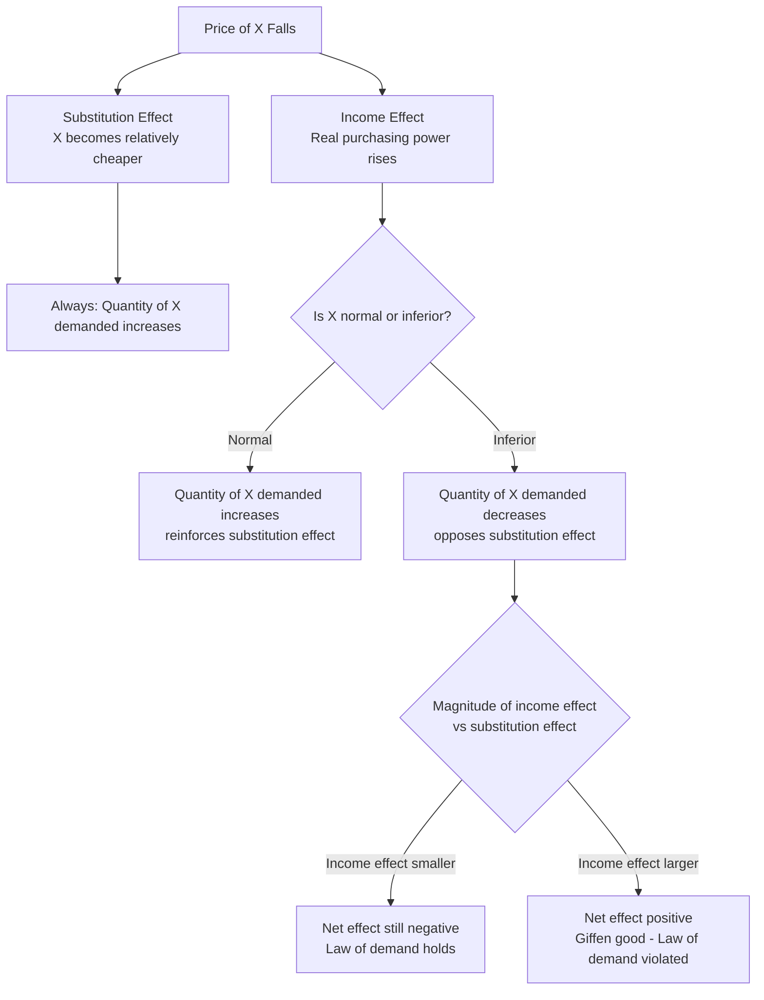

## Income and Substitution Effects

### Overview

When the price of a good changes, the total change in quantity demanded (the **price effect**) can be analytically decomposed into two distinct components: the **substitution effect** and the **income effect**. This decomposition, pioneered by Eugen Slutsky and later refined graphically by John Hicks, is central to understanding demand behavior, the shape of demand curves, and anomalies such as Giffen goods.

### Key Definitions

**Price Effect (Total Effect)**

The total change in quantity demanded of a good resulting from a change in its own price, holding money income and the price of other goods constant. Equals the sum of the substitution and income effects.

**Substitution Effect**

The change in quantity demanded resulting purely from a change in the relative price of a good, with real income (or utility) held constant. When a good becomes relatively cheaper, consumers substitute toward it and away from now relatively more expensive goods — this effect is **always negative** (price and quantity move in opposite directions), regardless of the nature of the good.

**Income Effect**

The change in quantity demanded resulting from the change in real purchasing power caused by the price change, with relative prices held constant at their new level. Its direction depends on whether the good is normal or inferior.

**Key Points**

- Substitution effect: always negative (opposes the price change) — law of demand holds unconditionally here
- Income effect: sign depends on income elasticity of the good
- Total price effect = Substitution effect + Income effect

### Two Decomposition Methods

**Hicksian Decomposition**

Holds **real utility** constant. The substitution effect is measured by keeping the consumer on the *original* indifference curve while adjusting to the new price ratio, using a hypothetical (compensated) budget line tangent to the original indifference curve.

**Slutsky Decomposition**

Holds **real purchasing power (real income)** constant, defined as the ability to purchase the original bundle at new prices. The substitution effect is measured by shifting the budget line to the new price ratio while allowing it to pass through the original consumption bundle.

**Key Points**

- Hicksian: theoretically cleaner (constant utility), used in advanced welfare economics and compensated demand derivation
- Slutsky: simpler to apply empirically since it relies on observable income/prices rather than unobservable utility
- Both methods agree qualitatively on the direction of effects; they differ slightly in magnitude, particularly for large price changes

**[Inference]** For infinitesimally small price changes, the Hicksian and Slutsky substitution effects converge to the same value; the distinction in magnitude becomes more relevant primarily for discrete/large price changes, though the extent of divergence depends on the specific utility function and the curvature of preferences.

### Graphical Decomposition (Hicksian Method)

Consider a fall in the price of good X ($P_X \downarrow$), with $P_Y$ and money income $M$ held constant.

**Steps**

1. **Original equilibrium** at point $E_1$: tangency of original budget line $B_1$ with indifference curve $IC_1$
2. **New (actual) budget line** $B_2$: pivots outward from the $Y$-intercept as $P_X$ falls, reflecting the new relative price ratio
3. **New equilibrium** at point $E_3$: tangency of $B_2$ with a higher indifference curve $IC_2$
4. **Compensated budget line** $B_c$: hypothetical line parallel to $B_2$ (same new price ratio) but shifted inward/outward so it is tangent to the *original* indifference curve $IC_1$ at point $E_2$
5. **Substitution effect** = movement from $E_1$ to $E_2$ (along $IC_1$, driven purely by relative price change)
6. **Income effect** = movement from $E_2$ to $E_3$ (parallel shift from $B_c$ to $B_2$, driven purely by real income change)

<svg xmlns="http://www.w3.org/2000/svg" viewBox="0 0 560 420">
<text x="280" y="25" font-size="16" font-weight="bold" text-anchor="middle" fill="#1a1a1a">Hicksian Decomposition: Fall in P_X (svg_diagram)</text>
<line x1="70" y1="370" x2="70" y2="50" stroke="#333" stroke-width="2" />
<line x1="70" y1="370" x2="520" y2="370" stroke="#333" stroke-width="2" />
<text x="525" y="375" font-size="13" fill="#333">Good X</text>
<text x="40" y="45" font-size="13" fill="#333">Good Y</text>
<line x1="90" y1="100" x2="270" y2="360" stroke="#555" stroke-width="2" />
<text x="200" y="345" font-size="11" fill="#555">B1 (original)</text>
<line x1="90" y1="100" x2="470" y2="360" stroke="#111" stroke-width="2" />
<text x="420" y="345" font-size="11" fill="#111">B2 (new, P_X falls)</text>
<line x1="160" y1="80" x2="400" y2="320" stroke="#999" stroke-width="1.5" stroke-dasharray="5,3" />
<text x="405" y="315" font-size="11" fill="#999">Bc (compensated)</text>
<path d="M 110,300 Q 170,200 260,150" stroke="#2563eb" stroke-width="2" fill="none" />
<text x="115" y="295" font-size="11" fill="#2563eb">IC1</text>
<path d="M 170,280 Q 250,190 380,180" stroke="#16a34a" stroke-width="2" fill="none" />
<text x="385" y="180" font-size="11" fill="#16a34a">IC2</text>
<circle cx="175" cy="245" r="5" fill="#dc2626" />
<text x="130" y="235" font-size="12" fill="#dc2626">E1</text>
<circle cx="260" cy="215" r="5" fill="#ea580c" />
<text x="265" y="205" font-size="12" fill="#ea580c">E2 (compensated)</text>
<circle cx="330" cy="190" r="5" fill="#7c3aed" />
<text x="335" y="180" font-size="12" fill="#7c3aed">E3 (final)</text>
<line x1="175" y1="245" x2="260" y2="215" stroke="#dc2626" stroke-width="2" marker-end="url(#arrow2)" />
<line x1="260" y1="215" x2="330" y2="190" stroke="#7c3aed" stroke-width="2" marker-end="url(#arrow2)" />
<text x="175" y="390" font-size="11" fill="`#dc2626`">← Substitution Effect →</text>

<text x="330" y="405" font-size="11" fill="`#7c3aed`">← Income Effect →</text>

</svg>

### Mathematical Formulation: The Slutsky Equation

The Slutsky equation formally decomposes the total effect of a price change on demand into substitution and income components:

$$\frac{\partial X}{\partial P_X}\bigg|_{M} = \frac{\partial X}{\partial P_X}\bigg|_{U} - X \cdot \frac{\partial X}{\partial M}$$

Where:

- $\dfrac{\partial X}{\partial P_X}\Big|_{M}$ = total (Marshallian/uncompensated) price effect, holding money income constant
- $\dfrac{\partial X}{\partial P_X}\Big|_{U}$ = substitution effect (Hicksian/compensated), holding utility constant
- $-X \cdot \dfrac{\partial X}{\partial M}$ = income effect, scaled by the quantity of X consumed

**Key Points**

- The substitution term is always $\leq 0$ (negative semi-definiteness of the substitution matrix, a core result of consumer theory)
- The income effect term's sign depends on $\partial X/\partial M$: positive for normal goods, negative for inferior goods
- The equation can also be written using elasticities (see below)

**Elasticity Form of the Slutsky Equation**

$$e_{X,P_X} = e_{X,P_X}^{S} - \theta_X \cdot e_{X,M}$$

Where $e_{X,P_X}$ is the own-price elasticity, $e_{X,P_X}^{S}$ is the substitution (compensated) elasticity, $\theta_X = P_X X / M$ is the budget share of good X, and $e_{X,M}$ is the income elasticity.

### Classification of Goods by Income and Substitution Effects

| Good Type | Substitution Effect | Income Effect | Net Price Effect |
| --- | --- | --- | --- |
| Normal good | Negative (SE reinforces) | Positive (as $P_X\downarrow$, real income $\uparrow$, X demand $\uparrow$) | Negative — law of demand holds |
| Inferior good (mild) | Negative | Negative, but smaller in magnitude than SE | Negative — law of demand holds |
| Giffen good | Negative | Negative, and larger in magnitude than SE | **Positive** — law of demand violated |

**Example**

Suppose $P_X$ falls. For a **normal good**, both effects push quantity demanded of X upward — demand curve slopes downward unambiguously. For an **inferior good** like store-brand staples, the income effect (fall in $P_X$ → higher real income → *less* demand for the inferior good) works against the substitution effect, but is generally too weak to reverse the price effect. For a **Giffen good** (a specific, rare case of a strongly inferior good with a high budget share, such as classic examples of staple grains in subsistence economies), the negative income effect dominates the negative substitution effect, causing quantity demanded to *fall* as price falls — an upward-sloping demand curve.

### Worked Numerical Example

**Setup**

A consumer has utility $U(X,Y) = XY$, income $M = \$120$. Initially $P_X = \$3$, $P_Y = \$3$. Price of X falls to $P_X' = \$2$.

**Step 1: Original equilibrium**

For Cobb-Douglas utility $U = XY$, demand functions are $X = M/(2P_X)$, $Y = M/(2P_Y)$.

$$X_1 = \frac{120}{2(3)} = 20, \quad Y_1 = \frac{120}{2(3)} = 20$$

**Step 2: New (uncompensated) equilibrium at new price**

$$X_3 = \frac{120}{2(2)} = 30, \quad Y_3 = \frac{120}{2(3)} = 20$$

Total price effect on X: $\Delta X = 30 - 20 = 10$ (increase)

**Step 3: Compensating variation (Slutsky compensation)**

Income needed to just afford the original bundle $(20, 20)$ at new prices:

$$M_c = P_X' \cdot 20 + P_Y \cdot 20 = 2(20) + 3(20) = 100$$

**Step 4: Compensated demand at new prices with compensated income**

$$X_2 = \frac{100}{2(2)} = 25$$

**Output**

- Substitution effect: $X_2 - X_1 = 25 - 20 = 5$ (increase, due to relative price change alone)
- Income effect: $X_3 - X_2 = 30 - 25 = 5$ (increase, since X is a normal good here)
- Total effect: $5 + 5 = 10$ ✓ (matches Step 2)

### Applications

**Key Points**

- **Deriving the law of demand** and identifying its theoretical exceptions (Giffen goods)
- **Tax and subsidy analysis** — comparing an equal-revenue specific tax vs. lump-sum tax using compensated demand curves shows lump-sum taxation is generally less distortive (smaller deadweight loss) because it avoids inducing a substitution effect
- **Labor supply and the backward-bending supply curve** — a wage increase has a substitution effect (favoring work over leisure) and an income effect (favoring leisure as a normal good), which can offset at high wage levels
- **Welfare measurement** — Compensating Variation (CV) and Equivalent Variation (EV) are built directly on Hicksian (compensated) demand derived from this decomposition
- **Index number construction** — Laspeyres and Paasche price indices implicitly reflect assumptions about these effects

### Distinguishing Marshallian vs. Hicksian (Compensated) Demand

| Aspect | Marshallian Demand | Hicksian (Compensated) Demand |
| --- | --- | --- |
| Held constant | Money income $M$ | Utility level $U$ |
| Derived from | Utility maximization s.t. budget constraint | Expenditure minimization s.t. utility constraint |
| Captures | Full price effect (SE + IE) | Substitution effect only |
| Slope | Can be positive (Giffen case) | Always non-positive (theoretically guaranteed) |
| Use case | Observable market demand | Welfare analysis, tax incidence |

### Limitations and Caveats

**Key Points**

- The decomposition is a theoretical/analytical device; in practice, only the total price effect is directly observable from market data — separating it into SE and IE requires estimating a full demand system or utility function
- Assumes preferences are well-behaved (convex, complete, transitive), which may not perfectly describe real consumer behavior
- Giffen goods, while theoretically important, are empirically rare and difficult to conclusively document
- [Unverified] The frequently cited historical "Irish potato famine" illustration of a Giffen good has been disputed by economic historians as lacking robust empirical support; more credible empirical evidence for Giffen behavior has come from controlled studies (e.g., rice and wheat consumption studies in parts of China)

### Related Topics

- Slutsky Equation: Formal Derivation and Matrix Form
- Hicksian vs. Marshallian Demand Functions
- Giffen Goods and Veblen Goods
- Consumer Surplus, Compensating Variation, and Equivalent Variation
- Labor-Leisure Choice and Backward-Bending Labor Supply Curve
- Elasticity of Demand: Price, Income, and Cross-Price
- Revealed Preference Theory
- Deadweight Loss and Tax Incidence Analysis