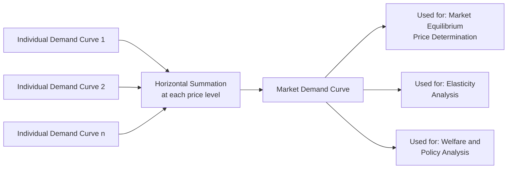

## Individual versus Market Demand Curves

### Overview

The individual demand curve shows the relationship between the price of a good and the quantity demanded by a single consumer, holding all other factors constant. The market demand curve aggregates the quantities demanded by all individual consumers in the market at each price level. Understanding the relationship between the two is essential for analyzing market equilibrium, elasticity, and policy interventions.

### Individual Demand Curve

**Definition**

The individual demand curve for a good depicts the quantity of that good a single consumer is willing and able to purchase at various price levels, ceteris paribus (holding income, prices of other goods, tastes, and expectations constant).

**Derivation**

The individual demand curve is derived from the consumer's utility-maximizing choices at each price, traced from the **Price Consumption Curve (PCC)** in indifference curve analysis. As $P_X$ varies (with $M$ and $P_Y$ fixed), the corresponding equilibrium quantities of X at each price trace out the individual demand curve.

**Key Points**

- Downward sloping (in the normal case), reflecting the law of demand
- Derived holding money income, other prices, and preferences constant
- Individual demand function: $X_i = f_i(P_X, P_Y, M_i, T_i)$, where $T_i$ represents tastes

### Derivation from Price Consumption Curve

**Steps**

1. Fix income $M$ and price of good Y ($P_Y$)
2. Vary $P_X$ across a range of values, generating a series of budget lines pivoting from the same $Y$-intercept
3. Find the utility-maximizing tangency point with an indifference curve at each price
4. Plot the resulting price-quantity pairs on a separate diagram with $P_X$ on the vertical axis and $X$ on the horizontal axis

<svg xmlns="http://www.w3.org/2000/svg" viewBox="0 0 600 420">
<text x="300" y="25" font-size="16" font-weight="bold" text-anchor="middle" fill="#1a1a1a">Deriving Individual Demand from PCC (svg_diagram)</text>
<line x1="70" y1="190" x2="70" y2="40" stroke="#333" stroke-width="2" />
<line x1="70" y1="190" x2="290" y2="190" stroke="#333" stroke-width="2" />
<text x="295" y="195" font-size="11" fill="#333">Good X</text>
<text x="40" y="35" font-size="11" fill="#333">Good Y</text>
<line x1="90" y1="60" x2="270" y2="180" stroke="#555" stroke-width="1.5" />
<line x1="90" y1="60" x2="220" y2="180" stroke="#777" stroke-width="1.5" />
<line x1="90" y1="60" x2="180" y2="180" stroke="#999" stroke-width="1.5" />
<path d="M 105,150 Q 140,100 190,80" stroke="#2563eb" stroke-width="1.5" fill="none" />
<path d="M 130,160 Q 175,115 235,95" stroke="#16a34a" stroke-width="1.5" fill="none" />
<path d="M 160,170 Q 210,130 260,110" stroke="#dc2626" stroke-width="1.5" fill="none" />
<circle cx="135" cy="140" r="3" fill="#111" />
<circle cx="175" cy="127" r="3" fill="#111" />
<circle cx="215" cy="118" r="3" fill="#111" />
<path d="M 135,140 Q 175,133 215,118" stroke="#111" stroke-width="1" stroke-dasharray="3,2" fill="none" />
<text x="140" y="128" font-size="10" fill="#111">PCC</text>
<line x1="360" y1="190" x2="360" y2="40" stroke="#333" stroke-width="2" />
<line x1="360" y1="190" x2="560" y2="190" stroke="#333" stroke-width="2" />
<text x="565" y="195" font-size="11" fill="#333">Quantity X</text>
<text x="330" y="35" font-size="11" fill="#333">Price of X</text>
<circle cx="400" cy="70" r="3" fill="#111" />
<circle cx="450" cy="110" r="3" fill="#111" />
<circle cx="510" cy="150" r="3" fill="#111" />
<path d="M 400,70 Q 450,105 510,150" stroke="#dc2626" stroke-width="2" fill="none" />
<text x="440" y="165" font-size="11" fill="#dc2626">Individual Demand (d)</text>
<line x1="360" y1="70" x2="400" y2="70" stroke="#999" stroke-width="1" stroke-dasharray="2,2" />
<line x1="360" y1="110" x2="450" y2="110" stroke="#999" stroke-width="1" stroke-dasharray="2,2" />
<line x1="360" y1="150" x2="510" y2="150" stroke="#999" stroke-width="1" stroke-dasharray="2,2" />
</svg>

### Market Demand Curve

**Definition**

The market demand curve shows the total quantity of a good demanded by all consumers in the market at each price level. It is the **horizontal summation** of individual demand curves — summing quantities (not prices) at each given price.

**Formal Aggregation**

$$Q_M(P) = \sum_{i=1}^{n} q_i(P)$$

Where $Q_M(P)$ is total market quantity demanded at price $P$, and $q_i(P)$ is the quantity demanded by the $i$-th individual at that same price.

**Key Points**

- Horizontal summation (summing along the quantity axis), not vertical summation of prices
- Market demand curve is generally flatter (more elastic) than individual demand curves due to aggregation across consumers with varying price sensitivities
- Number of consumers, distribution of income, and market-wide tastes affect the market curve's position

### Graphical Horizontal Summation

<svg xmlns="http://www.w3.org/2000/svg" viewBox="0 0 620 320">
<text x="310" y="22" font-size="16" font-weight="bold" text-anchor="middle" fill="#1a1a1a">Horizontal Summation of Individual Demands (svg_diagram)</text>
<line x1="60" y1="270" x2="60" y2="50" stroke="#333" stroke-width="2" />
<line x1="60" y1="270" x2="180" y2="270" stroke="#333" stroke-width="2" />
<text x="80" y="285" font-size="10" fill="#333">Consumer A</text>
<line x1="70" y1="80" x2="170" y2="250" stroke="#2563eb" stroke-width="2" />
<line x1="220" y1="270" x2="220" y2="50" stroke="#333" stroke-width="2" />
<line x1="220" y1="270" x2="340" y2="270" stroke="#333" stroke-width="2" />
<text x="240" y="285" font-size="10" fill="#333">Consumer B</text>
<line x1="230" y1="80" x2="330" y2="250" stroke="#16a34a" stroke-width="2" />

<text x="360" y="170" font-size="20" fill="#333">+</text>

<line x1="390" y1="270" x2="390" y2="50" stroke="#333" stroke-width="2" />
<line x1="390" y1="270" x2="510" y2="270" stroke="#333" stroke-width="2" />
<text x="415" y="285" font-size="10" fill="#333">Market (A+B)</text>
<path d="M 400,80 L 430,80 L 500,250" stroke="#dc2626" stroke-width="2" fill="none" />
<text x="415" y="70" font-size="10" fill="#dc2626">Kink where B enters</text>

<text x="200" y="170" font-size="20" fill="#333">→</text>

</svg>

**Note on kinks**: If individual demand curves have different vertical (price) intercepts — i.e., some consumers have a reservation price below which they buy nothing — the market demand curve will exhibit **kinks** at prices where additional consumers enter or exit the market.

### Numerical Example

Suppose two consumers have individual demand functions:

- Consumer A: $q_A = 20 - 2P$
- Consumer B: $q_B = 15 - P$ (for $P \leq 15$; else $q_B = 0$)

**Market demand** (horizontal sum):

For $P \leq 10$ (both consumers active):

$$Q_M = q_A + q_B = (20 - 2P) + (15 - P) = 35 - 3P$$

For $10 < P \leq 15$ (only Consumer B active, since A's reservation price is $P=10$):

$$Q_M = q_B = 15 - P$$

**Output**

| Price | $q_A$ | $q_B$ | $Q_M$ |
| --- | --- | --- | --- |
| 5 | 10 | 10 | 20 |
| 8 | 4 | 7 | 11 |
| 10 | 0 | 5 | 5 |
| 12 | 0 | 3 | 3 |

The market demand function is piecewise: $Q_M = 35 - 3P$ for $P \le 10$, and $Q_M = 15 - P$ for $10 < P \le 15$, producing a kink at $P = 10$.

### Determinants Affecting Both Curves

**Individual Demand Determinants**

- Price of the good itself
- Consumer's money income
- Prices of related goods (substitutes and complements)
- Individual tastes and preferences
- Expectations of future prices/income

**Market Demand Determinants (additional to above)**

- Number of buyers/consumers in the market
- Distribution of income across the population
- Demographic composition (age structure, household size)
- Aggregate income levels and its distribution across income classes

### Shifts versus Movements

**Key Points**

- **Movement along the curve**: caused only by a change in the good's own price
- **Shift of the curve**: caused by changes in income, prices of related goods, tastes, number of buyers, or expectations
- These principles apply identically to both individual and market curves, though a shift in the market curve can additionally result from a change in the *number* of consumers, which has no individual-level analogue

### Elasticity Considerations

**Key Points**

- Market demand elasticity is a weighted average of individual elasticities, weighted by each consumer's share of total quantity purchased
- Market demand tends to be more price-elastic than any single individual's demand near the margin, because price changes affect both the intensive margin (existing buyers buying more/less) and the extensive margin (new buyers entering or leaving the market)

**[Inference]** The claim that market demand is "more elastic" than individual demand is a common textbook generalization; the actual relationship depends on the heterogeneity of individual demand elasticities and reservation prices across the population, and is not a strict mathematical necessity in all cases.

### Comparison Table

| Aspect | Individual Demand | Market Demand |
| --- | --- | --- |
| Definition | Quantity demanded by one consumer | Total quantity demanded by all consumers |
| Derivation | From individual utility maximization (PCC) | Horizontal sum of individual demand curves |
| Axis interpretation | Price vs. one consumer's quantity | Price vs. aggregate quantity |
| Shape | Smooth curve (typically) | May have kinks from entry/exit of consumers |
| Determinants | Own price, individual income, tastes | Above + number of buyers, income distribution |
| Use in analysis | Consumer theory, individual welfare | Market equilibrium, industry-level policy analysis |

### Applications

**Key Points**

- **Market equilibrium determination**: intersecting market demand with market supply to find equilibrium price and quantity
- **Tax incidence analysis**: how the burden of a tax splits between buyers and sellers depends on relative elasticities of market demand and supply
- **Price discrimination strategy**: firms exploit differences between individual demand curves (segments) versus using a single market-wide price
- **Public goods and externality analysis**: contrasts with **vertical summation** used for public goods, where all consumers consume the same quantity, so willingness-to-pay is summed instead of quantities (a key distinction from private goods)

### Distinguishing Private Goods (Horizontal Sum) vs. Public Goods (Vertical Sum)

| Aspect | Private Good Market Demand | Public Good Aggregate Demand |
| --- | --- | --- |
| Summation method | Horizontal (sum quantities at given price) | Vertical (sum prices/willingness-to-pay at given quantity) |
| Consumption | Rival — each unit consumed by one person | Non-rival — same unit consumed by all simultaneously |
| Resulting curve | Standard market demand curve | Aggregate marginal social benefit curve |

### Related Topics

- Price Consumption Curve and Demand Curve Derivation
- Elasticity of Demand: Price, Income, and Cross-Price Elasticity
- Market Equilibrium and Comparative Statics
- Consumer Surplus and Aggregate Welfare
- Public Goods and Vertical Summation of Demand
- Price Discrimination Strategies
- Tax Incidence and the Division of Tax Burden