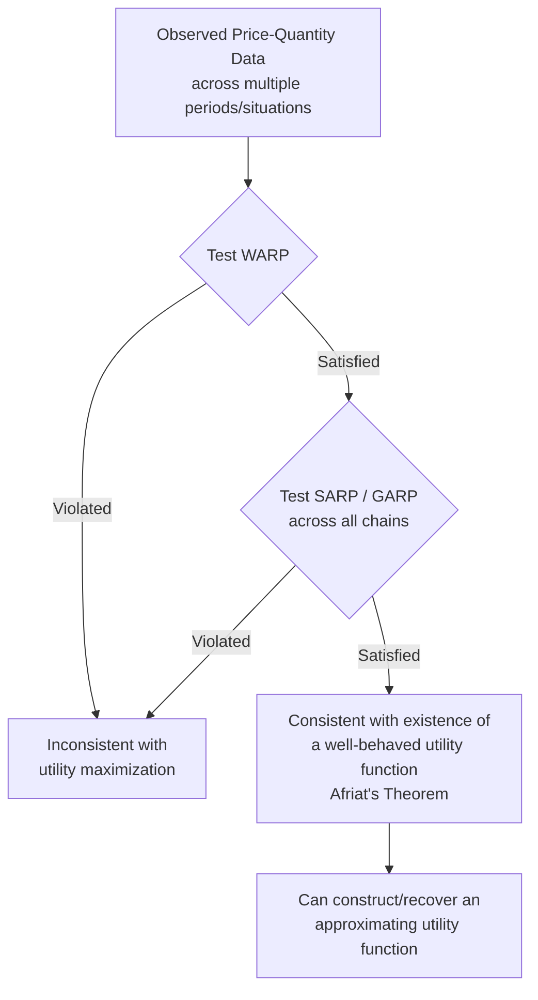

## Revealed Preference and Behavioral Foundations of Demand

### Overview

Revealed Preference Theory, developed principally by Paul Samuelson (1938) and later extended by Hendrik Houthakker and Hal Varian, offers an alternative foundation for demand theory that does not rely on unobservable concepts such as utility, indifference curves, or marginal rates of substitution. Instead, it derives consumer behavior propositions directly from **observed choices** in the market — what a consumer actually buys at various price-income situations. This approach addresses a methodological critique of the indifference curve method: that utility and indifference maps are not directly observable, whereas purchase decisions are.

Behavioral economics extends this further by empirically examining and often challenging the rationality assumptions underlying both cardinal utility theory and revealed preference theory, incorporating psychological insights into models of consumer decision-making.

### Motivation and Historical Context

**Key Points**

- Cardinal utility theory (Marshall) assumes utility is measurable in absolute units — criticized as unrealistic
- Ordinal utility theory (Hicks-Allen indifference curves) avoids measurability but still assumes an underlying, introspectively-known preference ordering that is not directly observable
- Samuelson sought to build demand theory using only **observable market behavior** — actual choices made at given prices and income — without any reference to psychological utility

### Core Axioms of Revealed Preference

**Weak Axiom of Revealed Preference (WARP)**

If a bundle A is chosen over an affordable bundle B (i.e., A is "revealed preferred" to B), then in any other price-income situation where B is chosen, A must not be affordable simultaneously with B — that is, the consumer should never reveal a preference for B over A after having already revealed A over B.

Formally: If $A$ is chosen when $B$ is also affordable ($P^1 \cdot A \geq P^1 \cdot B$), then it must never be the case that $B$ is chosen when $A$ is affordable ($P^2 \cdot B \geq P^2 \cdot A$) for $A \neq B$.

**Strong Axiom of Revealed Preference (SARP)**

Extends WARP to chains of preference: if A is revealed preferred to B, and B is revealed preferred to C, then A must be revealed preferred to C directly (i.e., the consumer should never choose C over A in a situation where both are affordable). SARP rules out preference cycles across any number of bundles, not just pairs, and ensures **transitivity** of revealed preferences.

**Key Points**

- WARP is a necessary condition for utility-maximizing behavior but not sufficient to guarantee a consistent underlying preference ordering exists for more than two goods
- SARP is both necessary and sufficient to guarantee the existence of a well-behaved (transitive, complete) underlying preference ordering consistent with observed choices
- Generalized Axiom of Revealed Preference (GARP), developed by Varian, extends this to allow for indifference (not just strict preference) and is used in modern non-parametric tests of rationality with real consumption data

### Formal Statement of WARP

Let $(P^1, X^1)$ and $(P^2, X^2)$ represent two price-quantity bundles chosen by a consumer in two different situations.

$$\text{If } P^1 X^1 \geq P^1 X^2 \text{ (X}^2\text{ was affordable when X}^1\text{ chosen)}$$

$$\text{Then it must NOT be the case that } P^2 X^2 \geq P^2 X^1 \text{ (X}^1\text{ affordable when X}^2\text{ chosen)}$$

unless $X^1 = X^2$.

### Diagrammatic Illustration of WARP

<svg xmlns="http://www.w3.org/2000/svg" viewBox="0 0 560 380">
<text x="280" y="25" font-size="16" font-weight="bold" text-anchor="middle" fill="#1a1a1a">Weak Axiom of Revealed Preference (svg_diagram)</text>
<line x1="70" y1="330" x2="70" y2="60" stroke="#333" stroke-width="2" />
<line x1="70" y1="330" x2="480" y2="330" stroke="#333" stroke-width="2" />
<text x="485" y="335" font-size="12" fill="#333">Good X</text>
<text x="40" y="55" font-size="12" fill="#333">Good Y</text>
<line x1="90" y1="90" x2="350" y2="310" stroke="#2563eb" stroke-width="2" />
<text x="355" y="310" font-size="11" fill="#2563eb">Budget Line 1 (situation 1)</text>
<circle cx="220" cy="200" r="5" fill="#dc2626" />
<text x="228" y="195" font-size="12" fill="#dc2626">A (chosen in situation 1)</text>
<circle cx="150" cy="250" r="5" fill="#16a34a" />
<text x="115" y="270" font-size="12" fill="#16a34a">B (affordable, not chosen)</text>
<line x1="180" y1="120" x2="420" y2="250" stroke="#7c3aed" stroke-width="2" stroke-dasharray="4,3" />
<text x="380" y="245" font-size="11" fill="#7c3aed">Budget Line 2 (situation 2)</text>

<text x="100" y="345" font-size="11" fill="#333">If B is chosen in situation 2 (where A is also affordable), WARP is violated.</text>

</svg>

**Interpretation**: In situation 1, A is chosen while B was also affordable — A is revealed preferred to B. WARP requires that in any future situation where B is chosen, A must not simultaneously be affordable; otherwise, the consumer's choices are logically inconsistent with any stable underlying preference ordering.

### Deriving Downward-Sloping Demand from Revealed Preference

**Key Points**

- Revealed preference theory can derive the negative substitution effect (and hence the Slutsky decomposition) without invoking utility or indifference curves at all — purely from the consistency axiom (WARP) applied to price and income changes
- This provides an independent, observable-behavior-based proof that compensated demand curves must slope downward, reinforcing the result obtained via the indifference curve approach

### Non-Parametric Testing (GARP) and Afriat's Theorem

**Key Points**

- **GARP (Generalized Axiom of Revealed Preference)**: extends WARP/SARP to permit ties (indifference) between bundles, making it suitable for testing with finite, real-world observational data sets
- **Afriat's Theorem** establishes that a finite set of observed price-quantity data is consistent with utility maximization (i.e., some well-behaved, non-satiated utility function *could* have generated the observed choices) **if and only if** the data satisfies GARP
- This gives economists a direct, empirically testable, non-parametric method to check whether observed consumer purchase data (e.g., household panel/survey data) is consistent with rational choice, without assuming any specific functional form for utility

### Relationship to Indifference Curve Analysis

| Aspect | Indifference Curve Approach | Revealed Preference Approach |
| --- | --- | --- |
| Starting point | Assumed preference ordering / utility function | Observed market choices |
| Key tool | MRS, tangency condition | WARP, SARP, GARP |
| Observability | Utility/indifference maps not directly observable | Based entirely on observable prices and quantities |
| Result | Downward-sloping compensated demand derived from convexity | Downward-sloping compensated demand derived from consistency axioms |
| Relationship | Can be shown to be logically equivalent under SARP | Equivalent to indifference curve approach when SARP holds |

**[Inference]** While the two approaches are frequently described as broadly equivalent for demand theory purposes, this equivalence formally relies on additional regularity conditions (e.g., that choices span a sufficiently rich set of price-income situations); with limited or specific data sets, revealed preference tests may be less demanding to satisfy than fully deriving a complete indifference map.

### Behavioral Foundations of Demand: Departures from Standard Theory

Behavioral economics, drawing on empirical and experimental findings (notably from Daniel Kahneman, Amos Tversky, and Richard Thaler), documents systematic patterns in actual consumer choice that deviate from the strict rationality (completeness, transitivity, consistency) assumed by both cardinal utility and revealed preference frameworks.

**Key Points**

- **Bounded rationality** (Herbert Simon): consumers face cognitive and informational limits, leading to satisficing behavior rather than strict optimization
- **Prospect Theory** (Kahneman & Tversky): consumers evaluate outcomes relative to a reference point, and exhibit **loss aversion** — losses loom larger than equivalent gains
- **Framing effects**: choices can be influenced by how options are presented (e.g., "90% fat-free" vs. "10% fat"), violating the invariance assumption of rational choice
- **Anchoring and mental accounting**: consumers may treat money differently depending on its source or intended use, contrary to the fungibility assumption of standard theory
- **Present bias / hyperbolic discounting**: intertemporal choices show inconsistent discount rates over time, violating the constant discounting assumed in standard intertemporal models
- **Default effects and status quo bias**: consumers disproportionately stick with default options, even when switching would be utility-improving under standard assumptions

### Prospect Theory Value Function (Illustrative)

<svg xmlns="http://www.w3.org/2000/svg" viewBox="0 0 500 380">
<text x="250" y="25" font-size="16" font-weight="bold" text-anchor="middle" fill="#1a1a1a">Prospect Theory Value Function (svg_diagram)</text>
<line x1="250" y1="340" x2="250" y2="50" stroke="#333" stroke-width="2" />
<line x1="60" y1="200" x2="440" y2="200" stroke="#333" stroke-width="2" />
<text x="445" y="205" font-size="11" fill="#333">Gains/Losses</text>
<text x="255" y="45" font-size="11" fill="#333">Value</text>
<text x="252" y="215" font-size="10" fill="#333">Reference point</text>
<path d="M 250,200 Q 320,110 420,95" stroke="#2563eb" stroke-width="2" fill="none" />
<text x="330" y="90" font-size="10" fill="#2563eb">Gains (concave)</text>
<path d="M 250,200 Q 150,280 90,330" stroke="#dc2626" stroke-width="2" fill="none" />
<text x="70" y="345" font-size="10" fill="#dc2626">Losses (convex, steeper)</text>
</svg>

**Interpretation**: The value function is concave for gains (risk-averse in the gain domain) and convex for losses (risk-seeking in the loss domain), and notably steeper for losses than gains — capturing loss aversion. This produces demand and choice predictions that diverge from the standard expected-utility-maximizing consumer.

### Comparison: Standard Rational Choice vs. Behavioral Models

| Dimension | Standard (Neoclassical) Theory | Behavioral Economics Findings |
| --- | --- | --- |
| Reference dependence | Absent — only final wealth/utility levels matter | Present — outcomes evaluated relative to reference point |
| Risk attitude | Assumed consistent (e.g., constant risk aversion) | Varies by domain (risk-averse for gains, risk-seeking for losses) |
| Preference consistency | Assumed stable, transitive, context-independent | Context-dependent; subject to framing effects |
| Time preference | Constant (exponential) discounting | Time-inconsistent (hyperbolic) discounting often observed |
| Decision process | Full optimization given available information | Heuristics, bounded rationality, satisficing |

### Applications and Implications

**Key Points**

- **Non-parametric demand analysis**: GARP-based tests are used by applied economists to check consistency of household survey/panel data without imposing functional-form assumptions
- **Policy design ("nudges")**: behavioral insights inform choice-architecture interventions (e.g., default enrollment in retirement savings plans) exploiting status quo bias to improve welfare outcomes
- **Marketing and pricing strategy**: framing, anchoring, and reference-price effects are widely used in retail pricing (e.g., "was $100, now $70" framing)
- **Critique of consumer surplus measures**: if choices are influenced by framing or biases, standard welfare measures (based on revealed willingness-to-pay) may not accurately reflect true consumer welfare

### Limitations of Revealed Preference Theory

**Key Points**

- Requires observing a sufficiently rich set of price-income situations to meaningfully test consistency; with only one or two observations, the axioms provide little discriminating power
- Assumes preferences are stable over the observation period (no changes in tastes between observed choice situations)
- Does not, by itself, explain *why* a consumer chooses one bundle over another — it is a consistency test, not a psychological or causal theory of choice
- Behavioral critiques argue the underlying rationality axioms (WARP/SARP/GARP) may themselves be systematically violated in real consumer behavior, motivating models that relax these axioms (e.g., reference-dependent preferences)

### Related Topics

- Indifference Curve Analysis and Consumer Equilibrium
- Slutsky Equation and Substitution/Income Effects
- Afriat's Theorem and Non-Parametric Demand Analysis
- Prospect Theory and Expected Utility Theory
- Behavioral Public Economics and Nudge Theory
- Intertemporal Choice and Hyperbolic Discounting
- Consumer Surplus and Welfare Measurement Under Bounded Rationality