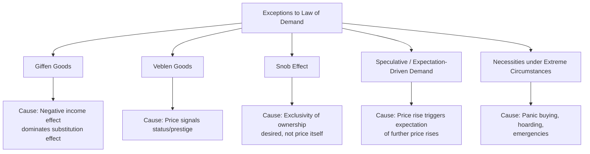

## Exceptions to the Law of Demand

### Overview

The law of demand states that, ceteris paribus, quantity demanded of a good is inversely related to its price — as price rises, quantity demanded falls, and vice versa, producing a downward-sloping demand curve. However, several theoretically and empirically recognized cases exist where this inverse relationship does not hold, producing upward-sloping (positively sloped) demand curves or otherwise anomalous demand behavior. These exceptions are important both for theoretical completeness and for understanding the boundary conditions of standard consumer theory.

### Recap: The Standard Law of Demand

$$\frac{\partial Q_d}{\partial P} < 0 \quad \text{(ceteris paribus)}$$

This result normally follows from the fact that, for most goods, both the substitution effect and the income effect of a price change work in the same direction (see Slutsky decomposition), reinforcing an inverse price-quantity relationship.

**Key Points**

- Substitution effect: always negative (works to reinforce the law of demand)
- Income effect: sign depends on whether the good is normal or inferior
- Exceptions to the law of demand generally arise when the **income effect is negative and outweighs the negative substitution effect**, or when the price itself alters perceived quality/utility

### 1. Giffen Goods

**Definition**

A Giffen good is a good for which quantity demanded *increases* as its price increases (and falls as price falls) — named after Sir Robert Giffen, to whom Alfred Marshall attributed the observation.

**Conditions for a Giffen Good**

- The good must be strongly **inferior** (negative income elasticity)
- The good must constitute a **large share of the consumer's total budget** (so that a price change produces a significant real-income effect)
- The negative income effect must be **larger in magnitude** than the negative substitution effect

$$\left|\text{Income Effect}\right| > \left|\text{Substitution Effect}\right| \implies \frac{\partial Q_d}{\partial P} > 0$$

**Illustrative Example**

Consider a very poor household whose diet consists mainly of a cheap staple (e.g., rice) supplemented with a smaller quantity of a more expensive good (e.g., meat). If the price of rice rises, real income falls sharply (since rice takes up a large budget share). The household, now poorer, may be forced to cut back on the more expensive meat and buy *more* rice to maintain caloric intake — increasing rice consumption despite its higher price.

**[Unverified]** The classic textbook illustration involving the Irish potato famine is widely repeated in introductory texts but has been challenged by economic historians as lacking robust empirical support; more credible empirical evidence for Giffen behavior has come from controlled field studies, notably documented rice and wheat consumption patterns among poor households in parts of Hunan and Gansu provinces in China (Jensen and Miller, 2008).

### 2. Veblen Goods

**Definition**

A Veblen good is a good for which demand increases as price increases because the high price itself confers status, prestige, or exclusivity — named after Thorstein Veblen's concept of "conspicuous consumption."

**Key Points**

- Demand is driven by the **price as a status signal**, not by the underlying utility from consumption or by an income effect
- Common examples cited: luxury goods, designer fashion, prestige automobiles, fine art, exclusive jewelry
- Unlike Giffen goods, Veblen goods are typically **normal or luxury goods** with high (not low or negative) income elasticity — the mechanism is entirely different

### 3. Snob Effect

**Definition**

Closely related to the Veblen effect, the snob effect describes demand that *increases* for a good as its consumption becomes *less* common — consumers seek differentiation from the masses. While not strictly a price effect, a price increase can sometimes reduce the number of other buyers, indirectly making the good more attractive to snob-effect-driven consumers.

**Key Points**

- Driven by exclusivity of *ownership*, not price per se, though the two are often correlated in luxury markets
- Distinguished from the Veblen effect: the snob effect is about how many *other people* own the good; the Veblen effect is about the price itself as a status marker

### 4. Bandwagon Effect (Contrast Case)

Although not an exception to the law of demand in the price dimension, the bandwagon effect is often discussed alongside Veblen and snob effects: demand for a good *increases* as more people are seen consuming it (network/conformity effects), independent of its price. It illustrates how conventional ceteris paribus demand analysis can be complicated by interdependent consumer preferences.

### 5. Speculative Demand (Expectation-Driven Demand)

**Definition**

In asset and commodity markets, if consumers expect a price increase to continue (or accelerate), a current price rise can trigger *increased* current purchases as buyers seek to acquire the good before prices rise further, rather than waiting.

**Key Points**

- Common in stock markets, real estate, cryptocurrency, and certain commodity markets (e.g., gold during inflationary expectations)
- Reflects a violation of the ceteris paribus assumption: expectations about *future* prices are changing along with the current price, rather than being held constant
- Not strictly an exception in the formal utility-theoretic sense (since expectations are technically a separate demand determinant that is shifting), but commonly cited as a practical/behavioral exception

### 6. Necessities Under Emergency or Panic Conditions

**Definition**

For certain essential goods during emergencies (e.g., medicines, essential food items, fuel during a shortage), consumers may increase purchases even as prices rise, driven by panic buying, hoarding behavior, or fear of future unavailability.

**Key Points**

- Driven by non-standard motivations: risk aversion regarding future scarcity, not standard utility-maximizing calculus under stable expectations
- Related to behavioral economics concepts such as loss aversion and scarcity heuristics rather than classical rational-choice demand theory

### 7. Ignorance/Quality Signaling Effect

**Definition**

When consumers cannot easily judge the quality of a good directly, price may be used as a **proxy signal for quality** ("higher price implies higher quality"). A price increase may therefore increase perceived value and demand, particularly for experience or credence goods.

**Key Points**

- Common in markets with significant information asymmetry (e.g., wine, perfume, some services, pharmaceuticals)
- Related to Akerlof's "Market for Lemons" framework on information asymmetry, though the mechanism here is about a positive quality-price inference rather than adverse selection alone

### Graphical Representation: Upward-Sloping Demand Curve

<svg xmlns="http://www.w3.org/2000/svg" viewBox="0 0 480 360">
<text x="240" y="25" font-size="16" font-weight="bold" text-anchor="middle" fill="#1a1a1a">Giffen/Veblen Good: Upward-Sloping Demand (svg_diagram)</text>
<line x1="70" y1="320" x2="70" y2="50" stroke="#333" stroke-width="2" />
<line x1="70" y1="320" x2="420" y2="320" stroke="#333" stroke-width="2" />
<text x="425" y="325" font-size="12" fill="#333">Quantity</text>
<text x="40" y="45" font-size="12" fill="#333">Price</text>
<line x1="100" y1="290" x2="380" y2="90" stroke="#dc2626" stroke-width="2" />
<text x="300" y="100" font-size="12" fill="#dc2626">Atypical Demand (D)</text>
<line x1="450" y1="320" x2="450" y2="320" stroke="none" />
<path d="M 480,290 Q 400,180 320,90" stroke="#2563eb" stroke-width="2" fill="none" stroke-dasharray="5,4" transform="translate(-160,0)" />
</svg>

### Comparative Summary Table

| Exception | Underlying Mechanism | Income Elasticity | Distinguishing Feature |
| --- | --- | --- | --- |
| Giffen good | Negative income effect dominates substitution effect | Strongly negative (inferior) | Large budget share; subsistence context |
| Veblen good | Price signals status/prestige | Positive (often luxury) | High price *itself* generates utility |
| Snob effect | Exclusivity of ownership desired | Positive (often luxury) | Driven by *scarcity of ownership*, not price directly |
| Speculative demand | Expectation of further price rises | N/A (asset/commodity markets) | Violates ceteris paribus on expectations |
| Panic/emergency buying | Fear of future scarcity | N/A | Driven by risk aversion, not standard utility calculus |
| Quality-signaling effect | Price used as quality proxy under information asymmetry | Varies | Relevant for experience/credence goods |

### Distinguishing True Theoretical Exceptions from Apparent Exceptions

**Key Points**

- **True exceptions** (Giffen goods) arise strictly within the standard utility-maximization framework — they do not require abandoning rational choice theory, only recognizing that the income effect can theoretically dominate
- **Veblen and snob effects** technically violate the *ceteris paribus* assumption in a subtler way: the good's utility function is not independent of its own price (price enters the utility function directly), which is a modification of standard preference assumptions rather than a pure income/substitution effect story
- **Speculative and panic-driven demand** are best understood as changes in an *underlying demand determinant* (expectations) coinciding with a price change, rather than true violations of ceteris paribus demand theory

### Empirical Identification Challenges

**Key Points**

- Giffen behavior is difficult to identify empirically because it requires isolating a population that is both very poor and highly dependent on a single staple good — conditions that are increasingly rare and hard to observe with clean data
- Veblen and snob effects are difficult to disentangle from ordinary quality differentiation (i.e., the higher-priced good may simply be genuinely different/better, not merely priced higher for status)
- [Inference] Given these identification challenges, most microeconomics textbooks present Giffen and Veblen goods primarily as theoretical curiosities illustrating the logical *boundary conditions* of demand theory, rather than as commonly observed phenomena in typical consumer markets.

### Applications and Policy Relevance

**Key Points**

- **Understanding subsidy design for staple goods** in developing economies — if a good has Giffen-like properties among the poorest households, price subsidies could have counterintuitive effects on nutrition and welfare calculations
- **Luxury goods marketing and pricing strategy** — firms selling Veblen or snob-effect goods may deliberately maintain high prices (or even raise them) to preserve exclusivity-driven demand, contrary to standard profit-maximizing price-cutting logic
- **Commodity and asset market regulation** — recognizing speculative demand dynamics informs policy on margin requirements, circuit breakers, and anti-hoarding regulations during price spikes

### Related Topics

- Income and Substitution Effects (Slutsky Decomposition)
- Individual versus Market Demand Curves
- Consumer Equilibrium and Indifference Curve Analysis
- Elasticity of Demand: Price, Income, and Cross-Price
- Behavioral Economics and Departures from Rational Choice
- Information Asymmetry and Signaling (Akerlof's Market for Lemons)
- Speculative Bubbles and Asset Pricing Dynamics