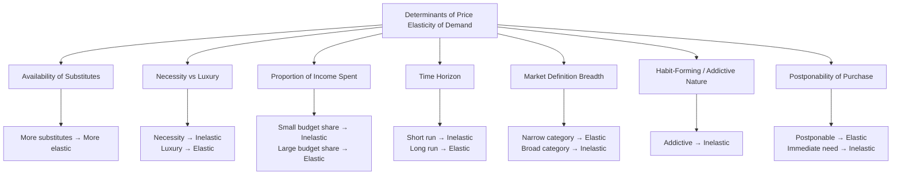

## Price Elasticity of Demand and Its Determinants

### Overview

Price elasticity of demand ($E_d$ or $E_P$) measures the responsiveness (sensitivity) of quantity demanded of a good to a change in its own price, holding all other determinants of demand constant. It is a critical concept for pricing decisions, tax incidence analysis, revenue forecasting, and understanding market structure implications.

### Definition and Formula

**Percentage Formula**

$$E_d = \frac{\%\Delta Q_d}{\%\Delta P}$$

**Point Elasticity (Calculus-Based)**

$$E_d = \frac{dQ}{dP} \times \frac{P}{Q}$$

**Arc Elasticity (Midpoint Method)**

Used when calculating elasticity over a discrete price change, avoiding the asymmetry problem of using either endpoint as the base:

$$E_d = \frac{(Q_2 - Q_1)/[(Q_1+Q_2)/2]}{(P_2 - P_1)/[(P_1+P_2)/2]}$$

**Key Points**

- Since demand curves are (typically) downward sloping, $E_d$ is mathematically negative; economists commonly report its **absolute value** for convenience when discussing magnitude
- Elasticity is a pure (unit-free) number, unlike slope, making it comparable across goods with different units of measurement

### Categories of Price Elasticity

| Category | Value of $|E_d|$ | Interpretation |

|---|---|---|

| Perfectly inelastic | $E_d = 0$ | Quantity demanded does not respond to price at all (vertical demand curve) |

| Inelastic | $0 < \|E_d\| < 1$ | Quantity demanded changes proportionally less than price |

| Unit elastic | $\|E_d\| = 1$ | Quantity demanded changes exactly proportionally to price |

| Elastic | $\|E_d\| > 1$ | Quantity demanded changes proportionally more than price |

| Perfectly elastic | $E_d \to \infty$ | Infinitesimal price change causes infinite change in quantity (horizontal demand curve) |

<svg xmlns="http://www.w3.org/2000/svg" viewBox="0 0 620 340">
<text x="310" y="22" font-size="16" font-weight="bold" text-anchor="middle" fill="#1a1a1a">Elasticity Categories: Demand Curve Shapes (svg_diagram)</text>
<line x1="50" y1="290" x2="50" y2="50" stroke="#333" stroke-width="1.5" />
<line x1="50" y1="290" x2="150" y2="290" stroke="#333" stroke-width="1.5" />
<line x1="100" y1="60" x2="100" y2="280" stroke="#dc2626" stroke-width="2" />
<text x="55" y="300" font-size="9" fill="#333">Perfectly Inelastic</text>
<line x1="180" y1="290" x2="180" y2="50" stroke="#333" stroke-width="1.5" />
<line x1="180" y1="290" x2="280" y2="290" stroke="#333" stroke-width="1.5" />
<line x1="200" y1="70" x2="260" y2="270" stroke="#ea580c" stroke-width="2" />
<text x="185" y="300" font-size="9" fill="#333">Inelastic (steep)</text>
<line x1="310" y1="290" x2="310" y2="50" stroke="#333" stroke-width="1.5" />
<line x1="310" y1="290" x2="410" y2="290" stroke="#333" stroke-width="1.5" />
<line x1="330" y1="70" x2="390" y2="270" stroke="#16a34a" stroke-width="2" transform="rotate(0)" />
<path d="M 330,90 L 390,250" stroke="#16a34a" stroke-width="2" />
<text x="315" y="300" font-size="9" fill="#333">Unit Elastic</text>
<line x1="440" y1="290" x2="440" y2="50" stroke="#333" stroke-width="1.5" />
<line x1="440" y1="290" x2="540" y2="290" stroke="#333" stroke-width="1.5" />
<line x1="450" y1="100" x2="530" y2="240" stroke="#2563eb" stroke-width="2" />
<text x="445" y="300" font-size="9" fill="#333">Elastic (flat)</text>
<line x1="560" y1="290" x2="560" y2="50" stroke="#333" stroke-width="1.5" />
<line x1="560" y1="290" x2="620" y2="290" stroke="#333" stroke-width="1.5" />
<line x1="565" y1="150" x2="615" y2="150" stroke="#7c3aed" stroke-width="2" />
<text x="555" y="300" font-size="9" fill="#333">Perfectly Elastic</text>
</svg>

### Worked Example: Point Elasticity

Demand function: $Q = 100 - 2P$. Evaluate elasticity at $P = 20$.

$$Q = 100 - 2(20) = 60$$

$$\frac{dQ}{dP} = -2$$

$$E_d = \frac{dQ}{dP} \times \frac{P}{Q} = -2 \times \frac{20}{60} = -0.667$$

**Output**

$|E_d| = 0.667 < 1$ → demand is **inelastic** at $P = 20$: a 1% price increase would reduce quantity demanded by only about 0.67%.

### Worked Example: Arc Elasticity

Price rises from $10 to $12; quantity falls from 50 to 42 units.

$$E_d = \frac{(42-50)/[(50+42)/2]}{(12-10)/[(10+12)/2]} = \frac{-8/46}{2/11} = \frac{-0.174}{0.182} = -0.956$$

**Output**

$|E_d| \approx 0.96$, close to unit elastic, slightly inelastic.

### Determinants of Price Elasticity of Demand

**1. Availability of Substitutes**

The single most important determinant. Goods with many close substitutes tend to have more elastic demand (consumers can easily switch away when price rises); goods with few or no substitutes (e.g., insulin for diabetics) tend to have inelastic demand.

**2. Necessity versus Luxury**

Necessities (staple foods, essential medicines) tend to have inelastic demand, since consumption is relatively insensitive to price. Luxuries (vacations, jewelry) tend to have more elastic demand, since consumption can be deferred or forgone.

**3. Proportion of Income Spent on the Good**

Goods that constitute a small share of the consumer's budget (e.g., salt, matches) tend to have inelastic demand, since a price change has a negligible effect on the overall budget. Goods with a large budget share (e.g., housing, automobiles) tend to be more elastic.

**4. Time Horizon**

Demand tends to be more elastic in the long run than in the short run, since consumers need time to adjust habits, find substitutes, or change technology/equipment (e.g., demand for gasoline is more inelastic in the short run, as consumers cannot immediately change vehicles, but becomes more elastic over a longer horizon as they can switch to fuel-efficient cars or alternative transport).

**5. Definition of the Market (Breadth of the Good Category)**

Narrowly defined goods (e.g., "Granny Smith apples") tend to have more elastic demand than broadly defined categories (e.g., "food"), since narrow categories have closer substitutes available.

**6. Habit-Forming or Addictive Nature**

Goods with addictive properties (e.g., tobacco, certain drugs) tend to exhibit inelastic demand, as consumption persists despite price increases due to physiological or psychological dependency.

**7. Postponability of Purchase**

Goods whose purchase can be delayed (durable goods, discretionary purchases) tend to be more elastic, as buyers can defer purchase until prices fall. Perishable or immediately needed goods tend to be less elastic.

### Elasticity and Total Revenue

**Total Revenue Test**

The relationship between price elasticity and total revenue ($TR = P \times Q$) provides a practical diagnostic for pricing decisions:

$$\frac{d(TR)}{dP} = Q\left(1 + \frac{1}{E_d}\right) = Q(1 - |E_d|) \cdot \text{sign adjustment}$$

More directly, using the standard relation:

$$MR = P\left(1 - \frac{1}{|E_d|}\right)$$

**Key Points**

- **Elastic demand** ($|E_d| > 1$): price and total revenue move in **opposite** directions — a price cut increases TR; a price increase decreases TR
- **Inelastic demand** ($|E_d| < 1$): price and total revenue move in the **same** direction — a price cut decreases TR; a price increase increases TR
- **Unit elastic demand** ($|E_d| = 1$): total revenue is at a **maximum**; small price changes leave TR unchanged (to a first-order approximation)

| Elasticity Range | Price ↑ Effect on TR | Price ↓ Effect on TR |
| --- | --- | --- |
| Elastic ($\|E_d\|>1$) | TR falls | TR rises |
| Unit elastic ($\|E_d\|=1$) | TR unchanged (at max) | TR unchanged (at max) |
| Inelastic ($\|E_d\|<1$) | TR rises | TR falls |

### Elasticity Along a Linear Demand Curve

**Key Points**

- For a straight-line (linear) demand curve, elasticity is **not constant** — it varies continuously along the curve, even though the slope $dQ/dP$ is constant
- At the midpoint of a linear demand curve, $|E_d| = 1$ (unit elastic)
- Above the midpoint (higher price, lower quantity): demand is elastic
- Below the midpoint (lower price, higher quantity): demand is inelastic

<svg xmlns="http://www.w3.org/2000/svg" viewBox="0 0 460 340">
<text x="230" y="22" font-size="15" font-weight="bold" text-anchor="middle" fill="#1a1a1a">Elasticity Along a Linear Demand Curve (svg_diagram)</text>
<line x1="60" y1="290" x2="60" y2="50" stroke="#333" stroke-width="2" />
<line x1="60" y1="290" x2="420" y2="290" stroke="#333" stroke-width="2" />
<text x="425" y="295" font-size="11" fill="#333">Quantity</text>
<text x="30" y="45" font-size="11" fill="#333">Price</text>
<line x1="80" y1="70" x2="400" y2="270" stroke="#111" stroke-width="2" />
<circle cx="240" cy="170" r="4" fill="#dc2626" />
<text x="245" y="165" font-size="10" fill="#dc2626">Midpoint: |E|=1</text>

<text x="110" y="100" font-size="10" fill="`#2563eb`">Elastic region</text>

<text x="300" y="250" font-size="10" fill="`#16a34a`">Inelastic region</text>

</svg>

**Constant Elasticity Exceptions**

- **Vertical demand curve**: perfectly inelastic ($E_d = 0$) at all points
- **Horizontal demand curve**: perfectly elastic ($E_d \to \infty$) at all points
- **Rectangular hyperbola demand curve** ($PQ = k$, constant): unit elastic ($|E_d| = 1$) at every point

### Log-Linear (Constant Elasticity) Demand Functions

A demand function of the form:

$$Q = A P^{-b}$$

has **constant** elasticity equal to $-b$ at every point, since:

$$\ln Q = \ln A - b \ln P \implies E_d = \frac{d \ln Q}{d \ln P} = -b$$

**Key Points**

- Widely used in empirical demand estimation because the elasticity coefficient can be read directly from a log-log regression
- Contrasts with linear demand functions, where elasticity varies by point

### Empirical Estimation Approaches

**Key Points**

- **Log-log regression**: $\ln Q = \alpha + \beta \ln P + \varepsilon$, where $\hat\beta$ directly estimates constant price elasticity
- **Double-log demand systems**: extended to include income and cross-prices for multi-good estimation (e.g., Almost Ideal Demand System - AIDS)
- Requires care regarding **identification** — since both supply and demand determine observed price-quantity pairs, naive regression of quantity on price can suffer from simultaneity bias; instrumental variable techniques or natural experiments are typically needed for credible estimation

**[Inference]** In applied industrial organization and marketing research, reported price elasticities for a given product category can vary substantially across studies depending on the specific market, time period, and estimation methodology used; single point estimates from any one study should generally be treated as context-specific rather than universal constants for that good.

### Applications

**Key Points**

- **Pricing strategy**: firms use elasticity estimates to determine whether price increases or decreases will raise revenue
- **Tax incidence analysis**: the more inelastic side of the market (demand or supply) bears a larger share of the tax burden
- **Excise tax policy**: goods with inelastic demand (tobacco, alcohol, fuel) are common targets for "sin taxes" since tax revenue is more predictable and the quantity distortion (deadweight loss) is smaller
- **Agricultural economics**: the well-known inelastic demand for many agricultural staples explains why bumper crop harvests can sometimes *reduce* total farm revenue (the "paradox of plenty")

### Related Topics

- Income Elasticity of Demand and Engel's Law
- Cross-Price Elasticity of Demand (Substitutes and Complements)
- Elasticity of Supply and Determinants
- Tax Incidence and the Division of Tax Burden
- Total Revenue, Marginal Revenue, and Elasticity Relationship
- Empirical Demand Estimation and the Almost Ideal Demand System (AIDS)
- Price Discrimination and Elasticity-Based Pricing Strategies