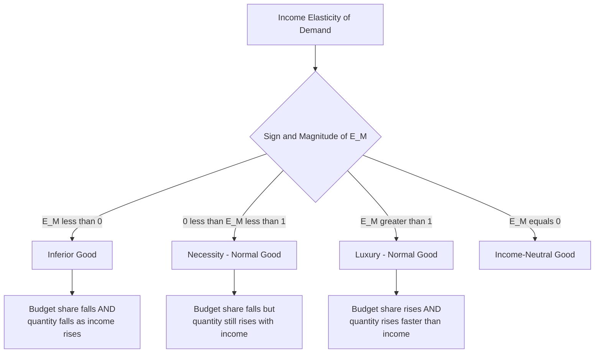

## Income Elasticity of Demand and Product Classification

### Overview

Income elasticity of demand ($E_M$ or $E_Y$) measures the responsiveness of quantity demanded of a good to a change in consumer income, holding price and all other determinants constant. It is a central tool for classifying goods (normal vs. inferior, necessity vs. luxury) and for forecasting how demand shifts as economies grow or contract.

### Definition and Formula

**Percentage Formula**

$$E_M = \frac{\%\Delta Q_d}{\%\Delta M}$$

**Point Elasticity (Calculus-Based)**

$$E_M = \frac{dQ}{dM} \times \frac{M}{Q}$$

**Arc Elasticity (Midpoint Method)**

$$E_M = \frac{(Q_2-Q_1)/[(Q_1+Q_2)/2]}{(M_2-M_1)/[(M_1+M_2)/2]}$$

**Key Points**

- Unlike price elasticity, income elasticity can be **positive or negative**, and its sign is the primary classification criterion
- Income elasticity is a pure, unit-free number, allowing comparison across goods regardless of measurement units

### Classification of Goods by Income Elasticity

| Classification | Value of $E_M$ | Behavior as Income Rises |
| --- | --- | --- |
| Inferior good | $E_M < 0$ | Quantity demanded **falls** as income rises |
| Necessity (normal) | $0 < E_M < 1$ | Quantity demanded rises, but proportionally less than income |
| Luxury (superior/normal) | $E_M > 1$ | Quantity demanded rises proportionally more than income |
| Income-neutral good | $E_M = 0$ | Quantity demanded unaffected by income changes |

**Key Points**

- **Normal goods** ($E_M > 0$): demand increases as income rises — the broad category encompassing both necessities and luxuries
- **Inferior goods** ($E_M < 0$): demand decreases as income rises, typically because consumers substitute toward higher-quality alternatives as they become more affordable (e.g., instant noodles, public transit in some contexts, store-brand staples)
- The **necessity/luxury** distinction is a finer classification *within* normal goods, based on whether $E_M$ is below or above 1

<svg viewBox="0 0 560 300" xmlns="http://www.w3.org/2000/svg">
<text x="280" y="25" font-size="16" font-weight="bold" text-anchor="middle" fill="#1a1a1a">Income Elasticity Spectrum (svg_diagram)</text>
<line x1="60" y1="150" x2="500" y2="150" stroke="#333" stroke-width="2"/>
<line x1="60" y1="140" x2="60" y2="160" stroke="#333" stroke-width="2"/>
<line x1="200" y1="140" x2="200" y2="160" stroke="#333" stroke-width="2"/>
<line x1="200" y1="140" x2="200" y2="160" stroke="#333" stroke-width="2"/>
<line x1="340" y1="140" x2="340" y2="160" stroke="#333" stroke-width="2"/>
<line x1="500" y1="140" x2="500" y2="160" stroke="#333" stroke-width="2"/>

<text x="55" y="180" font-size="11" fill="#333">E<0</text>

<text x="190" y="180" font-size="11" fill="#333">E=0</text>

<text x="330" y="180" font-size="11" fill="#333">E=1</text>

<text x="490" y="180" font-size="11" fill="#333">E>1</text>

<rect x="60" y="95" width="140" height="30" fill="#fecaca" opacity="0.7"/>
<text x="70" y="115" font-size="11" fill="#7f1d1d">Inferior Good</text>
<rect x="200" y="95" width="140" height="30" fill="#bfdbfe" opacity="0.7"/>
<text x="215" y="115" font-size="11" fill="#1e3a8a">Necessity (Normal)</text>
<rect x="340" y="95" width="160" height="30" fill="#bbf7d0" opacity="0.7"/>
<text x="360" y="115" font-size="11" fill="#14532d">Luxury (Normal)</text>
</svg>

### Worked Example

Consumer income rises from $40,000 to $50,000 annually; quantity demanded of a good rises from 20 units to 22 units.

$$E_M = \frac{(22-20)/[(20+22)/2]}{(50000-40000)/[(40000+50000)/2]} = \frac{2/21}{10000/45000} = \frac{0.0952}{0.2222} = 0.429$$

**Output**

$E_M \approx 0.43$: the good is a **normal good/necessity** ($0 < E_M < 1$) — demand rises with income, but less than proportionally.

### Engel's Law and Engel Curves

**Engel's Law**

Named after statistician Ernst Engel, this empirical regularity states that as household income rises, the *proportion* (not absolute amount) of income spent on food declines, even though absolute food expenditure may rise. This reflects the low income elasticity of food demand ($0 < E_M < 1$ typically).

**Engel Curve**

A graphical representation plotting quantity demanded (or expenditure) of a good against income, holding prices constant. The slope and curvature of the Engel curve directly reflect the good's income elasticity.

<svg xmlns="http://www.w3.org/2000/svg" viewBox="0 0 560 360">
<text x="280" y="22" font-size="16" font-weight="bold" text-anchor="middle" fill="#1a1a1a">Engel Curves by Good Type (svg_diagram)</text>
<line x1="70" y1="310" x2="70" y2="50" stroke="#333" stroke-width="2" />
<line x1="70" y1="310" x2="490" y2="310" stroke="#333" stroke-width="2" />
<text x="495" y="315" font-size="11" fill="#333">Income (M)</text>
<text x="40" y="45" font-size="11" fill="#333">Quantity (Q)</text>
<path d="M 90,280 Q 250,140 470,90" stroke="#16a34a" stroke-width="2" fill="none" />
<text x="330" y="85" font-size="11" fill="#16a34a">Luxury (E&gt;1, convex)</text>
<path d="M 90,280 Q 250,200 470,170" stroke="#2563eb" stroke-width="2" fill="none" />
<text x="330" y="185" font-size="11" fill="#2563eb">Necessity (0&lt;E&lt;1, concave)</text>
<path d="M 90,270 Q 200,230 260,230 Q 350,230 470,280" stroke="#dc2626" stroke-width="2" fill="none" />
<text x="330" y="300" font-size="11" fill="#dc2626">Inferior (E&lt;0 beyond turning point)</text>
</svg>

**Key Points**

- Luxury goods: Engel curve is **convex** (increasingly steep), since quantity rises faster than income
- Necessities: Engel curve is **concave** (increasingly flat), since quantity rises but at a diminishing rate relative to income
- Inferior goods: Engel curve initially rises then **bends backward** (negative slope) beyond some income threshold, once consumers can afford to substitute toward superior alternatives

### Relationship to Household Budget Shares

Differentiating the identity that total expenditure equals income (for a single-good simplification), income elasticity relates directly to the change in a good's **budget share** ($\theta = PQ/M$) as income rises:

$$\frac{d\theta}{dM} \gtrless 0 \iff E_M \gtrless 1$$

**Key Points**

- If $E_M > 1$ (luxury): budget share **rises** with income
- If $E_M < 1$ (necessity, but still normal): budget share **falls** with income (even though absolute spending rises) — this is the formal statement of Engel's Law applied more generally
- If $E_M < 0$ (inferior): both budget share and absolute quantity **fall** with income

### Determinants of Income Elasticity

**Key Points**

- **Nature of the good**: basic necessities (staple food, utilities) inherently have lower income elasticity than discretionary or status goods
- **Level of income of the consumer/market segment**: the same good can have different income elasticities at different income levels — a good may be a luxury for low-income households but a necessity for high-income households (income elasticity is often non-constant across the income distribution)
- **Availability of substitutes at different quality tiers**: goods with clear "step-up" quality alternatives (e.g., generic vs. branded goods) are more likely to be inferior at higher incomes, as consumers trade up
- **Cultural and demographic factors**: preferences and consumption patterns tied to income can vary by country, region, and cohort

**[Inference]** Because income elasticity often varies across the income distribution rather than being a single constant for a good, empirical estimates reported in textbooks or studies should generally be understood as applying to a specific sample population and income range, rather than as universal constants for that product category.

### Worked Comparative Example: Product Classification Table

| Good | Approx. $E_M$ (illustrative) | Classification |
| --- | --- | --- |
| Instant noodles (low-income staple) | $-0.3$ | Inferior good |
| Rice (staple in many economies) | $0.2$ | Necessity (normal) |
| Restaurant dining | $1.5$ | Luxury (normal, superior) |
| Designer handbags | $2.2$ | Luxury (normal, superior) |
| Public bus transit (in some markets) | $-0.4$ | Inferior good |
| Basic utilities (electricity, water) | $0.3$ | Necessity (normal) |

**[Inference]** The specific numerical values above are illustrative approximations commonly used for pedagogical purposes; actual empirically estimated income elasticities vary significantly by country, time period, dataset, and estimation methodology, and should be verified against current empirical studies for any applied analysis.

### Applications of Income Elasticity

**Key Points**

- **Business cycle sensitivity forecasting**: firms selling luxury goods (high $E_M$) face more volatile demand over the business cycle than firms selling necessities (low $E_M$), since demand contracts more sharply during recessions
- **Product portfolio and market segmentation strategy**: firms use income elasticity estimates to target products toward appropriate income segments and to anticipate demand shifts as target markets' incomes grow
- **International trade and development economics**: as national income grows, Engel's Law predicts declining food expenditure shares and rising shares for manufactured goods and services — informing structural transformation analysis
- **Public policy and taxation**: understanding which goods are necessities (low $E_M$) versus luxuries (high $E_M$) informs the design of progressive consumption taxes or targeted subsidies
- **Recession-proofing business strategy**: companies often diversify product lines across elasticity categories to stabilize revenue across economic cycles

### Distinguishing Income Elasticity from Price Elasticity

| Aspect | Price Elasticity ($E_d$) | Income Elasticity ($E_M$) |
| --- | --- | --- |
| Measures response to | Change in own price | Change in consumer income |
| Typical sign | Negative (law of demand) | Can be positive or negative |
| Classification purpose | Elastic vs. inelastic demand | Normal vs. inferior; necessity vs. luxury |
| Revenue relevance | Determines TR response to pricing | Determines demand response to economic growth/recession |

### Related Topics

- Price Elasticity of Demand and Its Determinants
- Cross-Price Elasticity of Demand (Substitutes and Complements)
- Engel's Law and Structural Transformation in Development Economics
- Income and Substitution Effects (Slutsky Decomposition)
- Consumer Equilibrium and Indifference Curve Analysis
- Business Cycle Forecasting and Demand Volatility by Product Category