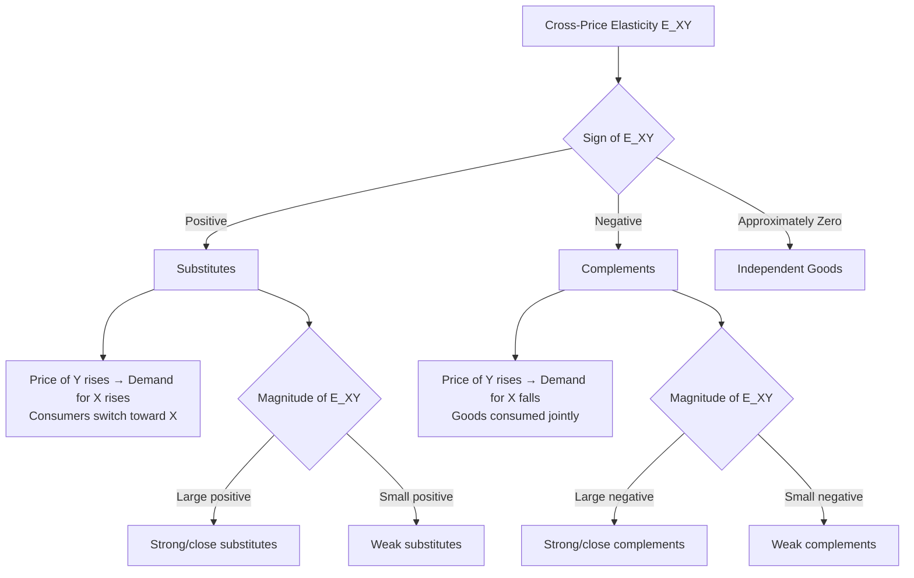
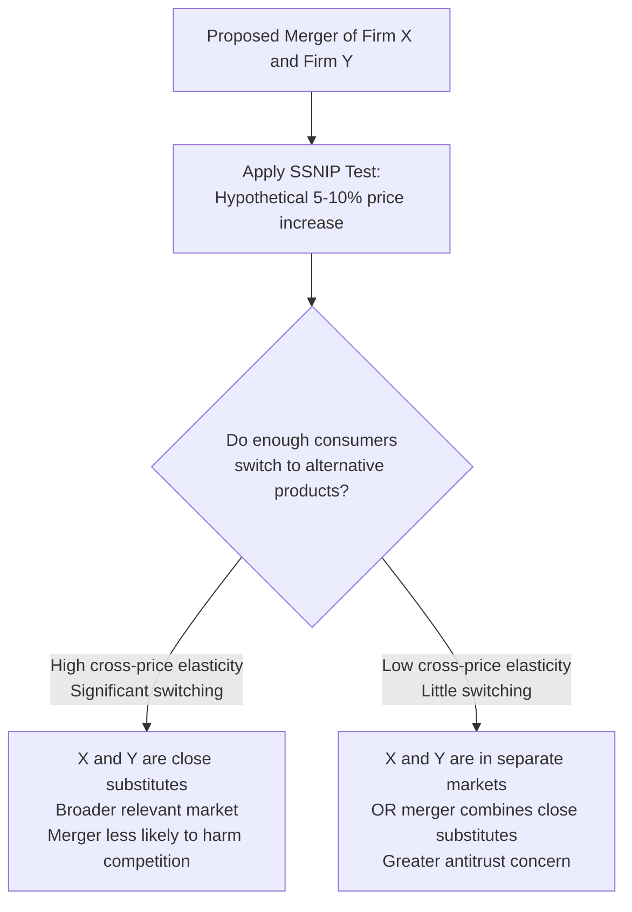

## Cross-Price Elasticity and Substitute-Complement Relationships

### Overview

Cross-price elasticity of demand ($E_{XY}$) measures the responsiveness of quantity demanded of one good (X) to a change in the price of a *different* good (Y), holding the price of X, income, and all other factors constant. It is the primary analytical tool for formally classifying the relationship between pairs of goods as substitutes, complements, or unrelated (independent) goods.

### Definition and Formula

**Percentage Formula**

$$E_{XY} = \frac{\%\Delta Q_X}{\%\Delta P_Y}$$

**Point Elasticity (Calculus-Based)**

$$E_{XY} = \frac{\partial Q_X}{\partial P_Y} \times \frac{P_Y}{Q_X}$$

**Arc Elasticity (Midpoint Method)**

$$E_{XY} = \frac{(Q_{X2}-Q_{X1})/[(Q_{X1}+Q_{X2})/2]}{(P_{Y2}-P_{Y1})/[(P_{Y1}+P_{Y2})/2]}$$

**Key Points**

- Unlike price elasticity of demand, cross-price elasticity can be **positive, negative, or zero**, and the sign is the defining classification criterion
- Cross-price elasticity is generally **not symmetric**: $E_{XY} \neq E_{YX}$ in general, since the two goods may occupy different budget shares or have different degrees of substitutability from each consumer's perspective

### Classification of Goods by Cross-Price Elasticity

| Classification | Sign of $E_{XY}$ | Relationship |
| --- | --- | --- |
| Substitutes | $E_{XY} > 0$ | Price of Y rises → demand for X rises (consumers switch to X) |
| Complements | $E_{XY} < 0$ | Price of Y rises → demand for X falls (goods consumed together) |
| Independent (unrelated) goods | $E_{XY} \approx 0$ | Price of Y has negligible effect on demand for X |

**Key Points**

- **Substitutes**: goods that can replace one another in consumption (e.g., coffee and tea, butter and margarine, Coke and Pepsi) — a price rise in one increases demand for the other
- **Complements**: goods consumed jointly, where one enhances the use of the other (e.g., printers and ink cartridges, cars and gasoline, smartphones and mobile data plans) — a price rise in one decreases demand for the other
- **Independent goods**: goods with no meaningful consumption relationship (e.g., bread and automobiles) — cross-price elasticity is close to zero

<svg viewBox="0 0 560 300" xmlns="http://www.w3.org/2000/svg">
<text x="280" y="25" font-size="16" font-weight="bold" text-anchor="middle" fill="#1a1a1a">Cross-Price Elasticity Spectrum (svg_diagram)</text>
<line x1="60" y1="150" x2="500" y2="150" stroke="#333" stroke-width="2"/>
<line x1="60" y1="140" x2="60" y2="160" stroke="#333" stroke-width="2"/>
<line x1="280" y1="140" x2="280" y2="160" stroke="#333" stroke-width="2"/>
<line x1="500" y1="140" x2="500" y2="160" stroke="#333" stroke-width="2"/>

<text x="45" y="180" font-size="11" fill="#333">E<0</text>

<text x="270" y="180" font-size="11" fill="#333">E=0</text>

<text x="485" y="180" font-size="11" fill="#333">E>0</text>

<rect x="60" y="95" width="220" height="30" fill="#fecaca" opacity="0.7"/>
<text x="100" y="115" font-size="12" fill="#7f1d1d">Complements</text>
<rect x="280" y="95" width="220" height="30" fill="#bfdbfe" opacity="0.7"/>
<text x="330" y="115" font-size="12" fill="#1e3a8a">Substitutes</text>

<text x="150" y="200" font-size="10" fill="#555">e.g. printers & ink</text>

<text x="360" y="200" font-size="10" fill="#555">e.g. coffee & tea</text>

</svg>

### Worked Example

Price of tea (good Y) rises from $4 to $5 per box; quantity demanded of coffee (good X) rises from 100 to 110 units.

$$E_{XY} = \frac{(110-100)/[(100+110)/2]}{(5-4)/[(4+5)/2]} = \frac{10/105}{1/4.5} = \frac{0.0952}{0.2222} = 0.429$$

**Output**

$E_{XY} \approx 0.43 > 0$: coffee and tea are **substitutes**, though only mildly so (a relatively modest cross-price response).

**Complement Example**

Price of ink cartridges (good Y) rises from $20 to $25; quantity demanded of printers (good X) falls from 50 to 42 units.

$$E_{XY} = \frac{(42-50)/[(50+42)/2]}{(25-20)/[(20+25)/2]} = \frac{-8/46}{5/22.5} = \frac{-0.174}{0.222} = -0.783$$

**Output**

$E_{XY} \approx -0.78 < 0$: printers and ink cartridges are **complements** — the negative sign confirms a strong inverse relationship (a price rise in one substantially reduces demand for the other).

### Degree of Substitutability/Complementarity

**Key Points**

- The **magnitude** of $E_{XY}$ (not just its sign) matters: a larger absolute value indicates a stronger substitute or complement relationship
- Weak substitutes/complements have $|E_{XY}|$ close to zero but non-negligible; strong (close) substitutes or complements have large $|E_{XY}|$
- **Perfect substitutes** (e.g., different brands of an identical generic product) exhibit very high positive cross-price elasticity
- **Perfect complements** (e.g., left shoes and right shoes) exhibit very high negative cross-price elasticity, approaching the fixed-proportions (Leontief) case

### Relationship to Consumer Theory: Substitution vs. Income Effects

**Key Points**

- The cross-price effect captured by $E_{XY}$ combines both a **substitution effect** (relative price change alters the MRS-based allocation between X and Y) and an **income effect** (a price change in Y alters real purchasing power, which spills over into demand for X)
- The Slutsky-style decomposition can, in principle, be extended to cross-price effects, separating the compensated (Hicksian) cross-substitution effect from the cross-income effect — the compensated cross-substitution effect between X and Y is theoretically symmetric ($\partial X_c/\partial P_Y = \partial Y_c/\partial P_X$, a result of Slutsky symmetry in demand theory), even though observed (Marshallian) cross-price elasticities generally are not

### Graphical Illustration: Effect of a Price Change in a Related Good

<svg xmlns="http://www.w3.org/2000/svg" viewBox="0 0 620 340">
<text x="310" y="22" font-size="15" font-weight="bold" text-anchor="middle" fill="#1a1a1a">Demand Curve Shift from Related Good's Price Change (svg_diagram)</text>
<line x1="70" y1="290" x2="70" y2="50" stroke="#333" stroke-width="2" />
<line x1="70" y1="290" x2="280" y2="290" stroke="#333" stroke-width="2" />
<text x="285" y="295" font-size="10" fill="#333">Quantity of X</text>
<text x="40" y="45" font-size="10" fill="#333">Price of X</text>
<text x="130" y="30" font-size="12" font-weight="bold" fill="#333">Substitute (Y price ↑)</text>
<line x1="90" y1="260" x2="240" y2="90" stroke="#999" stroke-width="1.5" stroke-dasharray="4,3" />
<line x1="110" y1="260" x2="260" y2="90" stroke="#2563eb" stroke-width="2" />
<text x="245" y="85" font-size="9" fill="#2563eb">D_X shifts right</text>
<line x1="360" y1="290" x2="360" y2="50" stroke="#333" stroke-width="2" />
<line x1="360" y1="290" x2="570" y2="290" stroke="#333" stroke-width="2" />
<text x="575" y="295" font-size="10" fill="#333">Quantity of X</text>
<text x="330" y="45" font-size="10" fill="#333">Price of X</text>
<text x="420" y="30" font-size="12" font-weight="bold" fill="#333">Complement (Y price ↑)</text>
<line x1="380" y1="260" x2="530" y2="90" stroke="#999" stroke-width="1.5" stroke-dasharray="4,3" />
<line x1="360" y1="260" x2="510" y2="90" stroke="#dc2626" stroke-width="2" />
<text x="380" y="270" font-size="9" fill="#dc2626">D_X shifts left</text>
</svg>

**Interpretation**: A rise in $P_Y$ shifts the *entire demand curve* for X — rightward (increase in demand) if X and Y are substitutes, or leftward (decrease in demand) if X and Y are complements. This is distinct from a movement along X's own demand curve, which is caused only by a change in $P_X$ itself.

### Determinants of Cross-Price Elasticity

**Key Points**

- **Degree of functional similarity**: goods that serve highly similar purposes (different brands of the same product type) have high positive cross-price elasticity
- **Strength of complementary use**: goods that are used jointly in fixed or near-fixed proportions have high negative cross-price elasticity
- **Market/product definition breadth**: narrowly defined competing products (e.g., two specific smartphone models) tend to show higher cross-price elasticity than broadly defined categories
- **Consumer budget share of each good**: goods with larger combined budget shares tend to show more pronounced cross-price responses due to larger associated income effects

### Applications

**Key Points**

- **Antitrust and merger analysis**: cross-price elasticity is central to defining the "relevant market" in competition law — the **SSNIP test** (Small but Significant Non-transitory Increase in Price) operationalizes this by asking whether a price increase in one product would cause enough substitution toward another product to make the price increase unprofitable, thereby indicating the two products are in the same relevant market
- **Bundling and joint pricing strategy**: firms selling complementary goods (e.g., razors and blades, gaming consoles and games) often use cross-price elasticity insights to set a low price on one component (loss leader) and a higher price on the complementary good to maximize combined profit
- **Competitive strategy and market positioning**: firms monitor cross-price elasticity with rival products to anticipate competitive price responses and market share shifts
- **Portfolio and product-line pricing**: firms managing multiple related products (their own substitutes or complements) must account for cross-price effects within their own product line, not just versus competitors, to avoid cannibalization or to exploit complementary demand

### Cross-Price Elasticity and the SSNIP Test (Merger/Antitrust Context)

### Comparison with Other Elasticity Measures

| Elasticity Type | Measures Response To | Sign Convention | Primary Use |
| --- | --- | --- | --- |
| Price elasticity ($E_d$) | Own price | Negative (law of demand) | Pricing, revenue analysis |
| Income elasticity ($E_M$) | Income | Positive (normal) or negative (inferior) | Product classification, forecasting |
| Cross-price elasticity ($E_{XY}$) | Price of a related good | Positive (substitutes) or negative (complements) | Market definition, bundling, competitive strategy |

### Limitations and Estimation Challenges

**Key Points**

- Empirical estimation of cross-price elasticity requires reliable, simultaneous price and quantity data for both goods, and is subject to the same identification challenges (simultaneity, omitted variable bias) as own-price elasticity estimation
- Cross-price relationships can be **asymmetric** and **context-dependent** — the classification of two goods as substitutes or complements can shift depending on the specific market segment, time period, or price range under consideration
- [Inference] In markets with many competing products (e.g., consumer packaged goods), pairwise cross-price elasticity analysis becomes increasingly complex, and applied researchers often turn to full demand system estimation (e.g., AIDS or nested logit models) rather than isolated pairwise cross-elasticity calculations, in order to capture the full substitution matrix consistently.

### Related Topics

- Price Elasticity of Demand and Its Determinants
- Income Elasticity of Demand and Product Classification
- Antitrust Market Definition and the SSNIP Test
- Bundling, Tying, and Complementary Goods Pricing Strategy
- Slutsky Symmetry and the Compensated Demand Matrix
- Almost Ideal Demand System (AIDS) and Multi-Good Demand Estimation