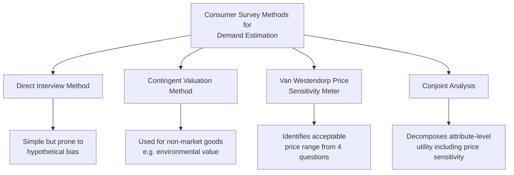
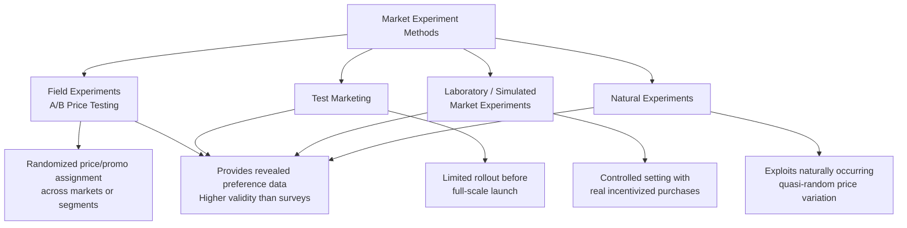

## Consumer Surveys and Market Experiments for Demand Estimation

### Overview

Direct methods of demand estimation — consumer surveys and market experiments — complement statistical/econometric approaches (regression analysis of historical data) by generating data through deliberate data collection or controlled variation, rather than relying solely on naturally occurring historical price-quantity observations. These methods are particularly valuable when historical data is limited, unavailable (e.g., new product launches), or when researchers need controlled variation in price to overcome the identification challenges inherent in observational data.

### Motivation: Limitations of Purely Statistical Estimation

**Key Points**

- Historical time-series or cross-sectional data may lack sufficient price variation to precisely estimate elasticity (multicollinearity between price and other variables)
- **Simultaneity bias**: observed price-quantity data reflects the intersection of supply and demand, making it difficult to isolate the demand relationship alone without instruments or controlled variation
- New products or markets have no historical data at all, necessitating direct estimation approaches before launch
- Surveys and experiments allow researchers to generate **controlled, exogenous variation** in price or other variables, directly addressing the identification problem

### Consumer Surveys

**Definition**

Consumer surveys involve directly questioning a sample of consumers about their purchasing intentions, preferences, or hypothetical responses to price changes, typically through structured questionnaires, interviews, or online panels.

**Key Survey-Based Techniques**

**1. Direct Interview Method**

Consumers are asked directly how much of a good they would purchase at various price points. Simple to administer but suffers from significant validity concerns.

**2. Contingent Valuation Method**

Consumers are asked to state their willingness to pay (WTP) for a good or a specific attribute/feature, often used for non-market goods (environmental amenities, public goods) where no market price exists.

**3. Van Westendorp Price Sensitivity Meter**

A structured survey technique asking respondents four questions about a product: the price at which it seems (a) too cheap (questionable quality), (b) a bargain, (c) starting to feel expensive, and (d) too expensive (prohibitively so). Responses are aggregated across the sample to identify an "acceptable price range" and estimate optimal price points.

**4. Conjoint Analysis**

Respondents evaluate a series of product profiles that vary systematically across multiple attributes (including price), allowing researchers to statistically decompose the relative importance (utility weight) consumers place on each attribute, including price sensitivity, without directly asking about price in isolation.

**Key Points**

- Surveys allow estimation of demand for **new products** before market launch, when no historical sales data exists
- Surveys can probe underlying **motivations and preferences**, not just observable purchase behavior, offering insight into *why* demand patterns exist
- Surveys are relatively **fast and low-cost** compared to full market experiments

### Limitations of Survey-Based Methods

**Key Points**

- **Hypothetical bias**: stated intentions in a hypothetical scenario often diverge from actual purchasing behavior when real money and trade-offs are involved (respondents may overstate willingness to pay for goods with no real budget consequence)
- **Sampling bias**: if the survey sample is not representative of the true target market, results may not generalize
- **Strategic/social desirability bias**: respondents may answer in ways they believe are expected or socially favorable rather than truthfully
- **Anchoring and framing effects**: the order and wording of survey questions can systematically influence stated price sensitivity
- **[Inference]** Because of these validity concerns, well-designed applied market research generally treats survey-based demand estimates as directional or preliminary inputs, best combined with revealed-preference data (from experiments or actual sales) rather than relied upon as the sole basis for pricing or demand decisions.

### Market Experiments

**Definition**

Market experiments involve actually varying price, advertising, packaging, or other marketing-mix variables in a real (or simulated real) market setting and observing actual consumer purchase behavior, providing **revealed preference** data rather than stated intentions.

**Key Experimental Techniques**

**1. Field Experiments (A/B Testing / Price Testing)**

Different prices (or promotional treatments) are randomly assigned across comparable markets, stores, customer segments, or time periods, and actual sales outcomes are compared. Widely used in e-commerce and retail settings due to ease of implementation (e.g., showing different prices to randomly assigned customer segments online).

**2. Test Marketing**

A new product (or price/marketing change) is launched in a limited geographic area or customer segment before a full-scale rollout, allowing the firm to observe real purchase behavior and refine strategy before committing to broader launch costs.

**3. Laboratory (Simulated Market) Experiments**

Consumers are brought into a controlled laboratory setting and given a budget to make real (or realistically incentivized) purchase decisions among various goods at experimentally varied prices, combining some rigor of controlled experimentation with more realistic purchase incentives than pure surveys.

**4. Natural Experiments**

Researchers exploit naturally occurring, quasi-random variation in price or policy (e.g., a tax change in one jurisdiction but not a neighboring one, a supply shock affecting only certain regions) to estimate demand elasticity using difference-in-differences or similar causal inference techniques, without deliberately designing the price variation themselves.

### Advantages of Experimental Methods over Surveys

**Key Points**

- **Revealed rather than stated preference**: actual purchase decisions with real financial consequences are generally considered more reliable indicators of true demand than hypothetical survey responses
- **Controlled variation directly addresses simultaneity bias**: since the researcher (not the market) determines the price variation, the resulting price-quantity relationship can be interpreted causally
- **Randomization** (in properly designed field experiments) allows for clean identification of causal price effects, analogous to randomized controlled trials in clinical research

### Limitations of Market Experiments

**Key Points**

- **Cost and time**: field experiments and test marketing are generally more expensive and time-consuming to design and execute than surveys
- **Competitive exposure risk**: test marketing reveals strategic information (pricing, product features) to competitors before a full launch, potentially inviting preemptive competitive responses
- **External validity concerns**: results from a limited test market or laboratory setting may not perfectly generalize to the full target market, particularly if the test sample or setting differs systematically from the broader population
- **Novelty and Hawthorne effects**: consumers may behave differently simply because they know they are part of an experiment or because a promotion is perceived as temporary/novel, potentially biasing observed responses
- **Ethical and customer relations considerations**: price experimentation, particularly personalized pricing based on customer data, raises fairness and transparency concerns and can generate customer backlash if discovered

### Comparison of Estimation Approaches

| Method | Data Type | Cost | Validity | Best Suited For |
| --- | --- | --- | --- | --- |
| Statistical/econometric (historical data) | Observational (secondary) | Low (if data available) | Moderate (subject to bias without controls) | Established products with rich historical data |
| Consumer surveys | Stated preference (primary) | Low-moderate | Lower (hypothetical bias risk) | New products, exploratory research, non-market goods |
| Field experiments (A/B testing) | Revealed preference (primary) | Moderate | High (with proper randomization) | Digital/retail pricing optimization, established sales channels |
| Test marketing | Revealed preference (primary) | High | High but limited generalizability | Pre-launch validation of new products |
| Laboratory experiments | Revealed preference (semi-controlled) | Moderate-high | Moderate-high (controlled but less naturalistic) | Academic research, controlled attribute testing |
| Natural experiments | Observational (quasi-experimental) | Low (if suitable variation exists) | High (if exogeneity assumption holds) | Policy evaluation, tax/regulation impact studies |

### Modern Digital Applications

**Key Points**

- **E-commerce platforms** routinely run large-scale, low-cost A/B price and promotion tests due to the ease of randomized digital experimentation and real-time sales tracking
- **Dynamic pricing algorithms** increasingly rely on continuously updated experimental data (multi-armed bandit approaches) to adaptively estimate demand elasticity and optimize pricing in near real-time
- **Conjoint analysis** has become widely automated through online survey platforms, enabling firms to rapidly test hypothetical product/price configurations at scale before physical or digital launch

### Integrating Survey and Experimental Methods with Econometric Analysis

**Key Points**

- Best-practice applied demand estimation often **combines** methods: using survey/conjoint data to inform initial hypotheses and product/price ranges, then validating and refining estimates through field experiments once feasible, and ultimately incorporating actual sales data into ongoing econometric demand models
- Experimental price variation (from a field test) can also serve as a valid **instrumental variable** for price in subsequent econometric estimation, since it is exogenously determined by the researcher rather than jointly determined by market supply and demand forces

### Applications in Managerial Decision-Making

**Key Points**

- **New product pricing strategy**: Van Westendorp and conjoint methods are widely used to set launch pricing in the absence of historical sales data
- **Promotional calendar optimization**: field experiments help retailers determine optimal discount depth and timing for promotional events
- **Market entry and expansion decisions**: test marketing informs go/no-go decisions and marketing-mix adjustments before committing to full-scale rollout costs
- **Personalized and dynamic pricing**: digital platforms use continuous experimentation to estimate segment-level or even individual-level price elasticity for targeted pricing strategies

### Related Topics

- Price Elasticity of Demand and Its Determinants
- Regression-Based (Econometric) Demand Estimation
- Identification Problems in Demand Estimation (Simultaneity Bias)
- New Product Pricing Strategies
- A/B Testing and Experimental Design in Business Analytics
- Dynamic Pricing and Revenue Management