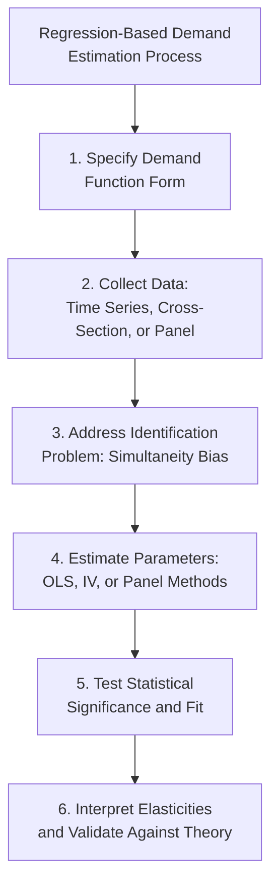

## Regression-Based Demand Estimation

### Overview

Regression-based demand estimation uses statistical/econometric techniques to estimate the parameters of a demand function from observed data on quantity, price, income, and other relevant variables. It is the most widely used quantitative approach to demand estimation in applied managerial and industrial economics, allowing analysts to derive numerical elasticity estimates directly from historical or cross-sectional data rather than relying solely on surveys or experiments.

### Specifying the Demand Function for Estimation

**General Form**

$$Q = f(P, P_S, P_C, M, A, T, \varepsilon)$$

Where $Q$ is quantity demanded, $P$ is own price, $P_S$/$P_C$ are prices of substitutes/complements, $M$ is income, $A$ is advertising, $T$ represents tastes/trend, and $\varepsilon$ is a random error term capturing unobserved influences.

**Key Points**

- The choice of functional form (linear, log-linear, semi-log, polynomial) has direct implications for the interpretation and constancy of estimated elasticities
- Model specification requires balancing theoretical grounding (which variables belong in the demand function) against data availability and statistical tractability

### Common Functional Forms

**1. Linear Demand Function**

$$Q = \beta_0 + \beta_1 P + \beta_2 M + \beta_3 P_S + \varepsilon$$

Elasticity varies at every point along the curve (see the linear demand elasticity discussion in price elasticity topics): $E_d = \beta_1 \cdot (P/Q)$, which changes as $P$ and $Q$ change.

**2. Log-Linear (Constant Elasticity / Double-Log) Demand Function**

$$\ln Q = \beta_0 + \beta_1 \ln P + \beta_2 \ln M + \beta_3 \ln P_S + \varepsilon$$

Here, each coefficient is *directly interpretable as a constant elasticity*: $\beta_1 = E_d$ (price elasticity), $\beta_2 = E_M$ (income elasticity), $\beta_3 = E_{XY}$ (cross-price elasticity), regardless of the specific values of $P$, $M$, or $Q$.

**3. Semi-Log Demand Function**

$$\ln Q = \beta_0 + \beta_1 P + \varepsilon \quad \text{or} \quad Q = \beta_0 + \beta_1 \ln P + \varepsilon$$

Used when the researcher expects a constant percentage (rather than constant proportional-to-proportional) response; elasticity varies with the level of the untransformed variable.

**Key Points**

- The **log-log (double-log) specification is the most commonly used form in applied demand estimation** specifically because its coefficients are directly interpretable as elasticities, simplifying both estimation and communication of results
- Model selection should be guided by statistical fit (e.g., $R^2$, information criteria) as well as theoretical plausibility and ease of interpretation

### The Identification Problem

**Definition**

The identification problem arises because observed price-quantity data represents the *intersection* of supply and demand curves in each period — not points along a single demand curve alone. Naive regression of quantity on price using observational market data therefore risks estimating a mixture of supply and demand relationships rather than the demand curve in isolation.

<svg xmlns="http://www.w3.org/2000/svg" viewBox="0 0 460 340">
<text x="230" y="22" font-size="15" font-weight="bold" text-anchor="middle" fill="#1a1a1a">The Identification Problem (svg_diagram)</text>
<line x1="60" y1="290" x2="60" y2="50" stroke="#333" stroke-width="2" />
<line x1="60" y1="290" x2="420" y2="290" stroke="#333" stroke-width="2" />
<text x="425" y="295" font-size="11" fill="#333">Quantity</text>
<text x="30" y="45" font-size="11" fill="#333">Price</text>
<line x1="80" y1="80" x2="380" y2="260" stroke="#2563eb" stroke-width="1.5" />
<line x1="80" y1="130" x2="380" y2="290" stroke="#2563eb" stroke-width="1.5" stroke-dasharray="3,2" />
<line x1="80" y1="30" x2="380" y2="220" stroke="#2563eb" stroke-width="1.5" stroke-dasharray="3,2" />
<text x="385" y="220" font-size="9" fill="#2563eb">Demand shifts</text>
<line x1="100" y1="270" x2="340" y2="70" stroke="#dc2626" stroke-width="1.5" />
<line x1="140" y1="270" x2="380" y2="70" stroke="#dc2626" stroke-width="1.5" stroke-dasharray="3,2" />
<line x1="60" y1="270" x2="300" y2="70" stroke="#dc2626" stroke-width="1.5" stroke-dasharray="3,2" />
<text x="345" y="65" font-size="9" fill="#dc2626">Supply shifts</text>
<circle cx="220" cy="150" r="4" fill="#111" />
<circle cx="260" cy="130" r="4" fill="#111" />
<circle cx="180" cy="180" r="4" fill="#111" />
<text x="230" y="200" font-size="10" fill="#111">Observed points reflect both curves shifting over time</text>
</svg>

**Key Points**

- If both supply and demand curves shift simultaneously over time (which is the norm in real markets), the scatter of observed price-quantity points does **not** trace out either curve cleanly
- Ordinary Least Squares (OLS) regression of quantity on price using such data will generally produce **biased and inconsistent** estimates of the true demand elasticity (simultaneity bias / endogeneity bias)

### Solutions to the Identification Problem

**1. Instrumental Variables (IV) Estimation**

Uses a variable that shifts *supply* but does not directly affect *demand* (a valid instrument) to isolate exogenous price variation, allowing consistent estimation of the demand curve. Common instruments include input costs, weather/supply shocks, or regulatory changes affecting production costs.

**2. Simultaneous Equations Models (Two-Stage Least Squares)**

Explicitly specifies and jointly estimates both supply and demand equations as a system, using instruments that satisfy the **order and rank conditions** for identification (each equation must be identified by at least one variable excluded from that equation but included in the other).

**3. Natural Experiments / Quasi-Experimental Variation**

Exploits externally driven, plausibly exogenous price changes (e.g., a tax change, a supply disruption unrelated to demand conditions) to estimate demand response without requiring a fully specified simultaneous equations model.

**4. Panel Data Methods**

Using data across multiple markets or time periods (panel data) allows researchers to control for unobserved, time-invariant market-specific factors (fixed effects), reducing omitted variable bias relative to simple cross-sectional or time-series regression.

**Key Points**

- The choice of identification strategy is often the most critical and most debated methodological decision in applied demand estimation — a technically well-estimated regression with a poor identification strategy can still produce **misleading** elasticity estimates
- [Inference] In modern applied industrial organization research, instrumental variables and quasi-experimental designs are generally regarded as more credible than simple observational regressions for causal elasticity estimation, though the appropriate strategy depends heavily on data availability and the specific market context.

### Order and Rank Conditions for Identification (Simultaneous Equations)

**Order Condition (necessary, not sufficient)**

An equation is identified if the number of excluded exogenous variables (from that equation, but present elsewhere in the system) is at least as great as the number of endogenous variables on the right-hand side of that equation minus one.

**Key Points**

- The demand equation requires at least one valid **supply-shifter** (excluded from demand) for identification
- The supply equation requires at least one valid **demand-shifter** (excluded from supply) for identification
- This is the classical "identification via exclusion restrictions" approach central to structural demand-supply estimation

### Statistical Estimation Techniques

**Key Points**

- **Ordinary Least Squares (OLS)**: appropriate only when price can be credibly treated as exogenous (e.g., in experimental or quasi-experimental settings); biased under simultaneity
- **Two-Stage Least Squares (2SLS)**: standard IV technique; first stage regresses price on instruments and exogenous controls, second stage uses the fitted (predicted) price values in the demand equation
- **Generalized Method of Moments (GMM)**: more flexible estimation framework, often used when multiple instruments or additional moment conditions are available, particularly in panel data settings
- **Discrete choice models (logit, nested logit)**: used when demand is estimated at the individual consumer or product level (e.g., which of several differentiated products a consumer chooses), common in modern applied industrial organization (e.g., Berry-Levinsohn-Pakes/BLP-style demand estimation for differentiated products)

### Worked Illustrative Example (Log-Linear Specification)

Suppose a researcher estimates the following log-linear demand model using time-series data on a consumer good, with price instrumented by an input-cost shifter to address simultaneity:

$$\ln Q_t = 4.605 - 0.85 \ln P_t + 0.30 \ln M_t + 0.20 \ln P_{S,t} + \varepsilon_t$$

**Output (Interpretation)**

- $\hat\beta_1 = -0.85$: own-price elasticity of $-0.85$ — demand is **inelastic** ($|E_d|<1$)
- $\hat\beta_2 = 0.30$: income elasticity of $0.30$ — the good is a **normal good/necessity** ($0<E_M<1$)
- $\hat\beta_3 = 0.20$: positive cross-price elasticity with good S — S is a **substitute**

**[Inference]** These specific coefficient values are illustrative for demonstrating interpretation methodology; actual estimated elasticities for any real product must be obtained from properly specified and validated econometric models using real data, and will vary by market, time period, and specification.

### Model Diagnostics and Validation

**Key Points**

- **Statistical significance**: t-tests/p-values on each coefficient to assess whether the estimated elasticity is statistically distinguishable from zero
- **Goodness of fit**: $R^2$ (or pseudo-$R^2$ for discrete choice models) indicates how much variation in quantity is explained by the model, though high $R^2$ alone does not guarantee correct identification
- **Residual diagnostics**: checking for heteroskedasticity, autocorrelation (especially relevant in time-series demand data), and multicollinearity among regressors
- **Out-of-sample validation**: testing the model's predictive accuracy on a holdout sample or subsequent time period not used in estimation, to assess practical forecasting reliability
- **Theoretical consistency checks**: verifying that estimated elasticities have plausible signs and magnitudes consistent with economic theory (e.g., own-price elasticity negative, cross-price elasticity signs consistent with known substitute/complement relationships)

### Data Requirements and Sources

**Key Points**

- **Time-series data**: historical price, quantity, income, and related-good price data over multiple periods for a single market — useful for capturing dynamics and trends but vulnerable to omitted time-varying confounders
- **Cross-sectional data**: price/quantity/income data across multiple markets or consumer segments at a single point in time — useful for capturing variation across markets but cannot capture dynamic/carryover effects
- **Panel data**: combines both dimensions (multiple markets over multiple time periods), generally preferred when available, as it allows control for both market-specific and time-specific unobserved factors via fixed effects

### Applications in Managerial Decision-Making

**Key Points**

- **Pricing strategy**: estimated own-price elasticity directly informs revenue-maximizing and profit-maximizing pricing decisions (via the elasticity-markup relationship, e.g., the Lerner Index)
- **Demand forecasting**: estimated demand functions, combined with projected values of income, competitor prices, and other determinants, support sales and revenue forecasting
- **Cross-elasticity mapping for competitive strategy**: regression-based cross-price elasticity estimates inform competitive positioning and market definition analysis
- **Regulatory and antitrust submissions**: rigorously estimated demand elasticities (with defensible identification strategies) are frequently required as evidence in regulatory proceedings, merger reviews, and litigation involving market definition or damages calculations

### Related Topics

- Price Elasticity of Demand and Its Determinants
- Income Elasticity of Demand and Product Classification
- Cross-Price Elasticity and Substitute-Complement Relationships
- Consumer Surveys and Market Experiments for Demand Estimation
- Instrumental Variables and Two-Stage Least Squares Estimation
- Discrete Choice Demand Models (Logit, Nested Logit, BLP)
- Demand Forecasting Techniques in Managerial Economics