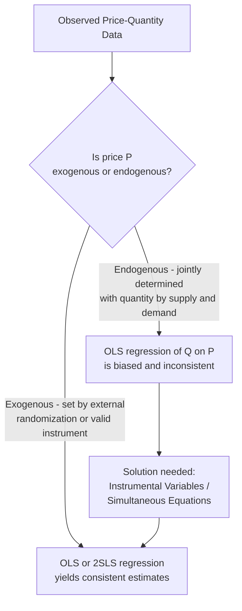
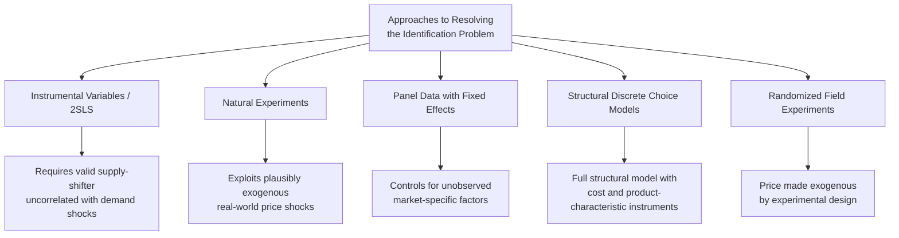

## The Identification Problem in Demand Estimation

### Overview

The identification problem is a foundational methodological challenge in empirical demand estimation: because observed market prices and quantities are jointly determined by the *simultaneous interaction* of supply and demand, a simple regression of quantity on price using observational market data does not, in general, recover the true demand curve. This problem, formally articulated in the econometrics literature going back to the Cowles Commission researchers of the 1940s, is central to understanding why naive statistical analysis of market data can produce systematically biased and misleading elasticity estimates.

### The Core Problem: Simultaneity

**Setup**

In any real market, both a demand equation and a supply equation determine the equilibrium price and quantity observed at any point in time:

$$\text{Demand: } Q_d = \alpha_0 + \alpha_1 P + \alpha_2 M + \varepsilon_d$$

$$\text{Supply: } Q_s = \beta_0 + \beta_1 P + \beta_2 W + \varepsilon_s$$

$$\text{Equilibrium: } Q_d = Q_s = Q$$

Where $M$ is income (a demand-side variable) and $W$ is an input/factor cost (a supply-side variable).

**Key Points**

- Price $P$ is **endogenous** — it is jointly determined within the system, not set independently of the error terms
- Any shock to the demand equation ($\varepsilon_d$) shifts the demand curve, which changes *both* equilibrium price and quantity simultaneously
- Because $P$ is correlated with $\varepsilon_d$ (the demand error term) through this simultaneous determination, ordinary least squares (OLS) estimation of the demand equation alone produces **biased and inconsistent** coefficient estimates — this is known as **simultaneity bias** or **endogeneity bias**

### Graphical Illustration: Why Observed Points Don't Trace the Demand Curve

<svg xmlns="http://www.w3.org/2000/svg" viewBox="0 0 500 380">
<text x="250" y="22" font-size="15" font-weight="bold" text-anchor="middle" fill="#1a1a1a">Simultaneous Shifts Obscure the True Demand Curve (svg_diagram)</text>
<line x1="70" y1="330" x2="70" y2="50" stroke="#333" stroke-width="2" />
<line x1="70" y1="330" x2="440" y2="330" stroke="#333" stroke-width="2" />
<text x="445" y="335" font-size="11" fill="#333">Quantity</text>
<text x="40" y="45" font-size="11" fill="#333">Price</text>
<line x1="90" y1="90" x2="400" y2="290" stroke="#2563eb" stroke-width="1.5" />
<line x1="90" y1="140" x2="400" y2="320" stroke="#2563eb" stroke-width="1.5" stroke-dasharray="3,2" />
<line x1="90" y1="40" x2="400" y2="250" stroke="#2563eb" stroke-width="1.5" stroke-dasharray="3,2" />
<text x="405" y="250" font-size="10" fill="#2563eb">D shifts (income, tastes)</text>
<line x1="110" y1="310" x2="360" y2="80" stroke="#dc2626" stroke-width="1.5" />
<line x1="150" y1="310" x2="400" y2="80" stroke="#dc2626" stroke-width="1.5" stroke-dasharray="3,2" />
<line x1="70" y1="310" x2="320" y2="80" stroke="#dc2626" stroke-width="1.5" stroke-dasharray="3,2" />
<text x="330" y="75" font-size="10" fill="#dc2626">S shifts (input costs)</text>
<circle cx="230" cy="185" r="4" fill="#111" />
<circle cx="260" cy="170" r="4" fill="#111" />
<circle cx="195" cy="220" r="4" fill="#111" />
<circle cx="280" cy="150" r="4" fill="#111" />
<path d="M 195,220 Q 230,195 260,170 Q 270,160 280,150" stroke="#333" stroke-width="1" stroke-dasharray="2,2" fill="none" />
<text x="150" y="245" font-size="10" fill="#111">Observed points trace neither curve cleanly</text>
</svg>

**Interpretation**: Each observed equilibrium point results from a different combination of demand and supply positions. A line fitted through these scattered points reflects a mixture of both curves' movements, not the slope of the demand curve alone.

### Consequences of Ignoring the Identification Problem

**Key Points**

- **Attenuation or reversal of estimated elasticity**: naive OLS estimates of price elasticity can be biased toward zero, or in some cases even carry the **wrong sign**, if supply-side variation dominates the observed price movements
- **Unreliable policy and business conclusions**: pricing decisions, tax incidence analysis, and forecasting based on a misidentified demand curve can lead to systematically incorrect managerial or policy choices
- **Illusory precision**: a regression can produce a high $R^2$ and statistically significant coefficients while still estimating an entirely wrong economic relationship, since standard diagnostic statistics do not by themselves reveal simultaneity bias

### Formal Conditions for Identification

**Order Condition (Necessary, Not Sufficient)**

For a given structural equation (e.g., the demand equation) in a system of simultaneous equations to be identified, the number of exogenous variables **excluded** from that equation (but present elsewhere in the system) must be at least as great as the number of **endogenous** right-hand-side variables in that equation minus one.

**Rank Condition (Necessary and Sufficient)**

A stricter, formal linear-algebra condition on the coefficient matrix of the full system, verifying that the excluded variables provide sufficient independent variation to distinguish the equation of interest from all others in the system. The rank condition subsumes the order condition; an equation satisfying the order condition may still fail the rank condition in degenerate cases.

**Key Points**

- **Demand equation identification** requires at least one valid **supply-shifter**: a variable that affects the position of the supply curve but has no direct effect on demand (e.g., input costs, weather affecting agricultural production, technology shocks in production)
- **Supply equation identification** requires at least one valid **demand-shifter**: a variable that affects demand but not supply directly (e.g., consumer income, prices of substitute/complement goods, advertising)
- This is the essence of **identification via exclusion restrictions**

### The Instrumental Variable Solution

**Definition**

An instrumental variable (IV) for price is a variable $Z$ that satisfies two key conditions:

1. **Relevance**: $Z$ is correlated with the endogenous variable $P$ (it meaningfully shifts price)
2. **Exogeneity (exclusion restriction)**: $Z$ is uncorrelated with the demand error term $\varepsilon_d$ — i.e., $Z$ affects quantity demanded *only* through its effect on price, not through any other channel

**Two-Stage Least Squares (2SLS) Procedure**

**Stage 1**: Regress the endogenous variable (price) on the instrument(s) and any exogenous controls:

$$P = \pi_0 + \pi_1 Z + \pi_2 M + u$$

Obtain fitted (predicted) values $\hat{P}$.

**Stage 2**: Regress quantity on the fitted price values $\hat{P}$ (and other exogenous demand-side controls):

$$Q = \alpha_0 + \alpha_1 \hat{P} + \alpha_2 M + \varepsilon$$

**Key Points**

- Because $\hat P$ is constructed purely from the exogenous instrument $Z$ (and other exogenous variables), it is, by construction, uncorrelated with $\varepsilon_d$, resolving the simultaneity bias
- $\hat\alpha_1$ from the second stage provides a **consistent** estimate of the true price elasticity of demand
- Common instruments in applied demand studies include: input/factor prices (e.g., cost of raw materials, wages), weather shocks affecting agricultural supply, and regulatory or tax changes that shift costs without directly affecting consumer demand

### Common Sources of Valid Instruments

**Key Points**

- **Cost-side (supply) shifters**: input prices, wage rates, energy costs, exchange rates affecting imported input costs
- **Natural/weather shocks**: rainfall, temperature, or natural disasters affecting agricultural or resource-based supply
- **Policy and regulatory changes**: taxes, tariffs, or regulations that shift production costs but have no direct behavioral link to consumer demand
- **Hausman-style instruments**: prices of the same good in geographically or temporally separated but related markets, used under the assumption that common cost shocks affect both markets similarly while demand shocks are more localized (subject to ongoing methodological debate about their validity in some applications)

### Alternative Approaches to the Identification Problem

**1. Natural Experiments**

Exploiting a plausibly exogenous, real-world event that shifts price without being driven by demand-side factors (e.g., a sudden tax increase, a supply disruption unrelated to consumer preferences), allowing a difference-in-differences or event-study estimation strategy.

**2. Panel Data with Fixed Effects**

Using data across multiple markets and time periods to control for unobserved, time-invariant market-specific characteristics, reducing (though not always eliminating) omitted variable bias that can compound the simultaneity problem.

**3. Discrete Choice / Structural Demand Models**

Modern industrial organization approaches (e.g., BLP-style random-coefficients logit models) build a fully specified structural model of consumer choice and firm pricing behavior, using instruments derived from cost shifters or characteristics of competing products to achieve identification within a richer, more flexible demand system.

**4. Controlled Field Experiments**

Directly randomizing price across markets or customer segments (see market experiments for demand estimation) sidesteps the identification problem entirely by making price **exogenous by design**, since the researcher (not market forces) determines price variation.

### Testing Instrument Validity

**Key Points**

- **Relevance** can be statistically tested via the first-stage F-statistic; a commonly cited rule of thumb suggests weak instruments (low first-stage explanatory power) can still produce biased and unreliable 2SLS estimates even when the exclusion restriction holds
- **Exogeneity (exclusion restriction)** generally **cannot** be directly statistically tested when the system is exactly identified — it must be justified on theoretical or institutional grounds specific to the market being studied
- When multiple instruments are available (over-identification), **over-identification tests** (e.g., the Sargan or Hansen J-test) can provide some empirical evidence on instrument validity, though these tests have their own limitations and cannot fully substitute for careful theoretical justification

### Worked Conceptual Example

A researcher wants to estimate the price elasticity of demand for coffee using monthly market data. A naive OLS regression of quantity on price yields a positive (theoretically implausible) coefficient, since periods of high coffee-bean crop yields (a supply-side shock) simultaneously lower price and raise quantity — the opposite of what a demand relationship alone would predict.

**Output**

Using rainfall in coffee-growing regions (a valid supply-shifter, plausibly unrelated to consumer demand for coffee) as an instrument for price in a 2SLS framework corrects this bias, yielding a properly negative and economically plausible estimated price elasticity, consistent with theoretical expectations.

**[Inference]** This example illustrates the general logic of instrument selection in agricultural or commodity demand studies; the specific validity of any proposed instrument (such as rainfall) depends on institutional details of the particular market and must be justified case by case, since rainfall could in principle also affect demand through indirect channels (e.g., regional income effects) that would violate the exclusion restriction.

### Relevance to Managerial Decision-Making

**Key Points**

- Firms relying on internally estimated demand elasticities for pricing decisions should be aware that simple historical price-sales regressions may be biased, particularly if past pricing decisions were themselves influenced by anticipated demand conditions (a common source of endogeneity even within firm-level data)
- **Experimental pricing (A/B testing)** is often preferred in modern digital commerce precisely because it sidesteps the identification problem by construction, providing more credible elasticity estimates for pricing algorithms
- Understanding the identification problem is essential for critically evaluating third-party market research or published elasticity estimates before applying them to internal pricing or forecasting decisions

### Related Topics

- Regression-Based Demand Estimation
- Consumer Surveys and Market Experiments for Demand Estimation
- Instrumental Variables and Two-Stage Least Squares Estimation
- Price Elasticity of Demand and Its Determinants
- Discrete Choice Demand Models (Logit, Nested Logit, BLP)
- Simultaneous Equations Models in Econometrics