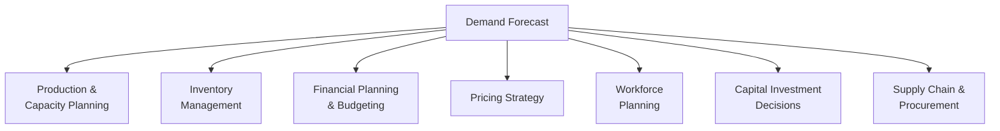
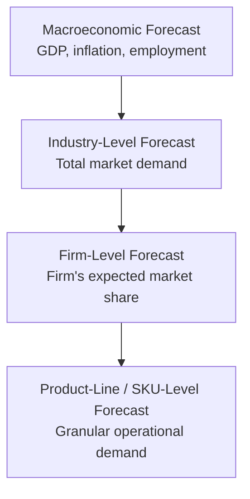
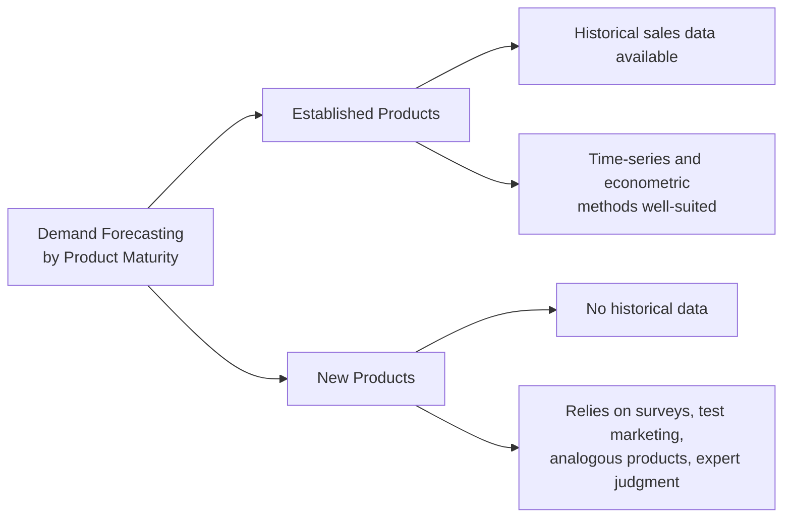

## Purpose and Levels of Demand Forecasting

### Overview

Demand forecasting is the systematic process of estimating future demand for a firm's products or services, using historical data, statistical techniques, and qualitative judgment. It underpins nearly every major managerial decision — from production planning and inventory management to capital budgeting and strategic market entry — making it a foundational tool in managerial economics.

### Purpose of Demand Forecasting

**Key Points**

- **Production and capacity planning**: forecasts guide decisions on how much to produce, when to produce it, and what production capacity investments are needed
- **Inventory management**: accurate forecasts minimize both stockout costs (lost sales, customer dissatisfaction) and excess inventory holding costs
- **Financial planning and budgeting**: revenue forecasts derived from demand forecasts feed directly into budgeting, cash flow planning, and financial statement projections
- **Pricing strategy**: understanding expected demand levels and their sensitivity to price supports informed pricing decisions
- **Workforce and human resource planning**: staffing levels, hiring, and training programs are planned around anticipated demand for output
- **Strategic and capital investment decisions**: long-term forecasts inform decisions on plant expansion, new market entry, product line extensions, and major capital expenditures
- **Supply chain and procurement planning**: demand forecasts coordinate upstream ordering of raw materials and components with suppliers

### Levels of Demand Forecasting

Demand forecasting can be structured across several distinct dimensions or "levels" — by economic scope, by time horizon, and by organizational purpose. Each level uses different techniques and serves different decision-making needs.

### Level 1: Economic Scope (Macro to Micro)

**1. Macroeconomic (Economy-Wide) Forecasting**

Forecasts of aggregate economic indicators such as GDP growth, inflation, interest rates, and employment levels. These provide the broad economic context within which firm-level and industry-level demand forecasts are made.

**2. Industry-Level Forecasting**

Forecasts of total demand for an entire industry or product category (e.g., total automobile sales in a country, total demand for cloud computing services), used to assess overall market size and growth trends.

**3. Firm-Level Forecasting**

Forecasts of demand specifically for a single firm's products, incorporating the firm's expected market share within the broader industry forecast.

**4. Product-Line or Product-Level Forecasting**

Forecasts disaggregated to individual products, product lines, or even specific SKUs (stock-keeping units), used for granular operational decisions such as inventory replenishment.

**Key Points**

- Forecasts at higher levels (macro, industry) typically inform and constrain forecasts at lower levels (firm, product) — a firm's own forecast should be consistent with, though not identical to, the broader industry and economic outlook
- Each level requires different data sources and methodologies: macro forecasts often rely on published economic indicators and econometric models; product-level forecasts rely heavily on internal sales history and operational data

### Level 2: Time Horizon

**1. Short-Term Forecasting (typically up to 1 year, often weeks to months)**

Used for operational decisions: production scheduling, inventory replenishment, workforce shift planning, and short-term cash flow management. Relies heavily on recent historical sales data, seasonal patterns, and near-term market signals.

**2. Medium-Term Forecasting (typically 1 to 3 years)**

Used for tactical planning: annual budgeting, medium-term capacity adjustments, marketing campaign planning, and product line decisions. Balances historical trend extrapolation with anticipated changes in market conditions.

**3. Long-Term Forecasting (typically 3+ years, sometimes 5-10+ years)**

Used for strategic decisions: major capital investments, new market entry, plant location decisions, and long-range corporate strategy. Relies more heavily on structural/causal economic models, scenario planning, and qualitative expert judgment, since historical extrapolation becomes less reliable over longer horizons.

| Time Horizon | Typical Duration | Primary Use | Typical Methods |
| --- | --- | --- | --- |
| Short-term | Weeks to 1 year | Operations, inventory, scheduling | Time-series methods (moving averages, exponential smoothing) |
| Medium-term | 1-3 years | Budgeting, tactical planning | Regression/econometric models, trend analysis |
| Long-term | 3+ years | Strategic investment, market entry | Scenario analysis, Delphi method, structural economic models |

**Key Points**

- Forecast **accuracy generally declines as the time horizon lengthens**, since more unknown factors and potential structural changes can intervene
- The appropriate forecasting **technique** should match the time horizon — naive time-series extrapolation methods that work well short-term become increasingly unreliable for long-term strategic forecasts, where causal/structural models and qualitative judgment become more important

### Level 3: Purpose-Based Classification

**1. Passive Forecasting**

Assumes no significant change in the firm's own policies (pricing, marketing, product features) and projects demand based on continuation of existing trends and external conditions.

**2. Active (Conditional) Forecasting**

Explicitly models how the firm's own planned policy changes (e.g., a price change, a new advertising campaign, a product redesign) are expected to affect future demand, often used to evaluate specific strategic options before implementation.

**Key Points**

- Passive forecasts serve as a baseline ("what would happen if we changed nothing"), useful for identifying underlying trend and cyclical patterns
- Active forecasts are essential for evaluating the likely demand impact of specific proposed managerial decisions, directly supporting scenario comparison and decision-making

### Level 4: New Product versus Established Product Forecasting

**Key Points**

- **Established product forecasting** can rely substantially on historical sales data, time-series methods, and econometric demand models, since a track record of demand behavior exists
- **New product forecasting** faces the fundamental challenge of having **no historical sales data**, requiring greater reliance on qualitative methods (expert judgment, analogous product comparisons, consumer surveys, test marketing) rather than purely quantitative extrapolation

### Interrelationship Between Levels

**Key Points**

- A comprehensive corporate forecasting system typically integrates **all levels simultaneously**: macro and industry forecasts set the overall context, firm-level forecasts allocate expected market share, product-level forecasts drive operational planning, and time horizons are matched to the corresponding decision type (operational, tactical, or strategic)
- Inconsistencies between levels (e.g., a firm-level long-term forecast implying market share gains inconsistent with the industry-level growth forecast) should be reconciled as part of a rigorous forecasting process
- Larger organizations often maintain **rolling forecasts** that are updated periodically (e.g., monthly or quarterly) to incorporate new information, blending short, medium, and long-term forecasting horizons into an integrated planning cycle

### Qualitative versus Quantitative Orientation Across Levels

**Key Points**

- **Short-term, product-level forecasts** tend to be dominated by **quantitative** time-series methods, given rich historical data availability
- **Long-term, strategic-level forecasts** tend to rely more heavily on **qualitative** methods (expert panels, scenario planning, Delphi techniques) due to greater structural uncertainty and limited relevant historical precedent
- Most robust forecasting practices in managerial economics **combine** quantitative and qualitative approaches, using statistical models as a baseline and qualitative judgment to adjust for anticipated structural changes, competitive actions, or other factors not captured in historical data

### Applications in Managerial Decision-Making

**Key Points**

- **Budget cycle integration**: forecasts at the appropriate time horizon directly feed into annual budgeting and multi-year strategic planning cycles
- **Cross-functional coordination**: demand forecasts serve as the common planning input shared across sales, operations, finance, and marketing functions, aligning organizational activities around a consistent view of expected future demand
- **Risk management**: understanding forecast uncertainty (and building in appropriate safety margins or scenario ranges) helps firms manage the risk of both under- and over-committing resources
- **Performance evaluation**: forecast accuracy itself is often tracked as a key performance metric, with systematic forecast errors analyzed to improve future forecasting processes

### Related Topics

- Qualitative Forecasting Methods (Delphi, Expert Panels, Sales Force Composite)
- Time-Series Forecasting Methods (Moving Averages, Exponential Smoothing, Decomposition)
- Econometric and Regression-Based Forecasting Models
- Barometric and Leading Indicator Forecasting
- Forecast Accuracy Measurement and Error Analysis
- New Product Forecasting and Diffusion Models (Bass Model)