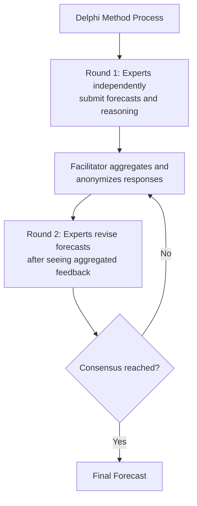
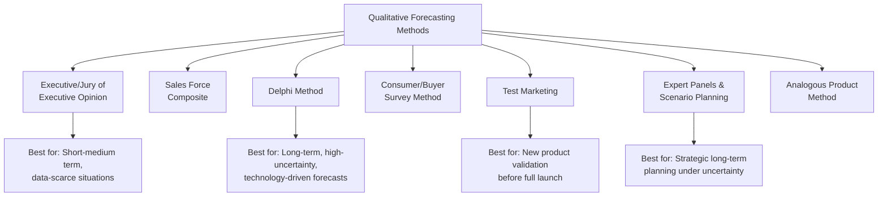

## Qualitative Forecasting Methods

### Overview

Qualitative forecasting methods rely on expert judgment, opinion, and subjective assessment rather than statistical analysis of historical numerical data. These methods are particularly valuable in situations where historical data is unavailable, unreliable, or insufficient to capture anticipated structural changes — most notably for new product launches, long-term strategic forecasts, and markets undergoing significant disruption. Qualitative methods are often used alongside quantitative techniques rather than as a complete substitute.

### When Qualitative Methods Are Most Appropriate

**Key Points**

- **New products with no historical sales data**
- **Long-term strategic forecasts** where structural change makes historical extrapolation unreliable
- **Markets undergoing significant disruption** (technological change, regulatory shifts, entry of disruptive competitors)
- **Situations requiring rapid forecasts** when time or data constraints prevent rigorous quantitative modeling
- As a **complement** to quantitative forecasts, to incorporate factors not captured in historical data (e.g., anticipated competitive actions, upcoming regulatory changes)

### 1. Executive/Jury of Executive Opinion Method

**Definition**

A panel of senior executives (from sales, marketing, finance, production, etc.) pools their individual judgment and experience to arrive at a consensus demand forecast, typically through group discussion and averaging of individual estimates.

**Key Points**

- Advantages: fast, leverages broad cross-functional expertise, useful when data is scarce
- Disadvantages: susceptible to groupthink, dominance by senior/vocal participants, and systematic optimism or pessimism bias depending on organizational culture
- Best suited for short-to-medium-term forecasts where executives have direct, relevant market knowledge

### 2. Sales Force Composite Method

**Definition**

Individual salespeople or regional sales managers, who have direct contact with customers and territory-specific market knowledge, provide bottom-up estimates of expected sales in their respective territories or accounts, which are then aggregated into an overall forecast.

**Key Points**

- Advantages: leverages granular, close-to-the-customer market knowledge; can capture regional or account-specific variation that aggregate methods might miss
- Disadvantages: salespeople may have incentive to **understate** forecasts (to make future sales targets easier to exceed) or **overstate** them (to secure more inventory/resources), introducing systematic bias
- Requires careful incentive design to mitigate strategic misreporting

### 3. Delphi Method

**Definition**

A structured, iterative process for eliciting and refining expert opinion, in which a panel of experts (often geographically dispersed and kept anonymous to one another) independently provides forecasts through several rounds of questionnaires, with a facilitator summarizing and feeding back aggregated results (and reasoning) between rounds until the panel converges toward consensus.

**Key Points**

- Anonymity of participants reduces the groupthink and dominance effects present in the jury of executive opinion method
- Iterative feedback allows experts to revise their views in light of others' reasoning without direct social pressure
- Particularly well-suited to **long-term, technology-driven, or highly uncertain forecasts** where no single expert has complete information
- Can be time-consuming, since it typically requires multiple rounds over an extended period

### 4. Consumer/Buyer Survey Method (Market Survey of Buyer Intentions)

**Definition**

Directly surveys current or prospective customers about their purchase intentions, typically through structured questionnaires asking about likelihood of purchase, quantity intended, or reaction to hypothetical price/product scenarios.

**Key Points**

- Particularly useful for industrial/B2B markets with a limited, identifiable set of major customers, where direct surveying of buying intentions is feasible
- Subject to **hypothetical bias** — stated purchase intentions often diverge from actual future behavior, particularly for consumer (B2C) markets with large, diffuse customer bases
- Overlaps methodologically with the consumer survey techniques discussed under demand estimation (e.g., Van Westendorp, contingent valuation), applied here specifically for forecasting purposes rather than elasticity estimation

### 5. Test Marketing

**Definition**

Launching a new product (or significant product/price change) in a limited geographic area or customer segment before a full-scale rollout, using observed actual sales performance to forecast demand for the broader intended market.

**Key Points**

- Provides **revealed preference** data (actual purchase behavior) rather than stated intentions, generally considered more reliable than pure survey methods
- Risk of **competitive exposure**: rivals may observe and react to the test, potentially distorting results or allowing preemptive competitive responses before full launch
- Results from a limited test market may have **limited external validity** if the test area is not representative of the broader target market

### 6. Expert Panels and Scenario Planning

**Definition**

Groups of subject-matter experts construct multiple plausible future scenarios (e.g., optimistic, pessimistic, base case) based on qualitative analysis of technological, regulatory, competitive, and macroeconomic trends, often assigning approximate probabilities or ranges to each scenario.

**Key Points**

- Particularly valuable for **long-term strategic forecasting** under high uncertainty (e.g., forecasting demand for an emerging technology a decade into the future)
- Produces a **range of forecasts** rather than a single point estimate, explicitly acknowledging and communicating forecast uncertainty to decision-makers
- Often used in conjunction with quantitative sensitivity analysis, where financial or operational models are re-run under each qualitative scenario's key assumptions

### 7. Analogous/Comparable Product Method

**Definition**

Forecasts demand for a new product by analyzing the historical demand pattern (adoption curve, growth trajectory) of a similar, previously launched product, adjusting for known differences in market conditions, target segment, or product characteristics.

**Key Points**

- Useful when no direct historical data exists for the specific new product, but relevant comparable product launches provide a reasonable analogical basis
- Relies heavily on the analyst's judgment in selecting appropriate analogs and making suitable adjustments — a significant source of potential forecast error if the analogy is poorly chosen

### Comparative Summary Table

| Method | Best Suited For | Key Strength | Key Weakness |
| --- | --- | --- | --- |
| Executive/Jury Opinion | Short-medium term, data-scarce | Fast, leverages broad expertise | Groupthink, dominant-voice bias |
| Sales Force Composite | Territory/account-level forecasts | Close to customer, granular | Strategic misreporting incentives |
| Delphi Method | Long-term, high-uncertainty, technical | Reduces groupthink via anonymity | Time-consuming, multiple rounds |
| Consumer/Buyer Survey | B2B markets, new products | Direct customer input | Hypothetical bias, sampling issues |
| Test Marketing | New product pre-launch validation | Revealed (actual) behavior | Costly, competitive exposure risk |
| Scenario Planning | Long-term strategic decisions | Captures range of outcomes | Requires skilled facilitation |
| Analogous Product | New products with comparable precedents | Leverages real historical patterns | Analogy selection is judgment-heavy |

### Strengths and Limitations of Qualitative Methods (General)

**Key Points**

- **General strengths**: can incorporate factors that are difficult to quantify (regulatory anticipation, competitive strategy shifts, qualitative shifts in consumer sentiment); do not require extensive historical data; can be relatively fast and low-cost to implement (with the exception of test marketing)
- **General limitations**: inherently **subjective** and vulnerable to cognitive biases (overconfidence, anchoring, groupthink, motivated reasoning); generally **less precise and harder to statistically validate** than quantitative methods; **difficult to systematically improve** over time without a formal feedback and error-tracking process
- **[Inference]** Because of these limitations, most established managerial forecasting practice treats qualitative methods as complementary to, rather than a full replacement for, quantitative techniques wherever sufficient historical data exists — using qualitative judgment primarily to adjust or override purely statistical forecasts in light of known upcoming changes not reflected in historical patterns.

### Mitigating Bias in Qualitative Forecasting

**Key Points**

- **Structured elicitation processes** (such as the Delphi method's anonymity and iteration) reduce social and hierarchical biases relative to open group discussion
- **Incentive alignment** (e.g., basing sales force compensation on forecast accuracy rather than only on sales targets) can reduce strategic misreporting in the sales force composite method
- **Combining multiple qualitative methods** (triangulation) — for example, cross-checking Delphi panel results against sales force composite estimates — can help identify and correct for method-specific biases
- **Systematic tracking of forecast accuracy** over time allows organizations to identify persistent biases (e.g., chronic over-optimism in executive forecasts) and apply corrective adjustments in future forecasting cycles

### Applications in Managerial Decision-Making

**Key Points**

- **New product launch planning**: combining test marketing, analogous product analysis, and consumer surveys to set initial production and marketing budgets before full-scale rollout
- **Long-range strategic planning**: scenario planning and Delphi panels inform capital investment, market entry, and R&D prioritization decisions under significant uncertainty
- **Rapid-response forecasting**: executive opinion and sales force composite methods provide quick, actionable forecasts when time constraints preclude rigorous quantitative modeling
- **Disruption and structural break scenarios**: qualitative expert judgment becomes particularly valuable when historical data patterns are expected to break down due to major technological, regulatory, or competitive shifts

### Related Topics

- Purpose and Levels of Demand Forecasting
- Time-Series Forecasting Methods (Moving Averages, Exponential Smoothing, Decomposition)
- Econometric and Regression-Based Forecasting Models
- Consumer Surveys and Market Experiments for Demand Estimation
- New Product Forecasting and Diffusion Models (Bass Model)
- Forecast Accuracy Measurement and Error Analysis