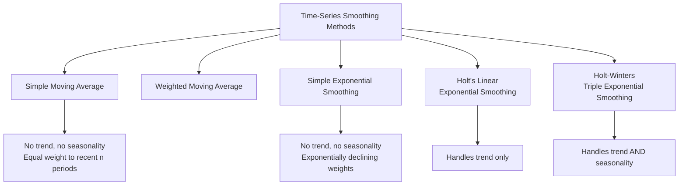

## Trend Analysis and Time-Series Smoothing Techniques

### Overview

Time-series forecasting methods analyze historical patterns in sequentially ordered data (typically demand or sales observed over time) to project future values. Unlike causal/econometric models that rely on explanatory variables (price, income, advertising), time-series methods extrapolate directly from the historical pattern of the variable itself, making them especially useful for short-to-medium-term operational forecasting where relevant historical data is abundant.

### Components of a Time Series

A time series is typically decomposed into four underlying components:

**Key Points**

- **Trend (T)**: the long-term underlying direction of the series (upward, downward, or flat) over an extended period
- **Seasonal (S)**: regular, predictable fluctuations that recur within a fixed period (e.g., daily, weekly, quarterly, annually), often tied to calendar effects, weather, or holidays
- **Cyclical (C)**: longer-term, less regular fluctuations tied to broader economic or business cycles, typically spanning multiple years and lacking a fixed periodicity
- **Irregular/Random (I)**: unpredictable, non-systematic variation not explained by the other three components (random shocks, one-off events)

**Decomposition Models**

$$\text{Additive Model: } Y_t = T_t + S_t + C_t + I_t$$

$$\text{Multiplicative Model: } Y_t = T_t \times S_t \times C_t \times I_t$$

**Key Points**

- The additive model is appropriate when seasonal/cyclical fluctuations are roughly **constant in absolute magnitude** regardless of the trend level
- The multiplicative model is appropriate when fluctuations **scale proportionally** with the trend level (more common in many real business time series, e.g., retail sales, where seasonal swings grow as overall sales grow)

<svg xmlns="http://www.w3.org/2000/svg" viewBox="0 0 560 340">
<text x="280" y="22" font-size="15" font-weight="bold" text-anchor="middle" fill="#1a1a1a">Time Series Decomposition (svg_diagram)</text>
<line x1="60" y1="290" x2="60" y2="50" stroke="#333" stroke-width="2" />
<line x1="60" y1="290" x2="510" y2="290" stroke="#333" stroke-width="2" />
<text x="515" y="295" font-size="10" fill="#333">Time</text>
<path d="M 80,270 Q 150,240 200,220 Q 280,190 350,160 Q 420,130 480,90" stroke="#999" stroke-width="1.5" stroke-dasharray="4,3" fill="none" />
<text x="420" y="80" font-size="9" fill="#999">Trend</text>
<path d="M 80,260 Q 100,220 120,260 Q 140,300 160,260 Q 180,220 200,240 Q 220,270 240,230 Q 260,190 280,210 Q 300,240 320,200 Q 340,160 360,180 Q 380,210 400,170 Q 420,130 440,150 Q 460,180 480,140" stroke="#2563eb" stroke-width="2" fill="none" />
<text x="90" y="245" font-size="9" fill="#2563eb">Trend + Seasonal</text>
</svg>

### Trend Analysis Methods

**1. Linear Trend Projection**

Fits a straight line to historical data using the time period as the independent variable:

$$Y_t = a + b \cdot t + \varepsilon_t$$

Estimated via ordinary least squares, where $t$ represents sequential time periods (1, 2, 3, ...).

**2. Non-Linear Trend Projection**

For series exhibiting accelerating or decelerating growth, alternative functional forms may fit better:

$$\text{Quadratic: } Y_t = a + b_1 t + b_2 t^2 + \varepsilon_t$$

$$\text{Exponential (constant \% growth): } Y_t = a \cdot e^{bt} \quad \text{or equivalently} \quad \ln Y_t = \ln a + bt$$

**Key Points**

- Linear trend assumes constant absolute growth per period
- Exponential trend assumes constant **percentage** growth per period — common for products in early growth-stage markets
- Quadratic and higher-order polynomial trends can capture curvature but risk **overfitting** and poor out-of-sample extrapolation if used mechanically beyond the observed data range

### Worked Example: Linear Trend Projection

Given five years of annual sales data (in thousands of units):

| Year (t) | 1 | 2 | 3 | 4 | 5 |
| --- | --- | --- | --- | --- | --- |
| Sales ($Y$) | 100 | 112 | 119 | 130 | 138 |

Using OLS: $\bar{t} = 3$, $\bar{Y} = 119.8$

$$b = \frac{\sum(t-\bar t)(Y-\bar Y)}{\sum(t-\bar t)^2} = \frac{(-2)(-19.8)+(-1)(-7.8)+(0)(-0.8)+(1)(10.2)+(2)(18.2)}{4+1+0+1+4} = \frac{39.6+7.8+0+10.2+36.4}{10} = \frac{94}{10} = 9.4$$

$$a = \bar{Y} - b\bar{t} = 119.8 - 9.4(3) = 91.6$$

**Output**

Fitted trend line: $\hat{Y}_t = 91.6 + 9.4t$. Forecast for Year 6: $\hat{Y}_6 = 91.6 + 9.4(6) = 148$ thousand units.

### Moving Average Methods

**Simple Moving Average (SMA)**

Averages the most recent $n$ observations to smooth out short-term fluctuations and estimate the underlying level:

$$\hat{Y}_{t+1} = \frac{Y_t + Y_{t-1} + \cdots + Y_{t-n+1}}{n}$$

**Key Points**

- Larger $n$ (longer averaging window) produces smoother forecasts but responds more slowly to genuine changes in the underlying trend
- Smaller $n$ responds more quickly to recent changes but is more sensitive to random noise
- Simple moving averages give **equal weight** to all observations within the window and **zero weight** to older observations — a key limitation addressed by weighted and exponential smoothing methods

**Weighted Moving Average (WMA)**

Assigns greater weight to more recent observations, reflecting the assumption that recent data is more informative about the near future:

$$\hat{Y}_{t+1} = w_1 Y_t + w_2 Y_{t-1} + \cdots + w_n Y_{t-n+1}, \quad \sum w_i = 1, \quad w_1 > w_2 > \cdots > w_n$$

### Exponential Smoothing

**Simple Exponential Smoothing (SES)**

Applies exponentially decreasing weights to all past observations, giving most weight to the most recent data while still incorporating the entire history:

$$\hat{Y}_{t+1} = \alpha Y_t + (1-\alpha)\hat{Y}_t$$

Where $\alpha$ (the smoothing constant, $0 < \alpha < 1$) controls the responsiveness of the forecast to recent observations.

**Key Points**

- Higher $\alpha$ (closer to 1): forecast responds quickly to recent changes, but is more sensitive to random noise
- Lower $\alpha$ (closer to 0): forecast is smoother and more stable, but responds more slowly to genuine shifts in the underlying pattern
- SES is appropriate only for series with **no significant trend or seasonality** — it will systematically lag behind a trending series

**Holt's Linear (Double) Exponential Smoothing**

Extends simple exponential smoothing to explicitly capture a trend component, using two smoothing equations:

$$\text{Level: } L_t = \alpha Y_t + (1-\alpha)(L_{t-1} + T_{t-1})$$

$$\text{Trend: } T_t = \beta(L_t - L_{t-1}) + (1-\beta)T_{t-1}$$

$$\text{Forecast: } \hat{Y}_{t+k} = L_t + k \cdot T_t$$

**Holt-Winters (Triple) Exponential Smoothing**

Further extends Holt's method to incorporate a seasonal component, using three smoothing equations (level, trend, and seasonal index), suitable for series exhibiting trend **and** seasonality simultaneously.

### Seasonal Index Method (Ratio-to-Moving-Average)

**Procedure**

1. Compute a centered moving average (typically over one full seasonal cycle, e.g., 12 months or 4 quarters) to estimate the trend-cycle component
2. Divide actual values by the corresponding moving average to isolate the seasonal-irregular ratio for each period
3. Average these ratios across corresponding periods (e.g., all Januaries) to compute a stable **seasonal index** for each period within the cycle
4. Normalize seasonal indices so they average to 1.0 (multiplicative) or sum to 0 (additive) across a full cycle
5. **Deseasonalize** the original data by dividing (multiplicative) or subtracting (additive) the seasonal index, enabling clearer trend identification
6. **Reseasonalize** forecasts by reapplying the seasonal index to trend-based projections for the target future period

**Key Points**

- Seasonal indices allow decision-makers to distinguish genuine trend changes from routine seasonal fluctuation (e.g., distinguishing a real sales decline from an expected post-holiday seasonal dip)
- Critical for inventory and staffing decisions in seasonal industries (retail, tourism, agriculture)

### Worked Example: Seasonal Index Interpretation

**Output**

Suppose a retailer's deseasonalized trend forecast for Q4 next year is 500,000 units, and the historically estimated Q4 seasonal index is 1.35 (reflecting a 35% above-average seasonal uplift, e.g., holiday shopping). The reseasonalized forecast is:

$$\hat{Y}_{Q4} = 500{,}000 \times 1.35 = 675{,}000 \text{ units}$$

### Choosing Among Smoothing Methods

| Method | Handles Trend? | Handles Seasonality? | Best For |
| --- | --- | --- | --- |
| Simple Moving Average | No | No | Stable, non-trending, non-seasonal series |
| Weighted Moving Average | No (limited) | No | Series where recent data is more informative |
| Simple Exponential Smoothing | No | No | Stable series requiring adaptive smoothing |
| Holt's Linear Smoothing | Yes | No | Trending series without seasonality |
| Holt-Winters Smoothing | Yes | Yes | Trending and seasonal series |

**Key Points**

- Method selection should be guided by visual inspection of the historical series (plotting the data) combined with formal statistical tests for trend and seasonality where available
- Optimal smoothing parameters ($\alpha$, $\beta$, and the seasonal smoothing constant $\gamma$ in Holt-Winters) are typically chosen by minimizing a forecast error metric (e.g., mean squared error) over historical data, often via numerical optimization

### Forecast Accuracy Measurement

**Key Points**

- **Mean Absolute Error (MAE)**: average absolute deviation between forecast and actual values
- **Mean Squared Error (MSE) / Root Mean Squared Error (RMSE)**: penalizes larger errors more heavily than MAE, useful when large forecast misses are especially costly
- **Mean Absolute Percentage Error (MAPE)**: expresses error as a percentage of actual values, facilitating comparison across series of different scales
- Forecast accuracy should always be assessed on **out-of-sample (holdout) data** rather than only within the estimation sample, to avoid overstating a model's true predictive performance

### Limitations of Time-Series Methods

**Key Points**

- Time-series extrapolation methods assume that **historical patterns will continue** into the future — they do not explicitly model the underlying causal drivers of demand (price, income, competitor actions), making them vulnerable to structural breaks (e.g., a major economic shock, a disruptive new competitor)
- Generally most reliable for **short-to-medium-term** forecasting; accuracy typically deteriorates for longer horizons, where causal/econometric or qualitative methods become more appropriate
- Cannot forecast demand for genuinely **new products** with no historical data — requires the qualitative or analogous-product methods discussed elsewhere

### Applications in Managerial Decision-Making

**Key Points**

- **Inventory and production scheduling**: short-term moving average and exponential smoothing forecasts directly drive just-in-time inventory replenishment and production scheduling systems
- **Seasonal workforce planning**: seasonal index methods inform temporary staffing decisions in retail, hospitality, and agriculture
- **Budget variance analysis**: trend projections provide baseline expectations against which actual performance is measured and variances investigated
- **Early warning systems**: significant deviations between actual results and time-series forecasts can signal structural changes in the market warranting deeper investigation (e.g., new competitive entry, changing consumer preferences)

### Related Topics

- Purpose and Levels of Demand Forecasting
- Qualitative Forecasting Methods
- Econometric and Regression-Based Forecasting Models
- Regression-Based Demand Estimation
- Forecast Accuracy Measurement and Error Analysis
- New Product Forecasting and Diffusion Models (Bass Model)