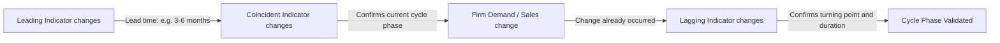

## Barometric and Leading Indicator Methods

### Overview

Barometric and leading indicator methods are qualitative-quantitative hybrid techniques used in demand forecasting that rely on observing variables ("indicators") whose movements precede, coincide with, or follow changes in the variable being forecast (typically demand, sales, or general economic activity). The term "barometric" is borrowed from meteorology, where a barometer predicts weather changes by measuring atmospheric pressure; similarly, a barometric indicator signals impending changes in business/economic conditions before they actually occur.

This method was pioneered by the National Bureau of Economic Research (NBER), notably through the work of Wesley Mitchell and Arthur Burns, who developed systematic indices of leading, coincident, and lagging indicators for business cycle analysis.

### Core Concept

The underlying premise is that economic and business variables do not move in isolation or simultaneously. Some variables systematically change **before** a shift in overall economic activity or specific demand, acting as early warning signals. By tracking these indicators, a firm can forecast turning points in demand — upswings, downswings, recessions, or booms — before they are reflected in actual sales data.

### Classification of Indicators

**Leading Indicators**

These change direction before the reference series (e.g., GDP, industrial production, or firm-specific demand) changes direction. They provide advance signals.

- New orders for durable goods
- Building permits issued
- Stock market indices (e.g., S&P 500)
- Money supply (M2)
- Average weekly hours worked in manufacturing
- Consumer expectations index
- New business formation rate
- Change in inventories relative to sales

**Coincident Indicators**

These move in step with the overall economy or demand, confirming the current phase of the cycle.

- Industrial production index
- Personal income (less transfer payments)
- Manufacturing and trade sales
- Employment levels (non-farm payroll)

**Lagging Indicators**

These change direction after the reference series has already turned, useful for confirming that a change has occurred and estimating its duration.

- Average duration of unemployment
- Commercial and industrial loans outstanding
- Labor cost per unit of output
- Consumer price index (CPI) for services

### The Barometric Technique — Methodology

**Step 1: Identify Relevant Indicators**

Select variables historically correlated with the firm's demand or the broader economic activity relevant to the firm's industry.

**Step 2: Establish Lead-Lag Relationship**

Determine the time lag between the indicator's movement and the corresponding change in the target variable (demand), typically through historical cross-correlation analysis.

**Step 3: Construct a Composite Index**

Rather than relying on a single indicator (which may give false signals), multiple leading indicators are combined into a **Composite Index of Leading Indicators (CLI)**, smoothing out noise and idiosyncratic movements in individual series.

$$CLI_t = \sum_{i=1}^{n} w_i \cdot I_{i,t}$$

Where $w_i$ is the weight assigned to indicator $i$ (often based on its historical forecasting reliability), and $I_{i,t}$ is the standardized value of indicator $i$ at time $t$.

**Step 4: Interpret Turning Points**

A sustained movement (typically three or more consecutive months) in the composite index in one direction signals an impending turning point in demand/economic activity.

**Step 5: Translate Into Demand Forecast**

Once a turning point is anticipated, the firm applies the historically observed lead time (e.g., "leading indicators turn 6 months before sales") to project when and how firm-level demand will shift.

### Diagram: Lead-Lag Relationship

### Diagram: Composite Index and Reference Cycle (svg_diagram)

<svg xmlns="http://www.w3.org/2000/svg" viewBox="0 0 720 380">
<rect x="0" y="0" width="720" height="380" fill="#ffffff" />
<text x="360" y="24" text-anchor="middle" font-size="16" font-weight="bold" fill="#1a1a1a">Leading Indicator vs Actual Demand (svg_diagram)</text>
<line x1="60" y1="320" x2="680" y2="320" stroke="#333" stroke-width="1.5" />
<line x1="60" y1="60" x2="60" y2="320" stroke="#333" stroke-width="1.5" />
<text x="370" y="355" text-anchor="middle" font-size="12" fill="#333">Time (months)</text>
<text x="25" y="190" text-anchor="middle" font-size="12" fill="#333" transform="rotate(-90 25,190)">Index Level</text>

<polyline points="60,220 120,180 180,130 240,100 300,120 360,170 420,230 480,260 540,240 600,190 660,150" fill="none" stroke="`#2563eb`" stroke-width="2.5" />

<text x="640" y="140" font-size="11" fill="`#2563eb`" font-weight="bold">Leading Indicator</text>

<polyline points="60,260 120,240 180,210 240,170 300,140 360,150 420,190 480,240 540,270 600,260 660,220" fill="none" stroke="`#dc2626`" stroke-width="2.5" stroke-dasharray="6,3" />

<text x="500" y="290" font-size="11" fill="`#dc2626`" font-weight="bold">Actual Demand</text>

<line x1="240" y1="60" x2="240" y2="320" stroke="#999" stroke-width="1" stroke-dasharray="3,3" />
<line x1="300" y1="60" x2="300" y2="320" stroke="#999" stroke-width="1" stroke-dasharray="3,3" />
<text x="240" y="75" text-anchor="middle" font-size="10" fill="#666">Peak (Leading)</text>
<text x="300" y="75" text-anchor="middle" font-size="10" fill="#666">Peak (Demand)</text>
<line x1="240" y1="325" x2="300" y2="325" stroke="#16a34a" stroke-width="2" />
<text x="270" y="340" text-anchor="middle" font-size="10" fill="#16a34a">Lead time</text>
</svg>

### Common Barometric Indices Used in Practice

| Index | Publisher | Use |
| --- | --- | --- |
| Composite Index of Leading Economic Indicators (LEI) | The Conference Board (US) | Macro-level business cycle forecasting |
| Purchasing Managers' Index (PMI) | ISM / S&P Global | Manufacturing/services sector demand |
| Consumer Confidence Index | The Conference Board / Various national agencies | Household spending forecasts |
| Index of Industrial Production | Government statistical agencies | Coincident measure of output |
| OECD Composite Leading Indicators | OECD | Cross-country economic turning points |

### Numerical Example

**Scenario**: A construction equipment manufacturer wants to forecast demand 6 months ahead.

**Step 1**: Historical data shows that "new building permits issued" leads equipment sales by approximately 5 months, with a correlation coefficient of $r = 0.82$.

**Step 2**: Building permits index rose from 100 to 118 over the last quarter (an 18% increase).

**Step 3**: Applying the historical elasticity of equipment demand to permits:

$$\%\Delta Demand = \beta \times \%\Delta Permits$$

If regression analysis yields $\beta = 0.65$:

$$\%\Delta Demand = 0.65 \times 18\% = 11.7\%$$

**Step 4**: The firm forecasts an **11.7% increase in equipment demand approximately 5 months from now**, allowing it to adjust production schedules, inventory, and workforce planning in advance.

### Advantages

- **Early warning system**: Provides lead time for strategic and operational adjustments (inventory, capacity, workforce).
- **Objective and data-driven**: Reduces reliance on subjective judgment compared to purely qualitative methods (e.g., expert opinion, jury of executive opinion).
- **Applicable at macro and micro levels**: Can be adapted for economy-wide forecasting or firm/industry-specific demand.
- **Combines multiple signals**: Composite indices reduce the risk of false signals from any single indicator.

### Limitations

- **No guarantee of consistent lead time**: The lag between indicator movement and demand change can vary across cycles. [Inference: lead times are historically observed averages, not fixed constants, and can shift due to structural economic changes.]
- **False signals (false positives)**: An indicator may turn without a corresponding change in demand actually materializing — historically referred to as "false alarms" in NBER literature.
- **Structural breaks**: Relationships between indicators and demand can break down due to technological change, policy shifts, or market disruption (e.g., a pandemic), reducing the reliability of historically-calibrated weights.
- **Does not explain causation**: Barometric methods are correlational, not causal; an indicator may be a proxy for a deeper structural relationship that isn't explicitly modeled.
- **Requires long, reliable time series**: Establishing a stable lead-lag relationship requires substantial historical data, which may not be available for new products or industries.

### Distinguishing From Related Methods

| Method | Basis | Typical Use |
| --- | --- | --- |
| Barometric/Leading Indicator | Statistical lead-lag relationships between indicator and target series | Turning point prediction |
| Time Series (e.g., moving average, exponential smoothing) | Extrapolation of the target series' own historical pattern | Trend/seasonal forecasting |
| Econometric/Regression | Causal/structural relationship between demand and explanatory variables | Quantifying demand drivers |
| Survey/Opinion Poll methods (e.g., consumer intentions survey) | Direct elicitation of stated intentions | Short-term, qualitative insight |

Note: Leading indicator methods are sometimes considered a subset of econometric approaches when formalized via regression, but classically they are treated as a distinct qualitative-quantitative hybrid technique in demand forecasting textbooks.

### Application in Managerial Decision-Making

Managers use barometric methods to:

- Time inventory build-up or drawdown ahead of anticipated demand shifts
- Adjust capital expenditure and capacity planning decisions
- Inform pricing strategy ahead of anticipated demand softening or strengthening
- Support working capital and cash flow planning
- Provide early input into budgeting and sales targets

**Related Topics**

- Survey methods of demand forecasting (consumer intentions, sales force composite, jury of executive opinion)
- Time series analysis and decomposition (trend, seasonal, cyclical, irregular components)
- Econometric/regression-based demand forecasting
- Business cycle theory and turning point analysis
- The Conference Board's Leading Economic Index (LEI) methodology
- Diffusion indices and index of industrial production
- Delphi method and other qualitative forecasting techniques
- Forecast evaluation and error measurement (MAPE, RMSE, Theil's U)