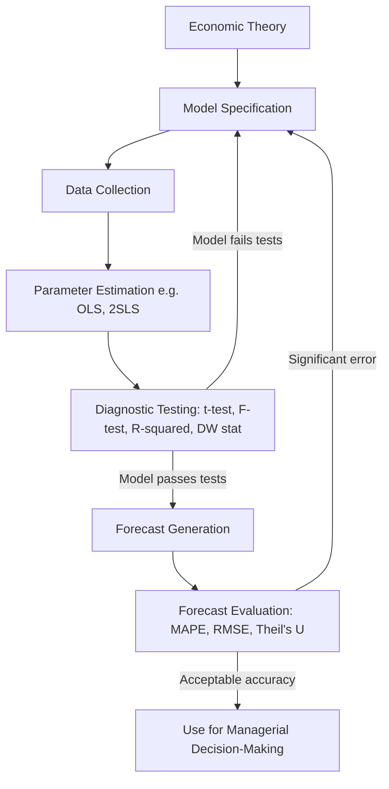

## Econometric Forecasting Models

### Overview

Econometric forecasting models combine economic theory, mathematical formulation, and statistical estimation to predict future values of demand or other economic variables. Unlike barometric methods, which rely on observed lead-lag correlations, econometric models attempt to establish an explicit **causal, structural relationship** between the dependent variable (demand) and one or more independent (explanatory) variables, using historical data to estimate the parameters of that relationship.

### Core Concept

An econometric model expresses demand as a function of its determinants, derived from economic theory (e.g., the law of demand, income effects, cross-price effects), and then statistically estimates the coefficients of that function using techniques such as regression analysis. The estimated model is subsequently used to generate forecasts by plugging in projected/assumed future values of the explanatory variables.

### Types of Econometric Models

**1. Single-Equation Regression Models**

A single dependent variable (demand) is expressed as a function of one or more independent variables.

*Simple (Single-Variable) Regression:*

$$Q_d = a + bP + e$$

Where $Q_d$ is quantity demanded, $P$ is price, $a$ is the intercept, $b$ is the slope coefficient, and $e$ is the stochastic error term.

*Multiple Regression:*

$$Q_d = \beta_0 + \beta_1 P + \beta_2 Y + \beta_3 P_s + \beta_4 A + e$$

Where $Y$ = consumer income, $P_s$ = price of substitute/complementary goods, $A$ = advertising expenditure, and $\beta_i$ are parameters estimated typically via Ordinary Least Squares (OLS).

**2. Simultaneous Equation Models**

Used when demand and supply (or multiple interdependent variables) are determined jointly rather than independently. Since price and quantity are jointly determined in market equilibrium, single-equation OLS estimation can produce biased results (simultaneity bias), requiring specialized techniques.

$$Q_d = a_0 + a_1 P + a_2 Y + e_1 \quad \text{(Demand equation)}$$

$$Q_s = b_0 + b_1 P + b_2 C + e_2 \quad \text{(Supply equation)}$$

$$Q_d = Q_s \quad \text{(Equilibrium condition)}$$

Where $C$ represents cost/input price variables affecting supply.

**3. Time-Series Econometric Models**

Incorporate the variable's own past values and/or time as explanatory factors, often blended with causal variables (dynamic/autoregressive distributed lag models).

$$Q_t = \alpha + \beta_1 Q_{t-1} + \beta_2 P_t + \beta_3 Y_t + e_t$$

### Estimation Methodology — Step by Step

**Step 1: Model Specification**

Identify the functional form (linear, log-linear, semi-log) and the explanatory variables based on economic theory and prior empirical research.

**Step 2: Data Collection**

Gather time-series, cross-sectional, or panel data on the dependent and independent variables.

**Step 3: Parameter Estimation**

Apply an appropriate estimation technique:

- **Ordinary Least Squares (OLS)** — for single-equation models satisfying classical assumptions
- **Two-Stage Least Squares (2SLS)** — for simultaneous equation models
- **Generalized Least Squares (GLS)** — when heteroskedasticity or autocorrelation is present
- **Maximum Likelihood Estimation (MLE)** — for non-linear or limited dependent variable models

**Step 4: Model Verification (Diagnostic Testing)**

- **Statistical significance**: t-tests on individual coefficients, F-test for overall model significance
- **Goodness of fit**: $R^2$ and adjusted $R^2$
- **Autocorrelation**: Durbin-Watson statistic
- **Multicollinearity**: Variance Inflation Factor (VIF)
- **Heteroskedasticity**: Breusch-Pagan or White's test

**Step 5: Forecasting**

Substitute projected/assumed future values of independent variables into the estimated equation to generate point forecasts, often accompanied by confidence intervals.

**Step 6: Forecast Evaluation**

Compare forecasted values against actual outcomes using error metrics (MAPE, RMSE, Theil's U) and revise the model if systematic bias is detected.

### Diagram: Econometric Model-Building Process

### Ordinary Least Squares (OLS) — Estimation Logic

OLS minimizes the sum of squared residuals between observed and predicted values:

$$\min \sum_{i=1}^{n} (Q_i - \hat{Q_i})^2$$

The resulting estimator for a simple regression slope is:

$$\hat{b} = \frac{\sum (P_i - \bar{P})(Q_i - \bar{Q})}{\sum (P_i - \bar{P})^2}$$

**Key Points (Classical OLS Assumptions — Gauss-Markov)**

- Linearity in parameters
- Error term has zero mean: $E(e_i) = 0$
- Homoskedasticity (constant variance of errors)
- No autocorrelation between error terms
- No perfect multicollinearity among independent variables
- Errors are normally distributed (required for hypothesis testing, not for BLUE property itself)

When these assumptions hold, OLS estimators are **BLUE** (Best Linear Unbiased Estimators).

### Numerical Example

**Scenario**: A firm estimates demand for its product using annual data (10 years) with price ($P$, in $) and income ($Y$, in $000s) as explanatory variables.

Estimated regression output:

$$\hat{Q_d} = 500 - 4.2P + 1.8Y$$

$(t\text{-stat}_P = -3.1, \ t\text{-stat}_Y = 2.7, \ R^2 = 0.87)$

**Interpretation**:

- A $1 increase in price reduces quantity demanded by 4.2 units, holding income constant (statistically significant at conventional levels since $|t| > 2$).
- A $1,000 increase in income raises quantity demanded by 1.8 units.
- The model explains 87% of the variation in demand ($R^2 = 0.87$).

**Forecast**: If next year's projected price is $50 and projected income is $60,000 ($Y=60$):

$$\hat{Q_d} = 500 - 4.2(50) + 1.8(60) = 500 - 210 + 108 = 398 \text{ units}$$

### Functional Forms Commonly Used

| Form | Equation | Interpretation of Coefficient |
| --- | --- | --- |
| Linear | $Q = a + bP$ | $b$ = change in $Q$ per unit change in $P$ |
| Log-Linear (Double-Log) | $\ln Q = a + b \ln P$ | $b$ = price elasticity of demand directly |
| Semi-Log | $\ln Q = a + bP$ | $b$ = percentage change in $Q$ per unit change in $P$ |
| Reciprocal | $Q = a + b(1/P)$ | Models asymptotic demand behavior |

The **double-log (log-linear) form** is especially popular in demand estimation because the estimated slope coefficient is directly interpretable as the elasticity:

$$\ln Q_d = \ln a + b \ln P + c \ln Y$$

Here $b$ = price elasticity of demand, $c$ = income elasticity of demand — both constant across all values in this specification.

### Advantages

- **Causal insight**: Explains *why* demand changes, not just *that* it changes, supporting policy and strategic decisions (e.g., pricing, advertising budget allocation).
- **Quantifies elasticities**: Provides direct estimates of price elasticity, income elasticity, and cross-price elasticity, useful for pricing and product-positioning decisions.
- **Scenario/what-if analysis**: Enables forecasting under multiple hypothetical scenarios by varying explanatory variable inputs.
- **Statistically testable**: Allows rigorous hypothesis testing and confidence interval construction, unlike purely judgmental methods.
- **Incorporates multiple determinants simultaneously**: Captures interacting effects of price, income, competitor pricing, advertising, etc.

### Limitations

- **Data-intensive**: Requires sufficiently long and reliable historical data series; unreliable for new products lacking history.
- **Model specification risk**: Omitted variable bias or incorrect functional form can produce misleading estimates.
- **Multicollinearity**: Highly correlated explanatory variables (e.g., income and time trend) can inflate standard errors and destabilize coefficient estimates.
- **Structural stability assumption**: Assumes the estimated relationship remains stable into the forecast period; structural breaks (regulatory change, technological disruption) can invalidate forecasts. [Inference: the degree of instability depends on the specific market and time horizon, and cannot be generalized across all applications.]
- **Requires technical expertise**: Model specification, estimation, and diagnostic interpretation require econometric/statistical proficiency, which may exceed the resources of smaller firms.
- **Simultaneity bias risk**: Using OLS on models where dependent and independent variables are jointly determined (e.g., price and quantity in market equilibrium) yields biased and inconsistent estimates unless corrected via instrumental variables or simultaneous equation techniques.

### Comparison With Other Forecasting Approaches

| Feature | Econometric Models | Barometric/Leading Indicator | Time Series (Naive/Smoothing) | Survey/Opinion Methods |
| --- | --- | --- | --- | --- |
| Basis | Causal/structural theory | Statistical lead-lag correlation | Extrapolation of own past pattern | Direct elicitation of intentions/opinions |
| Data requirement | High (multivariate historical data) | Moderate (indicator + target series) | Moderate (own series only) | Low to moderate |
| Explains causation | Yes | No | No | No |
| Best suited for | Medium-to-long-term, policy analysis | Turning point prediction | Short-term, stable-pattern forecasting | Short-term, new products, qualitative context |
| Technical complexity | High | Moderate | Low to moderate | Low |

### Application in Managerial Decision-Making

- **Pricing strategy**: Estimating price elasticity to guide optimal pricing and predict revenue impact of price changes
- **Sales/budget forecasting**: Projecting demand under different income, competitor pricing, or macroeconomic scenarios
- **Advertising and promotion planning**: Quantifying the marginal impact of advertising expenditure on sales
- **Capacity and investment planning**: Long-term demand projections to guide capital expenditure decisions
- **Policy impact analysis**: Assessing the likely effect of external factors (tax changes, tariffs, regulation) on firm demand

**Related Topics**

- Simple and multiple linear regression analysis
- Simultaneous equation models and two-stage least squares (2SLS)
- Price, income, and cross-price elasticity of demand
- Time series forecasting (moving average, exponential smoothing, ARIMA)
- Barometric and leading indicator methods
- Survey and opinion poll methods of demand forecasting
- Forecast accuracy measurement (MAPE, RMSE, Theil's U)
- Violations of classical linear regression assumptions (heteroskedasticity, autocorrelation, multicollinearity)