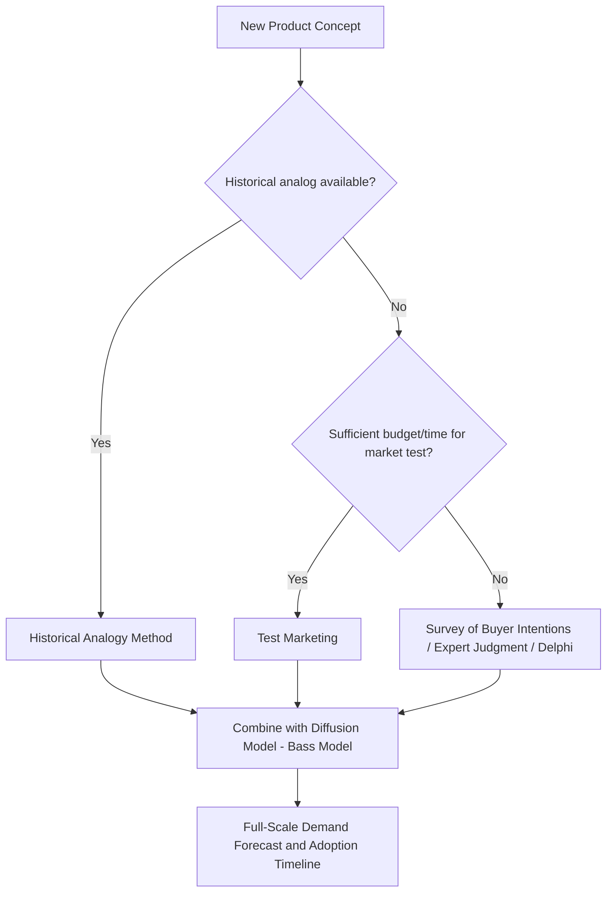

## Forecasting Demand for New Products

### Overview

Forecasting demand for new products presents a unique challenge distinct from forecasting for established products: there is little or no historical sales data to extrapolate from. Consequently, firms must rely on a combination of qualitative judgment, analogous product data, diffusion modeling, and controlled experimentation rather than purely statistical time-series or econometric extrapolation.

### Why New Product Forecasting Differs

| Established Products | New Products |
| --- | --- |
| Rich historical sales data available | Little to no historical data |
| Time-series/econometric methods applicable | Analogy, survey, and judgmental methods dominate |
| Demand pattern relatively stable | Demand pattern uncertain, evolves through adoption stages |
| Market size and structure known | Market size and competitive response often unknown |
| Risk primarily forecast error | Risk includes both forecast error and fundamental product failure |

### Key Approaches

**1. Survey of Buyers' Intentions**

Directly asks potential customers about their likelihood of purchasing the new product, often using a purchase-intention scale.

*Example scale*: "Definitely will buy," "Probably will buy," "Might or might not buy," "Probably will not buy," "Definitely will not buy."

Responses are weighted (e.g., 0.9, 0.6, 0.3, 0.1, 0.0 probabilities) and aggregated to estimate potential demand:

$$Q_{est} = \sum_{i} (N_i \times p_i)$$

Where $N_i$ is the number of respondents in intention category $i$, and $p_i$ is the assigned purchase probability.

**Limitations**: Stated intentions often overstate actual purchase behavior (intention-behavior gap); requires a representative sample of the target market.

**2. Expert/Executive Opinion (Jury of Executive Opinion)**

A panel of internal experts (sales, marketing, R&D, finance) provides independent demand estimates, which are then averaged or reconciled through discussion.

**3. Delphi Method**

A structured, iterative technique in which a panel of experts submits forecasts anonymously through multiple rounds, with aggregated feedback shared between rounds until consensus/convergence is reached. Reduces the dominance of any single strong personality in group forecasting compared to open discussion.

**4. Analogous Product / Historical Analogy Method**

The demand pattern of a similar product previously launched (by the firm or a competitor) is used as a template, adjusted for differences in market size, pricing, positioning, and competitive intensity.

$$Q_{new} = Q_{analog} \times \left(\frac{Market\ Size_{new}}{Market\ Size_{analog}}\right) \times Adjustment\ Factor$$

**Example**: A smartphone manufacturer launching a new mid-range model may use the adoption curve of its previous mid-range launch, adjusted for current market size and competitive landscape.

**5. Test Marketing**

The product is launched in a limited, representative geographic area or customer segment before full-scale launch, and actual sales data are used to extrapolate national/full-market demand.

- **Standard test markets**: Full-scale mini-launch including distribution, pricing, and promotion
- **Controlled test markets**: Conducted through a research firm's panel of stores
- **Simulated test markets**: Consumers exposed to advertising/product in a controlled lab-like environment before purchase intention is measured

**Key Points**

- Provides real behavioral data rather than stated intentions
- Costly and time-consuming; risks alerting competitors
- Results may not scale linearly to full market due to differing regional characteristics

**6. Diffusion Models (Bass Model)**

Formal mathematical models that project the adoption of a new product over time based on the interaction between **innovators** (who adopt independent of others) and **imitators** (who adopt due to social influence/word-of-mouth). The most widely used is the **Bass Diffusion Model**, developed by Frank Bass (1969).

$$f(t) = \frac{[p + q F(t)][1 - F(t)]}{1}$$

Or in its more common cumulative adoption form:

$$\frac{dN(t)}{dt} = \left[p + q \frac{N(t)}{m}\right][m - N(t)]$$

Where:

- $N(t)$ = cumulative number of adopters by time $t$
- $m$ = total market potential
- $p$ = coefficient of innovation (external influence, e.g., advertising)
- $q$ = coefficient of imitation (internal influence, e.g., word-of-mouth)

**Interpretation**:

- $p$ is typically small (0.01–0.03) — reflects the fraction of the remaining market that adopts purely due to external factors like advertising, independent of others' adoption.
- $q$ is typically larger (0.3–0.5) — reflects the fraction of adoption driven by imitation/social contagion.
- The model produces the classic **S-shaped cumulative adoption curve**, with the peak in the rate of new adopters (bell-shaped) occurring at:

$$t^* = \frac{1}{p+q} \ln\left(\frac{q}{p}\right)$$

### Diagram: Bass Diffusion Curve (svg_diagram)

<svg xmlns="http://www.w3.org/2000/svg" viewBox="0 0 720 380">
<rect x="0" y="0" width="720" height="380" fill="#ffffff" />
<text x="360" y="24" text-anchor="middle" font-size="16" font-weight="bold" fill="#1a1a1a">Bass Model: Adoption Rate and Cumulative Adoption (svg_diagram)</text>
<line x1="60" y1="320" x2="680" y2="320" stroke="#333" stroke-width="1.5" />
<line x1="60" y1="50" x2="60" y2="320" stroke="#333" stroke-width="1.5" />
<text x="370" y="355" text-anchor="middle" font-size="12" fill="#333">Time</text>
<text x="25" y="190" text-anchor="middle" font-size="12" fill="#333" transform="rotate(-90 25,190)">Adopters</text>

<path d="M 60 300 Q 200 290, 280 200 Q 340 100, 420 90 Q 500 100, 560 200 Q 620 280, 660 300" fill="none" stroke="`#dc2626`" stroke-width="2.5" />

<text x="440" y="75" font-size="11" fill="`#dc2626`" font-weight="bold">New Adopters per Period (bell curve)</text>

<path d="M 60 310 C 150 305, 250 280, 340 180 C 430 90, 550 65, 660 60" fill="none" stroke="`#2563eb`" stroke-width="2.5" />

<text x="480" y="55" font-size="11" fill="`#2563eb`" font-weight="bold" text-anchor="end">Cumulative Adoption (S-curve)</text>

<line x1="420" y1="60" x2="420" y2="320" stroke="#999" stroke-width="1" stroke-dasharray="3,3" />
<text x="420" y="335" text-anchor="middle" font-size="10" fill="#666">t* (peak adoption rate)</text>
</svg>

### Numerical Example (Bass Model)

**Scenario**: A firm launches a new home appliance with estimated market potential $m = 100,000$ units, $p = 0.02$, $q = 0.35$.

Peak adoption time:

$$t^* = \frac{1}{0.02+0.35} \ln\left(\frac{0.35}{0.02}\right) = \frac{1}{0.37} \ln(17.5) = \frac{2.86}{1} \approx 7.7 \text{ periods}$$

**Interpretation**: The firm should expect the **highest rate of new adoptions around period 7–8** (e.g., months or quarters, depending on the data frequency used to estimate $p$ and $q$), informing production ramp-up and inventory planning timelines. [Inference: actual timing may shift due to competitive entry, pricing changes, or supply constraints not captured in the base model.]

### Diagram: New Product Forecasting Decision Process

### Adjustment Factors Commonly Applied

- **Awareness rate**: Percentage of target market aware of the product
- **Distribution/availability rate**: Percentage of retail outlets or channels carrying the product
- **Trial rate**: Percentage of aware consumers who try the product
- **Repeat purchase rate**: Percentage of triers who become repeat buyers (critical for non-durable/FMCG products)

$$Q_{forecast} = Market\ Size \times Awareness\ Rate \times Trial\ Rate \times Repeat\ Rate \times Purchase\ Frequency$$

**Example**: For a new packaged food product with a target market of 5,000,000 households, 60% awareness, 20% trial rate among aware households, 40% repeat rate, and average annual purchase frequency of 6 units:

$$Q = 5{,}000{,}000 \times 0.60 \times 0.20 \times 0.40 \times 6 = 1{,}440{,}000 \text{ units annually}$$

### Advantages of New Product Forecasting Methods

- **Bass/diffusion models** provide a theoretically grounded S-curve pattern validated across many product categories historically.
- **Test marketing** provides real behavioral data, reducing reliance on potentially unreliable stated intentions.
- **Analogous forecasting** leverages existing organizational knowledge and reduces forecasting cost/time versus full market tests.
- **Combining methods** (triangulation) reduces the risk associated with any single method's blind spots.

### Limitations

- **High inherent uncertainty**: No amount of methodological rigor eliminates the fundamental uncertainty of predicting behavior toward an unproven product.
- **Bass model parameter estimation difficulty**: Without any historical data on the specific product, $p$ and $q$ must be borrowed from analogous products or industry benchmarks, introducing estimation error. [Inference: parameter transferability across categories is a documented practice but its accuracy varies by product category and is not guaranteed.]
- **Test market risks**: Costly, slow, and may alert competitors to the launch, potentially prompting preemptive competitive responses; regional test results may not generalize nationally/globally.
- **Survey intention-behavior gap**: Consumers often overstate purchase likelihood in surveys ("intention inflation"), requiring calibration/discounting factors based on historical validation studies.
- **Rapidly evolving markets**: In fast-moving technology categories, benchmarks from older analogous products may not hold given evolving consumer adoption speeds.

### Application in Managerial Decision-Making

- **Production planning**: Determines initial production runs and capacity ramp-up schedules aligned with the expected adoption curve
- **Marketing budget allocation**: Diffusion parameters guide the balance between advertising spend (boosting $p$) and word-of-mouth/referral programs (leveraging $q$)
- **Financial planning**: Revenue projections for business case development, break-even analysis, and investment approval
- **Inventory and supply chain**: Avoids costly stockouts (undersupply during high-growth phase) or excess inventory (oversupply if adoption is slower than forecast)
- **Go/no-go launch decisions**: Early-stage forecasts inform whether to proceed with full-scale launch, pilot further, or abandon the product

**Related Topics**

- Bass Diffusion Model parameter estimation techniques
- Test marketing design and controlled experiments
- Delphi method and jury of executive opinion
- Survey methods and buyer intention scales
- Product life cycle theory and stages of adoption (innovators, early adopters, early/late majority, laggards)
- Barometric and leading indicator methods
- Econometric forecasting models
- Forecast accuracy measurement for new products