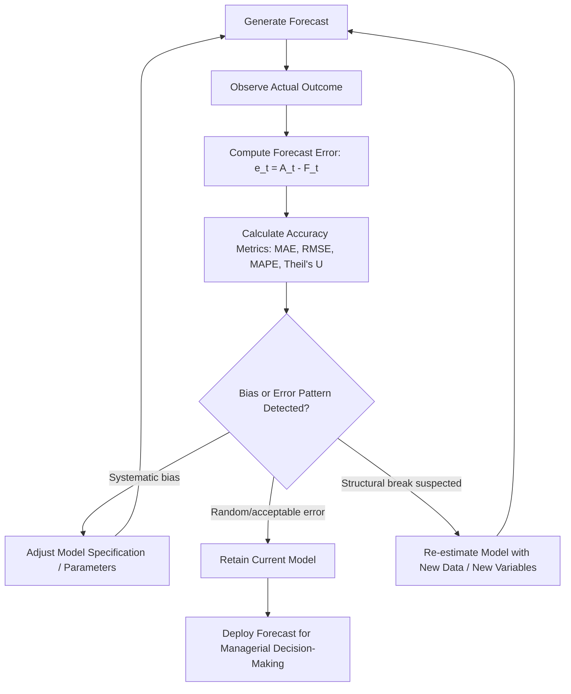

## Evaluating and Improving Forecast Accuracy

### Overview

Forecast accuracy evaluation is the systematic process of measuring how closely predicted values match actual observed outcomes, and using that measurement to diagnose weaknesses and refine forecasting methods. No forecasting technique is perfectly accurate; the objective is not to eliminate error entirely but to **minimize, understand, and manage** it so that managerial decisions (inventory, pricing, capacity, budgeting) are made with an appropriate margin of confidence.

### Why Forecast Accuracy Matters

- **Resource allocation**: Overestimation leads to excess inventory, wasted capacity, and tied-up capital; underestimation leads to stockouts, lost sales, and customer dissatisfaction.
- **Financial planning**: Revenue and budget projections depend directly on demand forecast reliability.
- **Strategic credibility**: Poor forecast accuracy undermines confidence in planning processes across the organization.
- **Continuous improvement**: Accuracy evaluation provides the feedback loop necessary to refine model specification, parameters, and method choice over time.

### Sources of Forecast Error

| Source | Description |
| --- | --- |
| Model specification error | Wrong functional form or omitted relevant variables |
| Parameter estimation error | Sampling error in estimated coefficients from historical data |
| Data quality issues | Measurement error, missing data, outliers |
| Structural change | Market conditions shift (regulation, technology, competition) after model estimation |
| Random/irreducible variation | Inherent stochastic noise that cannot be forecast by any model |
| Human/judgmental bias | Overoptimism, anchoring, political pressure to inflate or deflate forecasts |

### Forecast Error Definition

For a single forecast period:

$$e_t = A_t - F_t$$

Where $A_t$ is the actual value and $F_t$ is the forecasted value at time $t$. A positive $e_t$ indicates underforecasting; a negative $e_t$ indicates overforecasting.

### Key Accuracy Metrics

**1. Mean Error (ME) / Bias**

$$ME = \frac{1}{n}\sum_{t=1}^{n} (A_t - F_t)$$

Indicates systematic bias (consistent over- or under-forecasting). A well-calibrated model should have $ME \approx 0$; positive and negative errors offsetting is a limitation of this metric alone since large opposite errors can cancel out.

**2. Mean Absolute Error (MAE)**

$$MAE = \frac{1}{n}\sum_{t=1}^{n} |A_t - F_t|$$

Measures average magnitude of error regardless of direction, expressed in the same units as the original data.

**3. Mean Squared Error (MSE) and Root Mean Squared Error (RMSE)**

$$MSE = \frac{1}{n}\sum_{t=1}^{n} (A_t - F_t)^2 \qquad RMSE = \sqrt{MSE}$$

Squaring penalizes large errors disproportionately, making RMSE more sensitive to outliers than MAE. RMSE is expressed in original units, aiding interpretability.

**4. Mean Absolute Percentage Error (MAPE)**

$$MAPE = \frac{100}{n}\sum_{t=1}^{n} \left|\frac{A_t - F_t}{A_t}\right|$$

Expresses error as a percentage, allowing comparison across products/series of different scales. Widely used in business forecasting reports.

**Limitation**: Undefined or distorted when $A_t = 0$ or close to zero; asymmetric penalty (penalizes overforecasting more heavily than underforecasting in percentage terms for bounded series).

**5. Theil's U Statistic (Inequality Coefficient)**

Compares the forecasting model's performance against a naive (no-change) forecast benchmark:

$$U = \frac{\sqrt{\frac{1}{n}\sum (F_t - A_t)^2}}{\sqrt{\frac{1}{n}\sum A_t^2} + \sqrt{\frac{1}{n}\sum F_t^2}}$$

- $U = 0$: perfect forecast
- $U = 1$: forecast as poor as a naive/no-change model
- $U > 1$: forecast performs worse than simply assuming no change

**6. Symmetric MAPE (sMAPE)**

$$sMAPE = \frac{100}{n}\sum_{t=1}^{n} \frac{|A_t - F_t|}{(|A_t| + |F_t|)/2}$$

Addresses MAPE's asymmetry issue by using the average of actual and forecast values in the denominator.

### Diagram: Forecast Error Evaluation Workflow

### Numerical Example

A firm's monthly demand forecasts versus actuals over 5 months:

| Month | Actual ($A_t$) | Forecast ($F_t$) | Error ($e_t$) | $\|e_t\|$ | $e_t^2$ | $\|e_t/A_t\|$ |
| --- | --- | --- | --- | --- | --- | --- |
| 1 | 500 | 480 | 20 | 20 | 400 | 4.0% |
| 2 | 520 | 510 | 10 | 10 | 100 | 1.9% |
| 3 | 490 | 530 | -40 | 40 | 1,600 | 8.2% |
| 4 | 550 | 540 | 10 | 10 | 100 | 1.8% |
| 5 | 530 | 500 | 30 | 30 | 900 | 5.7% |

$$ME = \frac{20+10-40+10+30}{5} = \frac{30}{5} = 6 \text{ units (slight underforecasting bias)}$$

$$MAE = \frac{20+10+40+10+30}{5} = \frac{110}{5} = 22 \text{ units}$$

$$RMSE = \sqrt{\frac{400+100+1600+100+900}{5}} = \sqrt{\frac{3100}{5}} = \sqrt{620} \approx 24.9 \text{ units}$$

$$MAPE = \frac{4.0+1.9+8.2+1.8+5.7}{5} = \frac{21.6}{5} = 4.32\%$$

**Interpretation**: The model shows a slight positive bias (average underforecast of 6 units) and an average absolute percentage error of 4.32%, generally considered a reasonably accurate forecast for most business planning purposes, though Month 3's error (8.2%) warrants investigation as a potential outlier or missed explanatory factor.

### Diagnostic Techniques for Improving Accuracy

**1. Residual Analysis**

Plotting forecast errors over time to detect:

- **Trend in residuals**: Suggests the model is missing a trend component
- **Cyclical pattern in residuals**: Suggests missing seasonal or cyclical variables
- **Increasing error variance over time**: Suggests heteroskedasticity, possibly requiring a different functional form (e.g., log transformation)

**2. Tracking Signal**

Monitors cumulative bias relative to absolute error, used to trigger review when a forecast becomes systematically biased:

$$TS = \frac{\sum (A_t - F_t)}{MAD}$$

Where $MAD$ (Mean Absolute Deviation) is typically computed as a running average. A tracking signal exceeding a control limit (commonly ±4) signals the forecasting model requires review.

**3. Backtesting / Holdout Validation**

Splitting historical data into a training period (to estimate the model) and a holdout period (to test forecast accuracy on data not used in estimation), simulating real-world forecasting conditions.

**4. Rolling/Walk-Forward Validation**

Repeatedly re-estimating the model as new data becomes available and testing one-step-ahead forecasts, providing a more robust accuracy assessment across multiple time periods than a single train/test split.

**5. Combining Forecasts (Forecast Combination/Ensemble)**

Averaging or weighting forecasts from multiple independent methods (e.g., econometric + time series + judgmental) often outperforms any single method individually, since errors from different methods are frequently uncorrelated and partially offset.

$$F_{combined} = w_1 F_1 + w_2 F_2 + ... + w_n F_n \quad \text{where} \sum w_i = 1$$

**Key Points**

- Simple averages of multiple methods often perform surprisingly well compared to complex optimal-weighting schemes. [Inference: this finding, often referred to as the "forecast combination puzzle" in the forecasting literature, is well-documented empirically but the degree of benefit varies by application.]
- Combination reduces variance of the forecast error, particularly when underlying methods have different, non-overlapping sources of error.

**6. Judgmental Adjustment / Human Override**

Forecasters may adjust statistical outputs based on qualitative knowledge (e.g., an upcoming promotion, a known supply disruption) not captured by the model — but such overrides should themselves be tracked and evaluated for accuracy to prevent the introduction of systematic bias.

### Common Pitfalls Undermining Forecast Accuracy

- **Overfitting**: Excessively complex models fit historical data well but generalize poorly to future periods.
- **Ignoring structural breaks**: Continuing to apply a model whose underlying relationships have shifted (e.g., post-recession consumer behavior changes).
- **Confirmation bias in judgmental forecasting**: Forecasters unconsciously adjusting figures toward previously stated targets or expectations.
- **Political/incentive-driven bias**: Sales teams or executives intentionally skewing forecasts to influence budget allocation or performance targets ("sandbagging" or "hockey-stick" forecasting).
- **Neglecting outliers/special events**: Failing to flag one-time events (e.g., a stockout, a natural disaster, a one-off bulk order) that distort the historical baseline used for future forecasts.

### Improvement Framework — Summary Process

**Step 1**: Establish a systematic, regular measurement cadence (e.g., monthly comparison of forecast vs. actual)

**Step 2**: Track multiple complementary metrics (bias via ME, magnitude via MAE/RMSE, relative performance via MAPE/Theil's U)

**Step 3**: Investigate root causes of large errors via residual analysis and tracking signals

**Step 4**: Test model refinements using holdout/backtesting validation before full deployment

**Step 5**: Consider forecast combination across multiple independent methods

**Step 6**: Institutionalize a feedback loop connecting forecast errors back into the model review and re-estimation cycle

### Application in Managerial Decision-Making

- **Safety stock determination**: Forecast error variability (e.g., RMSE or MAD) directly informs the safety stock buffer needed to maintain target service levels in inventory management.
- **Performance evaluation of forecasting teams/processes**: Metrics like MAPE provide objective benchmarks for evaluating forecasting function effectiveness.
- **Method selection**: Comparative accuracy across methods (econometric vs. time series vs. judgmental) guides which technique(s) to institutionalize for a given product or market.
- **Confidence interval communication**: Presenting forecasts with associated error bands (rather than single-point estimates) improves risk-aware decision-making among stakeholders.
- **Continuous process improvement**: Regular accuracy review embeds forecasting as an iterative, self-correcting managerial process rather than a one-time exercise.

**Related Topics**

- Time series decomposition and smoothing techniques
- Econometric forecasting models
- Barometric and leading indicator methods
- Forecasting demand for new products
- Safety stock and inventory control under demand uncertainty
- Bias and heuristics in managerial judgment and decision-making
- Statistical hypothesis testing and confidence intervals