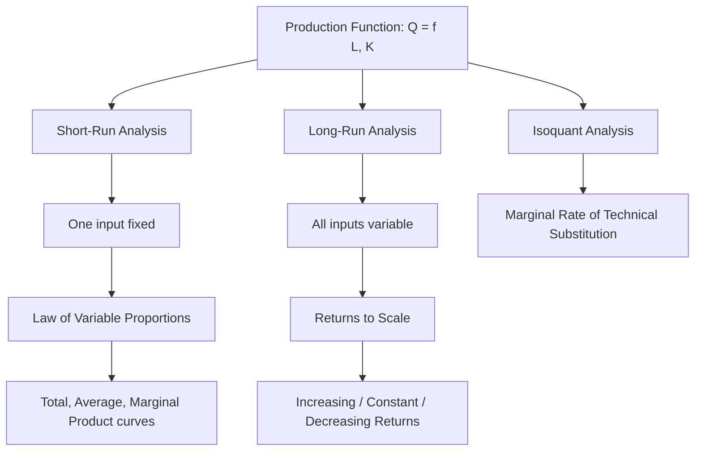

## Production Function Concepts and Assumptions

### Overview

A production function is a mathematical/technical expression describing the relationship between the quantities of inputs (factors of production) used by a firm and the maximum quantity of output that can be produced from those inputs, given the existing state of technology. It represents the **technological constraint** facing a firm, independent of input prices or cost considerations, and forms the foundation for subsequent analysis of costs, productivity, and optimal resource allocation in managerial economics.

### General Form

$$Q = f(L, K, M, T, ...)$$

Where:

- $Q$ = quantity of output
- $L$ = labor input
- $K$ = capital input
- $M$ = raw materials/other inputs
- $T$ = level of technology (often held constant within a given production function)

In simplified two-input analysis, commonly used for pedagogical and graphical purposes:

$$Q = f(L, K)$$

### Core Assumptions of the Production Function

**1. Given State of Technology**

The production function is defined for a specific, fixed level of technology. Any technological change (innovation, process improvement) results in a **new** production function, typically shifting output upward for the same input combination, rather than a movement along the existing function.

**2. Efficient Input Utilization**

The function represents the **maximum** output obtainable from a given combination of inputs — i.e., technical efficiency is assumed. Any output below this maximum for given inputs is considered technically inefficient and outside the scope of the production function itself.

**3. Divisibility of Inputs and Outputs**

Inputs and outputs are assumed to be divisible into small units, allowing continuous (rather than discrete/step) variation, which permits the use of calculus-based marginal analysis.

**4. Inputs Are Substitutable (to a Degree)**

Within limits, inputs can be substituted for one another while maintaining the same output level (reflected in the shape of isoquants), although the degree of substitutability varies by production process and input pair.

**5. Short-Run vs. Long-Run Distinction**

- **Short Run**: At least one input is fixed (typically capital/plant size), while others (typically labor) are variable. Analysis of the short-run production function centers on the **Law of Variable Proportions**.
- **Long Run**: All inputs are variable, allowing analysis of **returns to scale** — how output responds to proportional changes in all inputs simultaneously.

**6. Time Period Held Implicit**

The function does not explicitly specify the time required to produce output; it is generally treated as a flow relationship over a defined period.

### Key Production Function Forms

**1. Linear Production Function**

$$Q = a + bL + cK$$

Assumes constant marginal products and perfect substitutability between inputs at a fixed rate — rarely realistic but useful as a simplified baseline.

**2. Cobb-Douglas Production Function**

The most widely used functional form in managerial and empirical economics:

$$Q = A L^{\alpha} K^{\beta}$$

Where $A$ is total factor productivity (technology parameter), and $\alpha, \beta$ are output elasticities of labor and capital, respectively.

**Key Points**

- If $\alpha + \beta = 1$: constant returns to scale
- If $\alpha + \beta > 1$: increasing returns to scale
- If $\alpha + \beta < 1$: decreasing returns to scale
- $\alpha$ and $\beta$ represent the percentage change in output resulting from a 1% change in labor or capital, respectively (output elasticities)
- Exhibits diminishing marginal returns to each individual input when held with the other fixed, consistent with the Law of Variable Proportions

**3. Leontief (Fixed-Proportions) Production Function**

$$Q = \min\left(\frac{L}{a}, \frac{K}{b}\right)$$

Assumes inputs must be combined in fixed, non-substitutable proportions (e.g., one driver per truck) — output is constrained by whichever input is relatively scarcer.

**4. Constant Elasticity of Substitution (CES) Production Function**

$$Q = A\left[\delta L^{-\rho} + (1-\delta)K^{-\rho}\right]^{-1/\rho}$$

A more general functional form nesting Cobb-Douglas, Leontief, and linear forms as special/limiting cases, allowing the elasticity of substitution between inputs to take any constant value (rather than being fixed at 1, as in Cobb-Douglas).

### Diagram: Production Function Relationships

### Total, Average, and Marginal Product

Given the short-run production function $Q = f(L)$ with capital fixed:

**Total Product (TP)**: $TP = Q = f(L)$ — total output produced by a given quantity of the variable input.

**Average Product (AP)**:

$$AP_L = \frac{TP}{L} = \frac{Q}{L}$$

**Marginal Product (MP)**:

$$MP_L = \frac{\Delta TP}{\Delta L} = \frac{dQ}{dL}$$

### Diagram: TP, AP, MP Curves (svg_diagram)

<svg xmlns="http://www.w3.org/2000/svg" viewBox="0 0 720 400">
<rect x="0" y="0" width="720" height="400" fill="#ffffff" />
<text x="360" y="24" text-anchor="middle" font-size="16" font-weight="bold" fill="#1a1a1a">Total, Average, and Marginal Product Curves (svg_diagram)</text>
<line x1="60" y1="340" x2="680" y2="340" stroke="#333" stroke-width="1.5" />
<line x1="60" y1="50" x2="60" y2="340" stroke="#333" stroke-width="1.5" />
<text x="370" y="375" text-anchor="middle" font-size="12" fill="#333">Labor (L)</text>
<text x="25" y="200" text-anchor="middle" font-size="12" fill="#333" transform="rotate(-90 25,200)">Output</text>

<path d="M 60 335 C 150 250, 250 130, 380 100 C 480 85, 580 110, 660 180" fill="none" stroke="`#2563eb`" stroke-width="2.5" />

<text x="500" y="90" font-size="11" fill="`#2563eb`" font-weight="bold">TP (Total Product)</text>

<path d="M 60 300 C 150 200, 250 175, 340 175 C 450 175, 550 230, 660 320" fill="none" stroke="`#16a34a`" stroke-width="2.5" />

<text x="420" y="200" font-size="11" fill="`#16a34a`" font-weight="bold">AP (Average Product)</text>

<path d="M 60 260 C 130 150, 220 140, 280 175 C 380 230, 480 300, 560 335 C 600 350, 630 355, 660 360" fill="none" stroke="`#dc2626`" stroke-width="2.5" />

<text x="180" y="130" font-size="11" fill="`#dc2626`" font-weight="bold">MP (Marginal Product)</text>

<line x1="340" y1="50" x2="340" y2="340" stroke="#999" stroke-width="1" stroke-dasharray="3,3" />
<text x="340" y="360" text-anchor="middle" font-size="9" fill="#666">MP = AP (AP max)</text>
<line x1="380" y1="50" x2="380" y2="340" stroke="#999" stroke-width="1" stroke-dasharray="3,3" />
<text x="380" y="45" text-anchor="middle" font-size="9" fill="#666">TP max (MP=0)</text>
</svg>

### Three Stages of Production (Law of Variable Proportions)

| Stage | MP behavior | AP behavior | TP behavior | Rational to operate? |
| --- | --- | --- | --- | --- |
| Stage I | MP rising, MP > AP | AP rising | TP rising at increasing then decreasing rate | No — underutilizes fixed input |
| Stage II | MP falling but positive, MP < AP | AP falling | TP still rising, at a decreasing rate | Yes — economically rational zone |
| Stage III | MP negative | AP falling | TP falling | No — variable input overused, reduces output |

**Key Points**

- Rational firms operate in **Stage II**, where marginal product is positive but diminishing.
- Stage I is avoided because the fixed input is underutilized (adding more variable input is still highly productive, so stopping here forgoes profitable output).
- Stage III is avoided because marginal product turns negative — adding more of the variable input actually reduces total output.
- The exact boundary between rational and irrational stages ultimately also depends on relative input prices, which is analyzed via cost minimization/least-cost combination, building on the purely technical relationships described here.

### Numerical Example

Given the short-run production data (capital fixed at $K=10$):

| Labor ($L$) | Total Product ($TP$) | $MP_L$ | $AP_L$ |
| --- | --- | --- | --- |
| 1 | 10 | — | 10.0 |
| 2 | 22 | 12 | 11.0 |
| 3 | 36 | 14 | 12.0 |
| 4 | 48 | 12 | 12.0 |
| 5 | 58 | 10 | 11.6 |
| 6 | 64 | 6 | 10.7 |
| 7 | 63 | -1 | 9.0 |

**Interpretation**:

- Between $L=1$ and $L=3$: MP is increasing (Stage I) — increasing returns to the variable input.
- At $L=4$: $MP_L = AP_L = 12$, marking the boundary between Stage I and Stage II (AP is at its maximum).
- Between $L=4$ and $L=6$: MP is positive but declining (Stage II) — diminishing marginal returns, the economically rational operating zone.
- At $L=7$: $MP_L = -1$ (negative), TP declines from 64 to 63 (Stage III) — the firm should not add a 7th worker.

### Isoquants and Input Substitution

An **isoquant** represents all combinations of two inputs (e.g., $L$ and $K$) that yield the same level of output, analogous to an indifference curve in consumer theory.

$$Q_0 = f(L, K) = \text{constant}$$

**Marginal Rate of Technical Substitution (MRTS)**: the rate at which one input can be substituted for another while holding output constant, equal to the slope of the isoquant:

$$MRTS_{LK} = -\frac{\Delta K}{\Delta L} = \frac{MP_L}{MP_K}$$

**Key Points**

- Isoquants are typically convex to the origin, reflecting a diminishing MRTS — as more labor is substituted for capital, progressively less capital can be given up per additional unit of labor while holding output constant.
- Isoquants further from the origin represent higher output levels.
- Isoquants for a given production function never intersect, consistent with each representing a distinct, well-defined output level.

### Returns to Scale (Long-Run Property)

When **all** inputs are increased proportionally by a factor $\lambda$:

$$f(\lambda L, \lambda K) \; \text{compared to} \; \lambda \cdot f(L,K)$$

| Condition | Classification |
| --- | --- |
| $f(\lambda L, \lambda K) = \lambda \cdot Q$ | Constant returns to scale |
| $f(\lambda L, \lambda K) > \lambda \cdot Q$ | Increasing returns to scale |
| $f(\lambda L, \lambda K) < \lambda \cdot Q$ | Decreasing returns to scale |

**Example**: For $Q = L^{0.6}K^{0.5}$, doubling both inputs ($\lambda = 2$):

$$f(2L, 2K) = (2L)^{0.6}(2K)^{0.5} = 2^{0.6+0.5} L^{0.6}K^{0.5} = 2^{1.1} \cdot Q \approx 2.14Q$$

Since $2.14Q > 2Q$, this function exhibits **increasing returns to scale**.

### Distinguishing the Law of Variable Proportions From Returns to Scale

| Aspect | Law of Variable Proportions | Returns to Scale |
| --- | --- | --- |
| Time frame | Short run | Long run |
| Inputs varied | Only one input varied, others fixed | All inputs varied proportionally |
| Explains | Shape of TP/AP/MP curves for one variable input | How output responds to overall firm size change |
| Underlying cause | Changing input proportions/ratios | Economies/diseconomies of scale (specialization, managerial efficiency, indivisibilities) |

### Limitations and Real-World Considerations

- **Static technology assumption**: Actual firms face continuous, often unpredictable technological change, meaning the "production function" is a moving target in practice rather than a fixed relationship. [Inference: the rate at which a given production function becomes obsolete varies substantially across industries and cannot be generalized.]
- **Measurement difficulty**: Precisely quantifying capital and labor inputs (especially heterogeneous capital or skill-differentiated labor) in empirical estimation is methodologically challenging.
- **Assumes technical efficiency**: Real firms may operate below their theoretical production frontier due to organizational, managerial, or informational inefficiencies (addressed separately in the concept of X-efficiency).
- **Simplification of input categories**: Aggregating diverse inputs (e.g., many types of labor or capital) into single variables like $L$ and $K$ necessarily abstracts from real heterogeneity.

### Application in Managerial Decision-Making

- **Input combination decisions**: Understanding MRTS and isoquants guides cost-minimizing input selection given relative factor prices.
- **Short-run hiring/staffing decisions**: The Law of Variable Proportions informs how many workers to add to a fixed plant/equipment base before diminishing returns erode profitability.
- **Long-run capacity planning and plant sizing**: Returns to scale analysis informs decisions on optimal firm/plant size and expansion strategy.
- **Technology adoption evaluation**: Comparing production functions before and after a proposed technological upgrade quantifies expected productivity gains.
- **Outsourcing and make-vs-buy decisions**: Production function analysis clarifies the technical feasibility and efficiency implications of in-house production versus external sourcing.

**Related Topics**

- Law of Variable Proportions (Law of Diminishing Marginal Returns)
- Isoquants, isocosts, and least-cost input combination
- Returns to scale and economies/diseconomies of scale
- Cobb-Douglas production function estimation
- Short-run and long-run cost curves
- Marginal productivity theory of factor pricing
- Total, average, and marginal product relationships