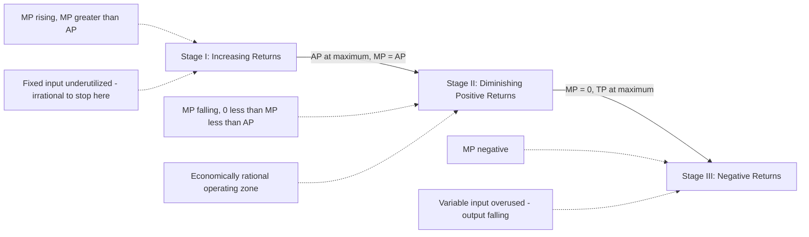

## Short-Run Production and the Law of Variable Proportions

### Overview

The Law of Variable Proportions describes how output changes as varying quantities of one input (typically labor) are combined with a fixed quantity of another input (typically capital or land) in the short run. It is one of the most fundamental laws in production theory, explaining why total, average, and marginal product curves take their characteristic shapes, and providing the technical foundation for short-run cost curve behavior.

### Definition

**Law of Variable Proportions**: As successive units of a variable input are added to a fixed input, holding technology constant, the marginal product of the variable input initially increases, reaches a maximum, and then eventually declines — and may ultimately become negative.

This law is also historically known as the **Law of Diminishing Marginal Returns**, though the "variable proportions" terminology emphasizes that the law describes the effect of a *changing ratio* between fixed and variable inputs, rather than diminishing returns being a universal, unconditional phenomenon.

### Assumptions Underlying the Law

- **Short run**: At least one factor of production (commonly capital/plant size) is fixed; only one input (commonly labor) varies.
- **Constant technology**: No technological change occurs during the analysis period.
- **Homogeneous units of variable input**: Each additional unit of labor is equally skilled/efficient.
- **Possibility of varying input proportions**: Inputs are not required to be combined in strictly fixed proportions (rules out the Leontief/fixed-proportions case).
- **Short enough time horizon**: The fixed input genuinely cannot be adjusted within the period under consideration.

### The Three Stages of Production

**Stage I — Increasing Returns**

As the first units of the variable input are added, the fixed input is underutilized relative to the variable input. Additional workers allow better specialization, division of labor, and fuller use of fixed capacity, so marginal product rises.

- $MP_L$ is rising and $MP_L > AP_L$, pulling $AP_L$ upward
- Ends when $AP_L$ reaches its maximum (at the point $MP_L = AP_L$)

**Stage II — Diminishing (but Positive) Returns**

Beyond a certain point, each additional unit of the variable input has progressively less fixed input to work with, so marginal product begins to decline, though it remains positive — total product continues to rise, but at a decreasing rate.

- $MP_L$ is falling but still positive, and $MP_L < AP_L$, pulling $AP_L$ downward
- Ends when $MP_L = 0$ (total product reaches its maximum)

**Stage III — Negative Returns**

Beyond the point where the fixed input becomes severely overcrowded by the variable input, additional units of the variable input actually interfere with production (overcrowding, coordination problems), causing total product to decline.

- $MP_L$ is negative
- $AP_L$ continues to fall but remains positive (since $TP$ is still positive, just declining)

### Diagram: Three Stages of Production

### Mathematical Relationships

Given $TP = f(L)$ with capital fixed:

$$MP_L = \frac{d(TP)}{dL} \qquad AP_L = \frac{TP}{L}$$

**Relationship between AP and MP**:

$$\frac{d(AP_L)}{dL} = \frac{MP_L - AP_L}{L}$$

This shows:

- If $MP_L > AP_L$, then $AP_L$ is rising
- If $MP_L < AP_L$, then $AP_L$ is falling
- If $MP_L = AP_L$, then $AP_L$ is at its maximum (turning point) — **MP curve always intersects AP curve at AP's peak**

**Relationship between TP and MP**:

$$MP_L = \frac{d(TP)}{dL}$$

- When $MP_L > 0$: $TP$ is rising
- When $MP_L = 0$: $TP$ is at its maximum
- When $MP_L < 0$: $TP$ is falling

### Diagram: Geometric Relationship Between TP, AP, and MP (svg_diagram)

<svg xmlns="http://www.w3.org/2000/svg" viewBox="0 0 720 420">
<rect x="0" y="0" width="720" height="420" fill="#ffffff" />
<text x="360" y="24" text-anchor="middle" font-size="16" font-weight="bold" fill="#1a1a1a">Three Stages of Production (svg_diagram)</text>
<line x1="60" y1="200" x2="680" y2="200" stroke="#333" stroke-width="1" />
<line x1="60" y1="50" x2="60" y2="200" stroke="#333" stroke-width="1.5" />
<text x="25" y="130" text-anchor="middle" font-size="11" fill="#333" transform="rotate(-90 25,130)">TP</text>

<path d="M 60 195 C 150 100, 250 55, 380 45 C 480 40, 580 60, 660 120" fill="none" stroke="`#2563eb`" stroke-width="2.5" />

<text x="450" y="40" font-size="11" fill="`#2563eb`" font-weight="bold">Total Product (TP)</text>

<line x1="60" y1="380" x2="680" y2="380" stroke="#333" stroke-width="1.5" />
<line x1="60" y1="230" x2="60" y2="380" stroke="#333" stroke-width="1.5" />
<text x="25" y="310" text-anchor="middle" font-size="11" fill="#333" transform="rotate(-90 25,310)">AP, MP</text>
<text x="370" y="405" text-anchor="middle" font-size="12" fill="#333">Labor (L)</text>

<path d="M 60 340 C 150 260, 250 245, 340 245 C 450 245, 550 290, 660 370" fill="none" stroke="`#16a34a`" stroke-width="2.5" />

<text x="500" y="260" font-size="11" fill="`#16a34a`" font-weight="bold">AP</text>

<path d="M 60 300 C 130 220, 220 210, 280 245 C 380 295, 480 350, 560 378 C 600 385, 620 385, 660 385" fill="none" stroke="`#dc2626`" stroke-width="2.5" />

<text x="180" y="205" font-size="11" fill="`#dc2626`" font-weight="bold">MP</text>

<line x1="340" y1="50" x2="340" y2="380" stroke="#999" stroke-width="1" stroke-dasharray="4,3" />
<text x="340" y="400" text-anchor="middle" font-size="9" fill="#666">Stage I / II boundary (MP=AP)</text>
<line x1="380" y1="50" x2="380" y2="380" stroke="#999" stroke-width="1" stroke-dasharray="4,3" />
<text x="490" y="415" text-anchor="middle" font-size="9" fill="#666">Stage II / III boundary (MP=0, TP max)</text>
<rect x="60" y="30" width="280" height="14" fill="#dbeafe" opacity="0.5" />
<text x="200" y="40" text-anchor="middle" font-size="9" fill="#1e40af">Stage I</text>
<rect x="340" y="30" width="40" height="14" fill="#dcfce7" opacity="0.5" />
<rect x="380" y="30" width="280" height="14" fill="#dcfce7" opacity="0.5" />
<text x="520" y="40" text-anchor="middle" font-size="9" fill="#166534">Stage II</text>
<rect x="380" y="196" width="280" height="0" fill="none" />
</svg>

### Numerical Example

A furniture manufacturer has fixed capital (one workshop with fixed machinery). Labor is varied:

| Labor ($L$) | $TP$ | $MP_L$ | $AP_L$ | Stage |
| --- | --- | --- | --- | --- |
| 0 | 0 | — | — | — |
| 1 | 8 | 8 | 8.0 | I |
| 2 | 20 | 12 | 10.0 | I |
| 3 | 33 | 13 | 11.0 | I |
| 4 | 44 | 11 | 11.0 | I/II boundary |
| 5 | 53 | 9 | 10.6 | II |
| 6 | 60 | 7 | 10.0 | II |
| 7 | 63 | 3 | 9.0 | II |
| 8 | 63 | 0 | 7.9 | II/III boundary |
| 9 | 60 | -3 | 6.7 | III |

**Interpretation**:

- From $L=1$ to $L=4$: MP is rising (Stage I); at $L=4$, $MP_L = AP_L = 11$, the peak of the AP curve.
- From $L=4$ to $L=8$: MP is positive but declining (Stage II); at $L=8$, $MP_L = 0$ and $TP$ reaches its maximum of 63.
- From $L=8$ onward: MP turns negative (Stage III); adding a 9th worker actually reduces TP from 63 to 60.
- The firm should hire **between 4 and 8 workers** (Stage II) — the exact optimal point within this range depends on the wage rate and output price, determined via marginal revenue product analysis, not by the production function alone.

### Why the Law Operates: Economic Rationale

- **Fixed input constraint**: Because at least one input (e.g., plant size, machinery, land) cannot be increased in the short run, each additional unit of the variable input has progressively less of the fixed input to combine with.
- **Initial specialization gains (Stage I)**: Early additions of labor allow division of labor, task specialization, and better utilization of previously idle fixed capacity, temporarily raising marginal product.
- **Eventual capacity constraints (Stage II/III)**: Once the fixed input's capacity is fully engaged, additional variable input faces diminishing space, equipment access, or supervisory attention, eventually leading to congestion and negative marginal contributions (Stage III).

### Why Rational Firms Operate Only in Stage II

| Stage | Reason to Avoid |
| --- | --- |
| Stage I | The fixed input is not yet fully/efficiently utilized; since $MP_L > AP_L$ throughout, adding more labor continues to raise average productivity — it is always profitable to keep hiring at least until Stage II begins, since output per worker is still rising. |
| Stage III | Marginal product is negative — hiring additional workers actively reduces total output, meaning the firm pays for labor that destroys value; no rational profit-maximizing firm would operate here regardless of how low the wage rate is. |
| Stage II | Marginal product is positive but declining — this is the only range in which the marginal cost/marginal revenue trade-off can yield a genuine profit-maximizing input level. |

**Key Points**

- The precise hiring point *within* Stage II depends on the relationship between the wage rate and the value of marginal product ($VMP_L = MP_L \times P$), not on the production function alone.
- This stage-based reasoning underlies the shape of short-run marginal and average cost curves: since MP first rises then falls, marginal cost first falls then rises — the mirror image relationship connecting production theory to cost theory.

### Relationship to Short-Run Cost Curves

The Law of Variable Proportions directly explains the U-shaped nature of short-run marginal cost (MC) and average variable cost (AVC) curves:

$$MC = \frac{w}{MP_L} \qquad AVC = \frac{w}{AP_L}$$

Where $w$ is the wage rate (price of the variable input). Since $MP_L$ initially rises then falls, $MC$ initially falls then rises — an inverse mirror-image relationship. Similarly, $AVC$ falls while $AP_L$ rises, and rises once $AP_L$ falls.

### Common Misconceptions

- **Misconception**: The law implies output must eventually fall as more of *any* input is added.

  **Clarification**: The law strictly applies to varying **one** input while holding **at least one other** input fixed; it does not describe what happens when all inputs are varied together (that is the domain of returns to scale, a separate long-run concept).
- **Misconception**: Diminishing returns mean the firm is doing something wrong.

  **Clarification**: Diminishing marginal returns (Stage II) is the **normal, expected, and economically rational** operating condition for a firm in the short run — it is not evidence of inefficiency, but of the mathematical/technical reality of a fixed input constraint.

### Limitations and Real-World Considerations

- **Assumes homogeneous variable input**: In practice, newly hired workers may differ in skill from existing workers, complicating the clean "additional identical unit" assumption.
- **Assumes strict fixity of other inputs**: In some real-world short-run situations, minor adjustments to "fixed" inputs (e.g., renting additional temporary equipment) may partially blur the short-run/long-run distinction.
- **Empirical identification challenges**: Precisely identifying the boundaries between Stage I, II, and III in real operational data requires granular, high-quality production data that firms may not always have readily available. [Inference: the practical difficulty of stage identification varies significantly by industry and data infrastructure maturity.]
- **Assumes constant technology**: Any process innovation during the analysis period would shift the entire TP/AP/MP curve set rather than representing movement within the existing law.

### Application in Managerial Decision-Making

- **Short-run staffing/hiring decisions**: Determines the range of labor input levels that are economically sensible given a fixed plant/capacity.
- **Identifying capacity constraints**: Signals when a fixed input (equipment, floor space) is becoming a binding constraint, informing capital expenditure or expansion decisions.
- **Short-run cost estimation**: Directly underpins the derivation of short-run marginal and average variable cost curves used in pricing and output decisions.
- **Overtime and shift-scheduling decisions**: Helps managers recognize the point at which additional labor hours yield diminishing productivity, informing overtime policy.
- **Production scheduling and workload balancing**: Prevents overstaffing relative to fixed capacity, which would push operations into Stage III inefficiency.

**Related Topics**

- Production function concepts and assumptions
- Total, average, and marginal product relationships
- Short-run cost curves (AVC, AFC, ATC, MC) and their derivation
- Returns to scale and long-run production analysis
- Marginal revenue product and optimal factor employment
- Isoquants and marginal rate of technical substitution
- Economies and diseconomies of scale