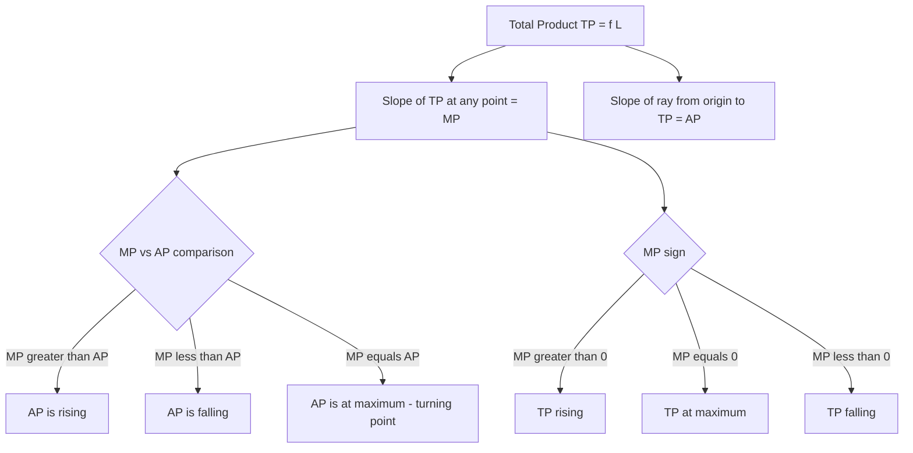

## Total, Average, and Marginal Product Relationships

### Overview

Total Product (TP), Average Product (AP), and Marginal Product (MP) are the three core measures used to analyze the productivity of a variable input in the short-run theory of production. Together they describe how output responds as increasing quantities of a variable input (typically labor) are combined with a fixed input (typically capital), and their interrelationships form the analytical backbone of the Law of Variable Proportions and short-run cost theory.

### Definitions

**Total Product (TP)**

The total quantity of output produced by a given combination of inputs, expressed as a function of the variable input with the fixed input held constant:

$$TP = Q = f(L)$$

**Average Product (AP)**

Output per unit of the variable input — total product divided by the quantity of variable input used:

$$AP_L = \frac{TP}{L} = \frac{Q}{L}$$

**Marginal Product (MP)**

The additional output produced by employing one more unit of the variable input, holding the fixed input constant:

$$MP_L = \frac{\Delta TP}{\Delta L} \quad \text{(discrete case)} \qquad MP_L = \frac{dQ}{dL} \quad \text{(continuous case)}$$

### Mathematical Relationships Between the Three Curves

**1. MP and TP**

$$MP_L = \frac{d(TP)}{dL}$$

- $MP_L > 0 \Rightarrow TP$ is increasing
- $MP_L = 0 \Rightarrow TP$ is at its maximum
- $MP_L < 0 \Rightarrow TP$ is decreasing

Geometrically, $MP_L$ at any point equals the **slope of the tangent to the TP curve** at that point.

**2. MP and AP**

Differentiating $AP_L = TP/L$ with respect to $L$:

$$\frac{d(AP_L)}{dL} = \frac{L \cdot MP_L - TP}{L^2} = \frac{MP_L - AP_L}{L}$$

- $MP_L > AP_L \Rightarrow AP_L$ is rising
- $MP_L < AP_L \Rightarrow AP_L$ is falling
- $MP_L = AP_L \Rightarrow AP_L$ is at its maximum (turning point)

**This is the single most important relationship to remember: the MP curve always intersects the AP curve exactly at the AP curve's maximum point.** This is a purely mathematical property — analogous to the relationship between marginal and average values in any context (e.g., marginal cost and average cost, or a student's grade on the next test versus their overall average).

**3. Geometric Interpretation of AP**

$AP_L$ at any point on the TP curve equals the **slope of a ray drawn from the origin to that point on the TP curve**. The point where this ray is steepest (tangent to TP) corresponds to maximum AP — which is also where MP equals AP.

### Diagram: Relationship Among TP, AP, and MP

### Complete Numerical Example With All Relationships Illustrated

| $L$ | $TP$ | $\Delta TP$ ($MP_L$) | $AP_L = TP/L$ | Relationship |
| --- | --- | --- | --- | --- |
| 0 | 0 | — | — | — |
| 1 | 10 | 10 | 10.0 | $MP > AP$: AP rising |
| 2 | 24 | 14 | 12.0 | $MP > AP$: AP rising |
| 3 | 39 | 15 | 13.0 | $MP > AP$: AP rising |
| 4 | 52 | 13 | 13.0 | $MP = AP$: AP at maximum |
| 5 | 63 | 11 | 12.6 | $MP < AP$: AP falling |
| 6 | 72 | 9 | 12.0 | $MP < AP$: AP falling |
| 7 | 77 | 5 | 11.0 | $MP < AP$: AP falling |
| 8 | 77 | 0 | 9.6 | $MP = 0$: TP at maximum |
| 9 | 74 | -3 | 8.2 | $MP < 0$: TP falling |

**Step-by-step interpretation**:

- Between $L=1$ and $L=3$: $MP_L$ is rising (10 → 14 → 15), consistent with Stage I increasing returns.
- At $L=4$: $MP_L = AP_L = 13$ — this is the precise turning point where $AP_L$ reaches its maximum of 13.0 before beginning to decline.
- Between $L=4$ and $L=7$: $MP_L$ is positive but falling (13 → 11 → 9 → 5), and consistently below $AP_L$, pulling the average down — Stage II.
- At $L=8$: $MP_L = 0$, and correspondingly $TP$ reaches its maximum value of 77 (unchanged from $L=7$).
- At $L=9$: $MP_L = -3$ (negative), and $TP$ falls from 77 to 74 — Stage III begins.

### Diagram: TP, AP, MP Curve Shapes and Turning Points (svg_diagram)

<svg xmlns="http://www.w3.org/2000/svg" viewBox="0 0 720 440">
<rect x="0" y="0" width="720" height="440" fill="#ffffff" />
<text x="360" y="24" text-anchor="middle" font-size="16" font-weight="bold" fill="#1a1a1a">TP, AP, MP: Turning Point Alignment (svg_diagram)</text>
<line x1="60" y1="190" x2="680" y2="190" stroke="#333" stroke-width="1" />
<line x1="60" y1="50" x2="60" y2="190" stroke="#333" stroke-width="1.5" />
<text x="25" y="120" text-anchor="middle" font-size="11" fill="#333" transform="rotate(-90 25,120)">TP</text>

<path d="M 60 185 C 160 110, 260 55, 380 48 C 480 45, 580 65, 660 110" fill="none" stroke="`#2563eb`" stroke-width="2.5" />

<text x="470" y="45" font-size="11" fill="`#2563eb`" font-weight="bold">TP</text>

<circle cx="380" cy="48" r="4" fill="`#2563eb`" />

<text x="380" y="35" text-anchor="middle" font-size="9" fill="`#2563eb`">TP max (MP=0)</text>

<line x1="60" y1="420" x2="680" y2="420" stroke="#333" stroke-width="1.5" />
<line x1="60" y1="230" x2="60" y2="420" stroke="#333" stroke-width="1.5" />
<text x="25" y="330" text-anchor="middle" font-size="11" fill="#333" transform="rotate(-90 25,330)">AP, MP</text>
<text x="370" y="440" text-anchor="middle" font-size="12" fill="#333">Labor (L)</text>

<path d="M 60 380 C 150 290, 250 270, 320 270 C 420 270, 520 320, 660 410" fill="none" stroke="`#16a34a`" stroke-width="2.5" />

<text x="500" y="290" font-size="11" fill="`#16a34a`" font-weight="bold">AP</text>

<path d="M 60 340 C 140 250, 220 235, 280 270 C 360 315, 460 370, 560 415 C 600 422, 620 422, 660 425" fill="none" stroke="`#dc2626`" stroke-width="2.5" />

<text x="180" y="235" font-size="11" fill="`#dc2626`" font-weight="bold">MP</text>

<circle cx="320" cy="270" r="4" fill="#000" />
<line x1="320" y1="50" x2="320" y2="420" stroke="#999" stroke-width="1" stroke-dasharray="4,3" />
<text x="320" y="435" text-anchor="middle" font-size="9" fill="#666">MP = AP (AP max)</text>
<line x1="380" y1="50" x2="380" y2="420" stroke="#999" stroke-width="1" stroke-dasharray="4,3" />
<text x="500" y="435" text-anchor="middle" font-size="9" fill="#666">MP = 0 aligns with TP max</text>
</svg>

### Special Case: Cobb-Douglas Production Function

For $Q = AL^{\alpha}K^{\beta}$ with $K$ fixed:

$$MP_L = \alpha A L^{\alpha - 1}K^{\beta} = \alpha \cdot \frac{Q}{L}= \alpha \cdot AP_L$$

**Key Points**

- Since $0 < \alpha < 1$ typically, $MP_L = \alpha \cdot AP_L < AP_L$ **always** — meaning $AP_L$ is continuously declining across the entire range for a standard Cobb-Douglas function (no genuine "rising AP" Stage I segment exists in this specific functional form). This illustrates that not all textbook production function forms necessarily generate all three classical stages; the three-stage law is most cleanly illustrated with cubic-type total product functions (as in the numerical table above).
- The ratio $MP_L/AP_L = \alpha$ remains constant throughout, directly equal to the output elasticity of labor.

### Diminishing Marginal Returns and the Curvature of TP

A TP curve consistent with all three stages is typically modeled as a cubic function of labor:

$$TP = aL + bL^2 - cL^3 \quad (a, b, c > 0)$$

Then:

$$MP_L = a + 2bL - 3cL^2$$

Setting $\frac{d(MP_L)}{dL} = 0$ gives the labor level at which MP is maximized (the inflection point of TP, marking the end of increasing marginal returns and the start of diminishing marginal returns):

$$2b - 6cL = 0 \implies L = \frac{b}{3c}$$

**Example**: If $TP = 10L + 3L^2 - 0.2L^3$:

$$MP_L = 10 + 6L - 0.6L^2$$

Maximum MP occurs at $L = \frac{3}{3(0.2)} = 5$ (verified by second-order condition, since the coefficient on $L^2$ in $MP_L$ is negative, confirming a maximum). Beyond $L=5$, MP continues positive but begins declining, consistent with the onset of Stage II behavior.

### Key Points Summary

- **TP** measures total output; rises, peaks, then falls as the variable input increases (holding the fixed input constant).
- **AP** measures productivity per unit of variable input; equals the slope of a ray from the origin to the TP curve.
- **MP** measures the output contributed by the last unit of variable input; equals the slope of the tangent to the TP curve at any point.
- **MP always crosses AP at AP's maximum** — a mathematically guaranteed relationship, not a coincidence of any specific numerical example.
- **MP = 0 coincides exactly with TP's maximum**, since MP is the derivative (rate of change) of TP.
- **MP typically lies above AP in early stages (pulling AP up) and below AP in later stages (pulling AP down)** — this pattern underlies the classic hump-shaped MP curve crossing a later-peaking, more gradually hump-shaped AP curve.

### Common Errors to Avoid

- **Confusing MP=0 with AP=0**: MP reaching zero corresponds to TP's maximum, not AP's maximum. AP's maximum occurs earlier, at the point where MP = AP.
- **Assuming AP and MP always move together**: They diverge systematically — AP rises as long as MP is above it, even after MP itself has started declining (as illustrated in the numerical table between $L=4$ and $L=5$, where $MP_L=11 < AP_L$ at $L=5$ causes AP to fall, even though MP was still positive).
- **Treating MP as always positive**: MP can become negative in Stage III, while AP (as long as TP remains positive) cannot become negative — it can only decline toward zero as $L$ grows very large relative to a fixed positive TP.

### Application in Managerial Decision-Making

- **Optimal short-run labor employment**: Identifying where $MP_L$ intersects the value of the wage rate (via marginal revenue product) determines profit-maximizing labor use, but only within the valid Stage II range identified through TP/AP/MP analysis.
- **Productivity benchmarking**: AP provides a straightforward, easily communicated productivity metric (e.g., "output per worker") frequently used in operational reporting and cross-team comparisons.
- **Diagnosing operational inefficiency**: A declining AP trend can signal the firm is approaching or within Stage II/III, prompting review of fixed capacity constraints or staffing levels.
- **Cost curve derivation**: The MP and AP curves directly determine the shape of short-run marginal cost (inversely related to MP) and average variable cost (inversely related to AP) curves.
- **Capacity planning triggers**: A persistently falling MP signals that additional capital investment (relaxing the fixed input constraint) may be more effective than continuing to add variable input.

**Related Topics**

- Short-run production and the Law of Variable Proportions
- Production function concepts and assumptions
- Short-run cost curves (MC, AVC, AFC, ATC) and their derivation
- Marginal revenue product and optimal factor employment
- Returns to scale and long-run production analysis
- Cobb-Douglas production function estimation