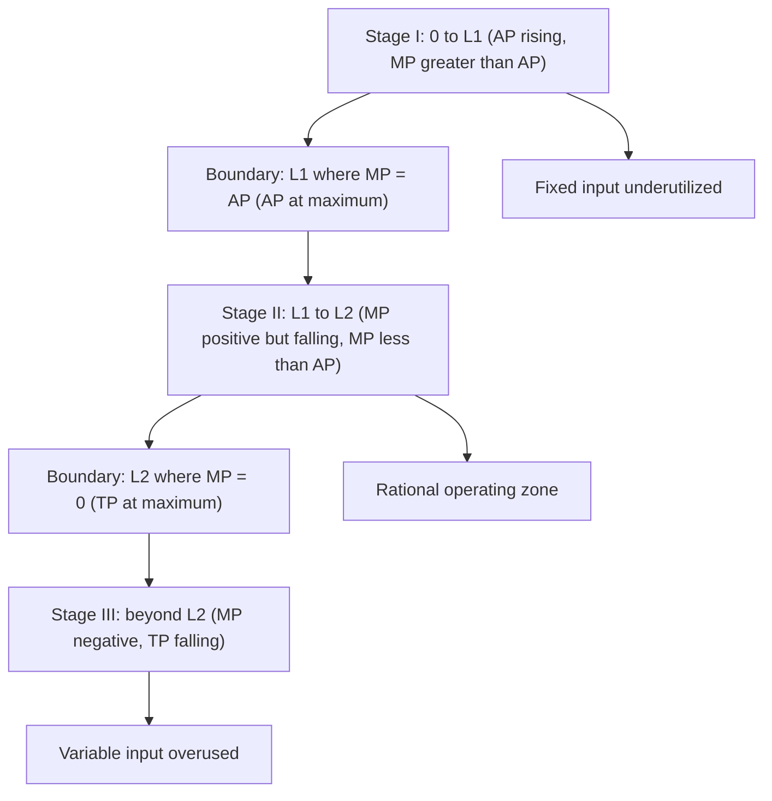
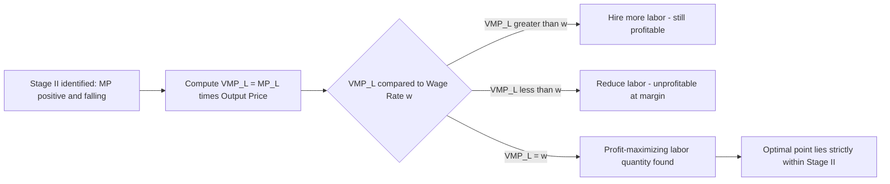

## Stages of Production and the Rational Stage of Operation

### Overview

The stages of production divide the short-run total product curve into three distinct regions based on the behavior of marginal and average product as a variable input is added to a fixed input. This classification is central to identifying the **economically rational range of operation** for a profit-maximizing firm, distinguishing it from technically feasible but economically irrational input combinations.

### The Three Stages Defined

**Stage I: Increasing Average Returns**

Extends from zero units of the variable input to the point where **Average Product (AP) reaches its maximum** (equivalently, where $MP_L = AP_L$).

- $MP_L$ rises, reaches a peak, then begins to fall — but throughout this stage $MP_L > AP_L$
- $AP_L$ is continuously rising
- $TP$ rises at an increasing rate, then at a decreasing rate

**Stage II: Diminishing Positive Returns**

Extends from the point where $AP_L$ is at its maximum to the point where **Marginal Product (MP) equals zero** (equivalently, where $TP$ reaches its maximum).

- $MP_L$ is positive but continuously falling
- $MP_L < AP_L$ throughout, so $AP_L$ is falling
- $TP$ continues to rise, but at a decreasing rate, until it peaks at the end of this stage

**Stage III: Negative Returns**

Begins at the point where $MP_L$ becomes negative (beyond $TP$'s maximum).

- $MP_L < 0$
- $AP_L$ continues to decline (though it remains positive as long as $TP > 0$)
- $TP$ itself is falling

### Diagram: The Three Stages and Their Boundaries

### Diagram: Stage Boundaries on TP/AP/MP Curves (svg_diagram)

<svg xmlns="http://www.w3.org/2000/svg" viewBox="0 0 720 440">
<rect x="0" y="0" width="720" height="440" fill="#ffffff" />
<text x="360" y="24" text-anchor="middle" font-size="16" font-weight="bold" fill="#1a1a1a">Stages of Production (svg_diagram)</text>
<rect x="60" y="40" width="260" height="380" fill="#fef3c7" opacity="0.35" />
<rect x="320" y="40" width="200" height="380" fill="#dcfce7" opacity="0.45" />
<rect x="520" y="40" width="140" height="380" fill="#fee2e2" opacity="0.4" />

<text x="190" y="55" text-anchor="middle" font-size="12" font-weight="bold" fill="`#92400e`">Stage I</text>

<text x="420" y="55" text-anchor="middle" font-size="12" font-weight="bold" fill="`#166534`">Stage II</text>

<text x="590" y="55" text-anchor="middle" font-size="12" font-weight="bold" fill="`#991b1b`">Stage III</text>

<line x1="60" y1="200" x2="660" y2="200" stroke="#333" stroke-width="1" />
<line x1="60" y1="70" x2="60" y2="200" stroke="#333" stroke-width="1.5" />
<text x="30" y="140" text-anchor="middle" font-size="11" fill="#333" transform="rotate(-90 30,140)">TP</text>

<path d="M 60 195 C 150 130, 250 75, 320 65 C 400 60, 480 75, 520 100 C 570 135, 620 175, 660 195" fill="none" stroke="`#2563eb`" stroke-width="2.5" />

<line x1="60" y1="420" x2="660" y2="420" stroke="#333" stroke-width="1.5" />
<line x1="60" y1="250" x2="60" y2="420" stroke="#333" stroke-width="1.5" />
<text x="30" y="335" text-anchor="middle" font-size="11" fill="#333" transform="rotate(-90 30,335)">AP, MP</text>
<text x="360" y="438" text-anchor="middle" font-size="12" fill="#333">Labor (L)</text>

<path d="M 60 390 C 140 300, 240 285, 320 285 C 420 285, 480 330, 660 415" fill="none" stroke="`#16a34a`" stroke-width="2.5" />

<text x="480" y="300" font-size="11" fill="`#16a34a`" font-weight="bold">AP</text>

<path d="M 60 350 C 130 260, 210 250, 270 285 C 340 325, 440 385, 520 410 C 570 420, 620 428, 660 432" fill="none" stroke="`#dc2626`" stroke-width="2.5" />

<text x="160" y="245" font-size="11" fill="`#dc2626`" font-weight="bold">MP</text>

<line x1="320" y1="40" x2="320" y2="420" stroke="#666" stroke-width="1.5" stroke-dasharray="5,3" />
<text x="320" y="30" text-anchor="middle" font-size="9" fill="#374151">L1: MP=AP</text>
<line x1="520" y1="40" x2="520" y2="420" stroke="#666" stroke-width="1.5" stroke-dasharray="5,3" />
<text x="520" y="30" text-anchor="middle" font-size="9" fill="#374151">L2: MP=0</text>
</svg>

### Numerical Illustration

| $L$ | $TP$ | $MP_L$ | $AP_L$ | Stage |
| --- | --- | --- | --- | --- |
| 1 | 12 | 12 | 12.0 | I |
| 2 | 28 | 16 | 14.0 | I |
| 3 | 45 | 17 | 15.0 | I |
| 4 | 60 | 15 | 15.0 | I/II boundary ($MP=AP$) |
| 5 | 72 | 12 | 14.4 | II |
| 6 | 81 | 9 | 13.5 | II |
| 7 | 86 | 5 | 12.3 | II |
| 8 | 88 | 2 | 11.0 | II |
| 9 | 88 | 0 | 9.8 | II/III boundary ($MP=0$) |
| 10 | 85 | -3 | 8.5 | III |

- **Stage I** spans $L=1$ to $L=4$: AP rising throughout, peaking at $L=4$ where $MP_L = AP_L = 15$.
- **Stage II** spans $L=4$ to $L=9$: MP positive but declining, AP falling but still positive; TP still increasing, reaching its peak of 88 at $L=9$.
- **Stage III** begins at $L=10$: $MP_L = -3$ (negative), and $TP$ falls from 88 to 85.

### Why Stage I Is Irrational to Operate In

Throughout Stage I, $MP_L$ exceeds $AP_L$, meaning **every additional worker adds more to output than the current average** — average productivity is still climbing. A profit-maximizing firm employing any positive quantity of the variable input would always find it worthwhile to hire at least one more unit while still in Stage I, because:

- The fixed input (capital, land, plant capacity) is not yet being used to its full technical potential.
- Adding another unit of variable input continues to raise both total output and output per worker.
- Stopping within Stage I means leaving profitable, productivity-enhancing hiring opportunities unexploited.

Therefore, **no rational firm deliberately stops hiring within Stage I** — it is always advantageous to at least reach the boundary between Stage I and Stage II.

### Why Stage III Is Irrational to Operate In

In Stage III, $MP_L < 0$: each additional unit of the variable input actually **reduces total output**. This occurs due to overcrowding — too many workers relative to the fixed capital/space, leading to interference, coordination breakdowns, or physical constraints (e.g., workers getting in each other's way on a fixed-size factory floor).

- The firm would be paying wages for labor that **destroys value** rather than adding it.
- Regardless of how low the wage rate is (even approaching zero), it is never profitable to employ a unit of input with negative marginal product, since any positive wage payment for negative output contribution guarantees a loss on that unit.
- Therefore, **no rational firm operates in Stage III** under any circumstances.

### Why Stage II Is the Rational Stage of Operation

Stage II is the **only** region where:

- Marginal product is positive (each additional unit still adds to total output — so hiring more could still be profitable depending on prices).
- Marginal product is declining (reflecting genuine scarcity of the fixed input, consistent with the firm approaching efficient utilization of its fixed capacity).
- A well-defined profit-maximizing input quantity can exist, since the firm can equate the value of marginal product to the input's price (wage rate) somewhere within this range.

**The exact point within Stage II at which the firm actually stops hiring** is determined by the profit-maximization condition:

$$VMP_L = MP_L \times P = w$$

Where $VMP_L$ is the value of marginal product, $P$ is the output price, and $w$ is the wage rate. This condition can only be satisfied within Stage II, since it requires $MP_L > 0$ (ruling out Stage III) and represents the point where the firm has moved past the region of increasing marginal returns (ruling out Stage I, where it would always be profitable to keep expanding).

### Diagram: Determining the Optimal Point Within Stage II

### Numerical Example of Optimal Point Selection

Using the table above, suppose output price $P = \$5$ per unit and wage rate $w = \$40$ per worker.

$$VMP_L = MP_L \times P$$

| $L$ | $MP_L$ | $VMP_L = MP_L \times 5$ | Compare to $w=\$40$ |
| --- | --- | --- | --- |
| 5 | 12 | 60 | $VMP > w$ — hire more |
| 6 | 9 | 45 | $VMP > w$ — hire more |
| 7 | 5 | 25 | $VMP < w$ — reduce |

The profit-maximizing labor quantity lies between $L=6$ and $L=7$ (where $VMP_L = w = 40$ is crossed), confirming the optimal hiring decision falls **within Stage II**, consistent with the theoretical prediction.

### Summary Comparison Table

| Criterion | Stage I | Stage II | Stage III |
| --- | --- | --- | --- |
| $MP_L$ vs $AP_L$ | $MP_L > AP_L$ | $MP_L < AP_L$ | $MP_L < AP_L$ (and negative) |
| $MP_L$ trend | Rising then falling | Falling (still positive) | Negative |
| $AP_L$ trend | Rising | Falling | Falling |
| $TP$ trend | Rising, increasing then decreasing rate | Rising, decreasing rate | Falling |
| Fixed input utilization | Underutilized | Efficiently utilized | Overcrowded |
| Rational to operate? | No | **Yes** | No |
| Economic rationale for avoidance | Leaves profitable hiring unexploited | N/A — rational zone | Negative output contribution |

### Limitations and Real-World Considerations

- **Requires observable/estimable MP and AP curves**: In practice, precisely identifying stage boundaries requires reasonably granular production data, which firms may lack, particularly for services or knowledge-based production.
- **Assumes a single variable input**: Real production often involves multiple variable inputs adjusted simultaneously, complicating the clean single-input stage analysis (addressed instead through isoquant/cost-minimization analysis).
- **Boundary identification in practice**: Stage boundaries are theoretical constructs; real production data may not exhibit a clean cubic-shaped TP curve, making stage boundaries harder to pinpoint empirically than in stylized textbook examples. [Inference: the smoothness and clarity of observed stage transitions vary by industry and data granularity, and is not guaranteed to match textbook shapes.]
- **Assumes profit maximization as the sole objective**: Other short-run considerations (e.g., maintaining workforce stability, contractual labor commitments) may lead real firms to temporarily operate outside the theoretically optimal point, even while remaining broadly within Stage II.

### Application in Managerial Decision-Making

- **Staffing level guardrails**: Provides theoretical boundaries (avoid Stage I underutilization, never enter Stage III overcrowding) within which practical hiring decisions should fall.
- **Capacity utilization diagnostics**: Persistent operation near the Stage II/III boundary signals the fixed input (plant, equipment) is nearing full utilization, informing capital expansion decisions.
- **Overtime and shift-planning decisions**: Helps identify when additional labor hours are likely to yield diminishing or even negative returns due to space/equipment constraints.
- **Input pricing negotiations**: Understanding the VMP-based optimal hiring point supports wage negotiation and workforce planning grounded in marginal productivity.
- **Cost-efficiency benchmarking**: Since Stage II corresponds to the region generating standard U-shaped short-run marginal and average variable cost curves, staying within this range keeps cost structures analytically well-behaved for planning purposes.

**Related Topics**

- Total, average, and marginal product relationships
- Short-run production and the Law of Variable Proportions
- Marginal revenue product and optimal factor employment
- Short-run cost curves (MC, AVC, AFC, ATC)
- Production function concepts and assumptions
- Isoquants and least-cost input combination
- Returns to scale and long-run production analysis