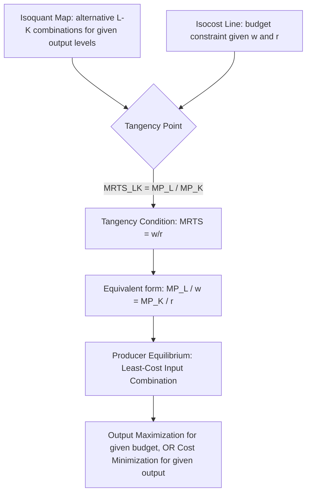

## Isoquants, Isocost Lines, and Producer Equilibrium

### Overview

Isoquants and isocost lines together form the graphical and analytical framework used to determine the **least-cost combination of inputs** for producing a given level of output, or equivalently, the **output-maximizing combination of inputs** for a given budget. This framework — the long-run analog of consumer indifference curve/budget line analysis — identifies **producer equilibrium**, the point at which a firm allocates its resources optimally between two (or more) variable inputs.

### Isoquants

**Definition**: An isoquant (from Greek *iso* = equal, and Latin *quantus* = quantity) is a curve showing all combinations of two inputs (typically labor $L$ and capital $K$) that produce the **same level of output**.

$$Q_0 = f(L, K)$$

**Properties of Isoquants**

| Property | Explanation |
| --- | --- |
| Downward sloping | To maintain the same output while increasing one input, the other input must decrease |
| Convex to the origin | Reflects a diminishing Marginal Rate of Technical Substitution (MRTS) between inputs |
| Never intersect | Each isoquant represents a distinct, unique output level; intersection would imply the same input combination yields two different outputs, a logical contradiction |
| Higher isoquants represent higher output | Isoquants farther from the origin correspond to greater output levels |
| Do not touch the axes (in the standard case) | Assumes both inputs are generally necessary for production (though exceptions exist for perfect substitutes) |

### Marginal Rate of Technical Substitution (MRTS)

The MRTS measures the rate at which one input can be substituted for another while holding output constant — the **slope of the isoquant**.

$$MRTS_{LK} = -\frac{\Delta K}{\Delta L}\bigg|_{Q=\text{constant}} = \frac{MP_L}{MP_K}$$

**Diminishing MRTS**: As a firm moves along an isoquant substituting labor for capital, the MRTS typically diminishes — each additional unit of labor can replace progressively less capital while maintaining the same output. This reflects the fact that as capital becomes scarcer relative to labor, its marginal productivity rises relative to labor's, requiring less capital to be given up per additional labor unit.

### Special Cases of Isoquants

**Perfect Substitutes (Linear Isoquants)**

$$Q = aL + bK$$

Isoquants are straight lines; constant MRTS. Example: two machines of different brands but identical output capacity.

**Perfect Complements (Leontief / Right-Angle Isoquants)**

$$Q = \min(aL, bK)$$

Isoquants are L-shaped; inputs must be combined in fixed proportions (e.g., one operator per specific machine); MRTS is undefined along the flat/vertical segments and effectively zero or infinite.

**Standard Convex Isoquants (Cobb-Douglas type)**

$$Q = AL^{\alpha}K^{\beta}$$

Smooth, convex curves representing imperfect (but positive) substitutability — the typical textbook case.

### Diagram: Isoquant Map (svg_diagram)

<svg xmlns="http://www.w3.org/2000/svg" viewBox="0 0 620 420">
<rect x="0" y="0" width="620" height="420" fill="#ffffff" />
<text x="310" y="24" text-anchor="middle" font-size="16" font-weight="bold" fill="#1a1a1a">Isoquant Map (svg_diagram)</text>
<line x1="60" y1="370" x2="580" y2="370" stroke="#333" stroke-width="1.5" />
<line x1="60" y1="50" x2="60" y2="370" stroke="#333" stroke-width="1.5" />
<text x="320" y="400" text-anchor="middle" font-size="12" fill="#333">Labor (L)</text>
<text x="25" y="210" text-anchor="middle" font-size="12" fill="#333" transform="rotate(-90 25,210)">Capital (K)</text>
<path d="M 90 340 C 130 200, 250 100, 460 85" fill="none" stroke="#93c5fd" stroke-width="2.5" />
<text x="465" y="82" font-size="10" fill="#3b82f6">Q1</text>
<path d="M 130 355 C 180 230, 320 130, 540 110" fill="none" stroke="#3b82f6" stroke-width="2.5" />
<text x="545" y="107" font-size="10" fill="#2563eb" font-weight="bold">Q2</text>
<path d="M 180 365 C 240 260, 400 160, 570 140" fill="none" stroke="#1e40af" stroke-width="2.5" />
<text x="575" y="137" font-size="10" fill="#1e3a8a">Q3</text>

<text x="90" y="200" font-size="10" fill="`#374151`">Higher isoquants →</text>

<text x="90" y="215" font-size="10" fill="`#374151`">higher output</text>

</svg>

### Isocost Lines

**Definition**: An isocost line shows all combinations of two inputs that a firm can purchase for a given total expenditure (cost outlay), given the prevailing prices of those inputs.

$$C = wL + rK$$

Where $C$ is total cost outlay, $w$ is the wage rate (price of labor), and $r$ is the rental/price of capital.

Rearranged into slope-intercept form (with $K$ on the vertical axis):

$$K = \frac{C}{r} - \frac{w}{r}L$$

**Key Points**

- The vertical intercept ($C/r$) represents the maximum capital purchasable if all expenditure were devoted to capital.
- The horizontal intercept ($C/w$) represents the maximum labor purchasable if all expenditure were devoted to labor.
- The **slope of the isocost line** is $-w/r$, the negative ratio of input prices.
- A change in total budget ($C$) shifts the isocost line parallel to itself (outward for an increase, inward for a decrease).
- A change in relative input prices ($w/r$) rotates the isocost line, changing its slope.

### Producer Equilibrium: Least-Cost Combination / Output Maximization

**Producer equilibrium** occurs at the point where an isoquant is **tangent** to an isocost line — the highest attainable isoquant for a given budget, or equivalently, the lowest-cost isocost line touching a given target isoquant.

**Tangency Condition**:

$$MRTS_{LK} = \frac{w}{r}$$

Since $MRTS_{LK} = MP_L / MP_K$, this can be rewritten as:

$$\frac{MP_L}{MP_K} = \frac{w}{r} \quad \Longleftrightarrow \quad \frac{MP_L}{w} = \frac{MP_K}{r}$$

**Economic interpretation**: At equilibrium, the **marginal product per dollar spent** must be equal across all inputs. If $MP_L/w > MP_K/r$, the firm gets more output per dollar from labor than capital, and should reallocate its budget toward labor (and vice versa) until the ratios equalize.

### Diagram: Producer Equilibrium (Tangency)

### Two Equivalent Formulations of Producer Equilibrium

| Formulation | Objective | Constraint | Solution |
| --- | --- | --- | --- |
| Output maximization | Maximize $Q = f(L,K)$ | Subject to fixed budget: $wL + rK = C$ | Highest isoquant tangent to the given isocost line |
| Cost minimization | Minimize $C = wL + rK$ | Subject to fixed output: $f(L,K) = Q_0$ | Lowest isocost line tangent to the given isoquant |

Both formulations yield the **same tangency condition** and, for well-behaved (convex) production functions, the same optimal input ratio $L^*/K^*$.

### Numerical Example

**Given**: $Q = 10L^{0.5}K^{0.5}$, wage rate $w = \$20$, rental rate of capital $r = \$5$, target output $Q_0 = 200$.

**Step 1: Derive MRTS**

$$MP_L = 5L^{-0.5}K^{0.5} \qquad MP_K = 5L^{0.5}K^{-0.5}$$

$$MRTS_{LK} = \frac{MP_L}{MP_K} = \frac{K}{L}$$

**Step 2: Apply Tangency Condition**

$$\frac{K}{L} = \frac{w}{r} = \frac{20}{5} = 4 \implies K = 4L$$

**Step 3: Substitute into the Production Function (Target Output Constraint)**

$$200 = 10L^{0.5}(4L)^{0.5} = 10L^{0.5} \cdot 2L^{0.5} = 20L$$

$$L^* = 10 \implies K^* = 4(10) = 40$$

**Step 4: Verify Minimum Cost**

$$C^* = wL^* + rK^* = 20(10) + 5(40) = 200 + 200 = \$400$$

**Interpretation**: To produce 200 units of output at the given input prices, the firm should employ 10 units of labor and 40 units of capital, incurring a minimum total cost of $400. Any other combination of $L$ and $K$ yielding 200 units of output (i.e., lying on the same isoquant) would cost **more** than $400, confirming this is indeed the least-cost combination.

### Diagram: Numerical Example — Tangency Point (svg_diagram)

<svg xmlns="http://www.w3.org/2000/svg" viewBox="0 0 620 420">
<rect x="0" y="0" width="620" height="420" fill="#ffffff" />
<text x="310" y="24" text-anchor="middle" font-size="15" font-weight="bold" fill="#1a1a1a">Producer Equilibrium: L*=10, K*=40 (svg_diagram)</text>
<line x1="70" y1="370" x2="580" y2="370" stroke="#333" stroke-width="1.5" />
<line x1="70" y1="50" x2="70" y2="370" stroke="#333" stroke-width="1.5" />
<text x="325" y="400" text-anchor="middle" font-size="12" fill="#333">Labor (L)</text>
<text x="35" y="210" text-anchor="middle" font-size="12" fill="#333" transform="rotate(-90 35,210)">Capital (K)</text>
<path d="M 100 340 C 140 200, 220 100, 420 75" fill="none" stroke="#2563eb" stroke-width="2.5" />
<text x="425" y="72" font-size="10" fill="#2563eb" font-weight="bold">Isoquant Q=200</text>
<line x1="70" y1="80" x2="440" y2="370" stroke="#dc2626" stroke-width="2.5" />
<text x="330" y="335" font-size="10" fill="#dc2626" font-weight="bold">Isocost C=400 (slope=-w/r=-4)</text>
<circle cx="210" cy="175" r="5" fill="#16a34a" />
<text x="220" y="170" font-size="11" fill="#16a34a" font-weight="bold">E (L*=10, K*=40)</text>
<line x1="210" y1="175" x2="210" y2="370" stroke="#999" stroke-width="1" stroke-dasharray="3,3" />
<line x1="70" y1="175" x2="210" y2="175" stroke="#999" stroke-width="1" stroke-dasharray="3,3" />
<text x="210" y="385" text-anchor="middle" font-size="9" fill="#666">L*=10</text>
<text x="45" y="178" text-anchor="middle" font-size="9" fill="#666">K*=40</text>
</svg>

### Expansion Path

The **expansion path** traces the locus of tangency points (producer equilibria) across successively higher isoquants as the firm's budget/output target expands, holding input prices constant. It shows how the optimal input ratio $L^*/K^*$ evolves as the firm scales output up or down.

- For a **Cobb-Douglas** production function, the expansion path is a **straight line through the origin**, since the optimal input ratio $K/L = (\beta w)/(\alpha r)$ remains constant regardless of output level (as input prices are held fixed).
- The expansion path is used to derive the firm's **long-run total cost curve**, by calculating the minimum cost associated with each output level along the path.

### Corner Solutions

If inputs are **perfect substitutes** (linear isoquants) and the isocost line's slope differs from the isoquant's constant slope, the tangency condition cannot be satisfied at an interior point — the cost-minimizing solution is a **corner solution**, using exclusively the relatively cheaper input (in effective productivity-adjusted terms).

### Effect of Changing Input Prices

If the wage rate $w$ rises (capital price $r$ unchanged), the isocost line becomes steeper (its horizontal intercept, $C/w$, shrinks), causing the tangency point to shift toward **less labor and more capital** — the standard **factor substitution effect** predicted by producer theory, analogous to the substitution effect in consumer theory.

### Limitations and Real-World Considerations

- **Assumes continuous divisibility of inputs**: Real-world inputs (e.g., a single specialized machine) are often lumpy/indivisible, limiting the smooth tangency solutions predicted by the theory.
- **Assumes known, stable production function and prices**: In practice, both technology and input prices may be uncertain or change unpredictably over the planning horizon.
- **Assumes only two inputs**: While pedagogically standard, the two-input model simplifies away interactions among the many inputs (multiple types of labor, capital, materials, energy) actually used by real firms; extensions require multi-input optimization techniques (e.g., Lagrangian methods with more than two variables).
- **Static analysis**: The tangency condition describes an equilibrium at a point in time; dynamic adjustment costs (e.g., costs of hiring/firing labor, installing/removing capital) are not captured within this basic framework.

### Application in Managerial Decision-Making

- **Cost-minimizing production planning**: Directly informs how a firm should combine labor and capital to produce a target output at minimum cost.
- **Capital-labor substitution decisions**: Guides automation/investment decisions when relative factor prices shift (e.g., rising wages relative to capital rental rates favoring capital-intensive production methods).
- **Budgeting and resource allocation**: The tangency condition (equal marginal product per dollar across inputs) provides a general decision rule applicable beyond just labor and capital — to any pair of substitutable resources, including marketing channels or raw material sourcing options.
- **Long-run cost curve derivation**: The expansion path derived from repeated producer equilibria across output levels forms the basis for deriving the long-run total, average, and marginal cost curves.
- **Outsourcing and technology investment evaluation**: Comparing the effective $MP/price$ ratio of in-house labor versus automated/outsourced alternatives informs strategic sourcing decisions.

**Related Topics**

- Production function concepts and assumptions
- Marginal Rate of Technical Substitution and input substitutability
- Returns to scale and long-run production analysis
- Long-run cost curves and the expansion path
- Cobb-Douglas production function estimation
- Consumer equilibrium (indifference curves and budget lines) — the parallel consumer-theory framework
- Economies and diseconomies of scale