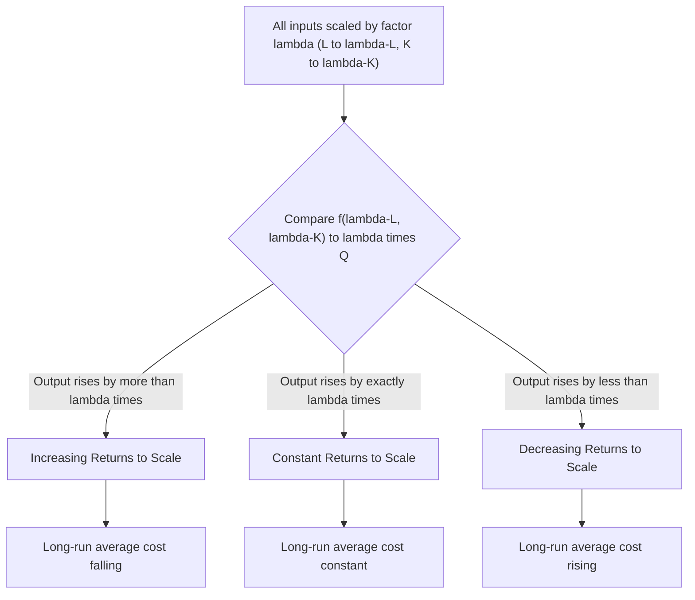
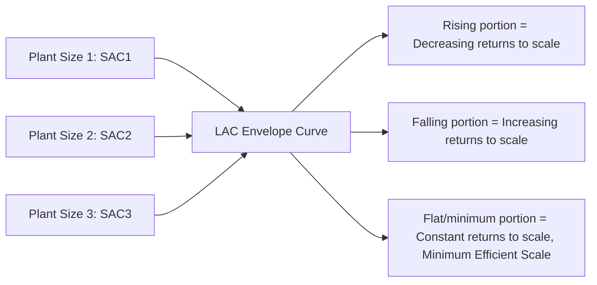

## Long-Run Production and Returns to Scale

### Overview

Long-run production analysis examines how output responds when **all** inputs are varied simultaneously, in contrast to short-run analysis where at least one input remains fixed. The central concept in this analysis is **returns to scale**, which describes the proportional relationship between a proportional change in all inputs and the resulting change in output. This framework underlies long-run cost curve behavior, optimal plant sizing, and strategic decisions about firm scale.

### The Long Run Defined

The **long run** is a planning horizon sufficiently extended that a firm can adjust **all** factors of production, including those (like plant size or major capital equipment) that are fixed in the short run. There is no universal fixed calendar duration for the long run — it is defined by the firm's ability to vary every input, which differs by industry (e.g., building a new factory takes longer than hiring additional temporary staff).

### Returns to Scale: Definition

Returns to scale examines what happens to output when **all inputs are increased by the same proportion** $\lambda$ ($\lambda > 1$):

$$f(\lambda L, \lambda K) \; \text{vs.} \; \lambda \cdot f(L,K)$$

| Condition | Classification | Output Response |
| --- | --- | --- |
| $f(\lambda L, \lambda K) = \lambda \cdot Q$ | Constant Returns to Scale (CRS) | Output increases in exact proportion to inputs |
| $f(\lambda L, \lambda K) > \lambda \cdot Q$ | Increasing Returns to Scale (IRS) | Output increases more than proportionally |
| $f(\lambda L, \lambda K) < \lambda \cdot Q$ | Decreasing Returns to Scale (DRS) | Output increases less than proportionally |

### Diagram: Returns to Scale Classification

### Testing Returns to Scale for the Cobb-Douglas Function

For $Q = AL^{\alpha}K^{\beta}$:

$$f(\lambda L, \lambda K) = A(\lambda L)^{\alpha}(\lambda K)^{\beta} = \lambda^{\alpha+\beta} \cdot AL^{\alpha}K^{\beta} = \lambda^{\alpha+\beta} \cdot Q$$

The sum of the exponents, $\alpha + \beta$, is the **degree of homogeneity** of the function and directly determines returns to scale:

| $\alpha + \beta$ | Classification |
| --- | --- |
| $= 1$ | Constant returns to scale |
| $> 1$ | Increasing returns to scale |
| $< 1$ | Decreasing returns to scale |

**Numerical Example**: $Q = 4L^{0.4}K^{0.5}$

$$\alpha + \beta = 0.4 + 0.5 = 0.9 < 1 \implies \text{Decreasing returns to scale}$$

Verification with $\lambda = 2$: $f(2L,2K) = 4(2L)^{0.4}(2K)^{0.5} = 4 \cdot 2^{0.9} \cdot L^{0.4}K^{0.5} = 2^{0.9} \cdot Q \approx 1.866Q$. Since doubling inputs yields only 1.866 times the output (less than double), this confirms decreasing returns to scale.

### Sources of Increasing Returns to Scale (Economies of Scale)

- **Specialization and division of labor**: Larger scale allows workers and machines to specialize in narrower tasks, increasing efficiency.
- **Indivisibility of inputs**: Some capital equipment is only efficient at a large scale (e.g., large assembly lines, specialized machinery) — small-scale operations cannot fully utilize such indivisible inputs.
- **Technical/engineering economies**: Larger vessels, containers, or pipes have a surface-area-to-volume relationship that reduces material cost per unit of capacity (the "cube-square law" in engineering economics).
- **Managerial and organizational efficiencies**: Fixed managerial/administrative overhead can be spread over a larger output base.
- **Bulk purchasing (pecuniary economies)**: Larger firms may secure better input prices, though this is technically a cost-side (pecuniary) rather than a pure production-side (technical) economy of scale.

### Sources of Decreasing Returns to Scale (Diseconomies of Scale)

- **Managerial diseconomies**: Coordination, communication, and control become progressively more difficult as organizations grow, leading to bureaucratic inefficiency, slower decision-making, and information loss across management layers.
- **Increased complexity of coordination**: Larger, more complex organizations face higher agency costs and coordination challenges among departments/divisions.
- **Input scarcity/rising factor prices at large scale**: Extremely large-scale operations may face rising costs for increasingly scarce specialized inputs.
- **Reduced worker morale/motivation**: Larger organizations may experience decreased employee engagement or increased shirking due to reduced individual accountability (a common explanation in organizational economics, though the strength of this effect is firm-specific).

### Diagram: Long-Run Average Cost (LAC) and Returns to Scale (svg_diagram)

<svg xmlns="http://www.w3.org/2000/svg" viewBox="0 0 700 400">
<rect x="0" y="0" width="700" height="400" fill="#ffffff" />
<text x="350" y="24" text-anchor="middle" font-size="16" font-weight="bold" fill="#1a1a1a">Returns to Scale and the LAC Curve (svg_diagram)</text>
<line x1="60" y1="330" x2="660" y2="330" stroke="#333" stroke-width="1.5" />
<line x1="60" y1="50" x2="60" y2="330" stroke="#333" stroke-width="1.5" />
<text x="360" y="365" text-anchor="middle" font-size="12" fill="#333">Output (Q)</text>
<text x="25" y="190" text-anchor="middle" font-size="12" fill="#333" transform="rotate(-90 25,190)">Long-Run Average Cost</text>

<path d="M 90 300 C 180 190, 260 130, 330 110 C 400 105, 460 115, 500 140 C 570 190, 620 260, 650 310" fill="none" stroke="`#2563eb`" stroke-width="2.5" />

<text x="340" y="95" font-size="11" fill="`#2563eb`" font-weight="bold">LAC Curve</text>

<rect x="60" y="335" width="270" height="14" fill="#dbeafe" opacity="0.5" />
<text x="195" y="345" text-anchor="middle" font-size="10" fill="#1e40af">Increasing Returns (LAC falling)</text>
<rect x="330" y="335" width="170" height="14" fill="#dcfce7" opacity="0.5" />
<text x="415" y="345" text-anchor="middle" font-size="10" fill="#166534">Constant Returns (LAC ~ flat/min)</text>
<rect x="500" y="335" width="150" height="14" fill="#fee2e2" opacity="0.5" />
<text x="575" y="345" text-anchor="middle" font-size="10" fill="#991b1b">Decreasing Returns (LAC rising)</text>
<line x1="330" y1="50" x2="330" y2="330" stroke="#999" stroke-width="1" stroke-dasharray="3,3" />
<line x1="500" y1="50" x2="500" y2="330" stroke="#999" stroke-width="1" stroke-dasharray="3,3" />
</svg>

### Returns to Scale vs. Economies/Diseconomies of Scale

| Concept | Basis | Measured In |
| --- | --- | --- |
| Returns to scale | Purely technical/physical input-output relationship | Physical units of output relative to physical units of input |
| Economies/diseconomies of scale | Cost behavior as scale increases, incorporating input prices | Cost per unit of output ($) |

**Key Points**

- Returns to scale is a **production-function (technical)** concept; economies of scale is a **cost-curve (economic)** concept that incorporates input prices in addition to the underlying technical relationship.
- Increasing returns to scale typically (though not automatically) translates into economies of scale (falling long-run average cost), provided input prices do not rise faster than output expands; the two concepts are closely related but not strictly identical, since changing input prices at larger scale (e.g., bulk discounts or scarcity premiums) can cause cost behavior to diverge from the pure technical returns-to-scale relationship.

### Returns to Scale vs. the Law of Variable Proportions

| Aspect | Returns to Scale | Law of Variable Proportions |
| --- | --- | --- |
| Time frame | Long run | Short run |
| Inputs varied | All inputs, in the same proportion | Only one input; at least one held fixed |
| Question answered | How does output respond to firm size/scale changes? | How does output respond to changing input *proportions*? |
| Relevant cost curve | Long-run average cost (LAC) | Short-run marginal/average variable cost (MC, AVC) |

These are **distinct concepts** frequently confused by students: the Law of Variable Proportions concerns changing the *ratio* of inputs in the short run, while returns to scale concerns changing the *overall scale* of all inputs together in the long run.

### The Long-Run Envelope: LAC as the "Envelope" of SAC Curves

The long-run average cost (LAC) curve is derived as the **envelope** of a series of short-run average cost (SAC) curves, each corresponding to a different fixed plant size. Each point on the LAC curve represents the lowest attainable short-run average cost for that particular output level, given the optimal plant size choice for producing that output level.

### Minimum Efficient Scale (MES)

The **Minimum Efficient Scale** is the smallest output level at which a firm exhausts all available economies of scale — the point where the LAC curve first reaches its minimum. Producing below MES means the firm forfeits available scale economies; producing beyond the range of constant returns pushes the firm into decreasing returns (diseconomies of scale), raising per-unit costs.

### Homogeneous vs. Non-Homogeneous Production Functions

A production function is **homogeneous of degree $n$** if:

$$f(\lambda L, \lambda K) = \lambda^n f(L,K)$$

- $n = 1$: Linearly homogeneous (constant returns to scale) — common simplifying assumption in many theoretical models, including much of general equilibrium theory
- $n \neq 1$: Non-homogeneous of that specific degree, corresponding to increasing ($n>1$) or decreasing ($n<1$) returns to scale

Not all production functions are homogeneous; some exhibit **varying returns to scale** at different output ranges (e.g., increasing returns at small scale transitioning to decreasing returns at very large scale) — this is the empirically common and theoretically standard **U-shaped long-run average cost curve** pattern.

### Numerical Example: Varying Returns to Scale Along a Single Function

Consider a firm whose returns to scale change across output ranges, as is common empirically (rather than a single constant elasticity throughout):

| Scale Range | Typical Source | LAC Behavior |
| --- | --- | --- |
| Small scale | Underutilized indivisible capital, limited specialization | Increasing returns → LAC falling |
| Moderate/optimal scale | Fully utilized specialization and capital, efficient coordination | Constant returns → LAC at or near minimum |
| Very large scale | Managerial complexity, coordination breakdown | Decreasing returns → LAC rising |

[Inference: while this U-shaped pattern is the standard textbook depiction and broadly consistent with observed industry cost structures, the specific output ranges and severity of scale effects vary substantially by industry and cannot be generalized to a universal numerical pattern.]

### Limitations and Real-World Considerations

- **Empirical estimation challenges**: Estimating returns to scale in practice requires reliable long-run data across firms of genuinely different scales, which is often confounded by differences in technology, management quality, and market conditions rather than scale alone.
- **Assumes proportional input scaling**: Real firms rarely scale all inputs in exact fixed proportion; actual expansion often involves disproportionate changes across different input categories.
- **Dynamic vs. static scale effects**: The theory is inherently static (comparing different scales at a point in time), while real firms experience *dynamic* scale effects (e.g., learning curve effects, organizational learning) that are conceptually distinct from returns to scale.
- **Industry-specific applicability**: Some industries (e.g., utilities, heavy manufacturing) exhibit substantial and well-documented increasing returns to scale over wide output ranges, while others (e.g., many service industries) show returns to scale close to constant over most relevant ranges — generalizing across industries is not appropriate.

### Application in Managerial Decision-Making

- **Optimal plant/firm size determination**: Identifying the Minimum Efficient Scale guides decisions on whether to expand, and by how much, to capture available economies of scale.
- **Merger and acquisition rationale**: Increasing returns to scale (and associated economies of scale) provide a technical efficiency rationale for horizontal mergers or capacity consolidation.
- **Market structure implications**: Industries with substantial increasing returns to scale over a wide output range tend toward natural monopoly or oligopoly structures, informing competitive strategy and regulatory analysis.
- **Investment and capacity expansion timing**: Understanding where a firm currently sits on its returns-to-scale spectrum informs whether further capital investment will yield proportionate, more-than-proportionate, or less-than-proportionate output gains.
- **International expansion and multi-plant decisions**: Firms facing decreasing returns to scale in a single facility may prefer building multiple smaller optimally-sized plants (each operating at Minimum Efficient Scale) rather than one very large plant experiencing diseconomies.

**Related Topics**

- Production function concepts and assumptions
- Isoquants, isocost lines, and producer equilibrium
- Long-run cost curves and the envelope relationship with short-run costs
- Economies and diseconomies of scale (cost-side analysis)
- Cobb-Douglas production function and homogeneity
- Minimum Efficient Scale and market structure
- Short-run production and the Law of Variable Proportions