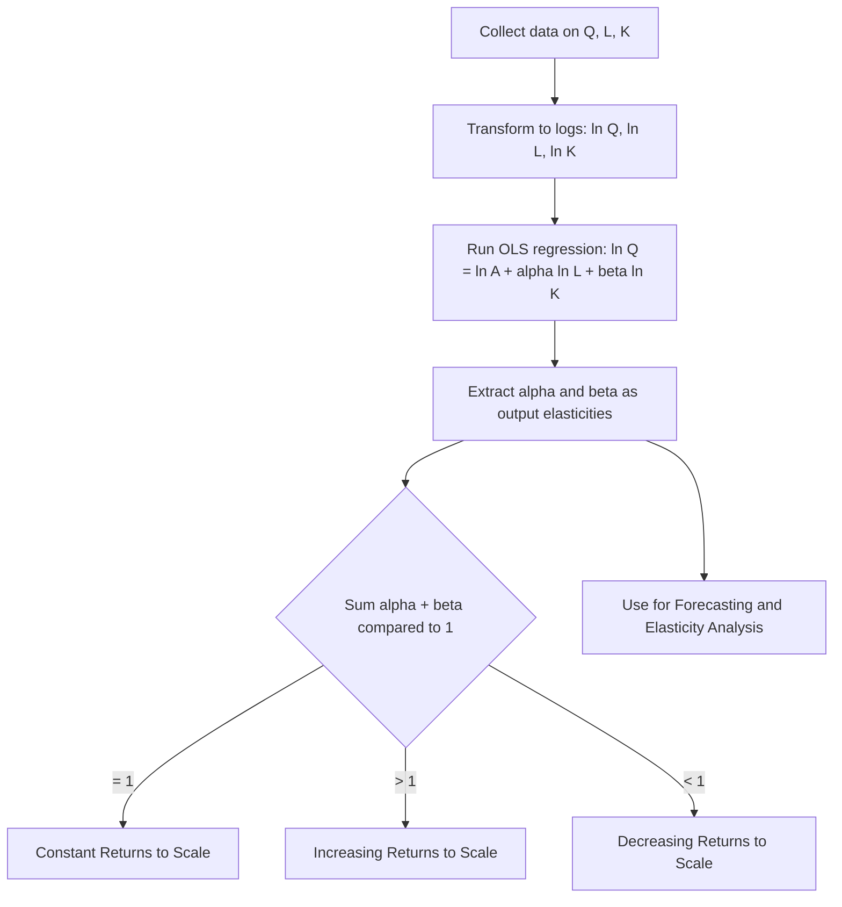

## The Cobb-Douglas and Other Production Functions

### Overview

While the general production function $Q = f(L,K)$ describes the technical relationship between inputs and output, applied managerial economics relies on specific **functional forms** to enable empirical estimation, elasticity calculation, and forecasting. The Cobb-Douglas function is the most widely used, but several alternative forms — linear, Leontief, quadratic, and CES — serve different analytical purposes depending on the assumed nature of input substitutability.

### The Cobb-Douglas Production Function

**General Form**

$$Q = A L^{\alpha} K^{\beta}$$

Where:

- $Q$ = output
- $A$ = total factor productivity (technology/efficiency parameter, $A > 0$)
- $L, K$ = labor and capital inputs
- $\alpha, \beta$ = output elasticities of labor and capital, respectively ($0 < \alpha, \beta < 1$ typically)

**Historical Origin**: Developed by Charles Cobb and Paul Douglas (1928) to statistically fit U.S. manufacturing output to capital and labor inputs, finding the relationship closely approximated $Q = AL^{0.75}K^{0.25}$ for the data they examined. [Note: this specific historical estimate is a commonly cited illustrative figure from the original study; contemporary estimates vary by industry, country, and time period.]

### Key Properties of Cobb-Douglas

**1. Output Elasticities**

$\alpha$ and $\beta$ directly represent the percentage change in output resulting from a 1% change in labor or capital, holding the other input constant:

$$\alpha = \frac{\partial Q/Q}{\partial L/L} = \frac{MP_L}{AP_L} \qquad \beta = \frac{\partial Q/Q}{\partial K/K} = \frac{MP_K}{AP_K}$$

**2. Returns to Scale**

$$Q(\lambda L, \lambda K) = \lambda^{\alpha+\beta} Q(L,K)$$

- $\alpha + \beta = 1$: constant returns to scale
- $\alpha + \beta > 1$: increasing returns to scale
- $\alpha + \beta < 1$: decreasing returns to scale

**3. Diminishing Marginal Returns to Individual Inputs**

$$MP_L = \alpha A L^{\alpha - 1}K^{\beta} = \alpha \cdot \frac{Q}{L}$$

Since $0 < \alpha < 1$, $MP_L$ declines as $L$ increases (holding $K$ fixed), consistent with the Law of Variable Proportions — even when the function exhibits constant or increasing returns to scale overall.

**4. Constant Elasticity of Substitution Equal to 1**

The Cobb-Douglas function has a fixed elasticity of substitution between labor and capital equal to exactly 1, meaning the percentage change in the capital-labor ratio associated with a 1% change in the MRTS is always 1 — a restrictive property relaxed by the more general CES functional form.

**5. Marginal Rate of Technical Substitution**

$$MRTS_{LK} = \frac{MP_L}{MP_K} = \frac{\alpha K}{\beta L}$$

### Estimation via Log-Linear Regression

The Cobb-Douglas function's key empirical advantage is that it becomes **linear in logarithms**, allowing straightforward OLS regression estimation:

$$\ln Q = \ln A + \alpha \ln L + \beta \ln K + e$$

This is estimated as a standard multiple linear regression with $\ln Q$ as the dependent variable and $\ln L$, $\ln K$ as independent variables, where the estimated coefficients directly yield $\alpha$ and $\beta$ (output elasticities).

### Numerical Example

Given estimated regression results (via OLS on firm-level or industry data):

$$\ln Q = 1.6 + 0.65 \ln L + 0.30 \ln K$$

$(R^2 = 0.91, \, t_L = 5.4, \, t_K = 3.1)$

**Interpretation**:

- $A = e^{1.6} \approx 4.95$
- $\alpha = 0.65$: a 1% increase in labor increases output by approximately 0.65%
- $\beta = 0.30$: a 1% increase in capital increases output by approximately 0.30%
- $\alpha + \beta = 0.95 < 1$: the firm/industry exhibits **decreasing returns to scale**, though close to constant returns
- Both coefficients are statistically significant given $|t| > 2$ at conventional significance levels

**Forecast**: If $L = 100$ and $K = 50$:

$$Q = 4.95 \times 100^{0.65} \times 50^{0.30} \approx 4.95 \times 19.95 \times 3.06 \approx 302$$

### Diagram: Cobb-Douglas Estimation Process

### Alternative Production Function Forms

**1. Linear Production Function**

$$Q = a + bL + cK$$

- Assumes **perfect substitutability** between inputs at a constant rate ($MRTS$ is constant)
- Constant marginal products ($MP_L = b$, $MP_K = c$ regardless of input levels)
- Rarely realistic on its own, but useful as a simplified baseline or for specific contexts involving genuinely interchangeable resources (e.g., interchangeable machine types with identical output capacity)

**2. Leontief (Fixed-Proportions) Production Function**

$$Q = \min\left(\frac{L}{a}, \frac{K}{b}\right)$$

- Assumes **zero substitutability** — inputs must be combined in strictly fixed proportions
- L-shaped isoquants; MRTS undefined along flat segments (effectively zero or infinite)
- Appropriate for processes with rigid technical requirements (e.g., one driver strictly required per vehicle, or fixed chemical reaction ratios)

**3. Constant Elasticity of Substitution (CES) Production Function**

$$Q = A\left[\delta L^{-\rho} + (1-\delta)K^{-\rho}\right]^{-1/\rho}$$

Where $\delta$ is a distribution parameter ($0 < \delta < 1$) and $\rho$ determines the elasticity of substitution $\sigma = 1/(1+\rho)$.

**Key Points**

- CES generalizes Cobb-Douglas, Leontief, and linear forms as **limiting/special cases**:
  - As $\rho \to 0$: CES approaches the Cobb-Douglas form ($\sigma = 1$)
  - As $\rho \to \infty$: CES approaches the Leontief form ($\sigma = 0$, no substitutability)
  - As $\rho \to -1$: CES approaches the linear form ($\sigma \to \infty$, perfect substitutability)
- This flexibility makes CES valuable in advanced empirical work where the elasticity of substitution itself is a parameter of interest rather than assumed fixed at 1.

**4. Quadratic Production Function**

$$Q = a + bL + cK + dL^2 + eK^2 + fLK$$

- Allows for **both increasing and diminishing marginal returns** within a single function (via the squared terms), useful for capturing the full three-stage TP curve shape in empirical short-run estimation
- More flexible than Cobb-Douglas for capturing non-monotonic marginal product behavior, at the cost of more parameters to estimate

**5. Translog (Transcendental Logarithmic) Production Function**

$$\ln Q = a_0 + a_L \ln L + a_K \ln K + \frac{1}{2}b_{LL}(\ln L)^2 + \frac{1}{2}b_{KK}(\ln K)^2 + b_{LK}\ln L \ln K$$

- A flexible **second-order approximation** to any underlying production function, widely used in advanced empirical/econometric production analysis
- Does not impose a constant elasticity of substitution (unlike Cobb-Douglas), allowing the data to reveal varying substitutability across the input range
- Requires more data and more complex estimation than Cobb-Douglas; primarily used in academic/advanced applied econometric research rather than routine managerial forecasting

### Comparison Table of Production Function Forms

| Form | Substitutability (Elasticity, $\sigma$) | Returns to Scale Flexibility | Estimation Complexity | Typical Use |
| --- | --- | --- | --- | --- |
| Linear | Perfect ($\sigma = \infty$) | Fixed by coefficients | Low | Simplified baseline, perfect substitutes |
| Leontief | None ($\sigma = 0$) | Fixed by coefficients | Low | Rigid technical processes |
| Cobb-Douglas | Unitary ($\sigma = 1$, fixed) | Determined by $\alpha+\beta$ | Low (log-linear OLS) | Standard applied/managerial estimation |
| CES | Any constant $\sigma$ | Flexible | Moderate to high (nonlinear estimation) | When substitutability itself is of interest |
| Quadratic | Varies across range | Flexible, can show all 3 stages | Moderate | Short-run empirical TP/MP estimation |
| Translog | Varies across range (flexible form) | Flexible | High | Advanced econometric research |

### Diagram: Isoquant Shapes Across Functional Forms (svg_diagram)

<svg xmlns="http://www.w3.org/2000/svg" viewBox="0 0 720 320">
<rect x="0" y="0" width="720" height="320" fill="#ffffff" />
<text x="360" y="22" text-anchor="middle" font-size="15" font-weight="bold" fill="#1a1a1a">Isoquant Shapes by Functional Form (svg_diagram)</text>
<line x1="50" y1="270" x2="220" y2="270" stroke="#333" stroke-width="1" />
<line x1="50" y1="120" x2="50" y2="270" stroke="#333" stroke-width="1" />
<line x1="60" y1="260" x2="200" y2="140" stroke="#2563eb" stroke-width="2.5" />
<text x="90" y="290" text-anchor="middle" font-size="10" fill="#333">Linear (perfect substitutes)</text>
<line x1="270" y1="270" x2="440" y2="270" stroke="#333" stroke-width="1" />
<line x1="270" y1="120" x2="270" y2="270" stroke="#333" stroke-width="1" />
<path d="M 320 130 L 320 220 L 410 220" fill="none" stroke="#dc2626" stroke-width="2.5" />
<text x="355" y="290" text-anchor="middle" font-size="10" fill="#333">Leontief (fixed proportions)</text>
<line x1="490" y1="270" x2="660" y2="270" stroke="#333" stroke-width="1" />
<line x1="490" y1="120" x2="490" y2="270" stroke="#333" stroke-width="1" />
<path d="M 510 260 C 540 190, 580 145, 640 135" fill="none" stroke="#16a34a" stroke-width="2.5" />
<text x="575" y="290" text-anchor="middle" font-size="10" fill="#333">Cobb-Douglas / CES (convex)</text>
</svg>

### Empirical Considerations in Choosing a Functional Form

**Key Points**

- **Cobb-Douglas** remains the default choice for routine managerial estimation due to its simplicity, ease of log-linear OLS estimation, and directly interpretable elasticities.
- **CES** is preferred when the assumption of unitary elasticity of substitution ($\sigma=1$) is theoretically or empirically questionable — for example, industries where capital and labor are known to be poor substitutes (near-Leontief) or unusually good substitutes.
- **Translog** and other flexible forms are typically reserved for advanced econometric/academic research rather than routine business forecasting, given their higher data and estimation requirements.
- **Model selection** should be guided by statistical tests (e.g., comparing model fit, testing restrictions like $\sigma=1$ via nested hypothesis tests) rather than convenience alone, though in practice Cobb-Douglas's tractability often makes it the pragmatic first choice in managerial applications. [Inference: the relative empirical performance of these functional forms is industry- and dataset-specific, and no single form is universally superior across all applications.]

### Limitations Common to All Production Function Estimation

- **Aggregation issues**: Aggregating heterogeneous labor (varying skill levels) or capital (varying vintage/type) into single scalar inputs $L$ and $K$ necessarily obscures real-world heterogeneity.
- **Endogeneity concerns**: Input choices ($L$, $K$) may be correlated with unobserved productivity shocks (e.g., a firm hires more labor precisely because it anticipates higher demand), potentially biasing OLS estimates — addressed in advanced literature via instrumental variables or specialized estimation techniques (e.g., Olley-Pakes, Levinsohn-Petrin methods).
- **Technology assumed constant within the estimation period**: Structural technological change during the sample period, if unaccounted for, can bias elasticity estimates.
- **Functional form misspecification risk**: Imposing an incorrect functional form (e.g., assuming Cobb-Douglas when the true relationship is closer to Leontief) can produce systematically biased elasticity and returns-to-scale estimates.

### Application in Managerial Decision-Making

- **Input elasticity estimation**: Cobb-Douglas coefficients directly quantify how responsive output is to labor versus capital, guiding resource allocation priorities.
- **Returns to scale assessment**: Informs plant-sizing and expansion decisions based on whether $\alpha+\beta$ indicates increasing, constant, or decreasing returns.
- **Technology and automation investment evaluation**: Comparing estimated elasticities/substitutability across functional forms informs decisions about capital-labor substitution in response to changing wage or capital costs.
- **Production forecasting**: The fitted function enables output projections under different planned input combinations, supporting capacity and budget planning.
- **Benchmarking productivity (Total Factor Productivity)**: The estimated parameter $A$ serves as a measure of technological efficiency, useful for benchmarking across plants, time periods, or competitors.

**Related Topics**

- Production function concepts and assumptions
- Returns to scale and long-run production analysis
- Isoquants, isocost lines, and producer equilibrium
- Total, average, and marginal product relationships
- Econometric forecasting models
- Total Factor Productivity measurement
- Elasticity of substitution and factor demand theory