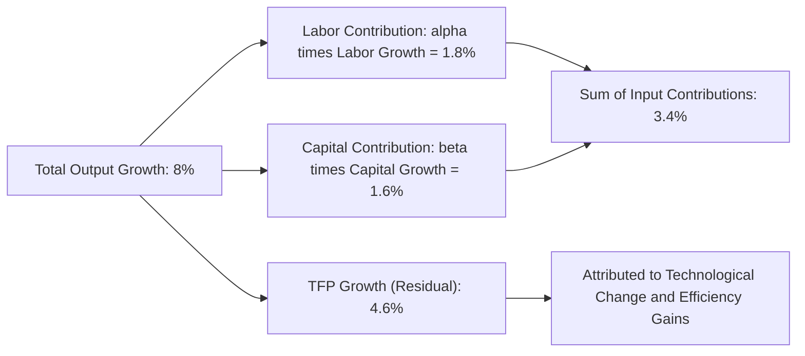

## Technological Change and Productivity Growth


### Overview

Technological change refers to any improvement in the state of knowledge, techniques, or processes that allows a firm or economy to produce **more output from the same inputs**, or the **same output from fewer inputs**, shifting the underlying production function itself rather than merely representing movement along an existing isoquant or TP curve. Productivity growth — the rate at which output per unit of input increases over time — is largely driven by technological change and is a central determinant of long-run economic growth, competitiveness, and profitability.

### Distinguishing Technological Change from Movements Along the Production Function

| Concept | What Changes | Graphical Effect |
| --- | --- | --- |
| Movement along a given production function | Input quantities (more $L$ or $K$) | Movement along the same isoquant or TP curve |
| Technological change | The production function itself | Isoquants shift inward (same output, fewer inputs) / TP curve shifts upward (more output, same inputs) |

Formally, if the original function is $Q = f(L,K)$, technological change produces a **new** function $Q' = g(L,K)$ such that $g(L,K) > f(L,K)$ for the same input combination — often modeled with an explicit time or technology-shift parameter:

$$Q = A(t) \cdot f(L,K)$$

Where $A(t)$ represents the level of technology/total factor productivity at time $t$, growing over time as innovation occurs.

### Diagram: Effect of Technological Change on the Production Function

```mermaid
flowchart TD
    A[Original Production Function: Q = f L,K] --> B[Technological Change Occurs]
    B --> C[New Production Function: Q' = A(t) f L,K, with A(t) greater than 1]
    C --> D[TP curve shifts upward - more output per input level]
    C --> E[Isoquants shift inward - same output achievable with fewer inputs]
    C --> F[MP and AP curves shift upward]
    D --> G[Increased Total Factor Productivity]
```

### Diagram: Isoquant Shift Due to Technological Change (svg_diagram)

<svg xmlns="http://www.w3.org/2000/svg" viewBox="0 0 640 380">
<rect x="0" y="0" width="640" height="380" fill="#ffffff" />
<text x="320" y="24" text-anchor="middle" font-size="15" font-weight="bold" fill="#1a1a1a">Technological Change: Isoquant Shift (svg_diagram)</text>
<line x1="60" y1="330" x2="580" y2="330" stroke="#333" stroke-width="1.5" />
<line x1="60" y1="50" x2="60" y2="330" stroke="#333" stroke-width="1.5" />
<text x="320" y="360" text-anchor="middle" font-size="12" fill="#333">Labor (L)</text>
<text x="25" y="190" text-anchor="middle" font-size="12" fill="#333" transform="rotate(-90 25,190)">Capital (K)</text>
<path d="M 150 320 C 200 220, 300 130, 500 100" fill="none" stroke="#94a3b8" stroke-width="2.5" stroke-dasharray="6,3" />
<text x="500" y="95" font-size="10" fill="#64748b">Original isoquant Q0 (before)</text>
<path d="M 100 320 C 140 200, 220 100, 380 75" fill="none" stroke="#16a34a" stroke-width="2.5" />
<text x="380" y="65" font-size="10" fill="#16a34a" font-weight="bold">New isoquant Q0 (after) — same output, fewer inputs</text>
<circle cx="280" cy="175" r="4" fill="#666" />
<circle cx="220" cy="175" r="4" fill="#16a34a" />
<line x1="220" y1="175" x2="280" y2="175" stroke="#dc2626" stroke-width="2" marker-end="url(#arrow)" />
</svg>

### Types of Technological Change

**1. Neutral Technological Change**

Increases output without altering the optimal capital-labor ratio at given relative input prices; the isoquant shifts inward proportionally without changing its shape/slope at any given ray from the origin.

$$Q' = A \cdot f(L,K), \quad A > 1$$

**Hicks-neutral**: Leaves the MRTS unchanged at any given $K/L$ ratio.

**Harrod-neutral (labor-augmenting)**: Effectively increases the productivity of labor, expressed as $Q = f(A_L \cdot L, K)$.

**Solow-neutral (capital-augmenting)**: Effectively increases the productivity of capital, expressed as $Q = f(L, A_K \cdot K)$.

**2. Labor-Saving (Capital-Deepening) Technological Change**

Increases the marginal product of capital relative to labor at any given input ratio, inducing firms to substitute toward capital-intensive production methods (e.g., automation, robotics).

**3. Capital-Saving (Labor-Deepening) Technological Change**

Increases the marginal product of labor relative to capital, inducing firms to substitute toward labor-intensive methods — historically less common in advanced economies but relevant in specific contexts (e.g., certain agricultural innovations in labor-abundant economies).

### Sources of Technological Change and Productivity Growth

| Source | Description |
| --- | --- |
| Process innovation | New or improved methods of production (e.g., lean manufacturing, automation) |
| Product innovation | New products, though primarily affects demand-side rather than production-function shifts |
| Organizational/managerial innovation | Improved organizational structures, incentive systems, supply chain management |
| Research and Development (R&D) | Formal investment in discovering new techniques, materials, or processes |
| Learning-by-doing | Productivity gains from cumulative production experience, distinct from formal R&D |
| Human capital improvement | Education, training, and skill development raising effective labor productivity |
| Embodied technological change | Improvements embedded in newly purchased capital equipment/vintage |
| Diffusion/adoption of existing technology | Productivity gains from adopting technology already developed elsewhere, not necessarily invented in-house |

### Measuring Productivity Growth: Total Factor Productivity (TFP)

**Total Factor Productivity (TFP)** measures the portion of output growth **not explained** by growth in measured inputs (labor and capital) — essentially, a residual capturing technological progress, efficiency gains, and other unmeasured factors.

**Growth Accounting Framework** (Solow Residual):

$$\frac{\Delta Q}{Q} = \frac{\Delta A}{A} + \alpha\frac{\Delta L}{L} + \beta\frac{\Delta K}{K}$$

Rearranged to isolate TFP growth:

$$\frac{\Delta A}{A} = \frac{\Delta Q}{Q} - \alpha\frac{\Delta L}{L} - \beta\frac{\Delta K}{K}$$

Where $\alpha$ and $\beta$ are the output elasticities of labor and capital (from the Cobb-Douglas framework), often approximated empirically by labor's and capital's shares of total income.

### Numerical Example

**Given**: A firm's output grew 8% over a year. Labor input grew 3%, capital input grew 4%. Output elasticities: $\alpha = 0.6$ (labor), $\beta = 0.4$ (capital).

**Step 1**: Compute the input-driven contribution to output growth:

$$\alpha \frac{\Delta L}{L} + \beta \frac{\Delta K}{K} = 0.6(3\%) + 0.4(4\%) = 1.8\% + 1.6\% = 3.4\%$$

**Step 2**: Compute the TFP (technological change) contribution as the residual:

$$\frac{\Delta A}{A} = 8\% - 3.4\% = 4.6\%$$

**Interpretation**: Of the firm's 8% output growth, only 3.4 percentage points are explained by increased use of labor and capital; the remaining **4.6 percentage points represent Total Factor Productivity growth** — attributable to technological improvement, better organization, more efficient processes, or other unmeasured efficiency gains.

### Diagram: Growth Accounting Decomposition



### The Learning Curve (Experience Curve)

A related but distinct concept from formal technological change: the **learning curve** describes how the labor cost or time required per unit of output declines as cumulative production experience increases, even absent any explicit new technology.

$$C_n = C_1 \cdot n^{-b}$$

Where $C_n$ is the cost of producing the $n$-th unit, $C_1$ is the cost of the first unit, and $b$ is the learning rate parameter (related to the "percentage learning curve," e.g., an 80% learning curve implies unit cost falls to 80% each time cumulative output doubles).

**Key Points**

- Learning-by-doing is often distinguished from formal R&D-driven technological change, though both contribute to overall measured productivity growth (TFP).
- Learning curve effects are particularly significant in the early stages of a new product or process, tapering off as experience accumulates.

### Impact of Technological Change on Cost Curves

Technological progress that increases $A(t)$ shifts:

- **Short-run TP curve upward** (more output for the same labor at fixed capital)
- **Short-run and long-run average/marginal cost curves downward** (lower cost per unit at any given output level)
- **Isoquants inward** (the same output achievable with fewer total inputs)

This cost-curve effect is the primary channel through which technological change translates into improved competitiveness and profitability at the firm level.

### Diminishing Returns to R&D Investment

While technological change shifts the production function favorably, **R&D investment itself** is typically subject to diminishing returns: successive increments of R&D spending tend to yield progressively smaller improvements in productivity, particularly as "easy" innovations are exhausted within a given technological paradigm. [Inference: the specific rate at which R&D returns diminish is highly field- and firm-specific, and periodic breakthrough innovations can temporarily reverse this pattern.]

### Limitations and Measurement Challenges

- **TFP as a "residual" or measure of ignorance**: Because TFP is computed as whatever output growth is *not* explained by measured input growth, it inherently captures not just technological change but also measurement error, changes in input quality not fully captured by simple quantity measures, and other unobserved factors — commonly noted in the growth-accounting literature as a limitation of interpreting the residual purely as "technology."
- **Difficulty isolating specific sources**: Distinguishing how much of measured TFP growth stems from formal R&D versus organizational improvements versus learning-by-doing is empirically challenging.
- **Lags between innovation and measured productivity gains**: New technologies often require complementary organizational and workforce adjustments before productivity gains are fully realized, creating measurement lags (sometimes called the "productivity paradox," historically observed with the delayed measured productivity impact of information technology investment).
- **Heterogeneous technology adoption rates**: Firms within the same industry often adopt new technology at different rates, meaning aggregate/industry-level TFP figures may mask substantial firm-level variation.

### Application in Managerial Decision-Making

- **R&D investment prioritization**: Growth accounting analysis helps firms assess the historical productivity payoff from past R&D spending, informing future investment levels.
- **Technology adoption decisions**: Understanding whether new technology is labor-saving or capital-saving informs complementary workforce and capital investment planning.
- **Competitive benchmarking**: Comparing TFP growth rates against industry peers or competitors provides an objective measure of relative innovation and efficiency performance.
- **Cost forecasting**: Anticipated technological improvements should be factored into long-run cost projections, since ignoring expected productivity gains can lead to overly pessimistic cost and pricing forecasts.
- **Workforce planning and training investment**: Recognizing the role of human capital and learning-by-doing in productivity growth supports the business case for training and skill-development programs.
- **Strategic planning around automation**: Assessing whether emerging technology is labor-saving informs long-term workforce composition and capital investment strategy.

**Related Topics**

- Production function concepts and assumptions
- Cobb-Douglas and other production functions
- Returns to scale and long-run production analysis
- Total Factor Productivity measurement and growth accounting
- Long-run cost curves and economies of scale
- Learning curve / experience curve effects on cost
- Innovation and R&D investment decisions