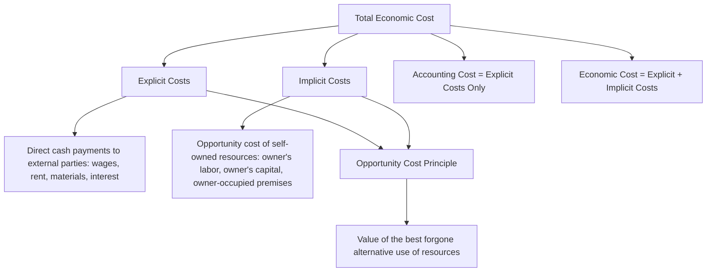

## Cost Concepts: Explicit, Implicit, and Opportunity Costs

### Overview

Before analyzing cost curves and production decisions, managerial economics requires a precise understanding of what "cost" actually means. Unlike accounting cost, which records only actual monetary outlays, **economic cost** incorporates the full resource cost of a decision, including the value of forgone alternatives. This distinction — centered on the concepts of explicit cost, implicit cost, and opportunity cost — underlies the difference between accounting profit and economic profit, and is foundational to all subsequent cost and decision analysis in managerial economics.

### Explicit Costs

**Definition**: Explicit costs (also called accounting costs or out-of-pocket costs) are actual monetary payments made by a firm to outside parties for resources used in production — costs that involve a direct, recorded cash outflow.

**Examples**:

- Wages and salaries paid to employees
- Rent paid for premises
- Payments for raw materials and supplies
- Utility bills (electricity, water)
- Interest paid on borrowed funds
- Insurance premiums

**Key Points**

- Explicit costs are recorded in a firm's accounting books and are the basis for calculating **accounting profit**.
- They represent contractual or transactional obligations to external parties.

### Implicit Costs

**Definition**: Implicit costs (also called imputed costs) are the costs of using resources that the firm **already owns**, for which no direct monetary payment is made, but which have an opportunity cost because they could have been employed elsewhere for a return.

**Examples**:

- The forgone salary an owner-manager could have earned working elsewhere instead of running their own business
- The forgone rental income from a firm-owned building being used for the firm's own operations rather than leased out
- The forgone return on the owner's capital invested in the business rather than in an alternative investment (e.g., a bond or another business)
- Depreciation of self-owned equipment not reflected in cash outflows

**Key Points**

- Implicit costs do not appear in standard accounting statements because no cash changes hands.
- They are, however, genuine economic costs, since the resources used have alternative valuable uses that are forgone.
- Ignoring implicit costs can lead to systematically overstated perceptions of profitability, particularly for small business owners who supply their own labor and capital.

### Opportunity Cost

**Definition**: Opportunity cost is the value of the **best forgone alternative** when a choice is made among mutually exclusive options — the benefit that would have been received had the resources been employed in their next-best use.

$$\text{Opportunity Cost of Choice A} = \text{Value of Best Forgone Alternative (Choice B)}$$

**Key Points**

- Opportunity cost is a **general economic principle**, not exclusively a cost-accounting category; it applies to any resource allocation decision, not just production inputs.
- Both explicit and implicit costs can be understood through the lens of opportunity cost: explicit costs represent the opportunity cost of funds that could have been spent elsewhere, while implicit costs represent the opportunity cost of self-owned resources.
- Opportunity cost is central to rational decision-making because it captures the **true** economic cost of a decision, not merely its cash cost.

### Diagram: Relationship Among Cost Concepts

### Accounting Profit vs. Economic Profit

$$\text{Accounting Profit} = \text{Total Revenue} - \text{Explicit Costs}$$

$$\text{Economic Profit} = \text{Total Revenue} - (\text{Explicit Costs} + \text{Implicit Costs})$$

Equivalently:

$$\text{Economic Profit} = \text{Accounting Profit} - \text{Implicit Costs}$$

**Key Points**

- Economic profit is **always less than or equal to** accounting profit, since implicit costs are always non-negative.
- **Normal profit** is defined as the minimum level of accounting profit required to just cover the entrepreneur's implicit costs — the level at which economic profit equals exactly zero.
- A firm earning **zero economic profit** is still earning a **positive accounting profit** equal to its normal profit — this is a critical distinction frequently misunderstood: zero economic profit does not mean the business is failing; it means the business is earning exactly enough to compensate the owner for all resources committed, including their forgone alternatives.
- **Positive economic profit** ("supernormal" or "abnormal" profit) indicates the firm is earning more than what is required to keep the owner's resources committed to this particular use — signaling potential entry incentives for competitors in a competitive market.

### Numerical Example

**Scenario**: Maria owns and operates a bakery. Her financial results for the year:

- Total Revenue: $250,000
- Explicit Costs (ingredients, rent paid to a landlord for the shop, wages to employees, utilities): $180,000

**Implicit Costs**:

- Maria could earn $60,000/year as a pastry chef at another company (forgone salary)
- Maria invested $100,000 of her own savings into the business; if instead invested elsewhere (e.g., a diversified portfolio), she could expect a 6% annual return: $100,000 \times 0.06 = \$6,000$ forgone return
- Total implicit costs: $60,000 + 6,000 = \$66,000$

**Step 1: Compute Accounting Profit**

$$\text{Accounting Profit} = 250,000 - 180,000 = \$70,000$$

**Step 2: Compute Economic Profit**

$$\text{Economic Profit} = 250,000 - (180,000 + 66,000) = 250,000 - 246,000 = \$4,000$$

**Interpretation**: Although Maria's bakery shows a healthy $70,000 accounting profit, once the opportunity cost of her own labor and capital is properly accounted for, her true economic profit is only $4,000. This modest positive economic profit suggests the bakery is *just barely* a better use of her time and money than her best alternative (working elsewhere and investing her savings), but not dramatically so — a critical insight an accounting-profit-only view would completely miss.

### Diagram: Accounting Profit vs. Economic Profit (svg_diagram)

<svg xmlns="http://www.w3.org/2000/svg" viewBox="0 0 640 360">
<rect x="0" y="0" width="640" height="360" fill="#ffffff" />
<text x="320" y="24" text-anchor="middle" font-size="15" font-weight="bold" fill="#1a1a1a">Accounting Profit vs. Economic Profit (svg_diagram)</text>
<rect x="220" y="60" width="200" height="260" fill="#e0f2fe" stroke="#0369a1" stroke-width="1" />
<text x="320" y="50" text-anchor="middle" font-size="12" font-weight="bold" fill="#0369a1">Total Revenue: $250,000</text>
<rect x="220" y="230" width="200" height="90" fill="#fecaca" />
<text x="320" y="280" text-anchor="middle" font-size="11" fill="#991b1b">Explicit Costs: $180,000</text>
<rect x="220" y="150" width="200" height="80" fill="#fed7aa" />
<text x="320" y="195" text-anchor="middle" font-size="11" fill="#9a3412">Implicit Costs: $66,000</text>
<rect x="220" y="130" width="200" height="20" fill="#bbf7d0" />
<text x="320" y="145" text-anchor="middle" font-size="10" fill="#166534">Economic Profit: $4,000</text>
<line x1="440" y1="230" x2="480" y2="230" stroke="#333" stroke-width="1" />
<text x="485" y="234" font-size="10" fill="#333">← Accounting Profit = $70,000 (above this line)</text>
<line x1="440" y1="150" x2="480" y2="150" stroke="#333" stroke-width="1" />
<text x="485" y="154" font-size="10" fill="#333">← Economic Profit boundary</text>
</svg>

### Sunk Costs — A Related but Distinct Concept

**Sunk costs** are costs that have already been incurred and **cannot be recovered**, regardless of future decisions. They are conceptually important precisely because they should be **excluded** from forward-looking decision-making — a rational decision-maker considers only relevant costs (those that differ across the alternatives being compared), and sunk costs by definition do not differ across future choices since they have already been paid.

**Key Points**

- Sunk costs are **not** opportunity costs — opportunity cost concerns forgone alternatives for a *current or future* decision, while sunk cost concerns *past* expenditure with no bearing on future alternatives.
- The "sunk cost fallacy" refers to the common behavioral error of continuing an activity (a project, an investment) because of resources already committed, rather than an objective, forward-looking evaluation of expected future costs and benefits.

### Comparison Summary Table

| Concept | Cash Outflow? | Recorded in Accounting Statements? | Relevant to Economic Decision-Making? |
| --- | --- | --- | --- |
| Explicit cost | Yes | Yes | Yes |
| Implicit cost | No | No | Yes |
| Opportunity cost | Not necessarily | No | Yes (foundational concept) |
| Sunk cost | Yes (in the past) | Yes (historically) | No (irrelevant to future decisions) |

### Limitations and Practical Considerations

- **Implicit cost estimation is inherently subjective**: Quantifying the value of an owner's forgone salary or forgone investment return requires assumptions about the best available alternative, which may not be precisely known or may vary depending on the comparison chosen. [Inference: the specific implicit cost figures used in practice depend on judgment calls about the relevant "next-best alternative," and reasonable analysts may arrive at different estimates for the same situation.]
- **Not all opportunity costs are easily monetized**: Some forgone alternatives (e.g., leisure time, risk tolerance, non-pecuniary job satisfaction) resist straightforward dollar valuation, complicating a fully rigorous economic profit calculation.
- **Accounting standards do not require implicit cost reporting**: Financial statements prepared under standard accounting principles (e.g., GAAP/IFRS) report only explicit costs, meaning economic profit must typically be estimated separately by managers or analysts for internal decision-making purposes.

### Application in Managerial Decision-Making

- **Make-or-buy and resource allocation decisions**: Properly incorporating implicit costs (e.g., the opportunity cost of using owned facilities for one product line versus another) leads to more accurate profitability comparisons across alternatives.
- **Business viability assessment**: Evaluating whether a business is truly worth continuing requires comparing economic profit (not just accounting profit) against the owner's best alternative use of time and capital.
- **Capital budgeting and investment appraisal**: Opportunity cost underlies the determination of the discount rate/cost of capital used in evaluating investment projects.
- **Avoiding sunk cost bias**: Recognizing which costs are sunk (and therefore irrelevant) prevents managers from continuing underperforming projects or product lines purely because of prior investment.
- **Entry and exit decisions**: A firm earning zero or negative economic profit, even while showing positive accounting profit, signals that resources might be better deployed elsewhere — informing rational exit or reallocation decisions.

**Related Topics**

- Short-run and long-run cost curves
- Sunk cost fallacy and relevant costs in decision-making
- Normal profit, economic profit, and market entry/exit decisions
- Cost-volume-profit (break-even) analysis
- Capital budgeting and the cost of capital
- Production function concepts and assumptions