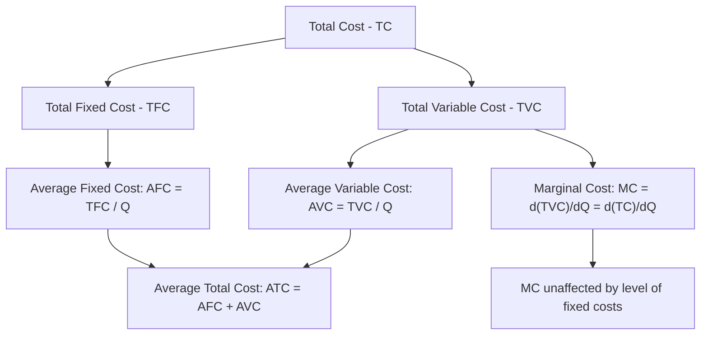
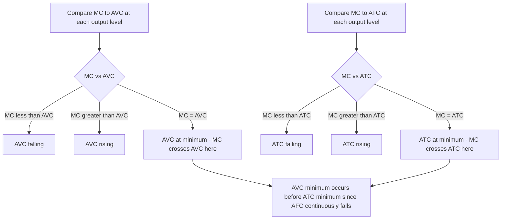

## Short-Run Cost Curves and Their Relationships

### Overview

Short-run cost curves describe how a firm's total, average, and marginal costs behave as output varies, given at least one fixed input (typically plant/capital). These curves are derived directly from the underlying short-run production function and the Law of Variable Proportions, translating the technical input-output relationship into cost terms using input prices. Understanding the shapes of, and relationships among, these curves is essential for short-run output and pricing decisions.

### The Short-Run Cost Categories

**1. Total Fixed Cost (TFC)**

Costs that do not vary with the level of output in the short run — incurred even if output is zero.

$$TFC = \text{constant, independent of } Q$$

Examples: rent on fixed facilities, insurance premiums, depreciation of fixed capital, salaries of permanent administrative staff.

**2. Total Variable Cost (TVC)**

Costs that vary directly with the level of output, rising as more of the variable input is employed.

$$TVC = w \cdot L(Q)$$

Where $w$ is the price of the variable input (e.g., wage rate) and $L(Q)$ is the quantity of the variable input required to produce output $Q$.

**3. Total Cost (TC)**

$$TC = TFC + TVC$$

**4. Average Fixed Cost (AFC)**

$$AFC = \frac{TFC}{Q}$$

Continuously declines as output rises, since a fixed cost is spread over more units — this pattern is sometimes called "spreading the overhead."

**5. Average Variable Cost (AVC)**

$$AVC = \frac{TVC}{Q}$$

**6. Average Total Cost (ATC)**, also called Average Cost (AC)

$$ATC = \frac{TC}{Q} = AFC + AVC$$

**7. Marginal Cost (MC)**

The additional cost incurred from producing one more unit of output:

$$MC = \frac{\Delta TC}{\Delta Q} = \frac{d(TC)}{dQ} = \frac{d(TVC)}{dQ}$$

**Key Points**: Since $TFC$ is constant, $d(TFC)/dQ = 0$, meaning MC is driven **entirely** by the variable cost component — $MC = d(TVC)/dQ$ always, regardless of the level of fixed costs.

### Diagram: Relationship Between Cost Categories

### Link to Production Theory: Why Cost Curves Are U-Shaped

Cost curves derive their shape directly from the Law of Variable Proportions governing marginal and average product:

$$MC = \frac{w}{MP_L} \qquad AVC = \frac{w}{AP_L}$$

Since $MP_L$ initially rises then falls (per the Law of Variable Proportions), $MC$ initially **falls** then **rises** — an inverse mirror-image relationship. Similarly, since $AP_L$ initially rises then falls, $AVC$ initially falls then rises.

**Key Points**

- $MC$ reaches its minimum at the labor level where $MP_L$ is at its maximum.
- $AVC$ reaches its minimum at the labor level where $AP_L$ is at its maximum — precisely the boundary between Stage I and Stage II in production theory.
- This inverse relationship is the essential bridge connecting production theory (Chapter: Theory of Production) to cost theory.

### Diagram: Short-Run Cost Curves (svg_diagram)

<svg xmlns="http://www.w3.org/2000/svg" viewBox="0 0 720 420">
<rect x="0" y="0" width="720" height="420" fill="#ffffff" />
<text x="360" y="24" text-anchor="middle" font-size="16" font-weight="bold" fill="#1a1a1a">Short-Run Average and Marginal Cost Curves (svg_diagram)</text>
<line x1="60" y1="370" x2="680" y2="370" stroke="#333" stroke-width="1.5" />
<line x1="60" y1="50" x2="60" y2="370" stroke="#333" stroke-width="1.5" />
<text x="370" y="400" text-anchor="middle" font-size="12" fill="#333">Output (Q)</text>
<text x="25" y="210" text-anchor="middle" font-size="12" fill="#333" transform="rotate(-90 25,210)">Cost per Unit</text>
<path d="M 90 130 C 250 340, 550 340, 660 355" fill="none" stroke="#f59e0b" stroke-width="2" stroke-dasharray="5,3" />
<text x="150" y="120" font-size="10" fill="#b45309" font-weight="bold">AFC</text>

<path d="M 100 320 C 200 210, 280 175, 340 175 C 420 175, 500 220, 620 310" fill="none" stroke="`#16a34a`" stroke-width="2.5" />

<text x="480" y="200" font-size="11" fill="`#16a34a`" font-weight="bold">AVC</text>

<path d="M 100 340 C 220 230, 300 200, 370 200 C 450 205, 540 250, 660 340" fill="none" stroke="`#2563eb`" stroke-width="2.5" />

<text x="540" y="255" font-size="11" fill="`#2563eb`" font-weight="bold">ATC</text>

<path d="M 100 250 C 170 170, 250 150, 300 200 C 380 260, 480 320, 580 370 C 610 385, 640 390, 660 393" fill="none" stroke="`#dc2626`" stroke-width="2.5" />

<text x="220" y="150" font-size="11" fill="`#dc2626`" font-weight="bold">MC</text>

<circle cx="340" cy="175" r="3" fill="#16a34a" />
<circle cx="370" cy="200" r="3" fill="#2563eb" />
</svg>

### Key Geometric Relationships

**1. MC Intersects AVC and ATC at Their Minimum Points**

The MC curve passes through the minimum point of both the AVC curve and the ATC curve — a mathematically guaranteed property directly analogous to the MP-AP relationship in production theory.

$$\text{If } MC < AVC \Rightarrow AVC \text{ is falling} \qquad \text{If } MC > AVC \Rightarrow AVC \text{ is rising}$$

$$\text{If } MC < ATC \Rightarrow ATC \text{ is falling} \qquad \text{If } MC > ATC \Rightarrow ATC \text{ is rising}$$

**2. ATC Minimum Occurs After AVC Minimum**

Since $ATC = AFC + AVC$, and $AFC$ is continuously declining, the ATC curve reaches its minimum at a **higher output level** than the AVC curve — the continuously falling AFC pulls the ATC minimum to the right of the AVC minimum, with the two curves converging (but never meeting) as output grows large, since $AFC \to 0$ as $Q \to \infty$.

**3. The Vertical Gap Between ATC and AVC Equals AFC**

$$ATC - AVC = AFC$$

This gap continuously narrows as output increases, since $AFC$ falls toward zero.

### Numerical Example

Given $TFC = \$200$, and the following variable cost/output schedule:

| $Q$ | $TVC$ | $TC$ | $AFC$ | $AVC$ | $ATC$ | $MC$ |
| --- | --- | --- | --- | --- | --- | --- |
| 1 | 100 | 300 | 200.0 | 100.0 | 300.0 | 100 |
| 2 | 180 | 380 | 100.0 | 90.0 | 190.0 | 80 |
| 3 | 240 | 440 | 66.7 | 80.0 | 146.7 | 60 |
| 4 | 320 | 520 | 50.0 | 80.0 | 130.0 | 80 |
| 5 | 420 | 620 | 40.0 | 84.0 | 124.0 | 100 |
| 6 | 540 | 740 | 33.3 | 90.0 | 123.3 | 120 |
| 7 | 700 | 900 | 28.6 | 100.0 | 128.6 | 160 |

**Step-by-step interpretation**:

- **AVC minimum** occurs at $Q=3$ (AVC = 80), where $MC$ (60 going into $Q=3$, entering 80 range) crosses AVC.
- More precisely: at $Q=3$, $MC=60 < AVC=80$ (pulling AVC down slightly, minimum reached around $Q=3$–$4$ where MC=AVC≈80).
- **ATC minimum** occurs at $Q=6$ (ATC = 123.3), notably **later** than the AVC minimum at $Q=3$–4 — illustrating that ATC's minimum lags AVC's minimum due to the continuously falling AFC component.
- At $Q=7$, $MC=160$ has risen well above both AVC (100) and ATC (128.6), pulling both averages upward — confirming the firm has moved well into the rising portion of both curves.

### Diagram: MC, AVC, ATC Intersection Logic

### Why MC Crosses AVC and ATC Precisely at Their Minimums

This is a mathematical consequence of the marginal-average relationship (identical in structure to the MP-AP relationship in production theory):

$$\frac{d(AVC)}{dQ} = \frac{MC - AVC}{Q}$$

- When $MC < AVC$: the derivative is negative, so AVC is falling.
- When $MC > AVC$: the derivative is positive, so AVC is rising.
- When $MC = AVC$: the derivative is zero, marking AVC's turning point (minimum).

The identical logic applies to $ATC$, replacing $AVC$ with $ATC$ in the formula above.

### Total Cost Curve Shapes

**Total Fixed Cost (TFC)**: A horizontal line, constant at all output levels (including $Q=0$).

**Total Variable Cost (TVC)**: Starts at the origin (zero output, zero variable cost), initially rising at a **decreasing** rate (reflecting increasing marginal returns/Stage I), then rising at an **increasing** rate (reflecting diminishing marginal returns/Stage II) — an S-shaped (or "inverse-S") curve, mirroring the inverted shape of the TP curve.

**Total Cost (TC)**: Identical shape to TVC, but shifted vertically upward by the constant amount $TFC$; TC and TVC are always separated by the same vertical distance ($TFC$) at every output level, and thus have identical slopes (and hence identical MC) at every point.

### Diagram: TFC, TVC, TC Curves (svg_diagram)

<svg xmlns="http://www.w3.org/2000/svg" viewBox="0 0 640 360">
<rect x="0" y="0" width="640" height="360" fill="#ffffff" />
<text x="320" y="24" text-anchor="middle" font-size="15" font-weight="bold" fill="#1a1a1a">TFC, TVC, TC Curves (svg_diagram)</text>
<line x1="60" y1="310" x2="580" y2="310" stroke="#333" stroke-width="1.5" />
<line x1="60" y1="50" x2="60" y2="310" stroke="#333" stroke-width="1.5" />
<text x="320" y="340" text-anchor="middle" font-size="12" fill="#333">Output (Q)</text>
<text x="25" y="180" text-anchor="middle" font-size="12" fill="#333" transform="rotate(-90 25,180)">Total Cost</text>
<line x1="60" y1="260" x2="560" y2="260" stroke="#f59e0b" stroke-width="2.5" stroke-dasharray="5,3" />
<text x="480" y="253" font-size="11" fill="#b45309" font-weight="bold">TFC</text>

<path d="M 60 305 C 150 260, 230 245, 300 240 C 400 235, 480 190, 560 100" fill="none" stroke="`#16a34a`" stroke-width="2.5" />

<text x="500" y="150" font-size="11" fill="`#16a34a`" font-weight="bold">TVC</text>

<path d="M 60 260 C 150 220, 230 205, 300 200 C 400 195, 480 150, 560 60" fill="none" stroke="`#2563eb`" stroke-width="2.5" />

<text x="500" y="70" font-size="11" fill="`#2563eb`" font-weight="bold">TC = TFC + TVC</text>

</svg>

### Relationship Between MC and the Shutdown/Break-Even Points

The MC curve's intersections with AVC and ATC hold direct significance for short-run production decisions:

| Point | Significance |
| --- | --- |
| $MC = AVC$ (AVC minimum) | **Shutdown point** — below this price, the firm cannot cover variable costs and should cease production entirely in the short run |
| $MC = ATC$ (ATC minimum) | **Break-even point** — at this price, the firm earns zero economic profit (normal profit); above this price, positive economic profit is possible |

**Key Points**

- Between the shutdown point and the break-even point, a firm may rationally continue operating at a short-run loss (since revenue still covers all variable costs plus part of fixed costs), rather than shutting down and losing 100% of fixed costs.
- Below the shutdown point, continuing to produce would mean losing money on every unit's variable cost in addition to losing fixed costs — shutting down minimizes losses to just the fixed cost amount.

### Common Errors to Avoid

- **Confusing the AVC minimum with the ATC minimum**: These occur at different output levels; the ATC minimum always occurs at a higher output level than the AVC minimum (assuming positive fixed costs).
- **Assuming MC is affected by fixed costs**: MC is derived solely from the variable cost component and is completely independent of the level of TFC — a change in fixed costs shifts ATC and AFC but leaves MC (and the shutdown point) unchanged.
- **Assuming AFC eventually reaches zero**: AFC approaches zero asymptotically as output grows very large, but mathematically never reaches exactly zero for any finite positive output level.

### Limitations and Real-World Considerations

- **Assumes a single variable input**: Real short-run cost structures often involve multiple variable inputs (materials, energy, variable labor categories) adjusted simultaneously, which the simplified single-variable-input model abstracts away.
- **Step/lumpy cost behavior**: Real-world costs sometimes behave in discrete steps (e.g., needing to add an entire shift of workers) rather than the smooth, continuous curves assumed in the theoretical model.
- **Measurement of the "short run"**: The actual time horizon over which a given input remains genuinely fixed varies substantially by industry and specific capital asset, complicating precise empirical application of the theoretical framework.

### Application in Managerial Decision-Making

- **Short-run production/shutdown decisions**: The relationship between price, AVC, and ATC directly informs whether a firm should continue operating, operate at a loss, or shut down in the short run.
- **Pricing floor determination**: AVC establishes the absolute minimum price at which continued short-run production is rational.
- **Cost-based output planning**: Identifying the output level corresponding to minimum MC or minimum AVC/ATC informs efficient scheduling and capacity utilization decisions.
- **Break-even analysis**: The ATC minimum, combined with market price, determines the output range over which the firm earns positive, zero, or negative economic profit.
- **Understanding the impact of fixed cost changes**: Recognizing that changes in fixed costs affect ATC and AFC but not MC helps managers correctly assess the impact of overhead cost changes on optimal short-run output decisions.

**Related Topics**

- Cost concepts: explicit, implicit, and opportunity costs
- Short-run production and the Law of Variable Proportions
- Total, average, and marginal product relationships
- Break-even analysis and the shutdown decision
- Long-run cost curves and the envelope relationship
- Profit maximization and the marginal cost = marginal revenue rule