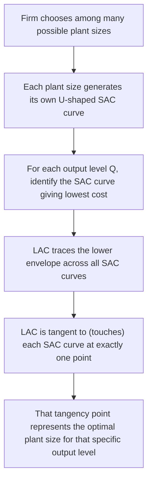
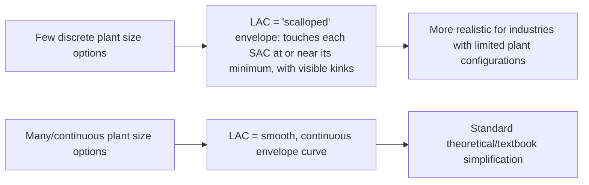

## Long-Run Average Cost and the Envelope Curve

### Overview

The long-run average cost (LAC) curve traces the lowest possible average cost of producing each level of output when a firm has complete freedom to choose its plant size (and all other inputs) optimally for that output level. It is derived as the **envelope** of a series of short-run average cost (SAC) curves, each representing a different fixed plant size, and provides the foundation for understanding economies and diseconomies of scale, optimal plant sizing, and long-run competitive dynamics.

### The Long Run and Plant Size Choice

In the short run, a firm operates with a **given, fixed plant size**, and its SAC curve reflects the cost structure associated with that specific plant. In the long run, the firm can choose **any** plant size before beginning production — effectively selecting which short-run cost structure it wishes to commit to, based on its anticipated output level.

Each possible plant size generates its own U-shaped SAC curve, with the minimum point of each individual SAC curve occurring at a different output level, depending on the plant's designed capacity.

### Deriving the LAC as an Envelope Curve

**Step 1**: For each conceivable plant size, plot its corresponding SAC curve.

**Step 2**: For any given output level $Q$, identify which plant size produces that output at the **lowest** possible average cost.

**Step 3**: The LAC curve is constructed by tracing the **lower boundary (envelope)** across all these SAC curves — at each output level, the LAC curve touches whichever SAC curve is lowest at that specific point.

$$LAC(Q) = \min_{\text{all plant sizes}} SAC(Q \mid \text{plant size})$$

### Diagram: LAC as Envelope of SAC Curves

### Diagram: LAC as Envelope of SAC Curves (svg_diagram)

<svg xmlns="http://www.w3.org/2000/svg" viewBox="0 0 720 420">
<rect x="0" y="0" width="720" height="420" fill="#ffffff" />
<text x="360" y="24" text-anchor="middle" font-size="16" font-weight="bold" fill="#1a1a1a">Long-Run Average Cost as Envelope Curve (svg_diagram)</text>
<line x1="60" y1="370" x2="680" y2="370" stroke="#333" stroke-width="1.5" />
<line x1="60" y1="50" x2="60" y2="370" stroke="#333" stroke-width="1.5" />
<text x="370" y="400" text-anchor="middle" font-size="12" fill="#333">Output (Q)</text>
<text x="25" y="210" text-anchor="middle" font-size="12" fill="#333" transform="rotate(-90 25,210)">Average Cost</text>
<path d="M 90 340 C 140 210, 190 170, 230 175 C 270 180, 300 230, 320 300" fill="none" stroke="#93c5fd" stroke-width="2" />
<text x="130" y="200" font-size="9" fill="#3b82f6">SAC1</text>
<path d="M 170 320 C 220 190, 270 150, 320 155 C 370 160, 410 210, 430 280" fill="none" stroke="#60a5fa" stroke-width="2" />
<text x="230" y="180" font-size="9" fill="#2563eb">SAC2</text>
<path d="M 270 300 C 320 175, 380 130, 420 135 C 460 140, 500 190, 520 260" fill="none" stroke="#3b82f6" stroke-width="2" />
<text x="350" y="160" font-size="9" fill="#1d4ed8">SAC3</text>
<path d="M 380 290 C 430 170, 490 125, 530 130 C 570 135, 610 185, 630 250" fill="none" stroke="#2563eb" stroke-width="2" />
<text x="470" y="155" font-size="9" fill="#1e40af">SAC4</text>
<path d="M 480 280 C 530 180, 580 140, 620 145 C 650 148, 665 165, 670 190" fill="none" stroke="#1e40af" stroke-width="2" />
<text x="590" y="170" font-size="9" fill="#1e3a8a">SAC5</text>

<path d="M 90 340 C 160 250, 250 165, 340 145 C 420 130, 480 135, 550 165 C 610 195, 650 230, 670 260" fill="none" stroke="`#dc2626`" stroke-width="3" />

<text x="330" y="115" font-size="12" fill="`#dc2626`" font-weight="bold">LAC (Envelope)</text>

</svg>

### The Non-Tangency Property in the Increasing/Decreasing Returns Region

**Key Points**

- In the **downward-sloping (economies of scale) portion** of the LAC curve, the tangency point with each SAC curve occurs to the **left** of that particular SAC curve's own minimum point.
- In the **upward-sloping (diseconomies of scale) portion** of the LAC curve, the tangency point occurs to the **right** of the SAC curve's own minimum.
- Only at the very **minimum point of the LAC curve** does the tangency coincide exactly with the minimum point of the corresponding SAC curve — this is the plant size operating at its own most efficient scale, corresponding to the output level of **Minimum Efficient Scale (MES)**.

This non-tangency property (away from the LAC minimum) reflects the fact that a firm producing at a lower output than a given plant's optimal capacity is not fully utilizing that plant's scale economies, so it can still find a *smaller* plant that produces that same lower output at even lower cost, and vice versa for output levels above a plant's optimal capacity.

### LAC Shape and Returns to Scale

| LAC Behavior | Underlying Returns to Scale |
| --- | --- |
| LAC falling | Increasing returns to scale (economies of scale) |
| LAC at minimum (flat/lowest point) | Constant returns to scale (locally) |
| LAC rising | Decreasing returns to scale (diseconomies of scale) |

**Key Points**

- The shape of LAC is fundamentally a **long-run, scale-related** phenomenon, distinct from the U-shape of individual SAC curves, which arises from the short-run Law of Variable Proportions applied to a fixed plant.
- A common student confusion: **both LAC and SAC curves are typically U-shaped, but for entirely different underlying reasons** — SAC's U-shape reflects diminishing returns to a variable input given a fixed plant; LAC's U-shape reflects economies followed by diseconomies of scale as plant size itself varies.

### Long-Run Marginal Cost (LMC)

The **Long-Run Marginal Cost (LMC)** curve shows the change in long-run total cost resulting from a one-unit change in output, when the firm is free to adjust plant size optimally at every output level.

$$LMC = \frac{d(LTC)}{dQ}$$

**Key Relationships**:

- $LMC$ intersects $LAC$ exactly at $LAC$'s minimum point (identical marginal-average relationship as in the short run).
- $LMC$ lies **below** $LAC$ over the falling (economies of scale) portion, and **above** $LAC$ over the rising (diseconomies of scale) portion.
- At the specific output level where a given SAC curve is tangent to LAC, the corresponding SMC (short-run marginal cost) curve for that plant size passes through the LMC curve — but **only** at the point where that SAC curve's minimum coincides with the LAC minimum does $SMC = LMC = SAC = LAC$ **simultaneously**.

### Numerical Example

A firm is choosing among three possible plant sizes, each with different SAC minimums:

| Plant Size | Optimal Output (SAC minimum) | Minimum SAC ($/unit) |
| --- | --- | --- |
| Small | 100 units | $50 |
| Medium | 250 units | $38 |
| Large | 450 units | $45 |

**Interpretation**:

- If the firm anticipates demand of approximately 250 units, the **Medium** plant is optimal, since it achieves the lowest average cost ($38) at that output level — this is the point where LAC touches SAC(Medium) at its own minimum, indicating the Medium plant size represents (in this example) the Minimum Efficient Scale.
- If the firm anticipates demand of only 100 units, building the Medium or Large plant and operating it *below* its designed capacity would result in *higher* average cost than building the Small plant sized specifically for that lower output level — illustrating why LAC touches SAC(Small) to the *left* of SAC(Small)'s own minimum only if a smaller-output tangency exists; here, Small's own minimum is directly the relevant comparison since 100 units is exactly Small's optimal capacity.
- If demand grows to 450 units, the **Large** plant becomes optimal ($45), even though this average cost is higher than the Medium plant's minimum ($38) — reflecting the onset of diseconomies of scale at very large output levels, or alternatively, the Large plant being specifically designed as the most efficient choice for that higher output level despite a higher minimum SAC than the Medium plant.

### The "Continuous" LAC Curve — Smooth Envelope Case

When a firm faces a **continuum** of possible plant sizes (rather than a small discrete set), the LAC curve becomes a smooth, continuous curve tangent to infinitely many SAC curves, rather than a series of discrete scallops connecting discrete plant-size minimums. This is the standard textbook depiction (as shown in the SVG diagram above) and is the typical assumption in formal long-run cost theory.

### Diagram: Discrete vs. Continuous Envelope

### Relationship to Minimum Efficient Scale (MES)

The **Minimum Efficient Scale** is the smallest output level at which the LAC curve reaches its minimum point — the smallest plant size (and associated output level) at which all available economies of scale have been fully exploited.

- Operating below MES: firm forfeits available scale economies, facing higher-than-necessary average costs.
- Operating at MES: firm achieves the lowest possible long-run average cost.
- Operating (much) beyond MES: if diseconomies of scale set in, average cost begins rising again.

**Key Points**

- Industries with a large MES relative to total market demand tend toward **fewer, larger firms** (oligopoly or natural monopoly structures), since only large-scale producers can compete on cost.
- Industries with a small MES relative to market demand can support **many competing firms** of efficient size, consistent with more fragmented, competitive market structures.

### Common Errors to Avoid

- **Assuming LAC is simply the "lowest" SAC curve at every point in a literal minimum-across-all-curves sense without proper tangency**: The envelope must be constructed via genuine tangency, not by naively connecting the minimum points of each SAC curve — connecting minimum points would produce a curve that lies *above* the true LAC envelope at most output levels (except at the single output level corresponding to MES).
- **Confusing short-run and long-run marginal cost**: SMC and LMC are generally different curves except at the specific point of tangency corresponding to the LAC minimum.
- **Assuming LAC must be U-shaped**: While U-shaped LAC is the standard textbook case, some industries empirically exhibit LAC curves that are L-shaped (falling then flat, without a subsequent rise) over the empirically relevant output range, particularly where diseconomies of scale are minimal or absent within observed firm sizes. [Inference: whether diseconomies of scale meaningfully appear within an industry's practical output range is an empirical question that varies substantially by industry.]

### Limitations and Real-World Considerations

- **Assumes perfect divisibility of plant size choices**: Real capital investments are often lumpy (e.g., a firm cannot build "half a factory"), meaning the smooth continuous envelope is a theoretical idealization.
- **Assumes input prices remain constant across plant sizes**: In reality, very large-scale plants might negotiate different input prices (bulk discounts) than smaller plants, complicating the pure "technical envelope" interpretation and blending it with pecuniary economies of scale.
- **Static, single-point-in-time analysis**: The theory does not account for the costs and time required to actually transition between plant sizes (adjustment costs), which are highly relevant to real managerial decisions about capacity expansion.
- **Empirical estimation challenges**: Directly estimating a firm's LAC curve requires either observing many firms of different sizes within the same industry (cross-sectional analysis) or observing a single firm's cost structure across different plant sizes over time — both approaches face significant data and confounding-variable challenges.

### Application in Managerial Decision-Making

- **Optimal plant size selection**: Directly informs which plant size a firm should build given its anticipated long-run output/demand level, minimizing long-run average cost.
- **Capacity expansion planning**: Understanding where a firm's current plant sits relative to the LAC/MES informs whether expanding to a larger plant would reduce or increase average costs.
- **Market entry strategy**: New entrants can use LAC/MES analysis to determine the minimum viable scale needed to compete on cost with incumbent firms.
- **Merger and industry consolidation analysis**: LAC curve shape and MES relative to market size inform whether industry consolidation (fewer, larger firms) is likely to be cost-efficient or whether a fragmented industry structure is sustainable.
- **Long-run pricing and competitive strategy**: A firm's position along the LAC curve relative to competitors directly affects its ability to sustain competitive pricing in the long run.

**Related Topics**

- Long-run production and returns to scale
- Economies and diseconomies of scale
- Short-run cost curves and their relationships
- Minimum Efficient Scale and market structure
- Isoquants, isocost lines, and producer equilibrium
- Market structure and industry concentration