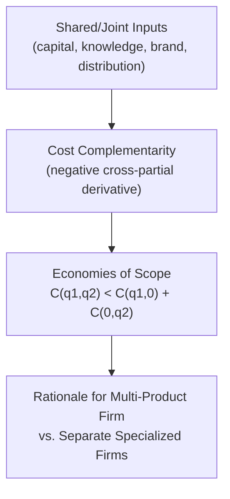

## Economies of Scope and Multi-Product Cost Structures

### Definition and Conceptual Overview

Economies of scope exist when the joint cost of producing two or more products **together** within a single firm is lower than the sum of the costs of producing each product **separately** in specialized, independent firms. This concept extends cost analysis beyond the single-product framework (economies of scale) into the multi-product firm, which is the empirically dominant form of enterprise in most modern economies.

Formally, for two products $q_1$ and $q_2$ produced jointly at total cost $C(q_1, q_2)$, economies of scope exist if:

$$C(q_1, q_2) < C(q_1, 0) + C(0, q_2)$$

where $C(q_1, 0)$ is the cost of producing only $q_1$ and $C(0, q_2)$ is the cost of producing only $q_2$, each by a specialized single-product firm.

Diseconomies of scope exist in the reverse case:

$$C(q_1, q_2) > C(q_1, 0) + C(0, q_2)$$

### The Degree of Economies of Scope (SC Measure)

The standard quantitative measure, developed in the multi-product cost literature (Baumol, Panzar, and Willig), is:

$$SC = \frac{C(q_1, 0) + C(0, q_2) - C(q_1, q_2)}{C(q_1, q_2)}$$

- $SC > 0$: economies of scope exist (joint production is cheaper).
- $SC < 0$: diseconomies of scope exist (joint production is more expensive).
- $SC = 0$: no cost interaction between the two products; production is cost-independent.

**Key Points**

- $SC$ is expressed as a proportion (or percentage when multiplied by 100) of the savings relative to the joint-production cost.
- The larger the positive value of $SC$, the stronger the economic rationale for a single diversified firm over separate specialized firms.

### Sources of Economies of Scope

#### 1. Shared and Indivisible Inputs

Fixed assets, facilities, or capabilities that can serve multiple product lines without proportional cost increases:

- Shared physical facilities (e.g., a factory floor producing multiple related goods).
- Shared distribution and retail networks (e.g., a supermarket chain selling groceries and pharmacy items through the same stores).
- Shared brand equity and reputation capital across product lines (e.g., a consumer goods company leveraging one trusted brand for multiple product categories).

#### 2. Shared Knowledge and Technology (Spillovers)

- R&D findings, patents, or production know-how developed for one product can be applied to another at near-zero marginal cost, since knowledge is largely **non-rival** in use.
- Core competencies (e.g., a firm's expertise in a particular chemical process) can be redeployed across product lines.

#### 3. By-Products and Joint Production Processes

- Certain production processes technologically generate multiple outputs simultaneously (e.g., oil refining yields gasoline, diesel, and petrochemical by-products from the same crude oil input; cattle processing yields both meat and hides).
- In these cases, cost savings arise because the inputs are inherently joint, not merely shared by managerial choice.

#### 4. Shared Overhead and Administrative Functions

- Centralized functions such as finance, HR, IT, legal, and executive management can serve multiple product divisions, spreading fixed administrative costs.

#### 5. Risk Diversification and Financial Synergies

- A multi-product firm can smooth cash flow volatility across product lines with different demand cycles, potentially lowering the firm's cost of capital.

### Sources of Diseconomies of Scope

- **Organizational complexity**: managing diverse product lines increases coordination costs and can dilute managerial focus (cf. "conglomerate discount" observed in diversified firms trading at lower valuations than the sum of their parts). [Inference: the magnitude of the conglomerate discount varies by market, era, and firm-specific execution, and is not a universal constant.]
- **Resource cannibalization**: shared inputs may create bottlenecks when demand for the two products peaks simultaneously, forcing costly capacity expansion.
- **Brand dilution risk**: extending a brand across too many unrelated product categories can weaken the value of the shared brand asset for all categories.
- **Loss of specialization benefits**: dedicated single-product firms may achieve deeper technical mastery ("focus" advantages) that diversified firms sacrifice.

### Multi-Product Cost Functions

For a firm producing $n$ products, the general multi-product cost function is:

$$C = C(q_1, q_2, \dots, q_n)$$

Key derived concepts include:

#### Product-Specific Economies of Scale

Measures returns to scale for a single product line holding other products' output constant — captures how average incremental cost of one product changes as its own output rises.

#### Multi-Product Economies of Scale (Ray Economies of Scale)

Measures the cost response to proportionally increasing **all** products' output simultaneously along a fixed output ratio (a "ray" through the output space):

$$S = \frac{C(q_1, q_2, \dots, q_n)}{\sum_{i=1}^{n} q_i \cdot \frac{\partial C}{\partial q_i}}$$

- $S > 1$: overall (ray) economies of scale.
- $S < 1$: overall (ray) diseconomies of scale.
- This differs from economies of scope, which concerns the *mix* of products, whereas ray economies of scale concerns the *proportional magnitude* of a fixed mix.

#### Cost Complementarity

Exists when the marginal cost of producing one product **decreases** as the output of another product increases:

$$\frac{\partial^2 C}{\partial q_1 \partial q_2} < 0$$

Cost complementarity is a common underlying cause of economies of scope, though the two concepts are formally distinct — economies of scope is a statement about total-cost comparison at specific output levels, while cost complementarity is a statement about the cross-partial derivative of the cost function.

### Numerical Illustration

**Example**

A firm can produce Product A alone, Product B alone, or both jointly. Suppose:

| Scenario | Total Cost ($) |
| --- | --- |
| Produce only A (100 units) | 40,000 |
| Produce only B (100 units) | 35,000 |
| Produce both A and B jointly (100 units each) | 60,000 |

$$SC = \frac{40{,}000 + 35{,}000 - 60{,}000}{60{,}000} = \frac{15{,}000}{60{,}000} = 0.25$$

Interpretation: Joint production generates a 25% cost saving relative to the joint-production cost, compared to producing the two goods in separate specialized firms — a clear indication of economies of scope, likely driven by shared facilities, distribution, or brand assets.

### Economies of Scope vs. Related Concepts

| Concept | Core Question | Relevant Dimension |
| --- | --- | --- |
| Economies of scale | Does average cost fall as output of **one** product rises? | Single-product, output magnitude |
| Economies of scope | Is joint production of **multiple** products cheaper than separate production? | Multi-product, product variety/mix |
| Cost complementarity | Does producing more of one good lower the marginal cost of another? | Cross-partial cost derivative |
| Ray economies of scale | Does cost fall proportionally less than output when scaling a fixed product mix? | Multi-product, proportional magnitude |
| Vertical integration economies | Are transaction/coordination costs lower when successive production stages are combined in-house? | Supply chain stage combination |

### Managerial and Strategic Applications

- **Product line diversification decisions**: firms evaluate whether to add a new product using existing capacity, R&D, or brand assets rather than launching a wholly new standalone venture.
- **Merger and acquisition rationale**: horizontal mergers across related but distinct product categories are often justified on economies-of-scope grounds (e.g., a beverage company acquiring a snack food company to share distribution networks).
- **Outsourcing vs. in-house production**: if $SC \leq 0$ for a given input or process, the firm has a cost rationale to outsource that component to specialized external suppliers rather than producing it in-house.
- **Platform and multi-sided business strategy**: technology platforms frequently exploit economies of scope by leveraging shared user data, infrastructure, and software codebases across multiple service lines.
- **Pricing implications**: economies of scope can support **bundling strategies**, since the firm's joint cost structure may make bundled pricing more profitable than separate component pricing. [Inference: whether bundling is optimal also depends on demand-side factors such as valuation correlation across products, not cost structure alone.]

### Empirical and Measurement Considerations

- Estimating multi-product cost functions econometrically is more complex than single-product cost estimation because firms rarely produce at "corner" output points (i.e., zero output of one good), requiring extrapolation or specialized functional forms (e.g., the quadratic or translog multi-product cost function) to estimate $C(q_1, 0)$ and $C(0, q_2)$.
- [Unverified] Real-world $SC$ estimates vary substantially by industry; banking, telecommunications, and healthcare have been frequently studied empirical settings in the scope-economies literature, but specific magnitude estimates depend heavily on the dataset, time period, and econometric specification used, so no single universal figure should be assumed.

**Next Steps**

- Multi-product pricing and bundling strategy
- Vertical integration and transaction cost economics (Coase, Williamson)
- Translog and quadratic cost function estimation techniques
- Economies of scale (single-product) for comparative review
- Diversification strategy and the conglomerate discount
- Joint production and by-product costing in managerial accounting