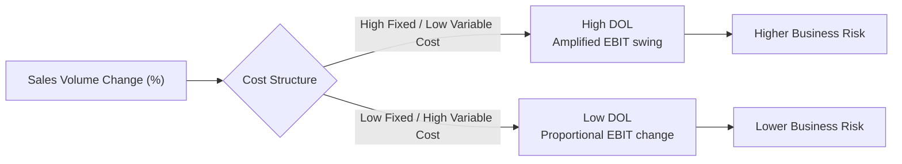

## Break-Even Analysis and Operating Leverage

### Definition and Conceptual Overview

Break-even analysis, a core component of **cost-volume-profit (CVP) analysis**, examines the relationship between a firm's costs, sales volume, and profit to determine the **break-even point (BEP)** — the level of output or sales at which total revenue exactly equals total cost, yielding zero economic or accounting profit. Operating leverage extends this framework by measuring how sensitive a firm's operating profit is to changes in sales volume, given the firm's specific mix of fixed and variable costs.

Both concepts rely on the standard **linear CVP model**, which assumes constant selling price per unit, constant variable cost per unit, and constant total fixed costs across the relevant range of output.

**Key Points**

- Break-even analysis identifies *where* profit turns positive.
- Operating leverage explains *how strongly* profit responds once volume moves away from break-even in either direction.
- Both are short-run planning tools, typically applied within a single product's or firm's relevant range of output.

### The Break-Even Model

#### Core Variables

- $P$ = selling price per unit
- $V$ = variable cost per unit
- $F$ = total fixed costs
- $Q$ = quantity (units) sold/produced
- Contribution margin per unit: $CM = P - V$
- Contribution margin ratio: $CMR = \frac{P - V}{P}$

#### Break-Even Point in Units

$$Q_{BE} = \frac{F}{P - V}$$

#### Break-Even Point in Sales Revenue (Dollars)

$$S_{BE} = \frac{F}{CMR} = \frac{F}{\left(\frac{P-V}{P}\right)}$$

#### Target Profit Analysis

The model extends naturally to solve for the output level required to achieve a specific target operating profit $\pi_T$:

$$Q_{target} = \frac{F + \pi_T}{P - V}$$

### Numerical Illustration

**Example**

A firm sells a product at $P = \$50$ per unit, with variable cost $V = \$30$ per unit, and total fixed costs $F = \$100{,}000$.

$$CM = 50 - 30 = \$20 \text{ per unit}$$

$$Q_{BE} = \frac{100{,}000}{20} = 5{,}000 \text{ units}$$

$$S_{BE} = 5{,}000 \times 50 = \$250{,}000$$

Interpretation: The firm must sell 5,000 units (generating $250,000 in revenue) to cover all fixed and variable costs exactly. Each unit sold beyond 5,000 contributes $20 directly to operating profit, since fixed costs are already fully covered at that point.

If the firm wants to achieve a target operating profit of $\pi_T = \$40{,}000$:

$$Q_{target} = \frac{100{,}000 + 40{,}000}{20} = 7{,}000 \text{ units}$$

**Break-Even Chart (svg_diagram)**

<svg xmlns="http://www.w3.org/2000/svg" viewBox="0 0 700 420">
<text x="350" y="25" font-size="16" text-anchor="middle" font-weight="bold">Break-Even Chart (svg_diagram)</text>
<line x1="60" y1="370" x2="650" y2="370" stroke="black" stroke-width="2" />
<line x1="60" y1="370" x2="60" y2="50" stroke="black" stroke-width="2" />
<text x="655" y="375" font-size="13">Units (Q)</text>
<text x="15" y="55" font-size="13">\$</text>

<line x1="60" y1="300" x2="650" y2="300" stroke="#9ca3af" stroke-width="2" stroke-dasharray="4" />
<text x="500" y="295" font-size="12" fill="#6b7280">Fixed Cost (F)</text>

<line x1="60" y1="300" x2="620" y2="90" stroke="#b91c1c" stroke-width="2.5" />
<text x="560" y="100" font-size="12" fill="#b91c1c">Total Cost (TC = F + VQ)</text>

<line x1="60" y1="370" x2="620" y2="60" stroke="#15803d" stroke-width="2.5" />
<text x="560" y="65" font-size="12" fill="#15803d">Total Revenue (TR = PQ)</text>

<circle cx="330" cy="200" r="6" fill="#1e3a8a" />
<text x="340" y="195" font-size="12" font-weight="bold">Break-Even Point (Q_BE)</text>
<line x1="330" y1="200" x2="330" y2="370" stroke="gray" stroke-dasharray="3" />
<text x="315" y="390" font-size="12">Q_BE = 5,000</text>

<text x="120" y="330" font-size="12" fill="`#b91c1c`">Loss Zone</text>

<text x="450" y="150" font-size="12" fill="`#15803d`">Profit Zone</text>

</svg>

### Margin of Safety

The margin of safety measures how far current (or budgeted) sales exceed the break-even point, indicating a buffer against a sales downturn before losses occur.

$$\text{Margin of Safety (units)} = Q_{actual} - Q_{BE}$$

$$\text{Margin of Safety (\%)} = \frac{Q_{actual} - Q_{BE}}{Q_{actual}} \times 100$$

**Example (continued)**: If the firm currently sells 7,500 units, the margin of safety is $7{,}500 - 5{,}000 = 2{,}500$ units, or $\frac{2{,}500}{7{,}500} \times 100 \approx 33.3\%$ — meaning sales could fall by roughly one-third before the firm returns to break-even.

### Operating Leverage

Operating leverage measures the extent to which a firm's cost structure relies on fixed costs relative to variable costs, and therefore how much operating profit (EBIT) amplifies in response to a given percentage change in sales.

#### Degree of Operating Leverage (DOL)

$$DOL = \frac{\% \Delta \text{EBIT}}{\% \Delta \text{Sales}} = \frac{Q(P-V)}{Q(P-V) - F} = \frac{\text{Contribution Margin}}{\text{Operating Profit}}$$

- A **high DOL** indicates a cost structure dominated by fixed costs relative to variable costs: small changes in sales volume produce disproportionately large changes in operating profit.
- A **low DOL** indicates a cost structure dominated by variable costs: operating profit responds more proportionately (less dramatically) to changes in sales volume.
- DOL is highest near the break-even point and declines as sales volume moves further above break-even, approaching (but never reaching) 1 at very high output levels, since the fixed-cost base becomes proportionally less significant relative to total contribution.

### Numerical Illustration (Operating Leverage)

**Example**

Using the same firm ($P=\$50$, $V=\$30$, $F=\$100{,}000$) at current output $Q = 7{,}500$ units:

$$\text{Contribution Margin} = 7{,}500 \times 20 = \$150{,}000$$

$$\text{Operating Profit (EBIT)} = 150{,}000 - 100{,}000 = \$50{,}000$$

$$DOL = \frac{150{,}000}{50{,}000} = 3.0$$

Interpretation: A DOL of 3.0 means that a 1% increase in sales volume from this point would produce approximately a 3% increase in operating profit — and conversely, a 1% decline in sales would produce roughly a 3% decline in operating profit. This amplification effect is symmetric in both directions, which is why high operating leverage is often described as a double-edged sword: it magnifies gains in economic upswings but equally magnifies losses in downturns. [Behavior may vary outside the linear relevant range assumed by the CVP model, where cost and price relationships may no longer hold.]

### Operating Leverage and Cost Structure Trade-Offs

| Characteristic | High Fixed Cost / High DOL Firm | High Variable Cost / Low DOL Firm |
| --- | --- | --- |
| Typical industries | Capital-intensive (airlines, semiconductor fabs, utilities) | Labor-intensive, subcontracted production, retail |
| Break-even point | Higher (more volume needed to cover fixed costs) | Lower |
| Profit sensitivity to volume | High (amplified swings) | Low (more stable/proportional) |
| Risk profile | Higher business risk from demand volatility | Lower business risk from demand volatility |
| Contribution margin per unit | Typically higher | Typically lower |

### Assumptions and Limitations of the Linear CVP Model

- **Linearity assumption**: selling price and variable cost per unit are assumed constant across all output levels within the relevant range; in reality, bulk discounts, overtime premiums, or capacity constraints can introduce non-linearity at extreme volumes.
- **Single-product simplification**: the basic model assumes a single product or a constant sales mix; multi-product firms require a **weighted-average contribution margin** approach, and the break-even point becomes sensitive to shifts in the product sales mix.
- **Fixed costs assumed constant**: valid only within the "relevant range" of output; beyond that range, fixed costs may jump to a new, higher step-level (e.g., needing to lease additional factory space), described as **step-fixed** or **semi-fixed** costs.
- **Static, short-run framework**: does not account for dynamic effects such as learning-curve cost reductions, competitive responses, or inventory build-up/drawdown (the model implicitly assumes production and sales volumes are equal in the period analyzed).
- **Ignores time value of money**: standard CVP/break-even analysis is a single-period, undiscounted framework, and does not incorporate the time value of money relevant to multi-period capital investment decisions.

### Managerial and Strategic Applications

- **Pricing decisions**: evaluating how proposed price changes shift the break-even point and required sales volume.
- **Capacity and automation investment decisions**: choosing between more labor-intensive (higher variable cost, lower fixed cost, lower DOL) versus more automated (higher fixed cost, lower variable cost, higher DOL) production methods, trading off risk against potential profit amplification.
- **New product launch evaluation**: estimating the sales volume required for a new product to become profitable, supporting go/no-go investment decisions.
- **Cost structure and business risk assessment**: firms with high operating leverage are more vulnerable to cyclical downturns and may pair high operating leverage with lower financial leverage (debt) to manage overall firm risk, and vice versa — a concept often extended in corporate finance as **total leverage** or **degree of combined leverage (DCL)**.
- **Sensitivity and scenario analysis**: break-even and DOL calculations are frequently stress-tested under multiple sales volume scenarios (optimistic, base case, pessimistic) to assess a project's or product line's profit risk profile.

### Related Concepts

| Concept | Relationship to Break-Even/Operating Leverage |
| --- | --- |
| Contribution margin analysis | The foundational building block of break-even and DOL calculations |
| Financial leverage / Degree of Financial Leverage (DFL) | Measures how debt financing amplifies the effect of EBIT changes on net income (earnings per share); combines with DOL to form total/combined leverage |
| Economies of scale | A separate long-run cost phenomenon; can lower $V$ or $F$ over time but is conceptually distinct from the short-run linear CVP framework |
| Margin of safety | A risk-buffer metric derived directly from the break-even point |

**Next Steps**

- Cost-volume-profit (CVP) sensitivity and multi-product break-even analysis
- Degree of Financial Leverage (DFL) and combined/total leverage
- Capital budgeting and investment appraisal techniques
- Statistical and engineering cost estimation methods (comparative review)
- Short-run vs. long-run cost curve theory
- Pricing strategies under different cost structures