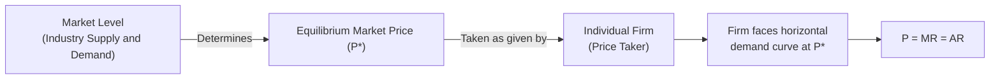

## Characteristics and Assumptions of Perfect Competition

### Definition and Conceptual Overview

Perfect competition is a theoretical market structure characterized by a large number of small buyers and sellers, homogeneous products, free entry and exit, and perfect information, such that **no individual firm has any influence over the market price**. It serves as a benchmark ("polar case") in managerial economics against which real-world market structures — monopoly, oligopoly, and monopolistic competition — are compared, and it establishes the theoretical standard for allocative and productive efficiency.

**Key Points**

- Perfect competition is a theoretical idealization; few, if any, real-world markets satisfy all its assumptions simultaneously.
- Its primary analytical value is as a **benchmark case** for evaluating the efficiency properties of other market structures.
- Firms in perfect competition are described as **price takers**: each firm accepts the market-determined price as given and has no ability to influence it individually.

### The Core Assumptions

#### 1. Large Number of Buyers and Sellers

The market contains a sufficiently large number of independent buyers and sellers such that no single participant's individual decision to buy or sell can perceptibly affect the market price. Each firm is small relative to total market output.

#### 2. Homogeneous (Standardized) Product

All firms in the industry produce an identical, undifferentiated product. Buyers are indifferent between the output of one seller and another, since there is no basis for preference beyond price — no branding, quality differences, or other differentiating characteristics exist.

#### 3. Free Entry and Exit

Firms face no significant barriers to entering or exiting the industry in the long run. There are no legal restrictions, large sunk costs, patent protections, or other structural barriers preventing new firms from entering when profits are attractive, or existing firms from exiting when losses persist.

#### 4. Perfect Information

All buyers and sellers possess complete and costless information about prices, product quality, and available technology throughout the market. No participant has an informational advantage over another, and prices are known instantaneously and universally.

#### 5. Perfect Factor Mobility

Resources (labor, capital, raw materials) can move freely and without cost between industries and geographic locations in response to price or profit signals, allowing the long-run adjustment process to proceed unimpeded.

#### 6. No Transaction Costs

There are no costs associated with the act of buying or selling itself (e.g., no brokerage fees, search costs, or transportation costs that would create a wedge between the price received by sellers and the price paid by buyers).

#### 7. Profit Maximization Objective

All firms are assumed to pursue the single objective of maximizing profit, providing a consistent and predictable behavioral basis for modeling firm decisions.

### The Price-Taking Firm and the Horizontal Demand Curve

Because each firm is infinitesimally small relative to the total market and the product is homogeneous, an individual firm faces a **perfectly elastic (horizontal) demand curve** at the prevailing market price, even though the **market** demand curve for the industry as a whole is downward-sloping in the normal fashion.

$$P = MR = AR$$

For a perfectly competitive firm, price ($P$), marginal revenue ($MR$), and average revenue ($AR$) are all equal and constant at every output level, since the firm can sell any quantity it chooses at the going market price without needing to lower price to sell additional units.

**Market vs. Firm Demand Curve (svg_diagram)**

<svg xmlns="http://www.w3.org/2000/svg" viewBox="0 0 700 380">
<text x="350" y="25" font-size="16" text-anchor="middle" font-weight="bold">Market Demand vs. Firm Demand Curve (svg_diagram)</text>

<line x1="60" y1="330" x2="320" y2="330" stroke="black" stroke-width="2" />
<line x1="60" y1="330" x2="60" y2="60" stroke="black" stroke-width="2" />
<text x="150" y="350" font-size="12" text-anchor="middle">Market Output</text>
<text x="30" y="55" font-size="12">Price</text>
<path d="M 80 90 L 300 300" stroke="#b91c1c" stroke-width="2.5" />
<text x="220" y="120" font-size="11" fill="#b91c1c">Market Demand (D)</text>
<path d="M 80 300 L 300 90" stroke="#2563eb" stroke-width="2.5" />
<text x="220" y="290" font-size="11" fill="#2563eb">Market Supply (S)</text>
<line x1="60" y1="200" x2="320" y2="200" stroke="gray" stroke-dasharray="3" />
<text x="35" y="205" font-size="11">P*</text>
<text x="130" y="365" font-size="12" font-weight="bold">Industry/Market</text>

<line x1="400" y1="330" x2="650" y2="330" stroke="black" stroke-width="2" />
<line x1="400" y1="330" x2="400" y2="60" stroke="black" stroke-width="2" />
<text x="525" y="350" font-size="12" text-anchor="middle">Firm Output (q)</text>
<text x="370" y="55" font-size="12">Price</text>
<line x1="410" y1="200" x2="640" y2="200" stroke="#15803d" stroke-width="2.5" />
<text x="500" y="190" font-size="11" fill="#15803d">Firm Demand = P = MR = AR</text>
<text x="480" y="365" font-size="12" font-weight="bold">Individual Firm</text>
</svg>

### Short-Run Equilibrium of the Firm

In the short run, a perfectly competitive firm maximizes profit by producing the output level where **marginal revenue equals marginal cost** ($MR = MC$), subject to the second-order condition that marginal cost is rising at that point (ensuring a profit maximum rather than a minimum).

$$P = MR = MC \quad \text{(profit-maximizing condition)}$$

**Key Points**

- If $P > AC$ at the profit-maximizing output, the firm earns positive (economic) short-run profit.
- If $AVC < P < AC$, the firm incurs a loss but continues operating in the short run, since it is covering variable costs and contributing partially toward fixed costs.
- If $P < AVC$, the firm's loss-minimizing decision is to **shut down** in the short run, since continuing to operate would lose more than the value of fixed costs alone.
- This yields the well-known result that the firm's short-run supply curve is the portion of its marginal cost curve **above the minimum point of average variable cost (AVC)**.

### Long-Run Equilibrium and Zero Economic Profit

The assumption of **free entry and exit** is the key driver of the long-run equilibrium result in perfect competition:

- If firms in the industry are earning **positive economic profit** in the short run, this profit signal attracts new entrants (since there are no barriers to entry), shifting the market supply curve rightward, lowering the market price until economic profit is driven to zero.
- If firms are incurring **losses**, some firms exit the industry, shifting market supply leftward, raising the market price until remaining firms earn zero economic profit.
- The process continues until **long-run equilibrium** is reached, characterized by:

$$P = MR = MC = AC_{min}$$

At this point, each firm produces at the minimum point of its long-run average cost curve, and earns **zero economic profit** (though a normal accounting profit, since economic profit is measured net of the opportunity cost of capital, including a normal return to the entrepreneur).

### Efficiency Properties of Perfect Competition

#### Productive (Technical) Efficiency

In long-run equilibrium, each firm produces at the minimum point of its LRAC curve, meaning output is produced at the lowest possible cost achievable given existing technology — no resources are wasted in production.

#### Allocative Efficiency

Since $P = MC$ in equilibrium, the price consumers pay exactly reflects the marginal opportunity cost of producing the last unit, meaning resources are allocated to their highest-valued use from society's perspective — no reallocation of resources between industries could make consumers better off without making someone else worse off (a Pareto-efficient outcome under standard assumptions).

**Key Points**

- Perfect competition, when its assumptions hold and in the absence of externalities or other market failures, achieves both productive and allocative efficiency simultaneously in long-run equilibrium.
- This dual efficiency result is the principal theoretical reason perfect competition serves as the normative benchmark against which the welfare losses of monopoly and other imperfectly competitive structures are measured (e.g., via deadweight loss analysis).

### Real-World Approximations and Limitations

- **No real market perfectly satisfies all assumptions simultaneously.** Markets often cited as close real-world approximations include certain agricultural commodity markets (wheat, corn) and financial markets for standardized securities (e.g., highly liquid equity or foreign exchange markets), due to large numbers of participants, standardized products, and relatively low information costs — though even these markets exhibit some deviations (e.g., transaction costs, imperfect information, or brief periods of market power). [Inference: the degree to which any specific real-world market approximates the perfect-competition assumptions is a matter of empirical judgment and can shift over time with changes in technology, regulation, and market concentration.]
- **Product homogeneity is rare**: most real-world products exhibit at least some differentiation (branding, quality, location, service), which is the defining feature distinguishing monopolistic competition from the perfectly competitive ideal.
- **Perfect information is an idealization**: real markets always involve some search costs, asymmetric information, or uncertainty, which is the subject matter of information economics.
- **Barriers to entry frequently exist**: patents, licensing requirements, economies of scale, and brand loyalty commonly create at least some entry barriers absent in the pure theoretical model.

### Comparison Table: Perfect Competition vs. Other Market Structures (Preview)

| Feature | Perfect Competition | Monopoly | Monopolistic Competition | Oligopoly |
| --- | --- | --- | --- | --- |
| Number of firms | Very large | One | Large | Few |
| Product | Homogeneous | Unique (no substitutes) | Differentiated | Homogeneous or differentiated |
| Entry barriers | None | Very high/blocked | Low | High |
| Firm's price influence | None (price taker) | Full (price maker) | Some | Some (interdependent) |
| Long-run economic profit | Zero | Can persist | Zero | Can persist |

### Managerial Relevance

- **Benchmark for strategic positioning**: firms actively seek to escape the zero-profit long-run outcome of perfect competition through product differentiation, cost leadership, branding, patents, or other strategies that create some degree of market power — a central theme of competitive strategy frameworks (e.g., Porter's generic strategies).
- **Pricing implications**: firms operating in markets closely approximating perfect competition have little to no discretion over pricing and must instead focus managerial attention on cost minimization, since price is externally determined by the market.
- **Antitrust and regulatory policy**: the efficiency properties of perfect competition inform the theoretical rationale for antitrust policy, which seeks to prevent excessive market concentration and preserve competitive market conditions where feasible.
- **Signal for entry/exit decisions**: the zero-economic-profit long-run condition provides a clear decision rule — new entrants should be attracted only where economic profit is genuinely positive net of full opportunity costs, and firms should exit where losses persist beyond the shutdown point.

**Related Topics**

- Short-run and long-run equilibrium of the competitive firm
- Shutdown point and short-run supply curve derivation
- Monopoly: characteristics, price-setting behavior, and welfare loss
- Monopolistic competition and product differentiation
- Oligopoly and strategic interdependence (game theory foundations)
- Deadweight loss and welfare analysis of market structures
- Barriers to entry and contestable markets theory