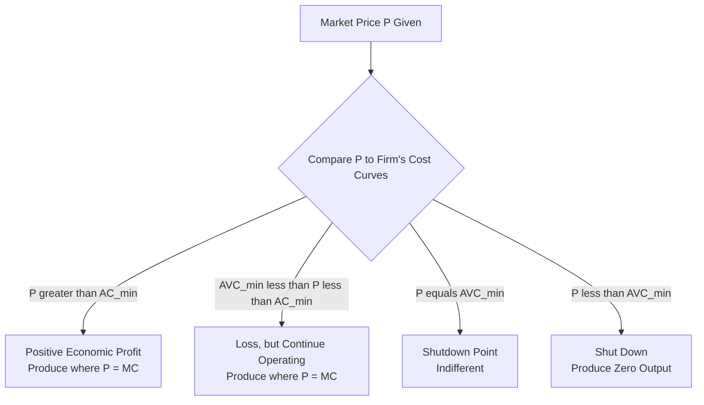
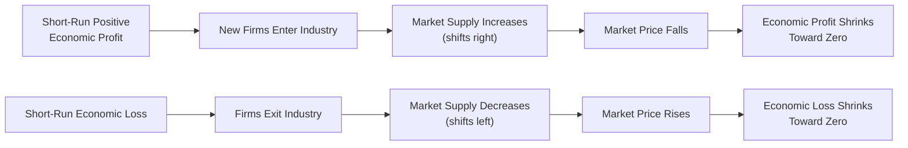

## Short-Run and Long-Run Equilibrium Under Perfect Competition

### Definition and Conceptual Overview

Equilibrium analysis under perfect competition examines how a price-taking firm determines its profit-maximizing output level in the short run (when at least one input, typically plant size, is fixed) and how the interaction of entry, exit, and market forces drives the industry toward a distinct long-run equilibrium (when all inputs, including plant size, are variable). The transition from short-run to long-run equilibrium is a foundational application of the profit-maximization principle and the free-entry-and-exit assumption central to the competitive model.

**Key Points**

- Short-run equilibrium: firms maximize profit or minimize loss given a fixed plant size; economic profit or loss can persist.
- Long-run equilibrium: firms adjust plant size, and the industry adjusts the number of firms via entry/exit, until economic profit is driven to zero.
- The universal profit-maximizing (or loss-minimizing) decision rule in both time horizons is $MR = MC$, with $MR = P$ under perfect competition.

### Short-Run Equilibrium of the Firm

#### The Profit-Maximizing Condition

A perfectly competitive firm maximizes profit by selecting the output level $Q^*$ where marginal revenue equals marginal cost:

$$P = MR = MC$$

subject to the second-order condition that $MC$ is rising at $Q^*$ (ensuring a true maximum rather than a minimum).

#### Short-Run Profit and Loss Outcomes

Because plant size is fixed in the short run, the firm's realized economic profit depends on where price falls relative to its average cost curves at the profit-maximizing output:

| Price Condition | Outcome | Firm Decision |
| --- | --- | --- |
| $P > AC_{min}$ | Positive economic profit | Continue producing at $Q^*$ where $P = MC$ |
| $AVC_{min} < P < AC_{min}$ | Economic loss, but $P$ covers all variable cost plus part of fixed cost | Continue producing in the short run (minimizes loss relative to shutting down) |
| $P = AVC_{min}$ | Shutdown point | Indifferent between producing and shutting down; loss equals total fixed cost either way |
| $P < AVC_{min}$ | Loss exceeds fixed cost if operating | Shut down immediately; loss limited to fixed cost only |

$$\pi = TR - TC = Q^*(P - AC)$$

#### Derivation of the Short-Run Supply Curve

Since the firm sets $P = MC$ at every price above the shutdown point, and produces zero output below it, the firm's **short-run supply curve is precisely the portion of its marginal cost curve lying above the minimum point of average variable cost (AVC)**. Below that point, quantity supplied is zero regardless of price.

### Numerical Illustration (Short Run)

**Example**

A firm's short-run cost structure yields the following at various output levels, with market price $P = \$40$:

| Q | TC ($) | AC ($) | AVC ($) | MC ($) |
| --- | --- | --- | --- | --- |
| 8 | 260 | 32.50 | 20.00 | 30 |
| 9 | 290 | 32.22 | 21.11 | 30 |
| 10 | 330 | 33.00 | 23.00 | 40 |
| 11 | 380 | 34.55 | 25.45 | 50 |

At $Q = 10$, $MC = \$40 = P$, satisfying the profit-maximizing condition. Since $AC = \$33.00 < P = \$40$, the firm earns positive short-run economic profit:

$$\pi = Q(P - AC) = 10 \times (40 - 33) = \$70$$

Interpretation: The firm profitably produces 10 units, earning $70 in short-run economic profit, since price exceeds average cost at the output level where price equals marginal cost.

**Short-Run Equilibrium Diagram (svg_diagram)**

<svg xmlns="http://www.w3.org/2000/svg" viewBox="0 0 700 400">
<text x="350" y="25" font-size="16" text-anchor="middle" font-weight="bold">Short-Run Equilibrium: Firm Earning Economic Profit (svg_diagram)</text>
<line x1="60" y1="350" x2="650" y2="350" stroke="black" stroke-width="2" />
<line x1="60" y1="350" x2="60" y2="50" stroke="black" stroke-width="2" />
<text x="655" y="355" font-size="13">Q</text>
<text x="20" y="55" font-size="13">\$</text>
<path d="M 90 300 Q 200 150 320 130 Q 450 150 580 280" stroke="#7c3aed" stroke-width="2.5" fill="none" />
<text x="480" y="180" font-size="11" fill="#7c3aed">MC</text>
<path d="M 90 260 Q 250 160 350 160 Q 470 175 580 260" stroke="#2563eb" stroke-width="2" fill="none" />
<text x="480" y="235" font-size="11" fill="#2563eb">AC</text>
<path d="M 90 220 Q 250 190 400 195 Q 500 205 580 240" stroke="#15803d" stroke-width="2" fill="none" />
<text x="480" y="215" font-size="11" fill="#15803d">AVC</text>
<line x1="60" y1="140" x2="650" y2="140" stroke="#b91c1c" stroke-width="2" />
<text x="600" y="135" font-size="12" fill="#b91c1c">P = MR</text>
<line x1="350" y1="140" x2="350" y2="350" stroke="gray" stroke-dasharray="3" />
<text x="330" y="365" font-size="11">Q*</text>
<rect x="350" y="140" width="100" height="27" fill="#fde68a" opacity="0.6" />
<text x="360" y="130" font-size="11" font-weight="bold">Profit Rectangle (P − AC) × Q</text>
</svg>

### Long-Run Adjustment Process

The long run permits two forms of adjustment absent in the short run:

1. **Existing firms adjust plant size** to the optimal scale for their chosen output level.
2. **New firms enter or existing firms exit** the industry in response to profit signals, since perfect competition assumes free entry and exit.

#### The Entry/Exit Mechanism

This adjustment process continues until no further incentive exists for entry or exit — that is, until **economic profit equals zero** industry-wide.

### The Long-Run Equilibrium Condition

At long-run equilibrium, three conditions hold simultaneously for every firm in the industry:

$$P = MR = MC = AC_{min} = LRAC_{min}$$

**Key Points**

- Each firm produces at the exact output level corresponding to the **minimum point of its long-run average cost curve** — the point of maximum productive efficiency for the chosen technology.
- Each firm operates its short-run plant at the scale where $SRAC_{min}$ also equals $LRAC_{min}$ at that output — i.e., the short-run and long-run average cost curves are tangent at the minimum point, meaning the firm has chosen precisely the optimal-sized plant for its equilibrium output level.
- Economic profit is exactly zero, though firms still earn a **normal accounting profit**, since economic profit is calculated net of the full opportunity cost of all resources employed, including a normal return on the owner's invested capital and effort.
- Since $P = MC$ in long-run equilibrium (as in the short run), **allocative efficiency** is maintained; since $P = AC_{min}$, **productive efficiency** is also achieved — output is produced at the lowest possible long-run average cost.

**Long-Run Equilibrium Diagram (svg_diagram)**

<svg xmlns="http://www.w3.org/2000/svg" viewBox="0 0 700 380">
<text x="350" y="25" font-size="16" text-anchor="middle" font-weight="bold">Long-Run Equilibrium: Zero Economic Profit (svg_diagram)</text>
<line x1="60" y1="330" x2="650" y2="330" stroke="black" stroke-width="2" />
<line x1="60" y1="330" x2="60" y2="50" stroke="black" stroke-width="2" />
<text x="655" y="335" font-size="13">Q</text>
<text x="20" y="55" font-size="13">\$</text>
<path d="M 90 280 Q 220 140 340 130 Q 460 140 580 260" stroke="#7c3aed" stroke-width="2.5" fill="none" />
<text x="500" y="180" font-size="11" fill="#7c3aed">MC = SRAC (tangent)</text>
<path d="M 90 250 Q 250 140 340 130 Q 450 145 580 240" stroke="#2563eb" stroke-width="2" fill="none" />
<text x="480" y="220" font-size="11" fill="#2563eb">LRAC</text>
<line x1="60" y1="130" x2="650" y2="130" stroke="#b91c1c" stroke-width="2" />
<text x="600" y="125" font-size="12" fill="#b91c1c">P = MR = LRAC_min</text>
<circle cx="340" cy="130" r="5" fill="#1e3a8a" />
<text x="350" y="120" font-size="12" font-weight="bold">Long-Run Equilibrium Point</text>
<line x1="340" y1="130" x2="340" y2="330" stroke="gray" stroke-dasharray="3" />
<text x="320" y="345" font-size="11">Q_LR</text>
</svg>

### Numerical Illustration (Long-Run Adjustment)

**Example**

Suppose the industry initially has 100 firms, each earning $70 short-run economic profit at market price $P = \$40$ (as in the earlier example), because $AC_{min} = \$32.50$ at that firm's optimal short-run plant scale, meaning long-run equilibrium price will eventually settle at $P = AC_{min} = \$32.50$ once entry is complete.

As new firms enter (attracted by the $70 profit signal), industry supply increases, and market price falls progressively from $40 toward $32.50. At $P = \$32.50$, each remaining firm earns exactly zero economic profit, entry incentives disappear, and the industry reaches long-run equilibrium — though now with more firms in the industry than at the start (the exact final number depends on total market demand at the new equilibrium price).

### Long-Run Industry Supply Curves

The shape of the long-run industry supply curve depends on how input prices behave as the industry as a whole expands or contracts, distinguishing three cases:

#### 1. Constant-Cost Industry

Input prices remain unchanged as industry output expands (the industry's demand for inputs is small relative to the total market for those inputs). Result: a **horizontal (perfectly elastic) long-run industry supply curve** at a price equal to the unchanging $LRAC_{min}$.

#### 2. Increasing-Cost Industry

Input prices rise as industry output expands, because increased industry-wide demand for specialized inputs (skilled labor, scarce raw materials) bids up their price, raising every firm's $LRAC_{min}$. Result: an **upward-sloping long-run industry supply curve** — the most commonly assumed case in most industries.

#### 3. Decreasing-Cost Industry

Input prices fall as industry output expands, typically due to external economies of scale (e.g., the development of specialized supplier industries or infrastructure as the industry grows). Result: a **downward-sloping long-run industry supply curve** — a less common but theoretically important case.

| Industry Type | Input Price Response to Industry Growth | Long-Run Supply Curve Shape |
| --- | --- | --- |
| Constant-cost | Unchanged | Horizontal |
| Increasing-cost | Rises | Upward-sloping |
| Decreasing-cost | Falls | Downward-sloping |

### Comparative Statics: Demand and Supply Shocks

- **A permanent increase in market demand**: raises price and short-run economic profit initially; triggers entry over time; price falls back toward (but, in a constant-cost industry, exactly to) the original $LRAC_{min}$, with a larger number of firms and higher total industry output in the new long-run equilibrium.
- **A permanent decrease in market demand**: lowers price and causes short-run losses initially; triggers exit over time; price rises back toward $LRAC_{min}$, with fewer firms and lower total industry output in the new long-run equilibrium.
- **A permanent decrease in input costs (e.g., a technological improvement)**: lowers each firm's cost curves, initially generating economic profit; triggers entry; price falls to the new, lower $LRAC_{min}$ in the new long-run equilibrium.

### Distinguishing Short-Run and Long-Run Equilibrium

| Dimension | Short-Run Equilibrium | Long-Run Equilibrium |
| --- | --- | --- |
| Plant size | Fixed | Variable (firm selects optimal scale) |
| Number of firms | Fixed | Variable (entry/exit occurs) |
| Economic profit | Can be positive, negative, or zero | Always zero |
| Equilibrium condition | $P = MR = MC$ | $P = MR = MC = AC_{min} = LRAC_{min}$ |
| Firm's relevant cost curve | Short-run marginal and average cost | Both short-run (at optimal scale) and long-run cost curves coincide at minimum |

### Managerial and Policy Relevance

- **Investment timing**: understanding that short-run economic profit is inherently transitory in competitive markets informs managerial expectations about the sustainability of above-normal returns, and underscores the strategic importance of creating barriers to imitation (patents, branding, proprietary technology) to sustain profit beyond the competitive long-run outcome.
- **Industry structure forecasting**: the constant/increasing/decreasing-cost industry framework helps forecast how prices will behave as an industry grows, informing capacity planning and long-term pricing strategy for firms considering entry.
- **Antitrust and efficiency benchmarking**: the long-run zero-profit, minimum-LRAC outcome provides the normative efficiency benchmark used to evaluate the welfare costs of market power in monopoly and oligopoly settings.
- **Signal interpretation for entry decisions**: persistent economic profit in a genuinely competitive (low-barrier) industry should be interpreted as a temporary, self-correcting signal rather than a stable long-run opportunity, cautioning against overinvestment based on current, unsustainable margins.

**Related Topics**

- Characteristics and assumptions of perfect competition (foundational review)
- Shutdown point and short-run supply curve derivation
- Monopoly: profit maximization and long-run persistence of economic profit
- Deadweight loss and welfare comparison across market structures
- Barriers to entry and contestable markets theory
- Economies and diseconomies of scale (link to LRAC curve shape)