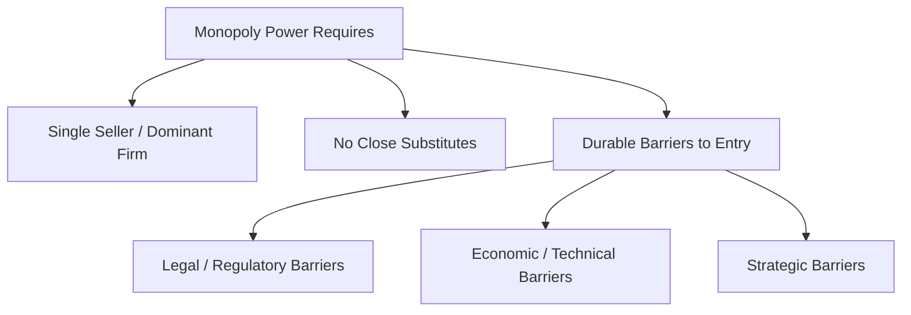

## Characteristics and Sources of Monopoly Power

### Definition and Conceptual Overview

A monopoly is a market structure characterized by a **single seller** of a product or service that has **no close substitutes**, facing the entire market demand curve directly and possessing the ability to influence the market price through its output decisions. Monopoly power (also called market power) refers more broadly to the degree to which any firm — not only a pure single-seller monopolist — can profitably set price above marginal cost without losing all its customers to competitors. Monopoly stands at the opposite theoretical pole from perfect competition on the spectrum of market structures.

**Key Points**

- A pure monopolist is a **price maker**, not a price taker: it selects a point along the market demand curve rather than accepting an externally given price.
- Because the monopolist faces the entire downward-sloping market demand curve, price and marginal revenue **diverge**, unlike in perfect competition where $P = MR$.
- The defining structural feature of monopoly is the existence of **significant, durable barriers to entry** that prevent competitors from eroding the monopolist's market position.

### Characteristics of Monopoly

#### 1. Single Seller

One firm constitutes the entire industry; there is no distinction between the "firm" and the "industry" in a monopoly, unlike in perfectly competitive markets.

#### 2. No Close Substitutes

The monopolist's product has no reasonably close substitutes available to consumers, meaning the cross-price elasticity of demand between the monopolist's product and any other good is low. This is the key economic test distinguishing a true monopoly from a firm that merely has a leading market share within a broader competitive product category.

#### 3. Price Maker

The monopolist sets price (or, equivalently, chooses output, with price determined residually by the market demand curve) rather than accepting a market-given price, since it faces the entire downward-sloping demand curve alone.

#### 4. Significant Barriers to Entry

Monopoly power is only sustainable in the long run if durable barriers prevent new firms from entering to compete away the monopolist's economic profit. The nature and strength of these barriers are the central determinant of how much monopoly power a firm can exercise and for how long.

#### 5. Downward-Sloping Demand Curve Facing the Firm

Because the monopolist's demand curve **is** the market demand curve, it is downward-sloping (unlike the horizontal firm-level demand curve under perfect competition), meaning $MR < P$ at every output level beyond the first unit.

$$MR = P\left(1 + \frac{1}{E_d}\right)$$

where $E_d$ is the price elasticity of demand (negative by convention), illustrating that marginal revenue falls below price and can even become negative in the inelastic portion of the demand curve.

### Sources of Monopoly Power: Barriers to Entry

#### 1. Legal Barriers

##### Patents and Copyrights

Government-granted exclusive rights to produce, use, or sell an invention or creative work for a specified period, providing legally enforced exclusivity that prevents imitation regardless of underlying cost or demand conditions. Patent protection is a primary mechanism through which pharmaceutical and technology firms secure temporary monopoly positions on specific products.

##### Government Licenses and Franchises

Governments may grant exclusive rights to operate in a particular market (e.g., a taxi medallion system, broadcast spectrum licenses, or an exclusive concession to operate a specific service in a defined territory), legally excluding competitors.

##### Public Franchises and Government-Sanctioned Monopolies

In some regulated industries (historically, utilities such as electricity, water, and telecommunications), governments have granted a single firm the exclusive legal right to serve a market, often paired with price regulation to limit the exercise of monopoly power.

#### 2. Economic and Technical Barriers

##### Natural Monopoly (Economies of Scale)

When the minimum efficient scale (MES) of production is very large relative to total market demand, a single large firm can supply the entire market at lower average cost than two or more competing firms could achieve individually. In this case, the long-run average cost curve continues declining across the relevant range of market output, making competition among multiple firms inherently inefficient.

$$LRAC \text{ declining throughout the relevant range of market demand} \Rightarrow \text{natural monopoly conditions}$$

Classic examples include traditional electricity transmission and distribution networks, water utilities, and rail infrastructure, where duplicating the fixed infrastructure across competing firms would be highly wasteful. [Inference: the scope of natural monopoly conditions can narrow over time as technology changes — for example, deregulation and new transmission/generation technologies have altered the natural monopoly status of parts of the electricity sector in various jurisdictions, so current classification should be verified against up-to-date industry structure.]

##### Control of Essential Inputs or Resources

A firm that owns or controls an essential raw material, resource deposit, or critical input required for production can exclude competitors regardless of other market conditions (a historically cited example is control over a scarce mineral resource essential to a specific production process).

##### High Capital/Sunk Cost Requirements

Industries requiring extremely large upfront capital investment (e.g., semiconductor fabrication plants, aircraft manufacturing) create a natural barrier, since few firms can raise the capital or bear the risk of large sunk costs required to enter competitively.

##### Absolute Cost Advantages

An incumbent firm may possess a proprietary production process, superior technology, or exclusive access to lower-cost inputs, allowing it to produce at a lower cost than any potential entrant could achieve, independent of scale.

#### 3. Strategic and Structural Barriers

##### Network Effects

In markets where the value of a product or service to each user increases as more users adopt it (e.g., social networks, payment platforms, certain software ecosystems), an early leader can develop a self-reinforcing advantage that makes it very difficult for later entrants to attract users away, even absent any formal legal barrier. [Inference: the strength and persistence of network-effect-based monopoly power varies by market and can be eroded by multi-homing, platform switching costs, or disruptive new technology, so it should not be assumed to be permanent.]

##### Brand Loyalty and Product Differentiation

Strong, well-established brand identity and consumer loyalty (built through advertising, reputation, or historical market presence) can create a significant, though generally less absolute, barrier to entry by raising the marketing cost a new entrant must incur to win customers.

##### Predatory or Limit Pricing (Strategic Deterrence)

An incumbent firm may set prices deliberately low, or maintain excess capacity, specifically to deter potential entrants by signaling that entry would be unprofitable — a strategic (rather than purely structural) barrier. [Unverified: the legality and prevalence of predatory pricing strategies vary substantially by jurisdiction's competition law and the specific facts of a case, and should not be treated as a universally available or legal strategy.]

##### Vertical Control of Distribution or Supply Chains

Control over critical distribution channels, retail shelf space, or supply relationships can exclude competitors from effectively reaching customers, even without formal legal exclusivity.

### Summary Table: Sources of Monopoly Power

| Barrier Type | Example Mechanism | Illustrative Context |
| --- | --- | --- |
| Legal | Patents, copyrights, licenses, franchises | Pharmaceuticals, broadcasting, taxi medallions |
| Natural monopoly | Economies of scale exceeding market demand | Utility transmission/distribution networks |
| Resource control | Ownership of a scarce essential input | Mineral or raw material deposits |
| Capital requirements | Very high sunk/fixed investment needed | Semiconductor fabrication, aircraft manufacturing |
| Network effects | Value increases with number of users | Payment platforms, certain digital marketplaces |
| Brand loyalty | Consumer preference built over time | Long-established consumer brands |
| Strategic deterrence | Limit/predatory pricing, excess capacity | Various contested antitrust cases |
| Vertical control | Exclusive control of distribution/supply | Certain retail and supply chain arrangements |

### Degree of Monopoly Power: The Lerner Index

Since pure, absolute monopoly (zero substitutes, complete price control) is rare in practice, economists commonly measure the **degree** of monopoly power a firm possesses using the **Lerner Index**:

$$L = \frac{P - MC}{P} = -\frac{1}{E_d}$$

where $P$ is price, $MC$ is marginal cost, and $E_d$ is the price elasticity of demand facing the firm.

- $L = 0$ corresponds to perfect competition (price equals marginal cost, no market power).
- $L \to 1$ indicates very high monopoly power (price far exceeds marginal cost).
- The index shows that a firm's ability to profitably price above marginal cost is inversely related to the elasticity of demand it faces: the less elastic (more inelastic) the demand for the firm's product, the greater its sustainable monopoly power — directly linking the *sources* of monopoly power (barriers to entry, lack of substitutes) to the *elasticity* of demand the firm ultimately confronts.

### Monopoly vs. Related Concepts

| Concept | Distinguishing Feature |
| --- | --- |
| Pure monopoly | Single seller, no close substitutes, significant entry barriers |
| Natural monopoly | A specific case of monopoly arising purely from cost structure (declining LRAC relative to market demand) |
| Monopsony | A market with a single **buyer** (rather than seller), exercising analogous market power on the demand side |
| Market power (general) | The broader, graduated ability of any firm (not necessarily a pure monopolist) to price above marginal cost, measurable via the Lerner Index |
| Oligopoly | Multiple firms with market power, arising from strategic interdependence rather than a single dominant seller |

### Managerial and Policy Relevance

- **Strategic barrier-building**: firms actively invest in creating and sustaining entry barriers (patents, brand equity, proprietary technology, exclusive supply agreements) precisely because sustainable monopoly-like power allows them to earn economic profit that would otherwise be competed away, as shown in the long-run equilibrium analysis of perfectly competitive markets.
- **Antitrust and competition policy**: regulators assess the sources and durability of a firm's market power (using tools including the Lerner Index, market share thresholds, and barrier-to-entry analysis) when evaluating mergers, exclusionary conduct, and abuse-of-dominance cases.
- **Regulation of natural monopolies**: where natural monopoly conditions genuinely exist (e.g., certain utility networks), governments frequently impose price regulation (rate-of-return or price-cap regulation) rather than attempting to force competitive market structure onto a fundamentally non-competitive cost structure.
- **Innovation policy trade-offs**: patent-based monopoly power represents a deliberate policy trade-off — temporary monopoly profit is granted as an incentive for innovation investment, balanced against the static efficiency losses monopoly pricing generates during the patent period.

**Next Steps**

- Monopoly profit maximization and price/output determination
- Deadweight loss and the welfare cost of monopoly
- Price discrimination strategies (first, second, third degree)
- Natural monopoly regulation (rate-of-return vs. price-cap regulation)
- Monopsony power and its implications for input markets
- Contestable markets theory and the role of potential competition