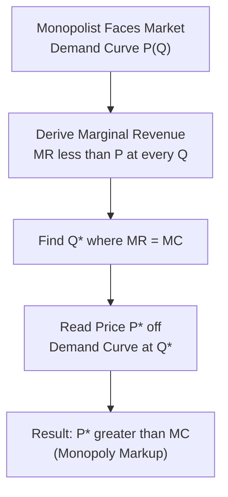

## Monopoly Price and Output Determination

### Definition and Conceptual Overview

Monopoly price and output determination analyzes how a single-seller firm facing the entire market demand curve selects its profit-maximizing price and quantity. Unlike a perfectly competitive firm, which takes price as given and simply chooses output where $P = MC$, a monopolist must recognize that **selling additional units requires lowering price on all units sold**, since it faces the downward-sloping market demand curve directly. This creates a critical divergence between price and marginal revenue that fundamentally alters the profit-maximizing decision rule and its outcomes.

**Key Points**

- The monopolist maximizes profit at the output level where $MR = MC$, exactly as under perfect competition, but then **prices above marginal cost** by reading the corresponding price off the demand curve — a behavior impossible for a price-taking competitive firm.
- Because $MR < P$ at every unit beyond the first, monopoly output is generally **lower** and price **higher** than would occur under otherwise-identical competitive conditions.
- Unlike a competitive firm, a monopolist has **no supply curve** in the traditional sense, since there is no unique, price-independent relationship between price and quantity supplied — the same $MC$ can correspond to different profit-maximizing prices depending on the shape of demand.

### The Relationship Between Price and Marginal Revenue

Because the monopolist faces a single downward-sloping demand curve $P = f(Q)$, total revenue is:

$$TR = P \cdot Q$$

Marginal revenue is the derivative of total revenue with respect to quantity:

$$MR = \frac{d(TR)}{dQ} = P + Q\frac{dP}{dQ}$$

Since $\frac{dP}{dQ} < 0$ (demand slopes downward), the second term is negative, meaning $MR < P$ at every output level beyond the first unit. This can be expressed in elasticity form:

$$MR = P\left(1 + \frac{1}{E_d}\right)$$

where $E_d$ is the price elasticity of demand (negative by convention).

**Key Points**

- When demand is **elastic** ($|E_d| > 1$), $MR > 0$: increasing output raises total revenue.
- When demand is **unit elastic** ($|E_d| = 1$), $MR = 0$: total revenue is at its maximum.
- When demand is **inelastic** ($|E_d| < 1$), $MR < 0$: increasing output actually reduces total revenue.
- A profit-maximizing monopolist **never** knowingly operates in the inelastic portion of its demand curve, since it could always increase profit by raising price and reducing output (lowering cost) simultaneously — this yields lower cost and higher revenue at once.

### Numerical Illustration: MR and Elasticity

**Example**

A monopolist faces the linear demand curve $P = 100 - 2Q$.

$$TR = P \cdot Q = 100Q - 2Q^2$$

$$MR = \frac{d(TR)}{dQ} = 100 - 4Q$$

| Q | P ($) | TR ($) | MR ($) |
| --- | --- | --- | --- |
| 5 | 90 | 450 | 80 |
| 15 | 70 | 1,050 | 40 |
| 25 | 50 | 1,250 | 0 |
| 35 | 30 | 1,050 | -40 |

Interpretation: Note that $MR$ falls twice as fast as $P$ for a linear demand curve — a general mathematical property whenever demand is linear ($P = a - bQ$), marginal revenue is also linear, with the same intercept $a$ but twice the slope ($MR = a - 2bQ$). At $Q = 25$, $MR = 0$ and total revenue is at its maximum ($1,250); increasing output beyond this point reduces total revenue even though price is still positive, since the firm has moved into the inelastic region of demand.

### Profit Maximization: The MR = MC Rule

The monopolist's profit-maximizing output $Q^*$ satisfies:

$$MR(Q^*) = MC(Q^*)$$

subject to the second-order condition that $MC$ cuts $MR$ from below (ensuring a genuine profit maximum). The corresponding **price** is then read off the demand curve at that output level — **not** set equal to marginal cost:

$$P^* = P(Q^*) > MR(Q^*) = MC(Q^*)$$

This wedge between $P^*$ and $MC$ is the defining feature of monopoly pricing and the source of the associated welfare loss relative to perfect competition.

### Numerical Illustration: Full Price/Output/Profit Determination

**Example**

Continuing with $P = 100 - 2Q$ and $MR = 100 - 4Q$, suppose the monopolist's marginal cost is constant at $MC = 20$ and average cost is also $AC = 20$ (implying zero fixed cost for simplicity).

Set $MR = MC$:

$$100 - 4Q = 20 \implies 4Q = 80 \implies Q^* = 20$$

$$P^* = 100 - 2(20) = \$60$$

$$\pi = Q^*(P^* - AC) = 20 \times (60 - 20) = \$800$$

Interpretation: The monopolist produces 20 units and charges $60 per unit, earning $800 in economic profit. Note that a hypothetical perfectly competitive industry facing the identical demand and cost conditions would set $P = MC = \$20$, yielding $Q = 40$ units at the point where $100 - 2Q = 20$ — substantially higher output and lower price than the monopoly outcome.

**Monopoly Equilibrium Diagram (svg_diagram)**

<svg xmlns="http://www.w3.org/2000/svg" viewBox="0 0 700 420">
<text x="350" y="25" font-size="16" text-anchor="middle" font-weight="bold">Monopoly Price and Output Determination (svg_diagram)</text>
<line x1="60" y1="370" x2="650" y2="370" stroke="black" stroke-width="2" />
<line x1="60" y1="370" x2="60" y2="50" stroke="black" stroke-width="2" />
<text x="655" y="375" font-size="13">Q</text>
<text x="20" y="55" font-size="13">\$</text>

<line x1="90" y1="90" x2="600" y2="340" stroke="#b91c1c" stroke-width="2.5" />
<text x="560" y="330" font-size="12" fill="#b91c1c">Demand (D = AR)</text>

<line x1="90" y1="90" x2="350" y2="340" stroke="#7c3aed" stroke-width="2.5" />
<text x="300" y="330" font-size="12" fill="#7c3aed">MR</text>

<line x1="60" y1="260" x2="650" y2="260" stroke="#2563eb" stroke-width="2" />
<text x="600" y="255" font-size="12" fill="#2563eb">MC = AC</text>

<line x1="290" y1="180" x2="290" y2="370" stroke="gray" stroke-dasharray="3" />
<text x="275" y="390" font-size="11">Q*</text>

<line x1="60" y1="180" x2="290" y2="180" stroke="gray" stroke-dasharray="3" />
<text x="20" y="185" font-size="11">P*</text>
<circle cx="290" cy="180" r="5" fill="#b91c1c" />
<text x="300" y="170" font-size="11">Price Point on Demand</text>
<circle cx="290" cy="260" r="5" fill="#1e3a8a" />
<text x="300" y="275" font-size="11">MR = MC (Q*)</text>
<rect x="60" y="180" width="230" height="80" fill="#fde68a" opacity="0.5" />
<text x="70" y="230" font-size="11" font-weight="bold">Monopoly Profit Area</text>
</svg>

### Absence of a Monopoly Supply Curve

Under perfect competition, the firm's supply curve is a unique, well-defined relationship (the portion of $MC$ above $AVC_{min}$) that gives quantity supplied at each price, independent of the shape of demand. A monopolist has **no such unique supply curve**, because the profit-maximizing price depends jointly on both $MC$ **and** the shape (elasticity) of the demand curve at each output level.

**Key Points**

- The same marginal cost curve, paired with two different demand curves that happen to cross at the same quantity but have different slopes, will generally result in two different profit-maximizing prices — demonstrating that price is not a fixed, one-to-one function of quantity for a monopolist as it is for a competitive firm.
- This has direct implications for market analysis and antitrust economics, since the standard supply-and-demand equilibrium framework used for competitive markets cannot be directly applied to monopoly price/output prediction.

### Possibility of Short-Run Losses

Although a monopolist possesses market power, this does **not guarantee** economic profit; the firm can still incur losses in the short run if demand is sufficiently weak relative to costs. The $MR = MC$ rule remains the correct decision rule regardless of whether the resulting outcome is a profit or a loss:

- If $P^* > AC$ at $Q^*$: positive economic profit.
- If $AVC_{min} < P^* < AC$ at $Q^*$: the monopolist incurs a loss but continues operating in the short run (as with a competitive firm), since it still covers variable costs and contributes toward fixed costs.
- If $P^* < AVC_{min}$: the monopolist shuts down in the short run, limiting losses to fixed costs only.

[Inference: unlike a competitive industry, a monopolist experiencing sustained losses cannot rely on other firms exiting to restore profitability, since it is already the sole firm in the market — the same barriers to entry that create its market power also mean no external competitive process corrects a poor underlying demand or cost position.]

### Long-Run Persistence of Monopoly Profit

Unlike perfect competition, where free entry drives long-run economic profit to zero, a monopolist can **sustain positive economic profit indefinitely** in the long run, precisely because the barriers to entry that define the monopoly (patents, natural monopoly cost structure, legal restrictions, etc.) prevent the entry-driven erosion process that operates in competitive markets.

$$P^* > MC = LRMC \quad \text{sustainable indefinitely, given durable barriers to entry}$$

This long-run persistence of profit above the competitive benchmark is the central source of the **welfare loss (deadweight loss)** associated with monopoly, and the basis for the standard economic critique of monopoly market structures on efficiency grounds.

### Monopoly vs. Perfect Competition: Comparative Outcomes

| Dimension | Perfect Competition | Monopoly |
| --- | --- | --- |
| Price-setting behavior | Price taker ($P = MR$) | Price maker ($P > MR$) |
| Profit-maximizing rule | $P = MR = MC$ | $MR = MC$, then $P$ read off demand |
| Price relative to MC | $P = MC$ | $P > MC$ |
| Long-run economic profit | Zero (free entry) | Can persist (barriers to entry) |
| Output level (identical cost/demand) | Higher | Lower |
| Allocative efficiency | Achieved ($P = MC$) | Not achieved ($P > MC$) |
| Supply curve | Unique, well-defined | Does not exist in the traditional sense |

### Managerial and Strategic Applications

- **Pricing strategy under market power**: firms with genuine monopoly power (or substantial market power short of pure monopoly) should apply the $MR = MC$ rule rather than any cost-plus or competitor-matching heuristic, since the profit-maximizing markup over marginal cost is directly determined by the elasticity of demand the firm faces (as captured by the Lerner Index relationship discussed in barriers-to-entry analysis).
- **Demand elasticity estimation**: because optimal monopoly pricing depends critically on the elasticity of demand at the chosen output level, accurate estimation of demand elasticity (via regression, market experiments, or conjoint analysis) is a first-order managerial priority for any firm with pricing discretion.
- **Capacity and investment planning**: since monopoly output is generally lower than the competitive benchmark, monopolists (including firms with substantial, though not absolute, market power) should size capacity investments to the profit-maximizing $Q^*$ rather than to a demand-maximizing or market-share-maximizing output level.
- **Antitrust risk assessment**: the systematic gap between monopoly price and marginal cost, and the associated welfare loss, is the core economic basis for antitrust scrutiny of dominant firms and proposed mergers that would confer significant market power.

**Related Topics**

- Characteristics and sources of monopoly power (foundational review)
- Deadweight loss and the welfare cost of monopoly
- Price discrimination strategies (first, second, third degree)
- Natural monopoly regulation (rate-of-return vs. price-cap regulation)
- Price elasticity of demand and its managerial applications
- Short-run and long-run equilibrium under perfect competition (comparative benchmark)