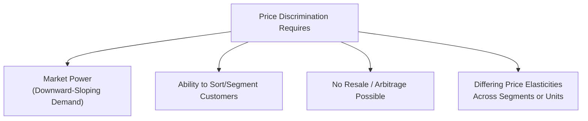

## Price Discrimination: First, Second, and Third Degree

### Definition and Conceptual Overview

Price discrimination refers to the practice of charging different prices to different customers, or for different units, for the same or similar product, where the price differences are **not based on differences in the cost of supplying those customers or units**. Price discrimination is only possible for firms with some degree of market power (it is impossible under pure perfect competition, since price-taking firms have no pricing discretion at all), and it allows a firm to capture a larger portion of consumer surplus as producer profit than a single uniform price would permit.

**Key Points**

- Price discrimination requires the firm to possess market power (some ability to set price above marginal cost).
- The firm must be able to **prevent resale (arbitrage)** between customers or market segments; without this, low-price buyers could resell to high-price buyers, undermining the discrimination scheme.
- The firm must be able to identify or sort customers by their willingness to pay, or design a mechanism that induces customers to self-select accordingly.
- Economists classify price discrimination into three canonical degrees, originally formalized by A.C. Pigou, based on the *mechanism* used to extract additional surplus.

### Necessary Conditions for Price Discrimination

1. **Market power**: the firm must face a downward-sloping demand curve (some ability to influence price), ruling out perfectly competitive price-taking firms.
2. **Ability to segment or sort customers**: the firm must be able to distinguish between customers or units with different willingness to pay, either directly (observable characteristics) or indirectly (self-selection mechanisms).
3. **Prevention of resale (no arbitrage)**: the product or service must be non-transferable between the segments being charged different prices — achieved through the nature of the product (services generally cannot be resold), contractual restrictions, or geographic/legal separation of markets.
4. **Different price elasticities of demand across segments or units**: for the discrimination to be *profitable*, different customer segments or units must exhibit different sensitivities to price.

### First-Degree Price Discrimination (Perfect Price Discrimination)

#### Definition

The firm charges **each individual customer the maximum price that customer is willing to pay** for each unit purchased — extracting the entire consumer surplus and converting it fully into producer profit. This is the theoretical extreme case and is rarely, if ever, achieved perfectly in practice.

#### Mechanism

Requires the firm to know (or very precisely estimate) each individual buyer's exact willingness to pay for each unit, and to charge a different price for every unit sold, following the demand curve exactly.

#### Outcome

Under perfect first-degree price discrimination:

$$P = MR \text{ for every unit (since each unit is priced independently)}$$

This means the firm's marginal revenue curve **coincides with the demand curve itself**, rather than lying below it as under uniform pricing. The profit-maximizing output level under perfect price discrimination therefore occurs where $D = MC$ — the same output level as the perfectly competitive/allocatively efficient outcome — but with **all consumer surplus transferred to the firm as producer surplus**, rather than shared between consumers and producer as under uniform monopoly pricing.

**Key Points**

- Perfect first-degree discrimination is **allocatively efficient** (output equals the competitive level, eliminating deadweight loss) but involves a complete redistribution of surplus from consumers to the firm.
- Real-world approximations include highly customized, negotiated pricing such as car sales with individual haggling, certain B2B contract negotiations, and some forms of algorithmic dynamic pricing informed by detailed customer data — though these are typically **imperfect (third-degree-like)** approximations rather than true first-degree discrimination. [Inference: the degree to which modern data-driven personalized pricing approximates true first-degree discrimination is a matter of ongoing empirical and legal debate, and specific claims about any particular firm's practices should be verified independently.]

### Second-Degree Price Discrimination (Quantity Discrimination / Menu Pricing)

#### Definition

The firm charges **different prices based on the quantity purchased** or offers a **menu of price-quantity (or price-quality) bundles**, allowing customers to self-select into the option that best matches their own willingness to pay, without the firm needing to identify individual customers directly.

#### Mechanism

Rather than sorting customers directly, the firm designs a menu of options such that customers with different willingness to pay **voluntarily self-select** into different bundles, revealing their type through their choice. Common implementations include:

- **Block pricing / quantity discounts**: different per-unit prices for different purchase quantities (e.g., bulk discounts, declining-block utility pricing).
- **Two-part tariffs**: a fixed entry fee plus a per-unit usage price (e.g., a membership/access fee plus a marginal price per unit consumed, such as many club membership or subscription-plus-usage models).
- **Versioning**: offering multiple quality/feature tiers of essentially the same underlying product at different prices (e.g., "economy," "standard," and "premium" service tiers), where the design deliberately induces high-willingness-to-pay customers to select the higher tier.

#### Two-Part Tariff Example

$$TC_{consumer} = A + p \cdot Q$$

where $A$ is the fixed access fee and $p$ is the per-unit price. The firm can set $p$ closer to marginal cost (encouraging higher volume consumption) while extracting additional surplus through the fixed fee $A$, calibrated to the consumer surplus of the *lowest-willingness-to-pay* customer segment the firm still wishes to serve.

**Key Points**

- Second-degree discrimination is based on **self-selection**, not on directly observable customer characteristics — the firm does not need to know which specific customer has high or low willingness to pay in advance.
- The key design challenge is structuring the menu so that each customer segment genuinely prefers its intended bundle over other available bundles (a condition known in mechanism design as **incentive compatibility**).

### Third-Degree Price Discrimination (Market Segmentation)

#### Definition

The firm divides the overall market into **distinct, identifiable segments** (based on observable characteristics such as age, location, student status, timing of purchase, or membership) and charges a **different uniform price to each segment**, based on the differing price elasticity of demand in each segment. This is the most commonly observed form of price discrimination in real-world practice.

#### Mechanism and Profit-Maximizing Rule

The firm treats each segment as a separate mini-market, applying the $MR = MC$ rule independently within each segment, subject to a shared, single marginal cost (assuming output is drawn from the same production process):

$$MR_1 = MR_2 = \dots = MR_n = MC$$

This yields the crucial pricing implication, derived from the elasticity form of marginal revenue ($MR = P(1 + 1/E_d)$):

$$\frac{P_1}{P_2} = \frac{1 + \frac{1}{E_{d,2}}}{1 + \frac{1}{E_{d,1}}}$$

**Key Points**

- The segment with the **more inelastic** demand (less price-sensitive) is charged the **higher price**.
- The segment with the **more elastic** demand (more price-sensitive) is charged the **lower price**.
- This is a direct, general application of the earlier finding that markup over marginal cost varies inversely with the elasticity of demand faced (as captured by the Lerner Index in monopoly pricing analysis).

### Numerical Illustration: Third-Degree Price Discrimination

**Example**

A firm sells to two segments with demand curves $P_1 = 120 - 2Q_1$ (Segment 1) and $P_2 = 80 - Q_2$ (Segment 2), and constant marginal cost $MC = \$20$.

**Segment 1:** $MR_1 = 120 - 4Q_1$. Setting $MR_1 = MC$: $120 - 4Q_1 = 20 \implies Q_1 = 25$, $P_1 = 120 - 2(25) = \$70$

**Segment 2:** $MR_2 = 80 - 2Q_2$. Setting $MR_2 = MC$: $80 - 2Q_2 = 20 \implies Q_2 = 30$, $P_2 = 80 - 30 = \$50$

| Segment | Demand | Price | Quantity | Elasticity at Equilibrium |
| --- | --- | --- | --- | --- |
| 1 | $P = 120 - 2Q$ | $70 | 25 | More inelastic |
| 2 | $P = 80 - Q$ | $50 | 30 | More elastic |

Interpretation: Segment 1 is charged the higher price ($70) because it exhibits less elastic demand at the relevant price range, while Segment 2, with more elastic demand, is charged the lower price ($50) — consistent with the general rule that firms price discriminate by charging more to less price-sensitive customers.

**Third-Degree Price Discrimination Diagram (svg_diagram)**

<svg xmlns="http://www.w3.org/2000/svg" viewBox="0 0 700 400">
<text x="350" y="25" font-size="16" text-anchor="middle" font-weight="bold">Third-Degree Price Discrimination Across Two Segments (svg_diagram)</text>

<line x1="60" y1="350" x2="310" y2="350" stroke="black" stroke-width="2" />
<line x1="60" y1="350" x2="60" y2="60" stroke="black" stroke-width="2" />
<text x="150" y="370" font-size="12" text-anchor="middle">Q1 (Inelastic Segment)</text>
<line x1="80" y1="90" x2="290" y2="330" stroke="#b91c1c" stroke-width="2" />
<text x="230" y="140" font-size="11" fill="#b91c1c">D1</text>
<line x1="60" y1="260" x2="310" y2="260" stroke="#2563eb" stroke-width="2" />
<text x="270" y="255" font-size="11" fill="#2563eb">MC</text>
<line x1="175" y1="150" x2="175" y2="350" stroke="gray" stroke-dasharray="3" />
<circle cx="175" cy="150" r="4" fill="#1e3a8a" />
<text x="130" y="140" font-size="11" font-weight="bold">P1 = \$70 (High)</text>

<line x1="400" y1="350" x2="650" y2="350" stroke="black" stroke-width="2" />
<line x1="400" y1="350" x2="400" y2="60" stroke="black" stroke-width="2" />
<text x="525" y="370" font-size="12" text-anchor="middle">Q2 (Elastic Segment)</text>
<line x1="420" y1="130" x2="630" y2="330" stroke="#15803d" stroke-width="2" />
<text x="570" y="170" font-size="11" fill="#15803d">D2</text>
<line x1="400" y1="260" x2="650" y2="260" stroke="#2563eb" stroke-width="2" />
<text x="610" y="255" font-size="11" fill="#2563eb">MC</text>
<line x1="540" y1="215" x2="540" y2="350" stroke="gray" stroke-dasharray="3" />
<circle cx="540" cy="215" r="4" fill="#1e3a8a" />
<text x="480" y="205" font-size="11" font-weight="bold">P2 = \$50 (Low)</text>
</svg>

#### Common Real-World Examples of Third-Degree Discrimination

- **Student, senior, and military discounts** on movie tickets, software, and transportation.
- **Geographic pricing** across countries or regions with different market conditions.
- **Peak-load / time-of-day pricing** for electricity, ride-sharing surge pricing, and airline fares based on booking timing.
- **Coupons and rebates**, which effectively segment price-sensitive customers (willing to spend time/effort redeeming coupons) from less price-sensitive customers who do not use them.

### Comparative Summary of the Three Degrees

| Degree | Basis of Discrimination | Information Requirement | Consumer Surplus Captured | Real-World Prevalence |
| --- | --- | --- | --- | --- |
| First-degree | Individual willingness to pay, unit by unit | Complete knowledge of each buyer's demand | All (theoretical maximum) | Rare in pure form; approximated by negotiation/customized pricing |
| Second-degree | Quantity purchased / self-selected bundle | No individual identification needed; relies on self-selection | Partial (via menu design) | Common (bulk discounts, tiered plans, two-part tariffs) |
| Third-degree | Observable segment membership | Segment-level elasticity estimates | Partial (via segment-level pricing) | Most common form in practice |

### Welfare and Efficiency Implications

- **First-degree discrimination**: achieves the allocatively efficient output level ($P = MC$ at the margin for the last unit sold) but transfers essentially all surplus to the firm, eliminating deadweight loss relative to single-price monopoly, though raising significant distributional/equity concerns.
- **Second-degree discrimination**: typically increases total output and reduces deadweight loss relative to single-price monopoly, though generally less than first-degree discrimination, since the firm still cannot perfectly extract all surplus from every customer.
- **Third-degree discrimination**: the welfare effect relative to uniform monopoly pricing is **ambiguous** and depends on the specific shapes of the segment demand curves — total output may rise or fall compared to single-price monopoly, and total welfare can increase or decrease correspondingly. [Inference: a commonly cited sufficient condition from the price discrimination literature is that total output must increase for third-degree discrimination to raise total welfare relative to uniform pricing, but this is a necessary rather than universally sufficient condition, and specific welfare conclusions depend on the functional forms of demand in each segment.]

### Managerial and Strategic Applications

- **Segmentation strategy design**: firms should identify observable, low-cost-to-verify characteristics correlated with willingness to pay (age, timing, location, membership status) to implement third-degree discrimination effectively.
- **Menu/tier design for SaaS and subscription businesses**: second-degree discrimination via tiered feature/pricing plans is a dominant strategy in software, telecommunications, and media, relying on careful design of feature differentiation to induce correct self-selection without excessive cannibalization of higher tiers.
- **Dynamic and algorithmic pricing**: increased availability of customer data has expanded firms' ability to approximate more granular, near-first-degree discrimination, raising both revenue-optimization opportunities and associated legal/regulatory and reputational considerations around pricing fairness and data use. [Unverified: the specific legal treatment of algorithmic personalized pricing varies by jurisdiction and is an actively evolving area of regulation; current rules should be confirmed against applicable law.]
- **Revenue management**: industries with perishable capacity and fluctuating demand (airlines, hotels, car rental) rely heavily on a combination of second- and third-degree discrimination techniques (advance-purchase restrictions, time-of-booking segmentation) collectively known as **revenue management** or **yield management**.

**Related Topics**

- Monopoly price and output determination (foundational review)
- Price elasticity of demand and its managerial applications
- Deadweight loss and welfare comparison of monopoly pricing strategies
- Two-part tariffs and non-linear pricing design
- Revenue/yield management strategies
- Bundling and tie-in sales as related pricing strategies