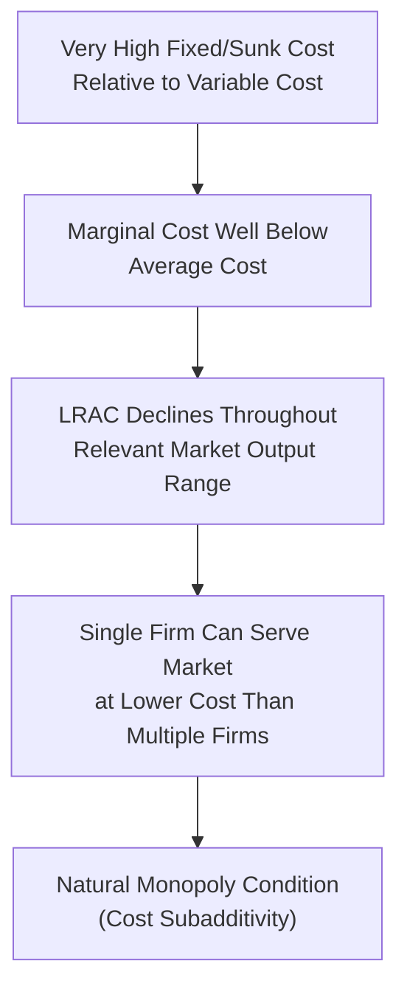

## Natural Monopoly and Welfare Considerations

### Definition and Conceptual Overview

A natural monopoly is a market condition in which a **single firm can supply the entire relevant market at a lower cost than two or more competing firms could achieve**, due to the underlying cost structure of the industry — specifically, when the long-run average cost (LRAC) curve continues declining across the entire relevant range of market demand. Unlike monopoly power arising from legal barriers, resource control, or strategic conduct, natural monopoly is a **structural, cost-driven** phenomenon: even in the complete absence of legal protection, competition among multiple firms would be inherently inefficient and likely unsustainable, tending to collapse back toward a single surviving firm.

**Key Points**

- The defining technical condition is that LRAC is declining (equivalently, marginal cost lies below average cost) throughout the range of output relevant to satisfying total market demand.
- Natural monopoly is closely tied to industries with very large fixed/sunk infrastructure costs relative to variable costs, such that duplicating that infrastructure across multiple competing firms would waste resources.
- Because natural monopoly arises from genuine cost efficiency, the standard antitrust response of "breaking up" the monopolist to restore competition is generally not efficient; the standard policy tool instead is **economic regulation** of the natural monopolist's pricing behavior.

### The Cost Condition for Natural Monopoly

#### Subadditivity of Cost

Formally, a cost function $C(Q)$ is **subadditive** at output level $Q$ if:

$$C(Q) < C(Q_1) + C(Q_2) + \dots + C(Q_n) \quad \text{for any split } Q_1 + Q_2 + \dots + Q_n = Q$$

That is, producing the entire market output $Q$ with a single firm costs less than splitting the same total output among any combination of multiple smaller firms. This is a more general and precise condition than simply observing declining average cost, though declining LRAC throughout the relevant output range is the most common practical driver of subadditivity, particularly for single-product natural monopolies.

#### Declining LRAC and High Fixed-to-Variable Cost Ratios

Natural monopoly commonly arises when:

- **Fixed (largely sunk) costs are very large** relative to marginal/variable costs (e.g., laying an electricity transmission grid, a water pipe network, or rail track).
- **Marginal cost of serving an additional customer is very low** once the fixed infrastructure exists (e.g., the marginal cost of transmitting one more unit of electricity over existing wires, or connecting one more household to an already-built water network).

$$MC \ll AC \implies AC \text{ declining as } Q \text{ rises}$$

Because $MC$ pulls $AC$ down whenever $MC < AC$, average cost falls continuously as output rises, throughout the range relevant to serving the total market — a direct link back to the general economies-of-scale relationship between marginal and average cost curves.

**Natural Monopoly Cost Curve Diagram (svg_diagram)**

<svg xmlns="http://www.w3.org/2000/svg" viewBox="0 0 700 400">
<text x="350" y="25" font-size="16" text-anchor="middle" font-weight="bold">Natural Monopoly: Declining LRAC Relative to Market Demand (svg_diagram)</text>
<line x1="60" y1="350" x2="650" y2="350" stroke="black" stroke-width="2" />
<line x1="60" y1="350" x2="60" y2="50" stroke="black" stroke-width="2" />
<text x="655" y="355" font-size="13">Q</text>
<text x="20" y="55" font-size="13">\$</text>

<path d="M 90 80 Q 250 220 450 280 Q 550 300 610 320" stroke="#2563eb" stroke-width="2.5" fill="none" />
<text x="470" y="270" font-size="11" fill="#2563eb">LRAC</text>

<path d="M 90 130 Q 250 260 450 310 Q 550 325 610 335" stroke="#7c3aed" stroke-width="2.5" fill="none" />
<text x="470" y="305" font-size="11" fill="#7c3aed">LRMC</text>

<line x1="140" y1="90" x2="580" y2="330" stroke="#b91c1c" stroke-width="2" />
<text x="500" y="290" font-size="11" fill="#b91c1c">Market Demand</text>
<line x1="420" y1="288" x2="420" y2="350" stroke="gray" stroke-dasharray="3" />
<text x="395" y="365" font-size="11">Q where D meets LRAC</text>

<text x="120" y="180" font-size="12" fill="`#15803d`" font-weight="bold">Entire relevant output</text>

<text x="120" y="198" font-size="12" fill="`#15803d`" font-weight="bold">range: LRAC declining</text>

</svg>

### Classic Examples of Natural Monopoly

- **Electricity transmission and distribution networks**: the fixed cost of building the wire/grid infrastructure is enormous relative to the marginal cost of transmitting additional electricity over existing lines.
- **Water and sewage utility networks**: the fixed cost of laying underground pipe networks dominates the marginal cost of delivering additional water.
- **Natural gas distribution pipelines**: similar fixed-infrastructure-dominant cost structure.
- **Rail track infrastructure**: laying and maintaining track is extremely capital-intensive relative to the marginal cost of running additional trains over existing track (though train **operations** themselves may be separable and potentially competitive, a distinction central to modern utility restructuring).
- **Local fixed-line telecommunications infrastructure** (historically): the physical wiring to individual premises exhibited natural monopoly characteristics before technological change (wireless, fiber competition) altered the cost structure in parts of the sector. [Inference: technological change has significantly altered which specific segments of telecommunications and, more recently, parts of the electricity sector retain genuine natural monopoly characteristics, so any current claim about a specific market's structure should be verified against up-to-date industry and regulatory information.]

### Unregulated Natural Monopoly Outcome and the Welfare Problem

If a natural monopolist is left entirely unregulated, it behaves exactly as any profit-maximizing monopolist: it sets $MR = MC$ and prices well above marginal cost, generating the standard monopoly welfare loss analyzed in monopoly price/output determination, but potentially at an even larger absolute scale given the typically very low marginal cost characteristic of natural monopoly industries.

$$P_{monopoly} > MC \implies \text{allocative inefficiency and deadweight loss}$$

This creates the **central regulatory dilemma** of natural monopoly: because splitting the industry into multiple competing firms would sacrifice the genuine cost efficiency of single-firm production (raising average cost for society), the standard antitrust remedy of promoting competition is not the efficient solution — yet leaving the natural monopolist entirely unregulated permits substantial allocative inefficiency and consumer welfare loss through monopoly pricing.

### Regulatory Responses to Natural Monopoly

#### 1. Marginal Cost Pricing (First-Best) and the Subsidy Problem

The theoretically efficient (allocatively optimal) regulated price sets $P = MC$, matching the competitive benchmark and eliminating deadweight loss. However, because $MC < AC$ throughout the relevant range in a natural monopoly (by definition), pricing at marginal cost means:

$$P = MC < AC \implies \text{firm incurs a loss at the efficient price}$$

This creates the need for a **government subsidy** to cover the resulting loss if marginal cost pricing is to be sustained — a solution that is efficient in principle but raises practical concerns about the source of subsidy funding (itself potentially distortionary if raised through taxation) and the political/administrative feasibility of ongoing subsidization. [Inference: whether marginal cost pricing with subsidy is judged practically superior to alternative regulatory approaches depends on a jurisdiction's specific fiscal capacity and political economy considerations, and is not a universally adopted solution even where theoretically efficient.]

#### 2. Average Cost Pricing (Second-Best)

A common practical compromise sets price equal to average cost, at the point where the demand curve intersects the LRAC curve:

$$P = AC \implies \text{firm earns zero economic profit (normal return only), no subsidy required}$$

This avoids the need for a subsidy and ensures the firm's financial viability (a "fair rate of return"), but results in **some remaining deadweight loss**, since $P = AC > MC$ still creates a wedge between price and marginal cost, though smaller than under unregulated monopoly pricing.

**Numerical Illustration**

**Example**

A natural monopolist has cost function $C(Q) = 1000 + 5Q$, so $MC = \$5$ (constant) and $AC = \frac{1000}{Q} + 5$. Market demand is $P = 50 - 0.5Q$.

**Unregulated monopoly**: $MR = 50 - Q$; setting $MR = MC$: $50 - Q = 5 \implies Q = 45$, $P = 50 - 0.5(45) = \$27.50$

**Marginal cost pricing**: $P = MC = \$5$; from demand, $5 = 50 - 0.5Q \implies Q = 90$. At $Q=90$, $AC = \frac{1000}{90} + 5 \approx \$16.11$, so the firm loses approximately $(16.11 - 5) \times 90 \approx \$1{,}000$ (exactly the fixed cost), requiring a subsidy of $1,000.

**Average cost pricing**: solve $50 - 0.5Q = \frac{1000}{Q} + 5$ for $Q$; this yields an intermediate output level between the unregulated monopoly quantity (45) and the marginal-cost-pricing quantity (90), with zero economic profit and no subsidy required, but still some allocative inefficiency remaining relative to the marginal cost pricing outcome.

| Pricing Rule | Price vs. MC | Output Level | Firm Profit | Subsidy Needed | Deadweight Loss |
| --- | --- | --- | --- | --- | --- |
| Unregulated monopoly ($MR=MC$) | $P \gg MC$ | Lowest | Positive economic profit | No | Largest |
| Average cost pricing ($P=AC$) | $P > MC$ | Intermediate | Zero economic profit | No | Intermediate |
| Marginal cost pricing ($P=MC$) | $P = MC$ | Highest (efficient) | Negative (loss) | Yes | Zero (eliminated) |

#### 3. Rate-of-Return Regulation

A traditional regulatory approach (historically dominant in U.S. utility regulation) in which the regulator permits the firm to set prices sufficient to cover operating costs plus a specified "fair" rate of return on its invested capital base.

- **Advantage**: ensures the regulated firm can recover costs and attract capital investment for infrastructure maintenance and expansion.
- **Key criticized limitation — the Averch-Johnson effect**: because allowed profit is tied to the capital base, the firm has a potential incentive to over-invest in capital relative to the truly cost-minimizing input mix, inflating its permitted rate base beyond what is technically efficient. [Inference: the empirical significance of the Averch-Johnson effect in practice has been debated in the regulatory economics literature and may vary by specific regulatory design and enforcement.]

#### 4. Price-Cap Regulation (Incentive Regulation)

A more modern regulatory approach that sets a ceiling on the price (or a price index) the firm may charge, typically adjusted over time by a formula such as:

$$P_{cap,t} = P_{t-1} \times (1 + \text{Inflation} - X)$$

where $X$ is an efficiency/productivity offset factor reflecting expected productivity gains the firm is expected to achieve.

- **Advantage**: because the firm keeps any cost savings achieved below the price cap (rather than having them immediately passed through to lower allowed prices, as under strict rate-of-return regulation), price-cap regulation creates stronger incentives for internal cost efficiency and innovation.
- **Limitation**: setting the appropriate initial price cap and the productivity offset $X$ requires significant regulatory information and judgment, and poorly calibrated caps can either be too generous (allowing excess profit) or too strict (undermining service quality or investment incentives). [Unverified: specific price-cap formulas, $X$-factor values, and regulatory review periods vary substantially across jurisdictions and industries, and should be confirmed against the applicable regulatory framework.]

### Structural Alternatives to Direct Price Regulation

#### Franchise Bidding (Demsetz Competition)

Rather than regulating an established monopolist's prices directly, the government can hold competitive bidding among potential firms for the exclusive right to serve the market for a defined period — introducing **competition for the market** even where competition **within** the market is inefficient due to genuine natural monopoly cost conditions. [Inference: the practical effectiveness of franchise bidding depends heavily on contract design, the number of credible bidders, asset specificity issues at contract renewal, and enforcement capacity, and outcomes have varied across specific applications documented in the regulatory economics literature.]

#### Vertical Unbundling

Where only part of an industry exhibits genuine natural monopoly characteristics (e.g., the transmission/distribution network in electricity or the physical track in rail), regulators may **unbundle** the naturally monopolistic infrastructure segment (kept regulated) from potentially competitive segments (generation, retail supply, train operations), allowing competition to be introduced in the latter while retaining regulation only where cost conditions genuinely require it — a central feature of utility sector liberalization since the late 20th century in many jurisdictions. [Inference: the specific structure and success of unbundling reforms vary considerably by country, sector, and time period, and current arrangements in any specific market should be verified against up-to-date sources.]

### Welfare Comparison Table

| Regime | Allocative Efficiency | Productive Efficiency | Financial Sustainability | Government Involvement |
| --- | --- | --- | --- | --- |
| Unregulated natural monopoly | Poor (largest deadweight loss) | Maintained (single-firm cost efficiency) | High (positive profit) | None |
| Marginal cost pricing + subsidy | Best (zero deadweight loss) | Maintained | Requires ongoing subsidy | High |
| Average cost pricing | Intermediate | Maintained | Self-sustaining (zero profit) | Moderate (price-setting) |
| Rate-of-return regulation | Intermediate, risk of overcapitalization | Potentially distorted (Averch-Johnson) | Self-sustaining | High (ongoing oversight) |
| Price-cap regulation | Intermediate, stronger efficiency incentives | Better incentives for cost efficiency | Self-sustaining | Moderate (periodic review) |

### Managerial and Policy Relevance

- **Regulated utility strategy**: firms operating under rate-of-return or price-cap regulation must understand the specific incentive structure of their regulatory regime, since it materially affects optimal capital investment, cost-management, and rate-case litigation strategy.
- **Investment planning under regulatory uncertainty**: natural monopoly firms typically require very long-lived, sunk infrastructure investments, making the credibility and stability of the regulatory framework a first-order factor in investment decision-making — a concern studied under the heading of "regulatory risk" or "regulatory commitment."
- **Deregulation and restructuring evaluation**: as technology changes the underlying cost structure of an industry (e.g., distributed generation altering electricity's natural monopoly boundaries), firms and regulators must periodically reassess which segments genuinely retain natural monopoly characteristics versus which have become suitable for competitive market structure.
- **Cross-subsidization and universal service concerns**: natural monopoly regulation frequently intersects with social policy goals (e.g., ensuring affordable universal access to electricity, water, or telecommunications), which can introduce pricing structures (such as increasing-block tariffs or geographic rate averaging) that depart from strict efficiency-based pricing for equity reasons.

**Related Topics**

- Characteristics and sources of monopoly power (foundational review)
- Monopoly price and output determination
- Deadweight loss and welfare comparison of market structures
- Price discrimination as an alternative approach to the natural monopoly financing problem
- Economies and diseconomies of scale (link to LRAC curve shape)
- Regulatory economics: rate-of-return vs. incentive (price-cap) regulation in depth