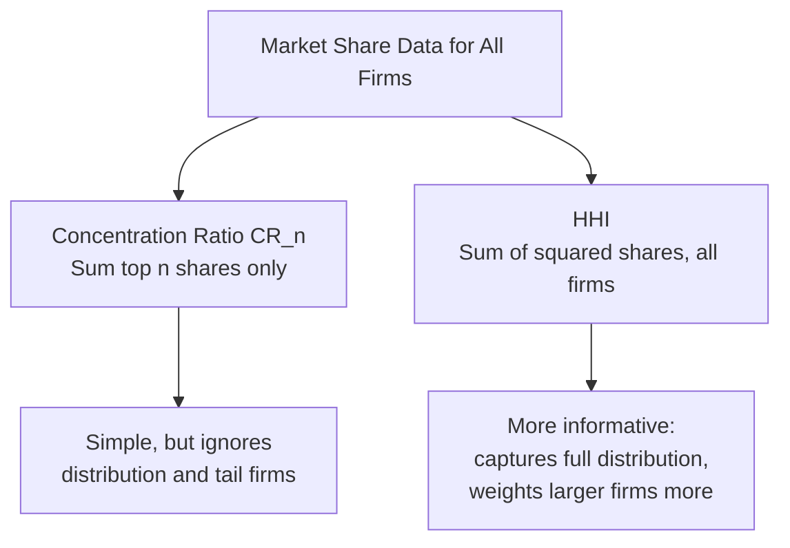

## Measuring Market Power and Market Concentration

### Definition and Conceptual Overview

Measuring market power and market concentration involves the application of quantitative tools that assess how much pricing discretion a firm or group of firms possesses, and how concentrated an industry's output is among its constituent firms. These measures serve as practical, empirically observable proxies for the theoretical market structures analyzed in perfect competition and monopoly, and they form the analytical backbone of antitrust enforcement, merger review, and industry structure analysis.

**Key Points**

- **Market power** measures refer to a specific firm's ability to profitably price above marginal cost.
- **Market concentration** measures refer to the distribution of market share across all firms within an industry, serving as a structural indicator that is often (though imperfectly) correlated with the degree of market power present.
- Regulators and economists use concentration measures as a practical, low-information-cost screening tool, while directly measuring market power (e.g., via the Lerner Index) requires more detailed firm-level cost and demand data.

### The Lerner Index (Direct Measure of Market Power)

The Lerner Index, introduced earlier in the context of monopoly power, measures the proportional markup of price over marginal cost for an individual firm:

$$L = \frac{P - MC}{P} = -\frac{1}{E_d}$$

**Key Points**

- $L = 0$ corresponds to price-taking behavior (perfect competition); $L$ approaching 1 indicates very substantial market power.
- The index directly links a firm's market power to the elasticity of demand it faces: firms facing more inelastic demand can sustain a higher markup.
- **Practical limitation**: accurately measuring $MC$ for a specific firm is often difficult using only publicly available data, since detailed cost data is typically proprietary; this is the primary reason concentration-based measures (which rely only on observable market share data) are more commonly used in practice for screening purposes, even though they measure market *structure* rather than market power directly.

### Concentration Ratio (CR_n)

The **n-firm concentration ratio** sums the market shares of the largest $n$ firms in an industry:

$$CR_n = \sum_{i=1}^{n} s_i$$

where $s_i$ is the market share (as a percentage or decimal) of the $i$-th largest firm, ranked from largest to smallest.

The most commonly reported versions are $CR_4$ (four-firm concentration ratio) and $CR_8$ (eight-firm concentration ratio).

#### Numerical Illustration

**Example**

An industry has the following market shares: Firm A = 30%, Firm B = 25%, Firm C = 15%, Firm D = 10%, and the remaining 20% split among many small firms.

$$CR_4 = 30 + 25 + 15 + 10 = 80\%$$

Interpretation: The four largest firms in this industry collectively control 80% of the market, indicating a highly concentrated industry structure — likely closer to an oligopoly than to perfect competition or monopolistic competition.

**Key Points**

- **Advantage**: simple to calculate and interpret, requiring only market share data for the top $n$ firms.
- **Key limitation**: the concentration ratio is **insensitive to the distribution of market share among the included top firms** — an industry where the top 4 firms each hold 20% ($CR_4 = 80\%$) receives the identical $CR_4$ score as an industry where one firm holds 77% and the other three hold 1% each, despite these representing very different competitive dynamics.
- Also **entirely ignores firms outside the top $n$**, meaning it provides no information about the structure of the "tail" of smaller firms in the industry.

### Herfindahl-Hirschman Index (HHI)

The HHI addresses the key limitations of the simple concentration ratio by incorporating **every firm's market share**, weighted by squaring, which gives proportionally greater weight to larger firms:

$$HHI = \sum_{i=1}^{n} s_i^2$$

where $s_i$ is each firm's market share expressed as a **whole number percentage** (i.e., 30% is entered as 30, not 0.30), and the sum runs over all firms in the industry.

$$HHI_{max} = 10{,}000 \quad \text{(pure monopoly, single firm with 100\% share)}$$

$$HHI_{min} \to 0 \quad \text{(large number of equally tiny firms, approaching perfect competition)}$$

#### Numerical Illustration

**Example**

Using the same industry as above (Firm A = 30%, Firm B = 25%, Firm C = 15%, Firm D = 10%, remaining 20% split among 20 firms of 1% each):

$$HHI = 30^2 + 25^2 + 15^2 + 10^2 + 20 \times (1^2) = 900 + 625 + 225 + 100 + 20 = 1{,}870$$

Compare this to a hypothetical industry with the same $CR_4 = 80\%$ but evenly distributed among the top four firms (20% each) and the same tail:

$$HHI_{alt} = 20^2 \times 4 + 20 \times (1^2) = 1{,}600 + 20 = 1{,}620$$

Interpretation: Even though both industries share an identical $CR_4$ of 80%, the first industry (with an unequal distribution favoring Firm A) has a notably higher HHI (1,870 vs. 1,620), correctly reflecting its greater effective concentration — demonstrating the HHI's key advantage of capturing the *distribution* of market share, not merely the combined share of a fixed number of top firms.

### HHI-Based Merger Screening Thresholds

Antitrust authorities in various jurisdictions use HHI thresholds as an initial screening tool in merger review, broadly classifying markets and evaluating the **change in HHI (ΔHHI)** resulting from a proposed merger:

| HHI Range (post-merger) | General Classification |
| --- | --- |
| Below ~1,500 | Unconcentrated market |
| ~1,500–2,500 | Moderately concentrated market |
| Above ~2,500 | Highly concentrated market |

[Unverified: specific numerical HHI thresholds, and the exact regulatory weight placed on them, vary by jurisdiction and are periodically revised by antitrust authorities (e.g., in official merger guidelines); current applicable thresholds and their precise regulatory significance should be confirmed against the relevant authority's most recent published guidance rather than treated as fixed constants.] A merger that produces a large increase in HHI within an already highly concentrated market is generally subject to substantially greater antitrust scrutiny than one occurring in a low-concentration market, though HHI thresholds serve only as an initial screen rather than a determinative legal test — actual antitrust review incorporates additional factors including entry barriers, efficiencies, and competitive dynamics specific to the case.

### Comparing CR_n and HHI

| Feature | Concentration Ratio ($CR_n$) | Herfindahl-Hirschman Index (HHI) |
| --- | --- | --- |
| Data required | Market shares of top $n$ firms only | Market shares of **all** firms in the industry |
| Sensitivity to share distribution among top firms | None (only the sum matters) | High (squaring weights larger firms more heavily) |
| Accounts for firms outside the top $n$ | No | Yes (implicitly, through the full sum) |
| Ease of calculation | Very simple | Requires complete market share data |
| Common regulatory/analytical use | Quick industry screening, historical/comparative studies | Formal merger review thresholds, more rigorous structural analysis |

### Other Related Measures and Considerations

#### Number of Firms (n) and the Reciprocal of HHI

A useful interpretive property: if all $n$ firms in an industry had **equal** market share, $HHI = \frac{10{,}000}{n}$, meaning the reciprocal of the HHI (scaled) can be loosely interpreted as an "effective number of equal-sized competitors" — a helpful intuition, though real industries rarely have perfectly equal shares.

#### Market Definition Sensitivity

Both $CR_n$ and HHI are highly sensitive to how the relevant **product market** and **geographic market** are defined. A narrowly defined market (e.g., "premium athletic footwear in a single metropolitan area") will generally show much higher concentration than a broadly defined market (e.g., "all footwear globally"), meaning market definition is often the single most consequential — and most contested — step in any concentration analysis, particularly in antitrust litigation. [Inference: the appropriate boundaries of a relevant market are determined through economic tools such as demand and supply substitutability analysis (e.g., the hypothetical monopolist test / SSNIP test), and reasonable analysts can reach different conclusions depending on the specific evidence and test applied in a given case.]

#### Barriers to Entry as a Complementary Consideration

Both concentration measures describe the **current** distribution of market share but say nothing directly about the **ease of entry** by new competitors. A highly concentrated market with genuinely low barriers to entry (a "contestable market") may exhibit competitive pricing behavior despite high measured concentration, since incumbent firms are disciplined by the credible threat of entry rather than by the current number of active competitors — a key qualification emphasized in contestable markets theory.

#### Cross-Elasticity of Demand

Beyond static concentration snapshots, economists also examine the **cross-price elasticity of demand** between a firm's product and potential substitutes as a complementary, demand-side indicator of market power — a high positive cross-elasticity with many other products suggests weaker market power (many substitutes constrain pricing), even if the firm's raw market share within a narrowly defined category appears high.

### Managerial and Policy Applications

- **Merger planning and antitrust risk assessment**: firms contemplating mergers or acquisitions routinely calculate pre- and post-merger HHI (and $CR_n$) for the relevant market to anticipate the likely level of regulatory scrutiny before proceeding to formal review, since a merger crossing key HHI thresholds is far more likely to trigger detailed investigation.
- **Competitive strategy and industry analysis**: understanding an industry's concentration structure informs strategic decisions about pricing discipline, the credibility of tacit coordination among rivals, and the likely intensity of competitive rivalry — foundational inputs into frameworks such as Porter's Five Forces analysis of industry competition.
- **Regulatory and public policy design**: concentration measures inform not only antitrust merger review but also broader industrial policy discussions about market power trends across the economy, though such macro-level conclusions require careful, consistent market definition across studies and time periods to be meaningfully compared. [Inference: aggregate, economy-wide trends in market concentration are actively debated in the current economics literature, with differing conclusions depending on data sources, industry classification systems, and time periods studied, so any specific claim about overall trends should be checked against current, well-documented research.]

**Related Topics**

- Characteristics and sources of monopoly power (foundational review)
- Oligopoly and strategic interdependence (game theory foundations)
- Contestable markets theory and the role of potential competition
- Monopolistic competition and product differentiation
- Merger analysis and antitrust enforcement frameworks
- Market definition: the hypothetical monopolist (SSNIP) test