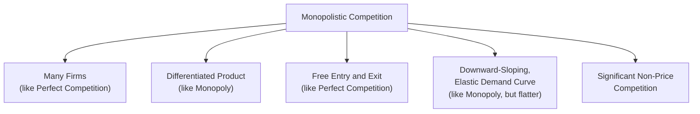

## Characteristics of Monopolistic Competition

### Definition and Conceptual Overview

Monopolistic competition is a market structure that combines elements of both perfect competition and monopoly: it features a **large number of firms** competing for the same broad customer base, similar to perfect competition, but each firm sells a **differentiated (non-identical) product**, giving it some degree of localized market power, similar to monopoly. This hybrid structure makes monopolistic competition one of the most empirically common and practically relevant market structures, describing many retail, restaurant, consumer goods, and professional service markets.

**Key Points**

- Monopolistic competition occupies a middle position on the spectrum between the two theoretical polar cases of perfect competition and pure monopoly.
- The defining feature that separates it from perfect competition is **product differentiation**; the defining feature that separates it from monopoly and oligopoly is the **large number of competing firms with free entry and exit**.
- Each firm faces a **downward-sloping (but relatively elastic) demand curve**, reflecting limited market power derived from its differentiated product, rather than the perfectly horizontal demand curve of a price-taking competitive firm.

### Core Characteristics

#### 1. Large Number of Firms

The market contains many firms, though typically fewer than in perfectly competitive markets. Each firm is small relative to the overall market and generally acts independently, without needing to consider the specific reactions of any single rival — a key distinction from oligopoly, where strategic interdependence among a small number of firms is central.

#### 2. Product Differentiation

Firms sell products that are **similar but not identical substitutes** for one another, differentiated along one or more dimensions:

- **Physical/functional differences**: variations in features, ingredients, design, or quality.
- **Location differentiation**: convenience of physical location (common in retail and restaurant markets).
- **Branding and perceived differentiation**: image, packaging, and marketing-created perceptions of distinctiveness, even where underlying physical products are very similar.
- **Service differentiation**: differences in customer service, warranty terms, or ancillary services accompanying the core product.

Because of this differentiation, each firm possesses a degree of **brand loyalty** among at least some customers, giving it limited pricing discretion rather than pure price-taking behavior.

#### 3. Free Entry and Exit

As in perfect competition, there are no significant barriers preventing new firms from entering the industry when economic profit is available, or existing firms from exiting when incurring sustained losses. This is the feature responsible for driving long-run economic profit toward zero, exactly as in perfect competition, despite the presence of product differentiation and short-run market power.

#### 4. Downward-Sloping, Relatively Elastic Demand Curve

Because the firm's product has some close (though imperfect) substitutes available from competing firms, the individual firm's demand curve, while downward-sloping (unlike the horizontal curve in perfect competition), is typically **more elastic** than that of a pure monopolist — since raising price too far will cause a significant number of customers to switch to competing, differentiated substitutes.

#### 5. Independent Decision-Making (No Strategic Interdependence)

Given the large number of competitors, each firm sets its price and output based on its own perceived demand and cost conditions, without needing to explicitly anticipate or respond to any single rival's specific reaction — in contrast to oligopoly, where the small number of firms makes each firm's decisions strategically interdependent with its rivals.

#### 6. Significant Non-Price Competition

Because firms compete partly on product characteristics rather than price alone, monopolistically competitive markets typically feature substantial investment in **advertising, branding, packaging, and product development** as tools of competition, alongside (or sometimes instead of) price competition.

### The Firm's Demand Curve

Because of product differentiation, the firm faces a downward-sloping demand curve, meaning $MR < P$ at every output level beyond the first unit, exactly as for a monopolist — but the curve is typically **flatter (more elastic)** than a pure monopolist's demand curve, since close substitutes from competing differentiated firms constrain the firm's pricing power more tightly than a true monopolist (with no close substitutes at all) would face.

$$MR = P\left(1 + \frac{1}{E_d}\right), \quad |E_d| \text{ relatively high (though finite) due to available substitutes}$$

**Demand Curve Comparison Diagram (svg_diagram)**

<svg xmlns="http://www.w3.org/2000/svg" viewBox="0 0 700 380">
<text x="350" y="25" font-size="16" text-anchor="middle" font-weight="bold">Firm Demand Curves Across Market Structures (svg_diagram)</text>
<line x1="60" y1="330" x2="650" y2="330" stroke="black" stroke-width="2" />
<line x1="60" y1="330" x2="60" y2="60" stroke="black" stroke-width="2" />
<text x="655" y="335" font-size="13">Q</text>
<text x="20" y="65" font-size="13">P</text>
<line x1="90" y1="170" x2="620" y2="170" stroke="#15803d" stroke-width="2.5" />
<text x="500" y="160" font-size="12" fill="#15803d">Perfect Competition (Perfectly Elastic)</text>
<line x1="90" y1="90" x2="450" y2="300" stroke="#2563eb" stroke-width="2.5" />
<text x="380" y="180" font-size="12" fill="#2563eb">Monopolistic Competition (Flatter)</text>
<line x1="90" y1="90" x2="290" y2="300" stroke="#b91c1c" stroke-width="2.5" />
<text x="200" y="230" font-size="12" fill="#b91c1c">Monopoly (Steeper)</text>
</svg>

### Short-Run Equilibrium

In the short run, the monopolistically competitive firm behaves exactly like a monopolist in its decision rule, since it faces a downward-sloping demand curve and possesses genuine (if limited) pricing discretion:

$$MR = MC \implies \text{determine } Q^*, \text{ then read } P^* \text{ off the firm's demand curve}$$

Depending on the relationship between the firm's demand and cost curves, the firm can earn **positive economic profit, a loss, or exactly zero economic profit** in the short run — identical in structure to short-run monopoly outcomes, since entry has not yet had time to erode any short-run profit.

### Long-Run Equilibrium: Zero Economic Profit with Excess Capacity

The critical distinguishing feature of monopolistic competition emerges in the **long run**, where the free-entry assumption (shared with perfect competition) interacts with the downward-sloping demand curve (shared with monopoly) to produce a unique outcome.

#### The Entry Adjustment Process

If firms are earning positive short-run economic profit, new firms enter the industry offering similar (differentiated) products. This entry:

- **Increases the number of available substitutes**, which shifts each existing firm's individual demand curve **leftward** (since the total market is now split among more competing brands).
- **Increases the elasticity of demand facing each firm** (makes each firm's demand curve flatter), since more substitutes are now available to consumers.

This process continues until economic profit is driven to exactly zero — analogous to the entry-driven adjustment mechanism under perfect competition, but with a critically different final tangency condition due to the downward-sloping demand curve.

#### The Long-Run Equilibrium Condition

$$P = AC \quad \text{(zero economic profit, as in perfect competition)}$$

$$\text{but} \quad P > MC \quad \text{(price still exceeds marginal cost, unlike perfect competition)}$$

Geometrically, the firm's downward-sloping demand curve becomes **tangent to its average cost curve** at the profit-maximizing output level — this tangency, rather than $P = AC_{min}$, is the defining condition of long-run monopolistic competition equilibrium.

**Long-Run Monopolistic Competition Diagram (svg_diagram)**

<svg xmlns="http://www.w3.org/2000/svg" viewBox="0 0 700 400">
<text x="350" y="25" font-size="16" text-anchor="middle" font-weight="bold">Long-Run Equilibrium: Tangency and Excess Capacity (svg_diagram)</text>
<line x1="60" y1="350" x2="650" y2="350" stroke="black" stroke-width="2" />
<line x1="60" y1="350" x2="60" y2="50" stroke="black" stroke-width="2" />
<text x="655" y="355" font-size="13">Q</text>
<text x="20" y="55" font-size="13">\$</text>
<path d="M 90 300 Q 220 130 350 125 Q 480 130 580 260" stroke="#2563eb" stroke-width="2.5" fill="none" />
<text x="480" y="180" font-size="11" fill="#2563eb">AC</text>
<line x1="120" y1="90" x2="520" y2="290" stroke="#b91c1c" stroke-width="2.5" />
<text x="450" y="250" font-size="11" fill="#b91c1c">Firm Demand (tangent to AC)</text>
<line x1="120" y1="90" x2="380" y2="300" stroke="#7c3aed" stroke-width="2" />
<text x="300" y="270" font-size="11" fill="#7c3aed">MR</text>
<circle cx="300" cy="180" r="5" fill="#1e3a8a" />
<text x="240" y="170" font-size="11" font-weight="bold">Tangency Point (P=AC)</text>
<line x1="300" y1="180" x2="300" y2="350" stroke="gray" stroke-dasharray="3" />
<text x="270" y="365" font-size="10">Q (actual, less than Q_min)</text>
<line x1="350" y1="125" x2="350" y2="350" stroke="gray" stroke-dasharray="3" />
<text x="355" y="365" font-size="10">Q_min (AC minimum)</text>

<text x="300" y="330" font-size="11" fill="`#b91c1c`" font-weight="bold">Excess Capacity Gap</text>

</svg>

### Excess Capacity Theorem

A key theoretical result of long-run monopolistic competition equilibrium: because the demand curve is downward-sloping (not horizontal), the tangency point between demand and $AC$ occurs at an output level **to the left of** the minimum point of the $AC$ curve.

$$Q_{actual} < Q_{min AC}$$

This means firms in long-run monopolistic competition equilibrium operate with **excess capacity** — they produce less output than the technically efficient scale that would minimize average cost, unlike firms in perfectly competitive long-run equilibrium, which produce exactly at $AC_{min}$.

**Key Points**

- Excess capacity implies monopolistic competition does **not** achieve full productive efficiency, in contrast to perfect competition.
- Because $P > MC$ in the long-run tangency equilibrium (price still exceeds marginal cost, even at zero economic profit), monopolistic competition also does **not** achieve full allocative efficiency.
- [Inference: the traditional excess-capacity theorem is sometimes qualified in the literature by the argument that the value consumers place on increased product variety (a benefit of differentiation not captured in the simple cost-efficiency comparison) may offset some or all of the efficiency loss from excess capacity, making the overall welfare comparison with perfect competition genuinely ambiguous rather than unambiguously worse.]

### Monopolistic Competition vs. Related Market Structures

| Feature | Perfect Competition | Monopolistic Competition | Monopoly | Oligopoly |
| --- | --- | --- | --- | --- |
| Number of firms | Very large | Large | One | Few |
| Product | Homogeneous | Differentiated | Unique | Homogeneous or differentiated |
| Entry barriers | None | Low/none | Very high | High |
| Firm's demand curve | Horizontal (perfectly elastic) | Downward-sloping, relatively elastic | Downward-sloping, market demand curve | Downward-sloping, interdependent |
| Long-run economic profit | Zero | Zero | Can persist | Can persist |
| Long-run $P$ vs. $MC$ | $P = MC$ | $P > MC$ | $P > MC$ | $P > MC$ |
| Productive efficiency | Achieved ($AC_{min}$) | Not achieved (excess capacity) | Not achieved | Not achieved |
| Strategic interdependence among firms | None | None (large numbers) | N/A (single firm) | Central feature |

### Non-Price Competition and Product Development

Because monopolistically competitive firms cannot rely on pure price competition alone to sustain any market position (given the ease of entry), they typically compete intensively through:

- **Advertising**: building brand awareness and perceived differentiation to shift and steepen the firm's individual demand curve, increasing pricing discretion.
- **Product development and innovation**: continuous refinement or introduction of new product variants to maintain differentiation and delay the demand-eroding effects of imitative entry.
- **Quality signaling**: warranties, certifications, and reputational investments that communicate product quality to imperfectly informed consumers.

[Inference: whether advertising expenditure in monopolistically competitive markets is primarily "informative" (helping consumers find better-matched products, potentially welfare-enhancing) or primarily "persuasive" (artificially entrenching brand loyalty without genuine informational content, potentially welfare-reducing or purely business-stealing) has long been debated in industrial organization economics, and the balance likely varies by industry and specific advertising content.]

### Real-World Examples

Industries frequently cited as approximating monopolistic competition include restaurants, hair salons and personal services, retail clothing, and many consumer packaged goods categories, where numerous competing sellers offer products that are close substitutes but differentiated by brand, location, quality, or style, with relatively low barriers to entry for new competitors. [Inference: the precise classification of any specific real-world industry as monopolistically competitive versus another structure depends on detailed analysis of entry conditions and the degree of genuine product differentiation, which can evolve over time.]

### Managerial and Strategic Applications

- **Differentiation strategy as a core competitive tool**: since long-run economic profit is competed away absent genuine differentiation (exactly as in perfect competition), firms in monopolistically competitive industries must continuously invest in meaningful product, service, or brand differentiation to sustain any above-normal returns, even temporarily.
- **Pricing strategy**: firms retain some short-run pricing discretion (unlike perfectly competitive firms) but must recognize that demand is relatively elastic due to available substitutes, making price increases riskier than for firms with stronger, more durable market power.
- **Advertising and marketing budget allocation**: understanding whether a firm's competitive position depends more on informative differentiation (features, quality, location convenience) or persuasive branding informs the appropriate marketing mix and expected return on advertising investment.
- **Anticipating imitative entry**: any successful, profitable product innovation in a monopolistically competitive market should be expected to attract imitative entry relatively quickly (given free entry), informing realistic expectations about how long first-mover profit advantages can be sustained absent additional protective barriers (patents, strong brand equity, network effects).

**Related Topics**

- Product differentiation strategies and their sources
- Excess capacity theorem and welfare implications in depth
- Advertising and its informative versus persuasive economic effects
- Oligopoly and strategic interdependence (game theory foundations)
- Short-run and long-run equilibrium under perfect competition (comparative benchmark)
- Monopoly price and output determination (comparative benchmark)