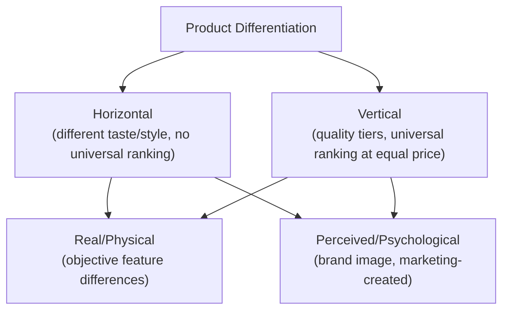

## Product Differentiation and Non-Price Competition

### Definition and Conceptual Overview

Product differentiation refers to the practice of making a firm's product or service distinguishable from competitors' offerings along dimensions other than price, creating a degree of consumer preference or brand loyalty that grants the firm limited pricing discretion. Non-price competition refers to the broader set of competitive strategies — advertising, product development, service quality, distribution, and positioning — that firms employ to win customers **without** directly lowering price, and is the natural strategic complement to differentiation in market structures such as monopolistic competition and oligopoly where price competition alone would rapidly erode profitability.

**Key Points**

- Differentiation is the underlying **source** of a firm's limited market power in non-perfectly-competitive markets with many firms; non-price competition is the set of **tools** firms use to create, communicate, and sustain that differentiation.
- Differentiation transforms a firm's demand curve from perfectly horizontal (as under perfect competition with a homogeneous product) to downward-sloping, giving the firm at least some ability to raise price without losing all customers.
- The degree of differentiation directly determines the **elasticity of demand** facing the firm: greater, more effective differentiation produces less elastic (more inelastic) demand, supporting a larger sustainable price-cost margin, consistent with the general Lerner Index relationship between market power and demand elasticity.

### Types of Product Differentiation

#### 1. Horizontal Differentiation

Products differ along a dimension where **no single variant is objectively "better"** for all consumers — different consumers simply have different preferences, and no amount of price adjustment would make all consumers agree on a single preferred option. Classic examples include flavor variations, color options, or location (in models of spatial competition).

#### 2. Vertical Differentiation

Products differ in a dimension where, **at equal price, all consumers would agree one variant is objectively superior** (higher quality, more features, greater durability) — differentiation here is primarily about quality tiers rather than differing tastes, and firms compete partly by choosing where to position on a quality-price spectrum.

#### 3. Real (Physical/Functional) Differentiation

Genuine, objectively verifiable differences in physical characteristics, ingredients, performance, features, or technical specifications.

#### 4. Perceived (Psychological) Differentiation

Differences that exist primarily in consumer perception, created through branding, packaging, advertising imagery, or reputation, even where the underlying physical product may be very similar or nearly identical to competitors' offerings.

### The Spatial (Hotelling) Model of Horizontal Differentiation

A foundational formal model of horizontal product differentiation locates firms and consumers along a line (representing either physical location or a spectrum of product characteristics, such as sweetness level or styling), where consumers incur a "transport cost" (literal or metaphorical, representing the disutility of consuming a product that doesn't exactly match their ideal preference) proportional to the distance between their ideal point and the firm's chosen position.

**Key Points**

- Firms choose both a **location** (position on the characteristic spectrum) and a **price**, and consumers select the firm offering the lowest combined price-plus-transport-cost.
- A central insight of this framework, and related "characteristics space" models more broadly, is that firms have an incentive to differentiate themselves from rivals **precisely to soften price competition** — locating too close to a rival intensifies direct price rivalry (since products become closer substitutes), while sufficient separation allows each firm some pricing discretion within its own "local" market niche.
- This provides a formal economic rationale for observed real-world product proliferation and niche positioning strategies across many differentiated-product industries.

### Sources and Drivers of Product Differentiation

#### 1. Physical Product Attributes

Design, materials, functionality, performance specifications, and ingredient composition.

#### 2. Location and Convenience

Physical proximity, accessibility, operating hours, and ease of purchase — a particularly important differentiator in retail, food service, and personal service industries.

#### 3. Branding and Image

Cultivated associations, reputation, and identity communicated through naming, packaging, logo design, and consistent marketing messaging over time.

#### 4. Service and Support

Pre-sale and post-sale service quality, warranty terms, customer support responsiveness, and return/exchange policies.

#### 5. Distribution and Availability

Exclusive or preferential distribution arrangements that make a product more readily accessible through certain channels than competitors' offerings.

### Non-Price Competition Strategies

#### 1. Advertising

The most visible and widely studied form of non-price competition, serving two theoretically distinct (though often intertwined in practice) functions:

##### Informative Advertising

Conveys genuine, verifiable information about product existence, price, features, or availability, helping consumers make better-informed purchase decisions and find products that better match their preferences — generally viewed as welfare-enhancing by reducing search costs and improving the efficiency of consumer choice.

##### Persuasive Advertising

Aims to shape consumer preferences or create brand loyalty and perceived differentiation independent of any objective, verifiable product information — its welfare implications are more contested, since it may simply shift demand between competing brands (a "business-stealing" effect) without necessarily improving overall market efficiency or consumer welfare. [Inference: the informative-versus-persuasive distinction is a useful conceptual framework rather than a sharp empirical dividing line, since real-world advertising campaigns frequently combine both elements, and the actual welfare effect of any specific advertising campaign is difficult to assess without detailed market-specific analysis.]

#### 2. Product Development and Innovation

Continuous investment in new features, product variants, or entirely new products, aimed at maintaining a differentiation advantage that imitative entry (common in monopolistically competitive markets) will otherwise erode over time.

#### 3. Packaging and Presentation

Visual design, branding consistency, and functional packaging improvements that enhance perceived value or convenience without altering the core product itself.

#### 4. Quality Signaling

Warranties, money-back guarantees, third-party certifications, and public reputation investments that communicate product quality to consumers who cannot fully verify quality prior to purchase — particularly important in markets characterized by asymmetric information between buyer and seller.

#### 5. Customer Service and Experience

Investment in the overall purchase and post-purchase experience (staff training, store ambiance, digital interface design, loyalty programs) as a differentiator independent of the core physical product.

#### 6. Distribution Channel Strategy

Securing preferential shelf space, exclusive retail partnerships, or superior online/offline availability relative to competitors.

### Economic Effects of Product Differentiation

#### Impact on Demand Elasticity

Effective differentiation reduces the availability of perceived close substitutes for a given firm's product, making demand **less elastic** and supporting a larger sustainable price-cost margin, consistent with the Lerner Index relationship $L = -1/E_d$.

#### Impact on Market Structure Outcomes

Product differentiation is the defining structural feature distinguishing monopolistic competition from perfect competition, directly producing the **downward-sloping firm demand curve**, the possibility of short-run economic profit, and — critically — the **excess capacity** result in long-run monopolistic competition equilibrium (since the tangency between a downward-sloping demand curve and the average cost curve occurs to the left of the AC-minimizing output level).

#### Trade-Off: Variety Benefits vs. Cost Efficiency

Differentiation and the resulting product variety provide genuine consumer benefit by allowing better matching between diverse consumer preferences and available products, but this benefit is achieved at some cost in terms of productive efficiency, since firms operating with excess capacity do not produce at the minimum point of their average cost curves. [Inference: the appropriate weighting of variety benefits against productive efficiency losses in evaluating the overall welfare desirability of product differentiation is a normative and empirical question without a single universally agreed answer, and likely varies substantially by product category and the genuine strength of underlying consumer preference heterogeneity.]

### Non-Price Competition Under Monopolistic Competition vs. Oligopoly

| Dimension | Monopolistic Competition | Oligopoly |
| --- | --- | --- |
| Number of competitors considered | Many; firm ignores individual rival reactions | Few; firm explicitly anticipates specific rival reactions |
| Primary driver of non-price competition | Sustaining differentiation against free entry/imitation | Sustaining differentiation while managing strategic interdependence and avoiding destructive price wars |
| Typical advertising intensity | Moderate to high, firm-specific | Often very high, sometimes involving explicit "advertising wars" as a form of non-price rivalry |
| Risk of price competition | Lower strategic stakes (large number of independent firms) | Higher strategic stakes (price cuts can trigger matching retaliation from a small number of identifiable rivals) |

**Key Points**

- In oligopoly, non-price competition (advertising, product features, loyalty programs) is often strategically preferred over price competition specifically because **price cuts are easily and quickly matched by rivals** (eliminating any competitive advantage while reducing industry-wide profit), whereas differentiation-based competition is harder to replicate quickly and can sustain a competitive advantage for longer.
- This strategic logic — preferring non-price to price competition specifically to avoid mutually destructive price wars — is a recurring theme explored further in oligopoly game-theoretic models.

### Measuring and Assessing Differentiation

- **Cross-price elasticity of demand**: a low (or even negative, if the products are complements rather than substitutes) cross-price elasticity between a firm's product and competitors' products indicates strong, effective differentiation; a high positive cross-price elasticity indicates weak differentiation (products are close substitutes).
- **Brand equity and consumer surveys**: firms and market researchers use brand-tracking studies, willingness-to-pay surveys, and conjoint analysis to quantify the perceived strength of differentiation and its translation into price premium potential.
- **Advertising-to-sales ratios**: commonly used (with significant limitations) as a rough industry-level proxy for the intensity of non-price, brand-based competition relative to reliance on direct price competition. [Unverified: the appropriate interpretation and typical magnitude of advertising-to-sales ratios vary substantially by industry, product category, and time period, and any specific benchmark figures should be verified against current industry data rather than assumed.]

### Managerial and Strategic Applications

- **Positioning strategy**: firms must deliberately choose where to position their product along relevant horizontal (taste/style) and vertical (quality) dimensions relative to competitors, informed by spatial competition logic that favors sufficient differentiation to soften direct price rivalry while remaining close enough to capture meaningful demand.
- **Marketing mix allocation**: understanding whether a firm's competitive advantage rests more on genuine functional differentiation or perceived/brand differentiation informs the appropriate balance of investment between product development (R&D) and marketing/advertising expenditure.
- **Sustaining differentiation against imitation**: in monopolistically competitive markets with free entry, firms should anticipate that any successful differentiation advantage will attract imitative entry over time, requiring continuous reinvestment in differentiation (new features, refreshed branding, service improvements) to sustain any above-normal returns — directly linked to the erosion of short-run profit toward the long-run tangency equilibrium.
- **Avoiding price wars in concentrated markets**: in oligopolistic settings, firms often have a strategic incentive to compete primarily through non-price channels (advertising, loyalty programs, product features) precisely because price competition is easily matched and tends to be mutually destructive to industry profitability, an insight with direct application to competitive strategy and pricing policy design.

**Related Topics**

- Characteristics of monopolistic competition (foundational review)
- Excess capacity theorem and welfare implications in depth
- Oligopoly and strategic interdependence (game theory foundations)
- Advertising economics: informative versus persuasive effects in depth
- Brand equity and consumer choice under imperfect information
- Spatial/Hotelling models of competition in depth