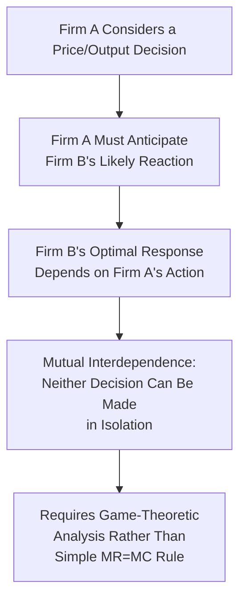
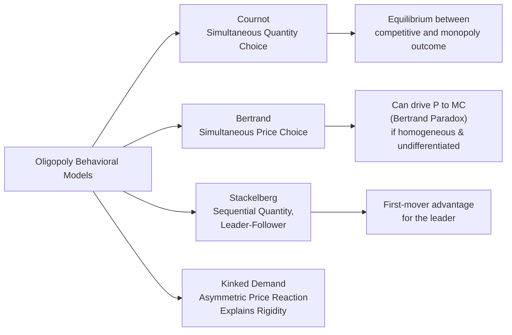

## Interdependence and Behavior Under Oligopoly

### Definition and Conceptual Overview

Oligopoly is a market structure characterized by a **small number of firms**, each large enough relative to the total market that its individual pricing, output, and strategic decisions **materially affect its rivals**, and vice versa. This mutual **strategic interdependence** is the single defining feature that distinguishes oligopoly from every other market structure covered previously: unlike a perfectly competitive or monopolistically competitive firm (which can safely ignore any individual rival's specific reaction, given the large number of competitors), an oligopolist must explicitly anticipate how rivals will respond to its own actions before making a decision.

**Key Points**

- Strategic interdependence means there is **no single, universally applicable oligopoly model** analogous to the clean $MR=MC$ rules of perfect competition or monopoly; instead, oligopoly outcomes depend critically on the specific **behavioral assumptions** firms are presumed to make about how rivals will react.
- This has made **game theory** the primary analytical toolkit for oligopoly analysis, since oligopoly decision-making is fundamentally a strategic game between a small number of identifiable, mutually aware players.
- Real-world oligopoly outcomes range from intensely competitive (approaching perfectly competitive pricing) to highly collusive (approaching monopoly pricing), depending on the specific structure of interaction, information, and enforcement mechanisms present in the industry.

### Characteristics of Oligopoly

#### 1. Few Dominant Firms

A small number of firms account for most industry output or sales, typically measurable via high concentration ratios ($CR_4$) or Herfindahl-Hirschman Index (HHI) values.

#### 2. Product Can Be Homogeneous or Differentiated

Unlike monopolistic competition (which requires differentiation) or perfect competition (which requires homogeneity), oligopoly can occur with either **homogeneous products** (e.g., certain commodity or basic industrial goods markets) or **differentiated products** (e.g., automobiles, smartphones, airlines) — the defining feature is the small number of firms, not the nature of the product.

#### 3. Significant Barriers to Entry

Oligopoly typically persists because of substantial (though not necessarily absolute) barriers to entry — economies of scale, high capital requirements, brand loyalty, or legal/regulatory barriers — that prevent the large-number, free-entry dynamics characteristic of perfect or monopolistic competition.

#### 4. Mutual Interdependence in Decision-Making

Each firm's optimal pricing, output, and strategic decisions depend explicitly on its **expectations about rivals' reactions**, making the analysis of oligopoly fundamentally different in kind — not merely degree — from the other market structures.

### The Kinked Demand Curve Model

One of the earliest formal attempts to explain observed **price rigidity** in oligopolistic markets (the empirical tendency for oligopoly prices to remain stable for extended periods despite cost or demand fluctuations), developed by Paul Sweezy, is built on an asymmetric assumption about how rivals react to price changes.

#### Core Behavioral Assumption

- If a firm **raises its price** above the prevailing market price, rivals are assumed **not to follow**, since they can gain market share by holding their price steady — making demand for the price-raising firm's product relatively **elastic** above the current price (a large quantity loss as customers switch to rivals).
- If a firm **lowers its price** below the prevailing market price, rivals are assumed to **match the cut**, since they cannot afford to lose market share — making demand relatively **inelastic** below the current price (only a modest quantity gain, since the price advantage is quickly neutralized by matching rivals).

This asymmetric reaction pattern produces a demand curve with a distinct **"kink"** at the prevailing market price, and — critically — a **discontinuity (gap) in the corresponding marginal revenue curve** at the output level associated with that kink.

**Kinked Demand Curve Diagram (svg_diagram)**

<svg xmlns="http://www.w3.org/2000/svg" viewBox="0 0 700 400">
<text x="350" y="25" font-size="16" text-anchor="middle" font-weight="bold">Kinked Demand Curve and Price Rigidity (svg_diagram)</text>
<line x1="60" y1="350" x2="650" y2="350" stroke="black" stroke-width="2" />
<line x1="60" y1="350" x2="60" y2="50" stroke="black" stroke-width="2" />
<text x="655" y="355" font-size="13">Q</text>
<text x="20" y="55" font-size="13">P</text>

<line x1="100" y1="120" x2="320" y2="200" stroke="#b91c1c" stroke-width="3" />
<line x1="320" y1="200" x2="580" y2="240" stroke="#b91c1c" stroke-width="3" />
<text x="480" y="230" font-size="11" fill="#b91c1c">D (inelastic below kink)</text>
<text x="140" y="140" font-size="11" fill="#b91c1c">D (elastic above kink)</text>

<line x1="100" y1="120" x2="320" y2="280" stroke="#7c3aed" stroke-width="2.5" />
<line x1="320" y1="140" x2="580" y2="340" stroke="#7c3aed" stroke-width="2.5" />
<text x="330" y="200" font-size="10" fill="#7c3aed">MR gap</text>
<circle cx="320" cy="200" r="5" fill="#1e3a8a" />
<text x="330" y="190" font-size="11" font-weight="bold">Kink (Prevailing Price)</text>

<line x1="60" y1="230" x2="650" y2="230" stroke="#2563eb" stroke-width="2" />
<line x1="60" y1="270" x2="650" y2="270" stroke="#2563eb" stroke-width="2" stroke-dasharray="4" />
<text x="600" y="225" font-size="10" fill="#2563eb">MC1</text>
<text x="600" y="265" font-size="10" fill="#2563eb">MC2</text>
<text x="150" y="300" font-size="11">MC can shift within the gap without changing P or Q</text>
</svg>

#### Explaining Price Rigidity

Because the marginal revenue curve has a vertical discontinuity (gap) at the kink's output level, **marginal cost can fluctuate within a certain range** without inducing the firm to change its profit-maximizing price or output, since $MR = MC$ continues to hold for any $MC$ value falling within the gap. This provides a theoretical explanation for the commonly observed empirical pattern of relatively stable oligopoly prices despite moderate cost fluctuations.

**Key Points**

- **Major limitation**: the kinked demand curve model explains price *rigidity* once a prevailing price exists, but does **not explain how that initial price was determined** in the first place — it takes the prevailing price as a given starting point rather than deriving it from underlying market conditions.
- [Inference: the kinked demand curve model has been substantially critiqued in the subsequent economics literature, both for its ad hoc behavioral assumption (asymmetric rival reactions) and for limited empirical support regarding the actual frequency and causes of oligopoly price rigidity, and is now generally regarded as one useful illustrative model among several oligopoly frameworks rather than a fully general theory of oligopoly pricing.]

### Behavioral/Conjectural Variation Models

Beyond the kinked demand curve, classical oligopoly theory developed several distinct models based on different assumptions about how a firm expects rivals to react — formally termed **conjectural variations**.

#### Cournot Model (Quantity Competition)

Each firm chooses its **output quantity** to maximize profit, assuming rivals' output levels remain **fixed** at their current values (a "naive" conjecture that ignores any actual quantity response from rivals). Firms reach equilibrium where each firm's output is a mutual best response to the others' output — a **Nash equilibrium** in quantities.

$$q_i^* = \text{best response to } q_{-i} \text{ (rivals' output, held fixed in conjecture)}$$

- With a small number of symmetric firms, the Cournot equilibrium price lies **between** the competitive price ($P=MC$) and the monopoly price, and approaches the competitive outcome as the number of firms increases.

#### Bertrand Model (Price Competition)

Each firm chooses its **price**, assuming rivals' prices remain fixed, with consumers buying entirely from the lowest-price seller (assuming homogeneous products). This produces the striking **Bertrand Paradox**: with just two identical firms producing a homogeneous product at constant marginal cost, competition drives price all the way down to marginal cost ($P = MC$) — the competitive outcome — even with only two firms in the market. [Inference: the stark Bertrand Paradox result is highly sensitive to its underlying assumptions (homogeneous product, identical constant marginal cost, no capacity constraints, single-period interaction); relaxing any of these assumptions, such as introducing product differentiation or capacity constraints, generally restores positive price-cost margins, which is why real-world price-setting oligopolies are not typically observed to price exactly at marginal cost.]

#### Stackelberg Model (Sequential Quantity Leadership)

One firm (the **leader**) chooses its output first, and the remaining firm(s) (the **follower(s)**) observe the leader's choice and then optimize their own output in response. The leader, anticipating the follower's best-response function, generally achieves a **higher** output and profit than in the simultaneous Cournot model, while the follower typically achieves lower profit than under simultaneous Cournot competition — illustrating a genuine **first-mover advantage** in quantity-setting oligopoly.

### Collusion and Cartel Behavior

Given the small number of firms and mutual awareness characteristic of oligopoly, firms have a clear collective incentive to **coordinate** on price and output, jointly restricting output and raising price toward the monopoly outcome to maximize combined industry profit.

#### Explicit Collusion (Cartels)

Firms formally agree on price, output quotas, or market territories. Explicit cartel agreements are **illegal under antitrust/competition law in most jurisdictions** (e.g., prohibitions on price-fixing agreements), though certain cartels operating across international boundaries with limited effective enforcement (most notably in specific commodity sectors) have historically achieved some degree of coordinated market influence. [Unverified: the current legal status, membership, and effectiveness of any specific real-world cartel arrangement changes over time and should be verified against current sources rather than assumed static.]

#### Tacit Collusion

Firms achieve coordinated, monopoly-like pricing outcomes **without any explicit communication or formal agreement**, relying instead on repeated interaction, mutual observation of pricing patterns, and implicitly understood retaliation strategies (e.g., price-matching norms, focal-point pricing) — a subtler and generally much harder-to-prosecute form of coordination than explicit cartel agreements.

#### Factors Affecting Cartel/Collusion Stability

- **Number of firms**: fewer firms make monitoring and coordination easier to sustain.
- **Product homogeneity**: harder to coordinate effectively across highly differentiated products with varying price points.
- **Frequency of interaction and detectability of cheating**: more frequent, transparent transactions make secret deviation (cheating on an agreed price/output) easier to detect and punish, supporting more stable coordination.
- **Demand and cost symmetry among firms**: more similar firms find it easier to agree on and sustain a common coordinated strategy.
- **Individual incentive to "cheat"**: each cartel member individually has a unilateral incentive to secretly undercut the agreed price or exceed its output quota to capture additional profit at rivals' expense, creating inherent instability — a dynamic directly analogous to the **Prisoner's Dilemma** structure explored in game theory.

### The Prisoner's Dilemma Structure of Oligopoly Pricing

Game theory provides the modern, generalized framework for understanding oligopoly behavior, formalizing the tension between the collective incentive to coordinate (raising joint profit) and each individual firm's incentive to unilaterally deviate (defect) for individual gain.

|  | Rival Holds Price High | Rival Cuts Price |
| --- | --- | --- |
| **Firm Holds Price High** | Both earn high (collusive) profit | Firm loses significant share; rival gains |
| **Firm Cuts Price** | Firm gains significant share; rival loses | Both earn low (competitive) profit |

**Key Points**

- In a **single-period (one-shot) game**, each firm's dominant strategy is typically to cut price (defect), since doing so is individually optimal regardless of the rival's choice — leading both firms to the mutually worse, low-profit outcome, exactly as in the classic Prisoner's Dilemma.
- In a **repeated game** (firms interact over many periods, as in ongoing real-world competition), sustained cooperation (tacit collusion) becomes more plausible, supported by strategies such as **tit-for-tat** (cooperate initially, then mirror the rival's previous action) or **trigger strategies** (cooperate until a rival defects, then punish with sustained non-cooperation), since the threat of future retaliation can outweigh the short-term gain from defecting today. [Inference: whether repeated interaction actually sustains stable tacit collusion in any specific real-world oligopoly depends on firm-specific factors including discount rates, detection speed, and punishment credibility, and cannot be assumed automatically from the theoretical possibility alone.]

### Price Leadership as an Alternative Coordination Mechanism

In some oligopolies, a **dominant firm** (often the largest or lowest-cost producer) sets the price, and smaller firms follow, adopting the leader's price as their own without explicit agreement — a form of tacit coordination that can achieve price stability and elevated margins similar to collusion, without requiring formal communication that would risk antitrust liability. [Inference: the specific dynamics and prevalence of price leadership arrangements vary considerably across industries and time periods, and identifying genuine price leadership versus independent parallel pricing based on shared cost conditions can be empirically and legally difficult to distinguish.]

### Summary Comparison of Classical Oligopoly Models

| Model | Strategic Variable | Timing | Key Behavioral Assumption | General Outcome |
| --- | --- | --- | --- | --- |
| Cournot | Quantity | Simultaneous | Rivals' output held fixed | Between competitive and monopoly outcome |
| Bertrand | Price | Simultaneous | Rivals' price held fixed | Can approach competitive outcome (P=MC) if homogeneous |
| Stackelberg | Quantity | Sequential | Leader anticipates follower's best response | First-mover advantage for leader |
| Kinked demand | Price | Static, asymmetric reaction | Rivals match cuts, ignore increases | Explains price rigidity, not initial price level |
| Collusion (cartel) | Joint price/quantity | Coordinated | Explicit or tacit agreement to restrict output | Approaches monopoly outcome, but unstable absent enforcement |

### Managerial and Strategic Applications

- **Anticipating rival reactions before major decisions**: managers in oligopolistic industries must explicitly model likely competitor responses (price matching, output adjustment, retaliatory moves) before committing to significant pricing or capacity decisions, since failing to do so risks triggering costly, unanticipated competitive responses.
- **Preference for non-price competition**: as noted in the discussion of product differentiation, oligopolists frequently favor advertising, product development, and service differentiation over direct price competition, precisely because price cuts are easily and quickly matched by identifiable rivals, risking a mutually destructive price war with little lasting competitive advantage.
- **First-mover considerations**: the Stackelberg model's result — that a credible, observable first move in quantity or capacity commitment can secure a lasting profit advantage — provides a strategic rationale for early, publicly visible capacity investment or product launch commitments in oligopolistic industries.
- **Antitrust compliance and tacit coordination risk**: firms in concentrated industries must be cautious that even informal, unspoken pricing patterns (price leadership, parallel pricing) can attract antitrust scrutiny in some jurisdictions, even absent explicit collusive agreement, making legal counsel important in pricing strategy design for genuinely oligopolistic markets. [Unverified: the specific legal boundary between lawful independent parallel pricing and unlawful tacit collusion varies by jurisdiction's competition law and case-specific evidence, and should be confirmed with current legal guidance rather than assumed from economic theory alone.]

**Related Topics**

- Game theory fundamentals: Nash equilibrium, dominant strategies, and payoff matrices
- Cournot, Bertrand, and Stackelberg models in mathematical depth
- Cartel stability and antitrust enforcement against collusion
- Product differentiation and non-price competition (foundational review)
- Measuring market power and market concentration (comparative review)
- Contestable markets theory and the role of potential competition