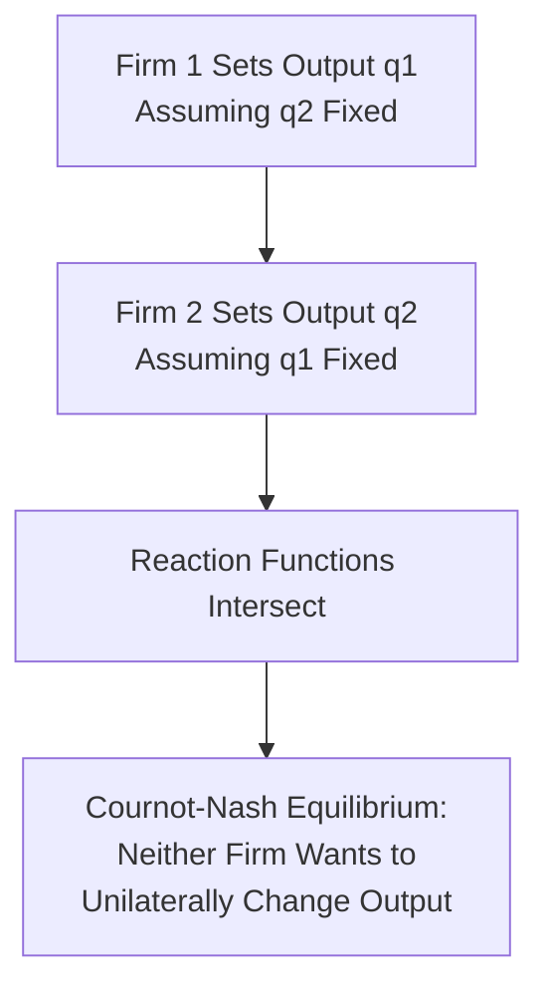
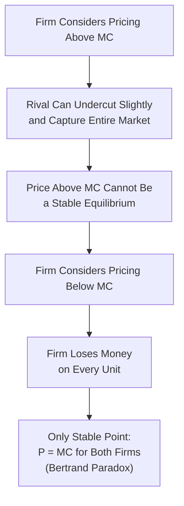

## Cournot and Bertrand Models of Oligopoly

### Definition and Conceptual Overview

The Cournot and Bertrand models are the two foundational formal frameworks for analyzing simultaneous-move oligopoly competition, distinguished by the **strategic variable** firms are assumed to choose: **quantity** in the Cournot model, and **price** in the Bertrand model. Despite analyzing structurally similar markets (a small number of firms with mutual awareness), the two models produce dramatically different equilibrium predictions, illustrating how sensitive oligopoly outcomes are to the specific competitive mechanism assumed — a central methodological lesson of formal oligopoly theory.

**Key Points**

- Both models rely on the game-theoretic concept of **Nash equilibrium**: each firm's chosen strategy (quantity or price) is a best response to its rivals' strategies, such that no firm has a unilateral incentive to deviate given what its rivals are doing.
- The Cournot model generally predicts outcomes **between** the competitive and monopoly benchmarks; the Bertrand model, under specific assumptions, can predict an outcome **identical to the competitive benchmark** even with very few firms — the striking "Bertrand Paradox."
- Both are **static, simultaneous-move** models; the **Stackelberg model** extends the Cournot framework to sequential (leader-follower) quantity competition.

### The Cournot Model (Quantity Competition)

#### Core Assumptions

- Firms choose **output quantity** simultaneously and independently.
- Each firm assumes its rivals' output levels will remain **fixed** at their current (conjectured) values when choosing its own profit-maximizing output — a "naive" conjecture, since in equilibrium rivals do in fact respond, but each firm's decision rule treats their output as given.
- The market price is determined **residually**, by the market demand curve, based on the **total combined output** of all firms.
- Products are typically assumed homogeneous (though the model can be extended to differentiated products).

#### Best-Response (Reaction) Functions

For a duopoly (two firms, $i$ and $j$), each firm's profit-maximizing output, given its conjecture about the rival's output $q_j$, defines its **reaction function**:

$$q_i^* = R_i(q_j)$$

Equilibrium occurs where both firms' reaction functions intersect — the point at which each firm's output choice is simultaneously a best response to the other's, with neither having any incentive to unilaterally change output.

#### Mathematical Derivation (Linear Duopoly Example)

**Example**

Market demand: $P = 100 - Q$, where $Q = q_1 + q_2$. Both firms have identical constant marginal cost $MC = 10$ (assume zero fixed cost for simplicity).

Firm 1's profit: $\pi_1 = P \cdot q_1 - 10q_1 = (100 - q_1 - q_2)q_1 - 10q_1$

Taking the derivative with respect to $q_1$ and setting it to zero:

$$\frac{\partial \pi_1}{\partial q_1} = 100 - 2q_1 - q_2 - 10 = 0 \implies q_1 = \frac{90 - q_2}{2} \quad \text{(Firm 1's reaction function)}$$

By symmetry, Firm 2's reaction function is $q_2 = \frac{90 - q_1}{2}$.

Solving the two reaction functions simultaneously (by symmetry, $q_1 = q_2 = q^*$):

$$q^* = \frac{90 - q^*}{2} \implies 2q^* = 90 - q^* \implies 3q^* = 90 \implies q^* = 30$$

$$Q^* = q_1^* + q_2^* = 60, \qquad P^* = 100 - 60 = \$50$$

$$\pi_i^* = (50 - 10) \times 30 = \$1{,}200 \text{ per firm}$$

**Cournot Reaction Function Diagram (svg_diagram)**

<svg xmlns="http://www.w3.org/2000/svg" viewBox="0 0 700 400">
<text x="350" y="25" font-size="16" text-anchor="middle" font-weight="bold">Cournot Reaction Functions and Nash Equilibrium (svg_diagram)</text>
<line x1="60" y1="350" x2="650" y2="350" stroke="black" stroke-width="2" />
<line x1="60" y1="350" x2="60" y2="50" stroke="black" stroke-width="2" />
<text x="655" y="355" font-size="13">q1</text>
<text x="20" y="55" font-size="13">q2</text>
<line x1="60" y1="90" x2="600" y2="350" stroke="#2563eb" stroke-width="2.5" />
<text x="450" y="230" font-size="12" fill="#2563eb">Firm 2's Reaction Function R2(q1)</text>
<line x1="90" y1="350" x2="350" y2="90" stroke="#b91c1c" stroke-width="2.5" />
<text x="150" y="180" font-size="12" fill="#b91c1c">Firm 1's Reaction Function R1(q2)</text>
<circle cx="240" cy="240" r="6" fill="#1e3a8a" />
<text x="250" y="230" font-size="12" font-weight="bold">Cournot-Nash Equilibrium (q1*, q2*)</text>
</svg>

#### Generalizing to $n$ Firms

As the number of symmetric Cournot firms increases, the equilibrium price falls progressively toward the competitive price ($P = MC$), and total output rises toward the competitive output level — demonstrating that the Cournot model **converges to the perfectly competitive outcome** as the number of firms grows large, providing a useful theoretical bridge between the oligopoly and perfect competition frameworks.

$$\text{As } n \to \infty: \quad P_{Cournot} \to MC$$

#### Cournot Equilibrium Relative to Competitive and Monopoly Benchmarks

| Benchmark | Price | Total Output |
| --- | --- | --- |
| Perfect competition ($P=MC$) | $10 | 90 |
| Cournot duopoly ($n=2$) | $50 | 60 |
| Monopoly (single firm, $MR=MC$) | $55 | 45 |

Interpretation: The Cournot duopoly outcome lies strictly **between** the competitive and monopoly benchmarks in both price and output — a general property of the Cournot model that holds for any number of firms $n \geq 1$, with the outcome approaching the competitive benchmark as $n$ increases and approaching the monopoly benchmark as $n$ decreases toward 1.

### The Bertrand Model (Price Competition)

#### Core Assumptions

- Firms choose **price** simultaneously and independently, rather than quantity.
- Each firm assumes its rivals' prices will remain **fixed** at their current values when choosing its own profit-maximizing price.
- Consumers are assumed to have **perfect information** and purchase entirely from the seller offering the **lowest price** (assuming a homogeneous product), meaning even a tiny price difference captures the **entire** market demand for the lower-price firm.
- Firms are typically assumed to have sufficient capacity to serve the entire market demand at any price they might set (no capacity constraints).

#### The Bertrand Paradox

With just **two** identical firms producing a homogeneous product at the same constant marginal cost $MC$, and no capacity constraints, the unique Nash equilibrium is:

$$P_1^* = P_2^* = MC$$

**Logical derivation of the paradox**: if either firm priced above $MC$, the rival could profitably undercut by even a negligible amount, capturing the entire market while still earning positive profit — so any price above $MC$ cannot be a stable equilibrium; if a firm priced below $MC$, it would lose money on every unit sold; therefore the only price from which neither firm has an incentive to deviate is $P = MC$ for both firms, resulting in a fully competitive outcome — **zero economic profit for both firms — despite the presence of only two competitors.**

**Key Points**

- The Bertrand Paradox is considered "paradoxical" precisely because it shows that the competitive outcome can emerge even with an extremely small number of firms (just two), contradicting the more intuitive expectation (embedded in the Cournot model and in the concentration-based intuition of measuring market power) that fewer firms should generally imply greater market power and higher prices.
- This starkly different prediction from the Cournot model, despite both describing similarly structured small-number oligopolies, is the central puzzle motivating much of the subsequent theoretical development in oligopoly economics — namely, identifying which specific assumptions drive each model's very different conclusions.

### Reconciling the Cournot-Bertrand Divergence

The dramatic difference between Cournot and Bertrand outcomes stems primarily from the two models' differing assumptions about **capacity flexibility and the nature of competition**:

#### 1. Capacity Constraints

The pure Bertrand result depends critically on firms having **unlimited capacity** to serve the entire market at any price. If firms face binding **capacity constraints** (a more realistic assumption in many industries), price competition is softened, since a firm cannot simply flood the market with unlimited supply at a marginal-cost price — the resulting equilibrium (formalized in models incorporating capacity constraints, sometimes attributed to Edgeworth or later work reconciling Cournot and Bertrand) can converge toward outcomes closer to the Cournot prediction. [Inference: the precise equivalence results linking capacity-constrained Bertrand competition to Cournot outcomes depend on specific technical assumptions about capacity-setting timing and rationing rules, and the general intuition (that capacity constraints soften Bertrand price competition) is more robust than any single precise numerical equivalence.]

#### 2. Product Differentiation

The stark Bertrand Paradox result depends on products being **perfectly homogeneous**, such that consumers buy entirely based on price with no other consideration. With **differentiated products** (as explored in monopolistic competition and product differentiation topics), each firm retains some pricing discretion even in a Bertrand-style simultaneous price-setting game, since a small price increase does not cause complete loss of all customers to a differentiated rival — producing positive price-cost margins for all firms, more consistent with commonly observed real-world oligopoly pricing behavior.

#### 3. Repeated Interaction

Both the stark Cournot and Bertrand results are derived from **single-period, static** games; in **repeated** interaction (firms competing over many periods, as in most real markets), the possibility of tacit collusion sustained by credible retaliation threats (as discussed in the broader analysis of oligopoly interdependence) can support prices above either the static Cournot or Bertrand equilibrium level, in both frameworks.

### Cournot vs. Bertrand: Comparative Summary

| Dimension | Cournot Model | Bertrand Model |
| --- | --- | --- |
| Strategic variable | Quantity | Price |
| Conjecture about rival | Rival's quantity held fixed | Rival's price held fixed |
| Product assumption | Typically homogeneous (extendable to differentiated) | Homogeneous in the classic paradox result |
| Typical equilibrium outcome | Between competitive and monopoly benchmarks | Can equal the competitive benchmark (P=MC) if homogeneous, undifferentiated, and unconstrained |
| Sensitivity to number of firms | Converges to competitive outcome as $n \to \infty$ | Reaches competitive outcome with as few as 2 firms (under core assumptions) |
| Realism concern | Capacity commitment implicitly assumed prior to price competition | Requires unlimited capacity and undifferentiated products, often unrealistic |
| Relation to Stackelberg | Simultaneous-move special case; Stackelberg adds sequential timing | Less commonly extended to a sequential leader-follower variant in standard curricula |

### When Each Model Is the More Appropriate Framework

**Key Points**

- The **Cournot model** is generally considered more applicable to industries where firms must make **capacity or production decisions well in advance** of actually selling to the market (e.g., industries with significant production lead times or capital-intensive capacity investment decided ahead of the selling period), since committing to a quantity level is analogous to committing to a maximum capacity, after which price adjusts to clear the market.
- The **Bertrand model** is generally considered more applicable to industries where firms can **flexibly and rapidly adjust prices** with output capable of responding quickly to demand at the chosen price (e.g., many service industries or businesses without significant capacity lead-time constraints), making price the more natural strategic choice variable.
- [Inference: this capacity-lead-time-based heuristic for choosing between Cournot and Bertrand as the more descriptively appropriate model for a specific real-world industry is a widely used pedagogical simplification; actual industry dynamics often involve elements of both quantity and price commitment operating on different timescales, and the choice of model should be informed by the specific institutional detail of the industry being analyzed.]

### Managerial and Strategic Applications

- **Capacity investment strategy**: firms in Cournot-like industries (significant capacity lead times) should recognize that their capacity commitment functions similarly to a quantity choice in the formal model, meaning capacity decisions have direct strategic implications for the market price that will subsequently prevail, informing capacity planning as a genuinely strategic (not merely operational) decision.
- **Price-matching and undercutting dynamics**: firms in Bertrand-like industries (flexible, rapid price adjustment, close-to-homogeneous products) should anticipate that any price advantage will typically be quickly matched or undercut by rivals, reinforcing the broader strategic logic (developed in the interdependence and non-price competition discussions) favoring differentiation and non-price competition as more durable sources of competitive advantage than price alone.
- **Assessing merger and market structure implications**: because Cournot and Bertrand models make sharply different predictions about the effect of reducing the number of competitors (e.g., via merger), the appropriate choice of underlying competitive model materially affects merger-analysis conclusions about likely post-merger pricing effects — an important methodological consideration in antitrust economic analysis.
- **Product differentiation as a strategic response to Bertrand-style price pressure**: the Bertrand Paradox provides a strong formal economic rationale for why firms in industries capable of rapid price adjustment have a particularly strong incentive to invest in genuine product differentiation, since doing so is what allows them to escape the profit-destroying logic of undifferentiated Bertrand price competition.

**Related Topics**

- Stackelberg model of sequential quantity leadership in depth
- Interdependence and behavior under oligopoly (foundational review)
- Game theory fundamentals: Nash equilibrium and dominant strategies
- Product differentiation and non-price competition (comparative review)
- Cartel stability and collusion in repeated games
- Measuring market power and market concentration (comparative review)