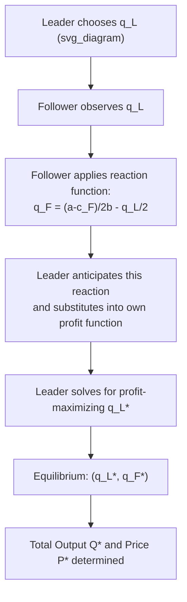

## The Stackelberg Leadership Model

### Overview

The Stackelberg leadership model is a game-theoretic framework describing strategic interaction between firms in an oligopoly where one firm (the **leader**) commits to an output quantity first, and a rival firm (the **follower**) observes this quantity and then chooses its own output to maximize profit. This sequential structure, in contrast to the simultaneous-move Cournot model, changes the equilibrium outcome and gives the leader a distinct first-mover advantage.

The model was introduced by German economist Heinrich von Stackelberg in his 1934 work *Marktform und Gleichgewicht*. It remains a foundational tool for analyzing markets with asymmetric firm sizes, dominant incumbents, or clear technological/informational leadership.

### Key Assumptions

- **Duopoly setting**: Typically modeled with two firms, though it generalizes to markets with one leader and multiple followers.
- **Homogeneous product**: Firms produce an identical or near-identical good, competing on quantity.
- **Sequential moves**: The leader chooses output $q_L$ first; the follower observes $q_L$ and then chooses $q_F$.
- **Commitment**: The leader's output decision is credible and irreversible before the follower moves (e.g., due to capacity investment or contractual commitments).
- **Complete information**: Both firms know the market demand curve and each other's cost structures.
- **Profit maximization**: Each firm seeks to maximize its own profit given the rules of the game.

### The Follower's Reaction Function

The follower behaves exactly like a Cournot competitor: it takes the leader's quantity as given and best-responds to it. This is the same reaction function used in the Cournot model.

Assume a linear inverse demand function:

$$P = a - b(q_L + q_F)$$

and constant marginal costs $c_L$ and $c_F$ for the leader and follower, respectively.

The follower's profit function is:

$$\pi_F = [a - b(q_L + q_F)]q_F - c_F q_F$$

Maximizing with respect to $q_F$ (first-order condition):

$$\frac{\partial \pi_F}{\partial q_F} = a - bq_L - 2bq_F - c_F = 0$$

Solving gives the follower's **reaction function**:

$$q_F = \frac{a - c_F}{2b} - \frac{q_L}{2}$$

This is identical in form to the Cournot reaction function — the distinguishing feature of Stackelberg is *how* it is used, not its derivation.

### The Leader's Optimization Problem

The leader's strategic advantage comes from **anticipating** the follower's reaction function and substituting it into its own profit function before choosing $q_L$. This is solved using **backward induction**.

The leader's profit function, after substituting the follower's reaction function:

$$\pi_L = \left[a - b\left(q_L + \frac{a - c_F}{2b} - \frac{q_L}{2}\right)\right]q_L - c_L q_L$$

Simplifying the price term:

$$P = a - bq_L - \frac{a - c_F}{2} + \frac{bq_L}{2} = \frac{a + c_F}{2} - \frac{bq_L}{2}$$

So:

$$\pi_L = \left(\frac{a + c_F}{2} - \frac{bq_L}{2}\right)q_L - c_L q_L$$

Taking the first-order condition with respect to $q_L$ and solving yields the **leader's optimal output**:

$$q_L^* = \frac{a - 2c_L + c_F}{2b}$$

### Equilibrium Outputs (Symmetric Cost Case)

When both firms share the same marginal cost ($c_L = c_F = c$), the equations simplify considerably:

**Leader's output:**

$$q_L^* = \frac{a - c}{2b}$$

**Follower's output** (substituting $q_L^*$ into the reaction function):

$$q_F^* = \frac{a - c}{4b}$$

**Key result**: The leader produces exactly **twice** the output of the follower. This is the hallmark numerical result of the symmetric-cost Stackelberg model.

**Total industry output:**

$$Q^* = q_L^* + q_F^* = \frac{3(a-c)}{4b}$$

**Equilibrium price:**

$$P^* = a - bQ^* = \frac{a + 3c}{4}$$

### Comparison with Cournot Equilibrium

| Metric | Cournot (simultaneous) | Stackelberg (sequential) |
| --- | --- | --- |
| Leader's output | $\frac{a-c}{3b}$ | $\frac{a-c}{2b}$ |
| Follower's output | $\frac{a-c}{3b}$ | $\frac{a-c}{4b}$ |
| Total output | $\frac{2(a-c)}{3b}$ | $\frac{3(a-c)}{4b}$ |
| Price | $\frac{a+2c}{3}$ | $\frac{a+3c}{4}$ |
| Leader's profit | Lower than Stackelberg leader | Higher (first-mover advantage) |
| Follower's profit | Higher than Stackelberg follower | Lower (second-mover disadvantage) |

**Key Points:**

- Stackelberg **total output exceeds Cournot total output**, so Stackelberg **price is lower** than the Cournot price.
- The leader strictly prefers being a Stackelberg leader to being a Cournot competitor — moving first and committing credibly always yields higher profit under these assumptions.
- The follower earns strictly less profit than either firm earns in the symmetric Cournot equilibrium, illustrating the value of commitment and the cost of being a passive responder.
- Aggregate consumer surplus is higher under Stackelberg than Cournot due to greater output and lower price, though total industry profit is generally lower than under collusion.

### First-Mover Advantage: Why It Exists

The leader's advantage stems from its ability to **credibly commit** before the follower acts. By producing a large quantity, the leader forces the follower to accommodate this output as a fixed feature of the market — the follower's best response is to *reduce* its own output relative to the Cournot level, since marginal revenue for the follower declines with a larger $q_L$ already in the market.

This is fundamentally a demonstration of the strategic value of **commitment devices** in game theory: an action is valuable not only for its direct payoff but because it constrains the rival's subsequent choices. This connects Stackelberg's model to the broader concept of "strategic substitutes," where one firm's aggressive move induces a rival's passive response.

**[Inference]** The credibility of the leader's commitment in real markets typically arises from sunk capacity investments, long-term contracts, or being first to market with irreversible production decisions — mechanisms not explicitly modeled in the basic quantity-setting framework itself.

### Graphical Representation (Reaction Curves)

Below is a standard reaction-curve diagram showing the Cournot equilibrium (intersection of both reaction curves) versus the Stackelberg equilibrium (leader's optimal point on the follower's reaction curve, tangent to the leader's highest attainable iso-profit curve).

<svg xmlns="http://www.w3.org/2000/svg" viewBox="0 0 520 420">
<text x="260" y="20" font-size="14" text-anchor="middle" font-family="sans-serif" font-weight="bold">Stackelberg vs Cournot Equilibrium (svg_diagram)</text>
<line x1="60" y1="360" x2="480" y2="360" stroke="black" stroke-width="1.5" />
<line x1="60" y1="360" x2="60" y2="40" stroke="black" stroke-width="1.5" />
<text x="480" y="378" font-size="12" font-family="sans-serif">q_L</text>
<text x="35" y="45" font-size="12" font-family="sans-serif">q_F</text>
<line x1="60" y1="60" x2="460" y2="340" stroke="#2b6cb0" stroke-width="2" />
<text x="380" y="330" font-size="11" fill="#2b6cb0" font-family="sans-serif">Follower's reaction curve (R_F)</text>
<line x1="80" y1="340" x2="440" y2="80" stroke="#c05621" stroke-width="2" />
<text x="330" y="95" font-size="11" fill="#c05621" font-family="sans-serif">Leader's reaction curve (R_L)</text>
<circle cx="260" cy="200" r="5" fill="black" />
<text x="268" y="195" font-size="11" font-family="sans-serif">Cournot Equilibrium (R_L ∩ R_F)</text>
<circle cx="340" cy="150" r="5" fill="#9b2c2c" />
<text x="348" y="145" font-size="11" fill="#9b2c2c" font-family="sans-serif">Stackelberg Equilibrium</text>
<ellipse cx="340" cy="150" rx="90" ry="40" fill="none" stroke="#9b2c2c" stroke-dasharray="4,4" />
<text x="255" y="120" font-size="10" fill="#9b2c2c" font-family="sans-serif">Leader's iso-profit curve (tangent to R_F)</text>
</svg>

The leader chooses the point on the follower's reaction curve $R_F$ that lies on its own **highest attainable iso-profit curve**, which is always a larger output/higher profit combination than the Cournot intersection point.

### Numerical Example

**Setup**: Market demand $P = 100 - Q$, where $Q = q_L + q_F$. Both firms have marginal cost $c = 10$ (so $a = 100$, $b = 1$, $c = 10$).

**Step 1 — Follower's reaction function:**

q_F = \frac{100 - 10}{2} - \frac{q_L}{2} = 45 - \frac{q_L}{2}$}

**Step 2 — Leader's optimal output:**

$$q_L^* = \frac{a - 2c_L + c_F}{2b} = \frac{100 - 20 + 10}{2} = 45$$

**Step 3 — Follower's output:**

$$q_F^* = 45 - \frac{45}{2} = 22.5$$

**Step 4 — Total output and price:**

$$Q^* = 45 + 22.5 = 67.5$$

$$P^* = 100 - 67.5 = 32.5$$

**Step 5 — Profits:**

$$\pi_L = (32.5 - 10)(45) = 1{,}012.5$$

$$\pi_F = (32.5 - 10)(22.5) = 506.25$$

**Comparison to Cournot** (same cost parameters): each firm would produce $q_L = q_F = 30$, price would be $P = 40$, and each firm's profit would be $900$. Here, the Stackelberg leader earns $1{,}012.5 > 900$, while the follower earns only $506.25 < 900$ — confirming the first-mover advantage and second-mover disadvantage.

### Extensions and Variants

- **Stackelberg with cost asymmetry**: When the leader has a cost advantage ($c_L < c_F$), its equilibrium output share increases further beyond the 2:1 ratio; a sufficiently large cost disadvantage for the leader could in principle make Stackelberg leadership unprofitable relative to Cournot, though under standard linear demand this is rare.
- **Multiple followers (Stackelberg with fringe firms)**: One dominant leader faces several competitive-fringe followers, each behaving as a price/quantity taker with respect to the leader's output — commonly used to model dominant-firm price leadership.
- **Stackelberg in prices (Bertrand-Stackelberg)**: An analogous sequential model where firms compete on price rather than quantity; results differ substantially because, under standard Bertrand assumptions with homogeneous goods, sequential price-setting typically converges toward marginal-cost pricing regardless of move order.
- **Endogenous timing / "Stackelberg warfare"**: Game-theoretic literature examines when firms would voluntarily choose to become the leader or follower (both may want to lead, given the profit advantage), sometimes resolved via observable, irreversible pre-commitment actions such as capacity investment.
- **Stackelberg equilibrium refinement**: The model is a specific application of **Subgame Perfect Nash Equilibrium (SPNE)**, solved via backward induction — a leader's threat to produce a suboptimal quantity is not credible unless it is subgame perfect.

**[Inference]** In real-world markets, identifying which firm is the "true" Stackelberg leader is often an empirical question rather than a structural certainty, since leadership can arise from being a first-mover historically, holding superior information, or possessing a credible capacity commitment — the model's stylized either/or leader-follower assignment is a simplification of more complex dynamic rivalry.

### Real-World Applications

- **Dominant firms with fringe competitors**: E.g., a large incumbent (such as a major domestic auto manufacturer) setting output levels that smaller regional competitors then adjust to.
- **Technology and network industries**: A first-to-market firm with a capacity or technology lead (e.g., an established chipmaker) can act as a quantity leader relative to newer entrants.
- **Agricultural and commodity markets**: A large producer with significant market share can act as an output leader that smaller producers adjust around.
- **Antitrust and regulatory analysis**: The model is used to analyze whether an incumbent's capacity expansion constitutes a strategic entry deterrent, since aggressive Stackelberg-style output commitment can also be a signal of anti-competitive intent.

### Limitations of the Model

- Assumes rigid sequential timing that may not reflect fluid real-world decision-making, where firms can often revise output.
- Requires the leader's commitment to be genuinely credible and observable — if the follower doubts the leader's stated output, the sequential advantage disappears.
- Sensitive to the linear demand and constant marginal cost assumptions; results can shift substantially under nonlinear demand or increasing marginal costs.
- Does not incorporate demand uncertainty, capacity constraints, or repeated-game reputational effects, all of which are common in actual oligopolistic markets.

**Related Topics:**

- Cournot competition model
- Bertrand competition model
- Subgame Perfect Nash Equilibrium and backward induction
- Dominant-firm price leadership models
- First-mover advantage and strategic commitment
- Kinked demand curve model
- Collusion and cartel behavior in oligopoly
- Entry deterrence and limit pricing